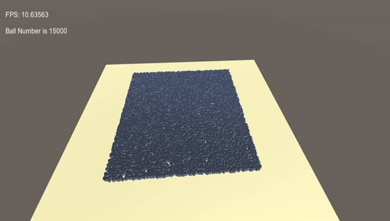
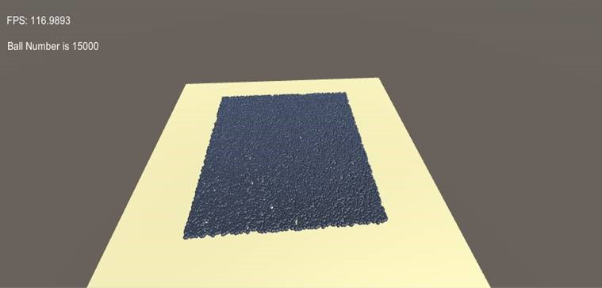

# 利用Unity C# Job system和ECS方法实现高性能游戏


## 前言

在2018年5月2号，Unity正式发布了2018.1版本。在这个版本中，Unity重构核心代码，重磅推出三个功能，这三个功能大大提升了多线程的处理能力以及内存的管理方式，从而有效地提升了游戏性能。

- C# Job System — 多线程游戏开发的框架。
- The Entity Component System (ECS) — 新型高效的面向数据的模型框架
- The Burst Compiler — 高性能的编译器

## 什么是Job System

一般来说，游戏在CPU侧主要的工作都在逻辑线程和渲染线程两个线程，可是如今的CPU核心数却越来越多，比如英特尔第八代core处理器8700K标配的是6核12线程，而且更高端的CPU拥有更多的核心数。可以看出，游戏的主要工作线程数和CPU的核心数明显的不匹配，结果就造成工作的那个核心利用率过高，其他的核心却没有充分利用，从而导致游戏性能低下和CPU资源的浪费。因此，Unity在新版本的引擎中引入C#  job system，方便用户能够在编写C#脚本时能够将大量不相关的工作剥离主线程，充分利用多核CPU的并行计算来减轻主线程的负担。

其实，程序员也可以使用传统意义上的多线程编程在利用多核CPU的处理能力，为每个独立的任务开启一个新的线程。但是这个方法有个弊端，如果任务数量多于CPU的核心数时，就不可避免的发生多任务抢占CPU资源，导致系统不停的在切换不同的上下文导致CPU资源浪费。Job   System的架构很好的避免这种问题，它将每个不同的独立任务job缓冲到job队列里，然后根据CPU的逻辑核心数来进行调度，多于核心数的job暂时缓冲在队列里，等待有逻辑核空闲后再运行。

那么C# job system的代码是如何编写的呢？首先需要定义Job的工作，声明一个基于IJob接口的struct，具体的每个Job的工作是在Execute函数里实现。

比如我们要实现一个求和的任务，参考代码如下：

#### **Job 代码:**

    // 这个job求两个float数之和
    public struct MyJob : IJob
    {
        public float a;
        public float b;
        NativeArray<float> result;	
    	public void Execute()
    	{
        	result[0] = a + b;
    	}
    }
Job代码实现之后，需要定义JobHandle来调度Job，同时也需要在主线程里装载Job所需要的数据。

#### **主线程代码**：

```
// 申请一个float数组来存储job的结果
NativeArray<float> result = new NativeArray<float>(1, Allocator.Temp);

// 装在Job数据
MyJob jobData = new MyJob();
jobData.a = 10;
jobData.b = 10;
jobData.result = result;

// 定义handle来调度job
JobHandle handle = jobData.Schedule();

// 等待job任务完成
handle.Complete();
 
float aPlusB = result[0];

// 释放内存
result.Dispose();
```

以上就是job如何编写和调度的代码。在使用Job system中有几点需要特别注意：

- 在一个job中不能访问static 变量，否则就不能使用Burst Compiler来编译
- 不能直接更新NativeArray的内容
- 经常调用Jobhandle.Complete()

## 什么是ECS

ECS是entity、component、system的缩写，是一个面向数据的编程模型。在Unity引擎中，传统的Gameobject/Monobehavior方法是面向对象的模型，即所有的组件都是挂在模型对象上，像transform，rigidbody   等等，此时如果我们只是需要对模型进行旋转的话，不仅仅是Rotation组件，其他所有的组件都load到memory里，这样不仅消耗内存，而且操作一多容易导致引发GC（Garbage  Collection）。ECS将component和object分开，比如object需要旋转的话，  只需创建一个带Rotation的component system，这样就没有多余的数据操作。

下面来介绍一些ECS基本概念。

- World：有一个EntityManager和一组Component System组成， 一般来说，一个项目只有一个world。
- EntityManager：创建和管理Entity和数据。
- Entity：Enity是一个ID，数据容器，可以看作一个轻量级的GameObject。
- Component Data：实质的数据，相当于组件。
- Component System：处理游戏数据，实现游戏逻辑模块。
- EntityArchetype：是一个包括ComponentData类型的数组，EntityManager通过它来管理拥有相同数据类型的Entity。

## 实例分析Job system 和ECS

这个实例展示的是同时15000个相同的球体做旋转和上下运动。工程文件已经上传到Github，可以参考[链接](https://github.com/ptofga/JobsECSandClassicComparison) 

### 传统的monobehavior实现方式

实现一个球上下和旋转运动的Prefab，将如下的BallMove.cs脚本挂在其上。脚本代码如下

```
using System.Collections;
using System.Collections.Generic;
using UnityEngine;

public class BallMove : MonoBehaviour 
{
	// Update is called once per frame
	void Update () 
	{
		this.transform.rotation= Quaternion.AngleAxis(Mathf.Sin(Time.timeSinceLevelLoad) * 100, 									Vector3.up);
    	this.transform.Translate(new Vector3(0, Mathf.Sin(Time.timeSinceLevelLoad)/100f,0));
    }
}
```

然后在实现Ball Spawn的脚本运行，生成15000个相同的球体。

### Job System和ECS的实现方式

既然是ECS的实现方式，首先需要规划Component   Data，也就是System需要运行的数据结构，这个结构都是基于IComponentData接口的，IComponentData是纯粹的ECS类型的组件，意味着他不定义行为，只包含数据。IComponentData是结构体(struct)而非类（class），所以他们进行值拷贝而不是引用拷贝。如下：

```
public struct BallData: IComponentData
{
    public Position pos;
    public TransformMatrix tm;
}
```

因为在这个实例中的场景有15000个球体要产生，传统方法是制作一个球体的Prefab，然后用函数Instantiate 重复产生所要的球体。那么在ECS架构下如何产生所需的球体呢？

首先定义工程的入口，在传统的monobehavior模式下所有的脚本都需要挂载到场景的物体上，然后系统会自动调用系统函数。但是在ECS模式下情况不一样，因为这种模式下脚本并没有挂载上任何模式，系统需要定义一个初始化的地方。好在系统定义一个接口RuntimeInitializeOnLoadMethod，所以我们在脚本GameBoostrap.cs的函数InitAfterScene前面加上语句

```
`[RuntimeInitializeOnLoadMethod(RuntimeInitializeLoadType.AfterSceneLoad)]`
```

表明这个函数是场景load之后立即自动运行。在这个函数里定义一些ComponentSystem所需的数据。然后创建EntityManager

```
`entityManager = World.Active.GetOrCreateManager<EntityManager>();`
```

再创建EntityArchetype和Entity

```
ballArchetype = entityManager.CreateArchetype(typeof(Position), typeof(Rotation),typeof(BallData), typeof(TransformMatrix));
ballEntity = entityManager.CreateEntity(ballArchetype);
```

EntityArchetype里所定义的Postion，Rotation，BallData和TransformMatrix   的ComponentData正是球体的Entity所有用到的数据，因此这里可以看到已经有Entity和ComponentData，ECS架构还差System需要实现了。在实现System之前需要实现球体的Mesh  Data供System调用。

```
BallLook = GetLookFromPrototype("ballObject");

public static MeshInstanceRenderer GetLookFromPrototype(string protoName)
        {
            var proto = GameObject.Find(protoName);
            if (proto == null)
                Debug.Log("do not get object");
            var result = proto.GetComponent<meshinstancerenderercomponent>().Value;
            Object.Destroy(proto);
            return result;
        }

```

所以数据准备完毕后，开始实现球体的Spawn   System脚本。BallSpawnSystem是基于ComponentSystem的一个类，这个类有个虚函数Update，系统将每帧调用此函数，那么就在此函数里产生球体，GetRandomPostion函数是随机生成位置，代码如下：

```
protected override void OnUpdate()
{
    BallNumber++;
    if(BallNumber<GameBoostrap.gameSetting.BallNumber)
    {   
        Spawnball(); 
    }
}
void Spawnball()
{
    PostUpdateCommands.CreateEntity(GameBoostrap.ballArchetype);
    PostUpdateCommands.SetComponent(GetRandomPostion());
    PostUpdateCommands.AddSharedComponent(GameBoostrap.BallLook);
}
Position GetRandomPostion()
{
    Position pos;
    float x = GameBoostrap.gameSetting.BallBound* (Random.value-0.5f);
    float z= GameBoostrap.gameSetting.BallBound * (Random.value - 0.5f);
    pos = new Position { Value=new Unity.Mathematics.float3(x,0,z)};
    return pos;
}

```

当球体生成之后，然后就要实现每个球体的运动脚本MoveSystem.cs

```
class BallMoveSystem : JobComponentSystem
{
    //  IJobProcessComponentData is a simple way of iterating over 
    //  all entities given the set of required          compoenent types.
    //  It is also more efficient than IJobParallelFor and more convenient.
    [ComputeJobOptimization]
    public struct RotationJob : IJobProcessComponentData<Rotation,Position>
    {
        public float time;
        public Vector3 vector3;
        public float random;
        public void Execute(ref Rotation rot,ref Position pos)
        {
            rot.Value = Quaternion.AngleAxis(math.sin(time) * 100, vector3); 
            pos.Value.y = math.sin(time);
        }
        
    }
     
    protected override JobHandle OnUpdate(JobHandle inputDeps)
    {
        var job = new RotationJob() { time = Time.timeSinceLevelLoad, vector3 = Vector3.up , random= Random.value};
        var handle = job.Schedule(this, 1, inputDeps);
        return handle;
    }
}
```

BallMoveSystem是继承JobComponentSystem的类，所以即具有System功能又有Job的特点。需要实现Job的struct和JobHandle的接口函数。RotationJob定义两个Rotation和Position的ComponentData，也就是说所有包含有此两个Component   Data的Entity都会执行这个Job任务。JobHandle主要是用来为Job输入参数和调度Job。Job的主要任务在Execute里来执行，这里可以看到Entity是进行旋转和上下运动的。

### 性能对比

以上我们通过两种不同的方式实现了15000个球体的运动，那么可以通过FPS来对比下两种方式的性能，所以在每个工程中分别实现显示FPS的函数。

测试的平台如下：

| 电脑型号   | MSI GT75VR           |
| ---------- | -------------------- |
| CPU        | Intel Core i7-7820HK |
| GPU        | Nvidia GFX 1080      |
| Unity 版本 | 2018.1               |
| OS版本     | Windows 10 16299     |
| 内存       | 32G                  |

测试的数据结果如下



MonoBehavior方式



Job System & ECS方式

可以看到性能提升非常明显，用传统的方式只有10.6FPS，但是用Job System&ECS方式的性能可以达到116.9FPS。

## 结论

Unity提供的C#  Job System&ECS的方式充分的利用目前多核CPU的处理能力，在处理场景中相同物体上比传统方式有非常大的性能优势。但是C#  Job System & ECS方式只有在Unity  Engine2018.1及后续版本才支持，所以如果要体验高性能的并行处理，需要升级Unity Engine到2018版本。

ECS是未来引擎架构的一种趋势，虽然他相对于传统的面向对象的方式在代码结构有点复杂，但是一旦熟悉其逻辑，编写代码也不是太麻烦。