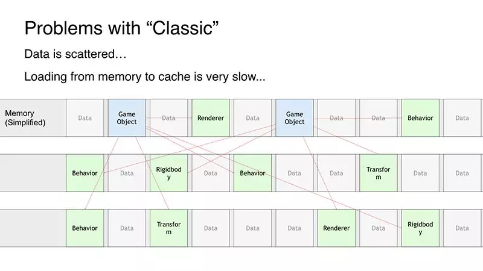
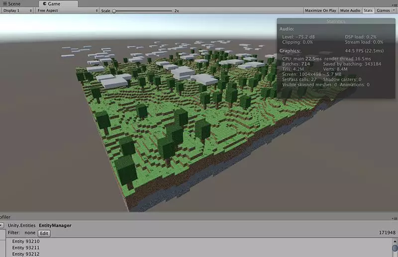
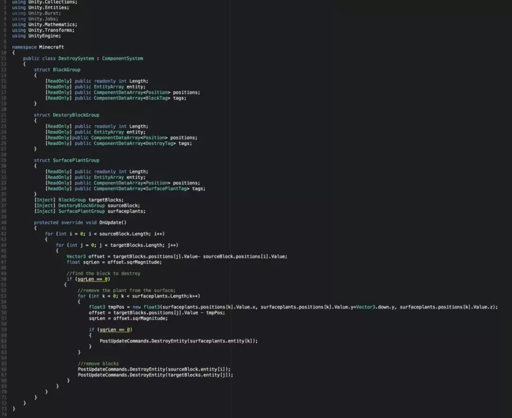
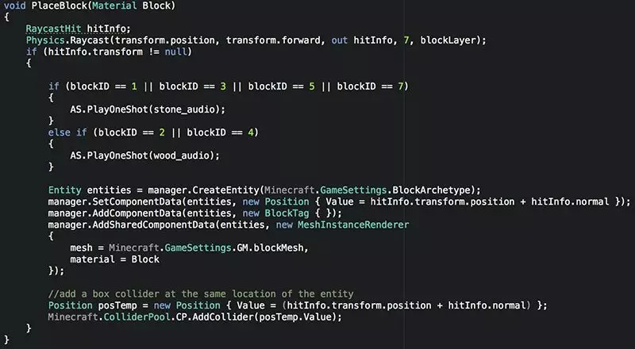
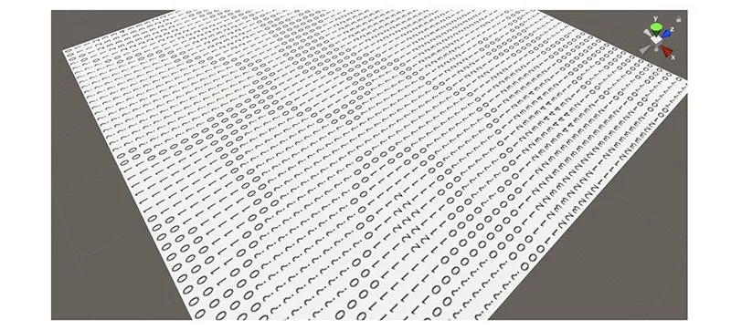
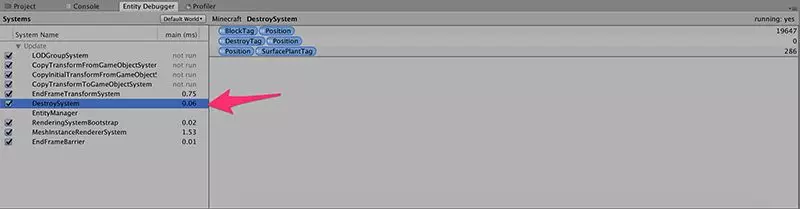

## 直播回顾 | 使用Unity ECS开发《我的世界》

本文将由Unity的技术经理罗志达带领大家回顾9月12日的直播课程－[使用UnityECS开发 《我的世界》](http://mp.weixin.qq.com/s?__biz=MzU5MjQ1NTEwOA==&mid=2247494865&idx=1&sn=ba401395e0b526307a65e098146ca186&chksm=fe1dd87ac96a516c68f52528b2522f7419aa0aacc879c8f2567507ba62390e2912e12b5c574c&scene=21#wechat_redirect)，了解如何把ECS的编程模式正式引入Unity游戏开发的流程中。

观看本次直播课程：

引言

受到了上次[Mike Geig大叔的ECS直播课程](http://mp.weixin.qq.com/s?__biz=MzU5MjQ1NTEwOA==&mid=2247494655&idx=1&sn=da557abde7e4a7adacbe534f590fe9df&chksm=fe1ddf54c96a5642dc9d4d3ec9c49cdcfde9e15506466668e7b816c202de85e531df92af61b7&scene=21#wechat_redirect)的启发，我用一场Game Jam活动的时间来制作了一个快速呈现ECS强大的简单项目-《我的世界》。

由于时间限制当然没办法还原像是红石系统这类高难度的功能，主要实现挖矿和放石头这二个主要功能，重点在于如何利用ECS生成广大的地形，以及体现ECS所提倡的要点-Performance by Default，在不考虑代码及任何优化的情况下，制作出来的场景还能保有很好的性能。

从Unity 2018开始引入了ECS框架，每一次的版本更新都会加入非常多的新功能，本篇文章是基于ECS（Unity 2018.2.6, Entities 0.0.12）的体验心得。

ECS

为什么ECS的性能会超越GameObject和MonoBehaviour很多呢？

传统方式的内存管理是离散式的，即物体和它的组件(Component)并非在同一个内存区段，每次存取都非常耗时。而ECS会确保所有的组件资料(Component Data)都紧密的连接再一起，这样就能确保存取内存资料时以最快的速度存取。

这里所提到的传统组件Component和ECS的C，即Component Data虽然名字很像但却是很不同的概念，旧的Component会承载着不同的资料与逻辑功能，不同的Component代表着不同的功能。但在ECS中Component只会存单纯的Data，不会有任何的逻辑运算，所有的逻辑运算必须拆离到S，即System中去实现。

传统的Component为了方便使用，集成了所有可能会用到的变量，不管你是否使用。好处是一个Component可以解决很多事情，例如：Transform，带有Position, Rotation, Scale，透过这些参数很容易对物体处理位置或移动缩放处理。但这些你用不到的变量对于内存来说一点也不友善，尤其时物体数量非常多的时候。

 

因此ECS把很重要一个概念就是管理只需要的Data即可，例如：我的物体只需要处理渲染和移动，就不需要纪录Scale资料。

Entity物体

下面谈谈几种方式产生Entity物体。

可以看到上图中层级窗口中只有一个方块物体，但画面却有3个方块，原因是左边二个是透过ECS生成的Entity物体，会独立显示在Entity Debugger内。虽然目前是分开显示的，但我们最终目的是重新打造一个让开发者接受的一个统一编辑环境。

 

左边二个Entity物体分别采用二种不同的方式生成，代码如下：

我先宣告了一个EntityManager管理器Manager，然后在它下面生成了一个Archetype，这种EntityArchetype能确保存放在里面的Component Data都紧密的相连，当一次性产生大量的Entities并给予各种逻辑运算时，这种结构在内存与快取之间的移动性能直逼memcpy。

代码41-49行是基于Archetype结构在里面生成一个Entity并给予座标资料与渲染资料，即指定渲染哪个Mesh和Material。最后这个方块只带有座标Position, 自定义的BlockTag和用来渲染的MeshInstanceRenderer三个Component Data远远比传统的Game object资料少很多。这种生成方式没有连结任何Unity编辑器上的功能，只是单纯的生成Data和处理Data，称为Pure ECS。

 

代码54-58行负责渲染最左边的方块，为了让开发更直觉，我希望产生Entity时引用一个Prefab，虽然Prefab是传统Game Object，但在实例化成Entity时，Unity会自动把跟ECS无关的Component拆离，只留下Component Data生成Entity物体。这种跟Unity整合的流程，可以称为Hybrid ECS，也是Unity在集成ECS的主要路线。

 

这个示例还用了一些新的功能例如新的NativeArray和定义像[RuntimeInitializeOnLoadMethod(RuntimeInitializeLoadType.BeforeSceneLoad)]

这样的Attributes属性来确保函数能够运行在想要的顺序上。

生成世界地形

为了要让地形能更像《我的世界》的生成方式，它必须符合几个要点：无接缝，无限大，乱数地形等。

采用Perlin noise处理这种地形是适合的方法，Perlin noise可以有规则的乱数生成一个波形资料，作为世界的高度资料参考非常适合，我可以先产生一个足够大的高度图然后只用一小部分即可，如果未来要延伸地形只需要继续生成它就会不断延伸下去不会破掉。

具体把这个高度资料用方块选染出来，如下图所示。

 

只留下高度0-6号的方块，感觉世界形状就出现了。

 

从代码针对不同高度的Entity给予不同的Material资料，就可以产生《我的世界》，针对高度0的地表，也可以随机生成花草或树木。

 

 

尝试生成了一个没有任何优化处理，17万个方块的《我的世界》还能保持在40帧以上。

 

生成物理地表

由于Unity ECS尚未支持物理系统，因此目前要实现物理要自己写碰撞逻辑，或是沿用旧的Collider来检测碰撞。

 

作为一个Game Jam项目，自己写是不太现实的，因此我决定采用最简单的方法，每个Entity方块都加上一个Collider，一方面可以作为地板一方面也可以检测挖掘和放置方块。

 

这是一个全部方块的座标同时都加放一个Collider物体的地形，除了第1帧稍微耗时之外，运行时并没有带来太多的消耗。

处理方块

有了地形就可以放上大家熟悉的FPS Character第一人称角色，继续处理方块的挖掘和放置。

制作放置方块比挖掘方块比较简单，我从摄像头发射一个Raycast，打到任何Collider就依照当下Normal的方向生成一个Collider与一个Entity物体，并依照选择的纹理指定给该Entity带有的MeshInstanceRenderer内的Material即可。代码如下：

但是挖掘方块就没那么容易了，主要是因为当前的Entities版本尚未支持物理系统，因此定位场景内众多物体中某一个Entity是有困难的，相信未来这不会是个问题，但现在我必须写很多代码来实现支持ECS的Raycast，因此我采用另外的思维来实现。

我在Raycast打到的Collider同样的座标生成一个只带有一个DestroyTag的Entity物体，它除了座标之外没有任何渲染资料，我就可以用System来检测移除同座标的方块。同时我也先移除了这个Collider。

我们已经聊了很多关于ECS里面的E（Entity）和C（Component Data），但一直没有提到S（System），现在我们要写一个System来处理删除方块的系统。但在之前我想讨论这个S和传统的有什么不同。

 

传统的脚本你必须要放到场景内才会随着物体的Update, FixUpdate或OnCollisionEnter各种方法来运行，但ECS的System是不分场景的，项目内所有的场景只要带有Entity物体System都会有反应，因此不需要特别把System脚本放入场景物体内。

这样做的好处就是所有的相关系统都可以一个脚本解决，而不是每个物体有各自的Update方法处理，从而造成物体数量一大就会影响性能。

 

System不在乎你是一颗子弹或是一只怪物或是一个角色，只要符合System过滤条件，它都会执行System内的逻辑。

 

于是我写了一个Destroy System用来检测那些Entity必须要删除。

 

System有二个主要的结构，一个是13-38行代码的Query，我分别查询哪些Entity带有BlockTag和Position，哪些带有DestroyTag和哪些是地表的花草，然后在OnUpdate内比对哪些是需要删除的Entity方块，并检查上方是否带有花草需要一并移除。

 

因此这里总共需要移除的物体有四个：该位置的Entity方块、作为检测的Entity物体、地上的花草和BoxCollider物体。

 

System的OnUpdate也是每帧运行的，现在我们可以从Entity Debugger内看到每个系统的耗时，虽说System是全项目运行的，但未来你也可以透过API在不同的场景开关这些System。

 

小结

以上是直播课程[使用Unity ECS开发《我的世界》](http://mp.weixin.qq.com/s?__biz=MzU5MjQ1NTEwOA==&mid=2247494865&idx=1&sn=ba401395e0b526307a65e098146ca186&chksm=fe1dd87ac96a516c68f52528b2522f7419aa0aacc879c8f2567507ba62390e2912e12b5c574c&scene=21#wechat_redirect)分享重点内容，更详细的内容，可以直接观看本次直播的视频，从而温故而知新。对于ECS想要更了解基本规则，建议访问Unity Connect平台，观看Mike大叔的课程视频：

https://connect.unity.com/p/2018zhi-bo-hui-zong-unityguan-fang-zhi-bo-lu-bo-hui-zong

更多Unity技术课程直播尽在Unity Connect平台，更多Unity技术内容分享尽在Unity官方中文论坛(UnityChina.cn)！