# [UnityEditor研究学习之EditorWindow](https://www.cnblogs.com/CaomaoUnity3d/p/4698538.html)

在unity使用过程中，其实我们都是在各个不同功能的Window下工作。

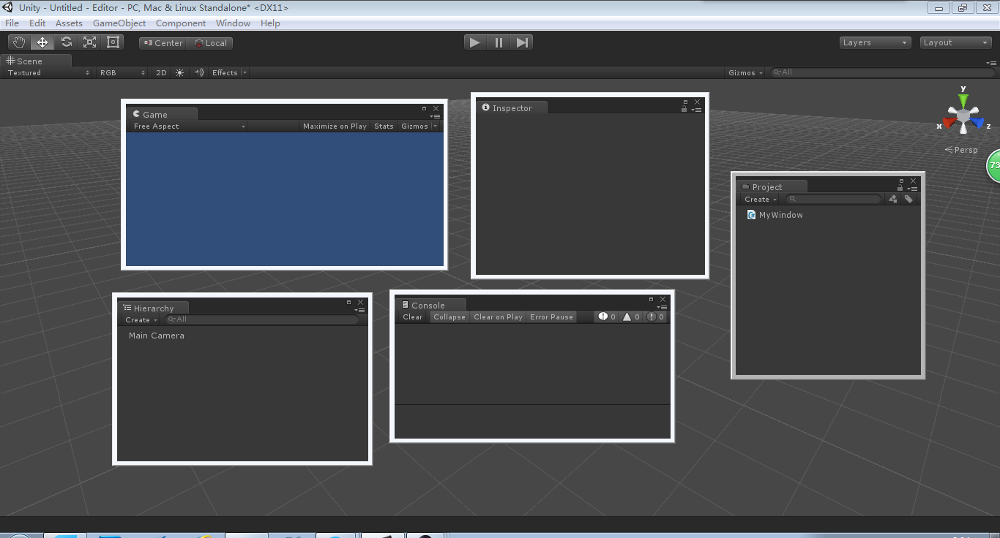

比如在Scene窗口中操作物体，在Inspector中操作物体属性，在Game视窗中观察游戏状态。

 

所以窗口是Unity的灵魂，这是唯一接口我们能够通过它来制作游戏。

 

那么，我们想自定义一个自己的窗口，那该如何呢？今天我们就来学习下EditorWindow，由于这个类在UnityEdior下，所以要using UnityEditor;

 

```c#
`using` `UnityEngine;``using` `System.Collections;``using` `UnityEditor;``//注意要引用``public` `class` `MyWindow: EditorWindow``{``    ``[MenuItem(``"Window/MyWindow"``)]``//在unity菜单Window下有MyWindow选项``    ``static` `void` `Init()``    ``{``        ``MyWindow myWindow = (MyWindow)EditorWindow.GetWindow(``typeof``(MyWindow), ``false``, ``"MyWindow"``, ``true``);``//创建窗口``        ``myWindow.Show();``//展示``    ``}``}`
```

 

这是个简单的创建窗口的代码，首先通过EditorWindow.GetWindow来取得窗口实例，然后展现，我们来看看官方的API说明。

 

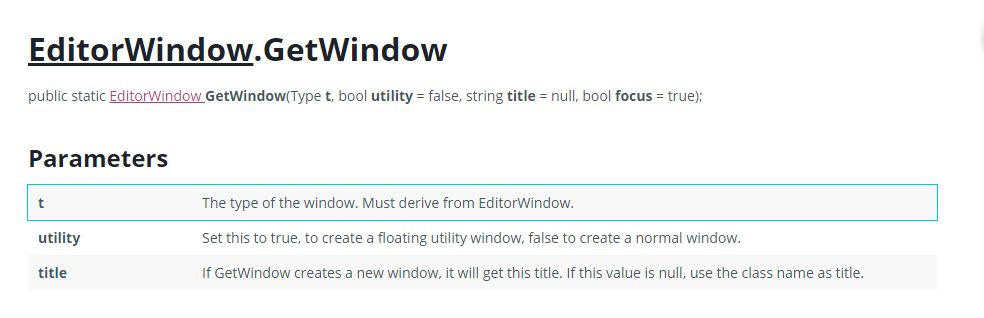

GetWindow是个静态方法，有三个参数：

第一个参数是窗口类型，注意是一定要继承自EditorWindow。

第二个参数是窗口是否浮动，如果是就不能内嵌到unity其他窗口中去，如果不是就能嵌入其他窗口。（可以省略，默认为内嵌入式）

第三个参数是窗口的标题，如果为空的话就采用类的名称来当标题。(可以省略，默认类的名称)

 

可以看到第一个参数是必须的，其他参数可以省略。c#可选参数的特性。

 

回到Unity，在Window菜单下拉列表选择MyWindow，可以看到弹出自己的窗口。好开心！

 

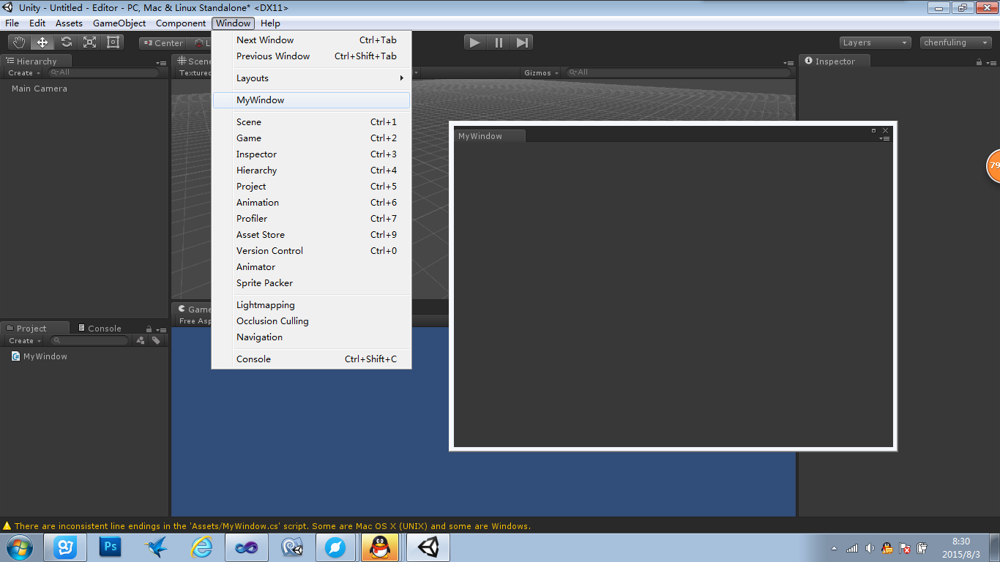

 

当然这个窗口里面什么东西都没有，我们需要往里面添加各个功能组件，当然这个以后再慢慢详谈，貌似好像如饥似渴了！！=_=

 

接着，下面我们来学习下EditorWindow的各个属性和方法：

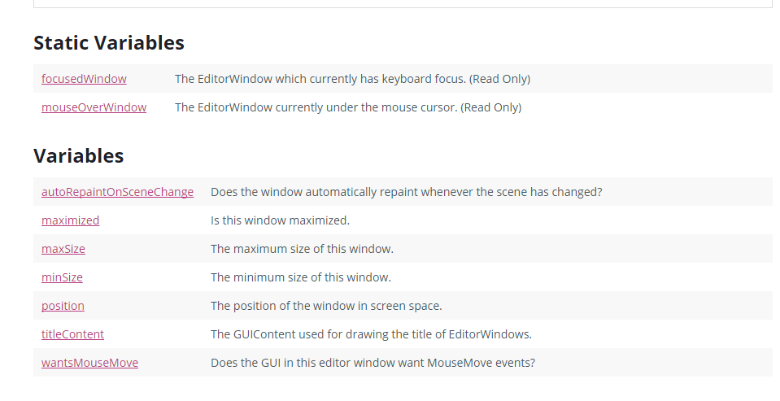

**fousedWindow（静态变量）：**

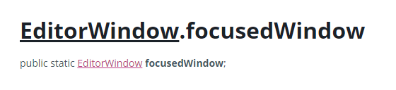

注意到类型是EditorWindow，所以顾名思义这个是表示当我们聚焦到哪个窗口，那么这个静态变量就是那个窗口。其实也就是记录我们聚焦的窗口。

 

于是我做了个小实验，功能也就是聚焦哪个窗口会打印这个窗口的信息。

```
`void` `OnGUI()``    ``{``        ``EditorGUILayout.LabelField(EditorWindow.focusedWindow.ToString());``    ``}`
```

 

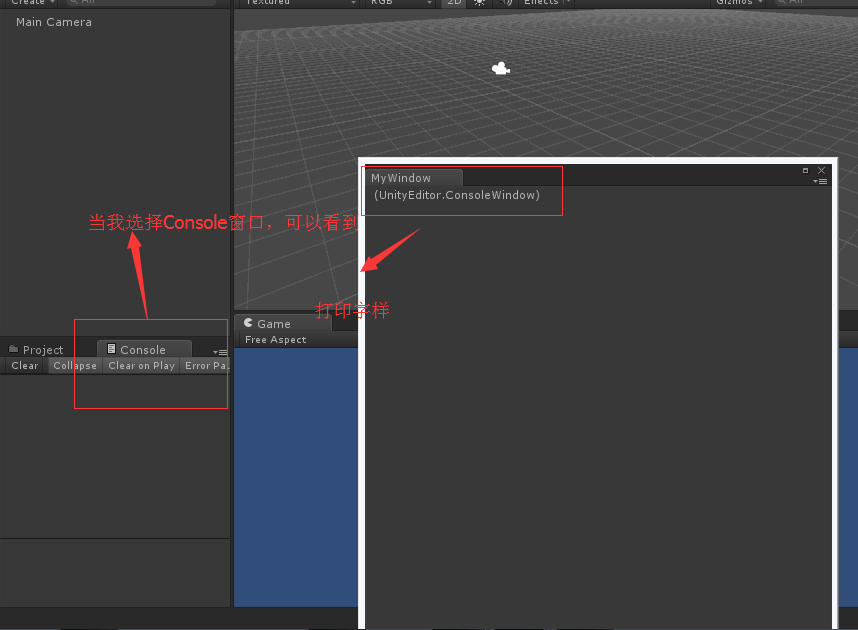

 

 

**mouseOverWindow（静态变量）：**

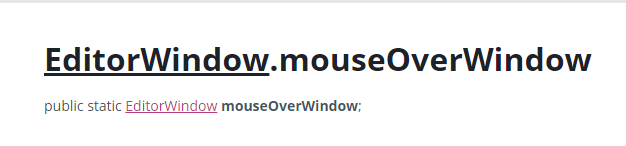

 

与fouseWindow相似，这个是鼠标悬停在哪个Window，这个静态变量就是那个窗口。

 

```
`using` `UnityEngine;``using` `System.Collections;``using` `UnityEditor;``public` `class` `MyWindow: EditorWindow``{``    ``string` `move;``    ``[MenuItem(``"Window/MyWindow"``)]``//在unity菜单Window下有MyWindow选项``    ``static` `void` `Init()``    ``{``        ``MyWindow myWindow = (MyWindow)EditorWindow.GetWindow(``typeof``(MyWindow), ``false``, ``"MyWindow"``, ``false``);``        ``myWindow.Show(``true``);``    ``}``    ``void` `OnGUI()``    ``{``        ``move = EditorWindow.mouseOverWindow ? EditorWindow.mouseOverWindow.ToString() : ``"Nothing"``;``        ``EditorGUILayout.LabelField(move);``    ``}``    ``void` `OnInspectorUpdate()``    ``{``        ``if` `(EditorWindow.mouseOverWindow)``            ``EditorWindow.mouseOverWindow.Focus();``//就是当鼠标移到那个窗口，这个窗口就自动聚焦``        ``this``.Repaint();``//重画MyWindow窗口，更新Label``    ``}``}`
```

于是我又做了个小测试，功能很简单，鼠标移动的哪个窗口，在MyWindow打印那个窗口的信息，并且自动聚焦到那个窗口。

反正我是成功了，你们可以自行测试。

 

# [EditorWindow](http://docs.unity3d.com/ScriptReference/EditorWindow.html).autoRepaintOnSceneChange

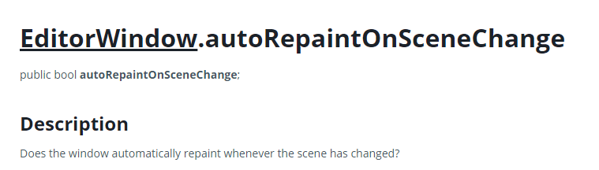

当这个变量为true时，如果unity编辑视窗（注意不只是scene视窗，其他窗口）只要有变动，就会重画窗口，为false就不会。

当然我们做个小测试：

```
`using` `UnityEngine;``using` `System.Collections;``using` `UnityEditor;``public` `class` `MyWindow: EditorWindow``{``    ``int` `i = 0;``    ``[MenuItem(``"Window/MyWindow"``)]``//在unity菜单Window下有MyWindow选项``    ``static` `void` `Init()``    ``{``        ``MyWindow myWindow = (MyWindow)EditorWindow.GetWindow(``typeof``(MyWindow), ``false``, ``"MyWindow"``, ``false``);``        ``myWindow.autoRepaintOnSceneChange = ``true``;``        ``myWindow.Show(``true``);``    ``}``    ``void` `OnGUI()``    ``{``        ``i++;``        ``EditorGUILayout.LabelField(i.ToString());``    ``}``}`
```

这段代码就是当我们变动unity编辑器时，label就会显示i自增。

 

 

 

# [EditorWindow](http://docs.unity3d.com/ScriptReference/EditorWindow.html).maximized

 

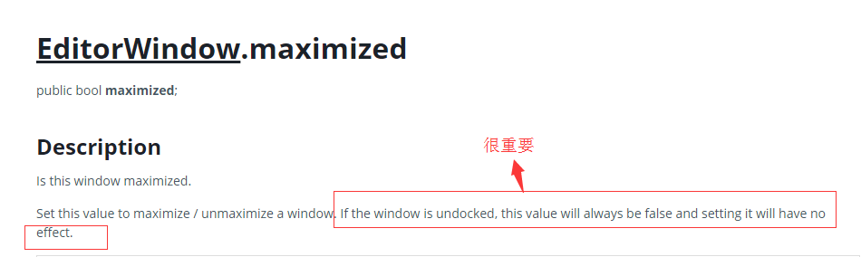

 

当为true，就是当窗口是内嵌到其他窗口，也就是docked停靠的意思，窗口就能最大化。开上面，他说如果窗口没有在停靠状态，那么这个值永远为false，并且设置无效。

 

测试的话，我们可以用toggle来改变这个bool值。

 

```
`using` `UnityEngine;``using` `System.Collections;``using` `UnityEditor;``public` `class` `MyWindow: EditorWindow``{``    ``[MenuItem(``"Window/MyWindow"``)]``//在unity菜单Window下有MyWindow选项``    ``static` `void` `Init()``    ``{``        ``MyWindow myWindow = (MyWindow)EditorWindow.GetWindow(``typeof``(MyWindow), ``false``, ``"MyWindow"``, ``false``);``        ``myWindow.autoRepaintOnSceneChange = ``true``;``        ``myWindow.Show(``true``);``    ``}``    ``void` `OnGUI()``    ``{``        ``maximized = EditorGUILayout.ToggleLeft(``"Max"``,maximized);``    ``}``}`
```

　　注意一定要是内嵌的状态下，那么会观察到点击Max会最大化，再次点击会回到原来。

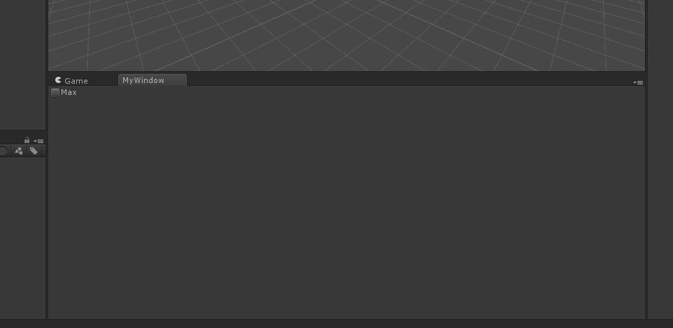

 

**maxSize，minSize，position**这里我就不详细介绍了，自己可以去改变着玩玩。

 

# [EditorWindow](http://docs.unity3d.com/ScriptReference/EditorWindow.html).titleContent

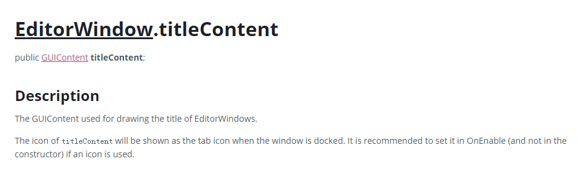

 这个变量是设置窗口的小图标的，图标的类型为GUIContent。

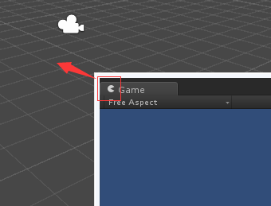

我们再来顺便学习下GUIContent，看看他的API。

# [GUIContent](http://docs.unity3d.com/ScriptReference/GUIContent.html).GUIContent

这里我们只看他的构造函数，因为我们只想要图标，所以我们选择public GUIContent([Texture ](http://docs.unity3d.com/ScriptReference/Texture.html)image);这个构造函数

 

不知为何，unity现在没有titleContent这个变量，那么我们也就不要管他了，影响不是很大。

# [EditorWindow](http://docs.unity3d.com/ScriptReference/EditorWindow.html).wantsMouseMove

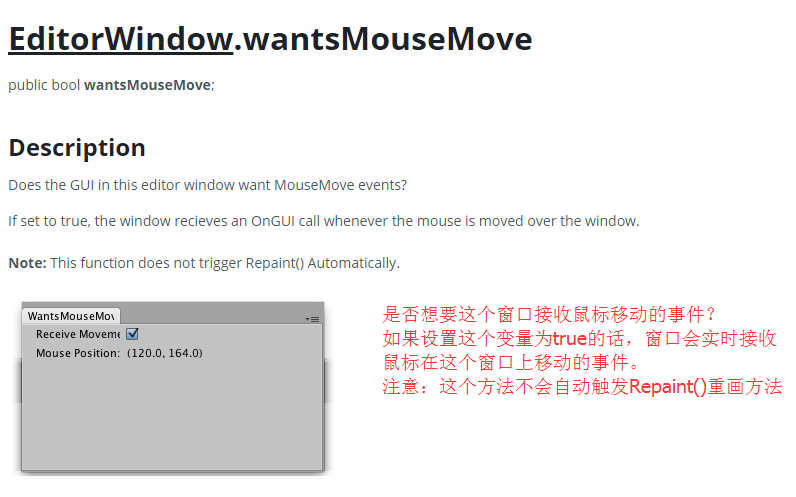

也就是设置这个变量为true的时候，这个窗口会接收OnGUI里面的鼠标在窗口上面移动的事件。我们来测试一下：

```
`using` `UnityEngine;``using` `System.Collections;``using` `UnityEditor;``public` `class` `MyWindow: EditorWindow``{``    ``static` `MyWindow myWindow;``    ``[MenuItem(``"Window/MyWindow"``)]``//在unity菜单Window下有MyWindow选项``    ``static` `void` `Init()``    ``{``        ``myWindow = (MyWindow)EditorWindow.GetWindow(``typeof``(MyWindow), ``false``, ``"MyWindow"``, ``false``);``        ``myWindow.Show(``true``);``    ``}``    ``void` `OnEnable()``    ``{``       ` `    ``}``    ``void` `OnGUI()``    ``{``        ``wantsMouseMove = EditorGUILayout.Toggle(``"receive mouseMove:"``, wantsMouseMove);``//是否启用接收鼠标移动事件监听``        ``EditorGUILayout.LabelField(``"Mouse Position:"``, Event.current.mousePosition.ToString());``        ``if` `(Event.current.type == EventType.mouseMove && wantsMouseMove)``//如果是鼠标移动的事件，就重画窗口``        ``{                                              ``///因为上面注意那里有讲到：他不会自动调用repaint()方法``            ``Repaint();``        ``}``    ``}`
```

　运行项目，可以看到，当勾选了recevive mouseMove选项后，label会实时更新鼠标的坐标。

 

--------------------------------------------------------------------------分隔符-------------------------------------------------------------------------------------------------------

讲完了EditorWindow的所有变量之后，接下来我们来学习下他的一些有用的方法。

 

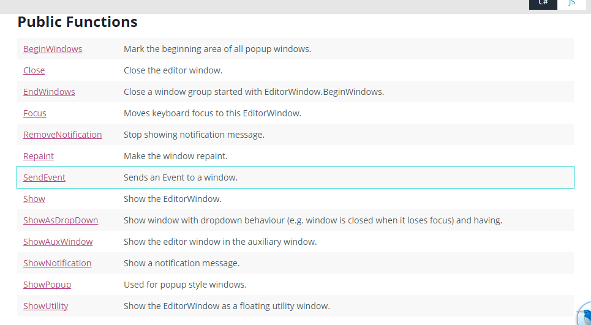

 

# 1.[EditorWindow](http://docs.unity3d.com/ScriptReference/EditorWindow.html).BeginWindows

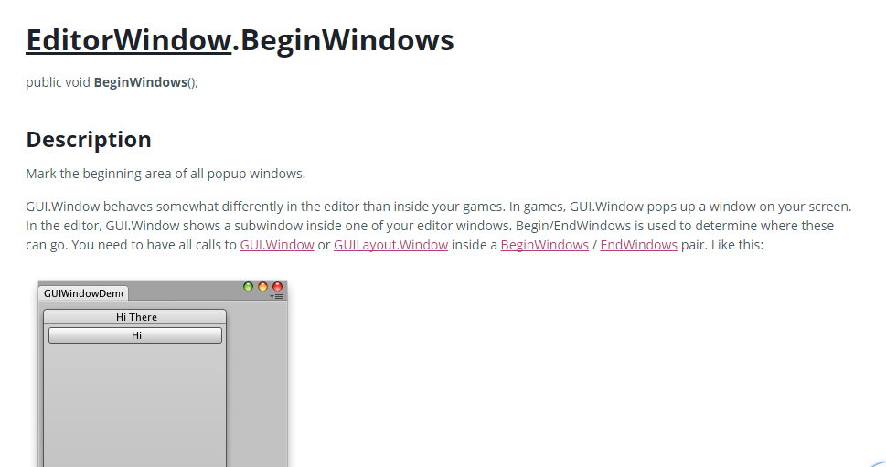

**顾名思义，函数名为beginWindows，也就是说从这里开始会创建窗口。咦？这里有些童鞋有些疑惑了。EditorWindow本身就是个窗口，这里又有窗口。**

 

**那就好玩了，对的。其实也就是窗口中嵌入窗口，就跟我们game视窗，在OnGUI()里面，创建窗口是一个道理。**

 

**这里是EditorWindow中创建Gui.window,具体如上图所示。**

 

**这个函数他是需要和EndWindows()配合使用，也就是begin之后必须要End。**

 

**具体可以看官方说明：他说GUI.Window内嵌game和editor视窗中表现有所不同。在game中GUI.Window是从你的屏幕中弹出，而在Editor中则是成为你editorwindow的子窗口。**

 

```
`using` `UnityEngine;``using` `System.Collections;``using` `UnityEditor;``public` `class` `MyWindow: EditorWindow``{``    ``static` `MyWindow myWindow;``    ``public` `Rect windowRect = ``new` `Rect(0, 0, 200, 200);``//子窗口的大小和位置``    ``[MenuItem(``"Window/MyWindow"``)]``//在unity菜单Window下有MyWindow选项``    ``static` `void` `Init()``    ``{``        ``myWindow = (MyWindow)EditorWindow.GetWindow(``typeof``(MyWindow), ``false``, ``"MyWindow"``, ``false``);``        ``myWindow.Show(``true``);``    ``}``    ``void` `OnEnable()``    ``{``       ` `    ``}``    ``void` `OnGUI()``    ``{``        ``BeginWindows();``//标记开始区域所有弹出式窗口``        ``windowRect = GUILayout.Window(1, windowRect, DoWindow, ``"子窗口"``);``//创建内联窗口,参数分别为id,大小位置，创建子窗口的组件的函数，标题``        ``EndWindows();``//标记结束``    ``}``    ``void` `DoWindow(``int` `unusedWindowID)``    ``{``        ``GUILayout.Button(``"按钮"``);``//创建button``        ``GUI.DragWindow();``//画出子窗口``    ``}``}`
```

**运行后，可以看到效果，并且这个窗口是可以移动的。**

**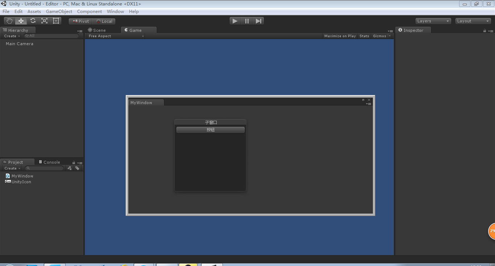**

 **OK,貌似很久没有更新这篇博客，现在回过头重新来学习下。**

**前面我们讲到EditorWindow的BeginWindow开始子窗口的编写，接着我们来看下他的Close()方法。**

**这个应该是十分简单，就是我们呢调用Close()的时候，我们创建的窗体就销毁。在官方API中这样解释的：**

**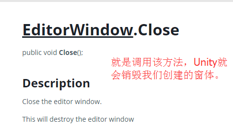**

**我们做下简单的测试：**

 

```
`using` `UnityEngine;``using` `System.Collections;``using` `UnityEditor;``public` `class` `MyWindow: EditorWindow``{``    ``static` `MyWindow myWindow;``    ``[MenuItem(``"Window/MyWindow"``)]``//在unity菜单Window下有MyWindow选项``    ``static` `void` `Init()``    ``{``        ``myWindow = (MyWindow)EditorWindow.GetWindow(``typeof``(MyWindow), ``false``, ``"MyWindow"``, ``false``);``        ``myWindow.Show();``    ``}``    ``void` `OnEnable()``    ``{``       ` `    ``}``    ``void` `OnGUI()``    ``{``        ``if` `(GUILayout.Button(``"关闭窗口"``))``        ``{``            ``myWindow.Close();``        ``}``    ``}``}`
```

 

　　**就是我们点击窗体里面的关闭窗体按钮的时候，就调用close方法，然后我们创建的窗体就销毁消失了。**

**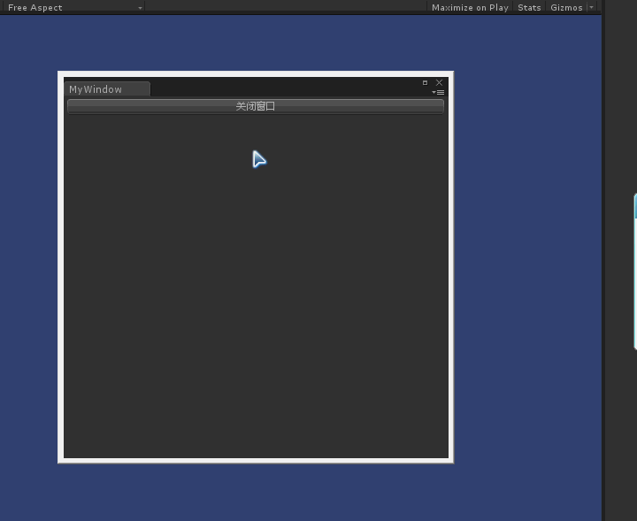**

**OK，接着我们看下其他方法：**

 

# [EditorWindow](http://docs.unity3d.com/ScriptReference/EditorWindow.html).Focus

 

**窗体聚焦方法，也就是说调用这个方法，就自动聚焦到该窗体。**

**那么我们也来做个小实验：**

 

```
`using` `UnityEngine;``using` `System.Collections;``using` `UnityEditor;``public` `class` `MyWindow: EditorWindow``{``    ``static` `MyWindow myWindow;``    ``[MenuItem(``"Window/MyWindow"``)]``//在unity菜单Window下有MyWindow选项``    ``static` `void` `Init()``    ``{``        ``myWindow = (MyWindow)EditorWindow.GetWindow(``typeof``(MyWindow), ``false``, ``"MyWindow"``, ``false``);``        ``myWindow.Show();``    ``}``    ``void` `OnEnable()``    ``{``       ` `    ``}``    ``void` `OnGUI()``    ``{``        ``EditorGUILayout.LabelField(``"聚焦窗体名字："``+EditorWindow.focusedWindow.ToString());``    ``}``    ``[MenuItem(``"Custom Editor/Focus Window"``)]``    ``static` `void` `FocusWindow()``    ``{``        ``myWindow.Focus();``    ``}  ``}`
```

**也就是我们点击Custom Editor菜单下面的Focus Window就会聚焦窗体到自己创建的窗体，然后利用EditorWindow的静态FoursedWindow变量取得，打印在label中。**

**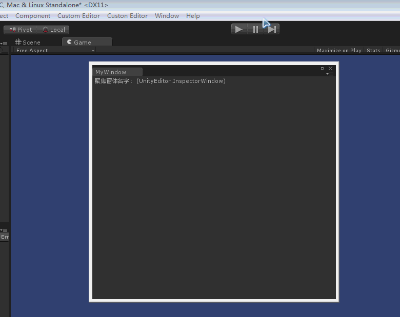**

**接着看下个方法：**

 

# [EditorWindow](http://docs.unity3d.com/ScriptReference/EditorWindow.html).ShowNotification

 

**这个方法是显示消息提示的方法，我们看下官方的API解释：**

**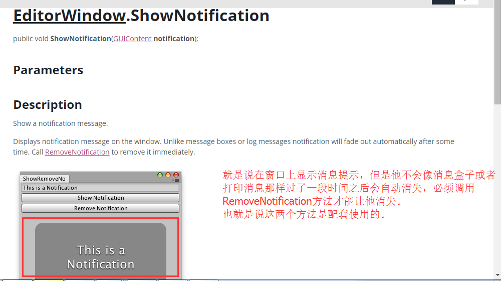**

 

**做事必须得亲自动手试下才能明白他的原理，这里我们编写下程序实验下：**

 

```
`using` `UnityEngine;``using` `System.Collections;``using` `UnityEditor;``public` `class` `MyWindow: EditorWindow``{``    ``static` `MyWindow myWindow;``    ``string` `m_notification = ``"我是消息内容"``;``    ``[MenuItem(``"Window/MyWindow"``)]``//在unity菜单Window下有MyWindow选项``    ``static` `void` `Init()``    ``{``        ``myWindow = (MyWindow)EditorWindow.GetWindow(``typeof``(MyWindow), ``false``, ``"MyWindow"``, ``false``);``        ``myWindow.Show();``    ``}``    ``void` `OnEnable()``    ``{``       ` `    ``}``    ``void` `OnGUI()``    ``{``        ``m_notification = EditorGUILayout.TextField(m_notification);``        ``if` `(GUILayout.Button(``"显示消息"``))``        ``{``            ``myWindow.ShowNotification(``new` `GUIContent(m_notification));``        ``}``        ``if` `(GUILayout.Button(``"不显示消息"``))``        ``{``            ``myWindow.RemoveNotification();``        ``}``    ``}``}`
```

****

**下个方法：**

 

# [EditorWindow](http://docs.unity3d.com/ScriptReference/EditorWindow.html).SendEvent

 

**这个方法就是传递事件的方法，什么意思，也就是说比如你想在Hierarchy窗口粘贴要复制的Cube，那么这个粘贴他是一个事件，那么正常我们是用鼠标操作粘贴，如果我们想要用代码控制，就得使用该方法，直接传递粘贴事件给Hierarchy窗口就行了。**

**具体看下官方的解释：**

****

**那么我们先要知道粘贴事件：**

 

```
`EditorGUIUtility.CommandEvent(``"Paste"``)`
```

**这个方法是通过事件名字取得事件，OK，我们来写下代码：**

 

```
`using` `UnityEngine;``using` `System.Collections;``using` `UnityEditor;``public` `class` `MyWindow: EditorWindow``{``    ``static` `MyWindow myWindow;``    ``[MenuItem(``"Window/MyWindow"``)]``//在unity菜单Window下有MyWindow选项``    ``static` `void` `Init()``    ``{``        ``myWindow = (MyWindow)EditorWindow.GetWindow(``typeof``(MyWindow), ``false``, ``"MyWindow"``, ``false``);``        ``myWindow.Show();``    ``}``    ``void` `OnEnable()``    ``{``       ` `    ``}``    ``void` `OnGUI()``    ``{``        ``if` `(EditorWindow.focusedWindow.ToString().Trim() == ``"(UnityEditor.SceneHierarchyWindow)"``)``        ``{``            ``EditorWindow.focusedWindow.SendEvent(EditorGUIUtility.CommandEvent(``"Paste"``));``//传递粘贴的事件``        ``}``    ``}``}`
```

 

　　

 

**这段代码就是如果聚焦的窗口是Hierarchy窗口的话，那么就传递粘贴事件给Hierarchy窗口。**

**所以我们事先复制一个cube，点击Asset/Copy。然后打开我们的MyWindow，然后点击Cube，就会发现神奇的事情：**

**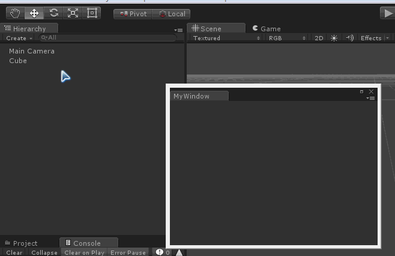**

**感觉篇幅有点过长，下节继续。。。。。未完待续**

**ok，继续回来，时隔这么久，先自己都快忘记了差不多，只能看之前自己写的。**

 

 

# [EditorWindow](file:///C:/Program Files (x86)/Unity/Editor/Data/Documentation/html/en/ScriptReference/EditorWindow.html).OnHierarchyChange()

 

**这个方法是当Hierarchy视窗改变的时候，会执行这个方法的逻辑。**

 

**那么什么时候Hierarchy视窗会改变呢？官方的解释是这样的：**

 

## Description

Called whenever the scene hierarchy has changed.

 

This is transform.parent changed, gameObject.name, creating a new game object, etc.

 

**当Transform组件参数改变的时候，这里注意下你在视窗Scene中拖动坐标轴是不会监听到，只有在Inspector视窗中手动改Transform的值才发生监听。**

**还有GameObject的名称改变会有触发事件监听，还有创建，删除，粘贴等等操作，都会被监听到。**

**写个小例子测试下：**

 

```
`using` `UnityEngine;``using` `UnityEditor;``using` `System.Collections;` `public` `class` `MyWindow : EditorWindow``{``    ``static` `EditorWindow myWindow;``    ``[MenuItem(``"Window/MyWindow"``)]``    ``static` `void` `Init()``    ``{``        ``myWindow = (MyWindow)EditorWindow.GetWindow(``typeof``(MyWindow), ``false``, ``"MyWindow"``, ``false``);``        ``myWindow.Show();``    ``}``    ``void` `OnHierarchyChange()``    ``{``        ``Debug.Log(``"Sync"``);``    ``}``}　`
```

 

****

**可以看到我创建和删除都监听到。**

 

 

# [EditorWindow](file:///C:/Program Files (x86)/Unity/Editor/Data/Documentation/html/en/ScriptReference/EditorWindow.html).OnProjectChange()

 

**这个方法和上述类似，是Project视窗发生改变的时候，会执行该方法。**

 

**什么时候发生监听，官方的解释是：**

 

## Description

Called whenever the project has changed.

 

Typically after import, file moves, etc.

 

**比如说导入文件，移动文件，等等，当然包括删除文件。**

**这里我就不演示了，和上述类似。**

 

#  

# [EditorWindow](file:///C:/Program Files (x86)/Unity/Editor/Data/Documentation/html/en/ScriptReference/EditorWindow.html).OnSelectionChange()

 

**这个方法是当你选择的物件发生变化（包括Scene，Project和Hierarchy视窗）的时候会执行该方法。**

 