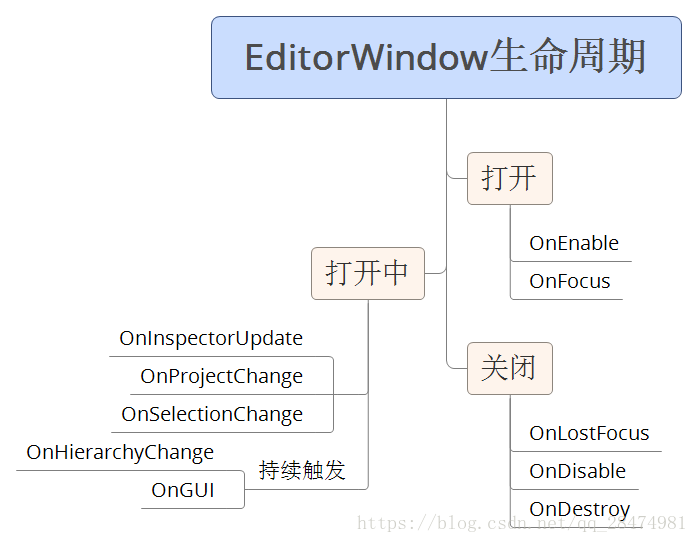

# UNITY EditorWindow生命周期

整理了一下EditorWindow开放出来的生命周期

  OnEnable()：当打开界面的时候调用
  OnFocus()：当被聚焦的时候调用
  OnGUI()：当渲染UI的时候调用
  OnSelectionChange()：当选择发生更改时调用，选中的可选项（在Project和Hierarchy视图中）

  OnLostFocus()：当失去焦点时调用

  OnInspectorUpdate()：当属性界面更新时，几乎一直在更新

  OnHierarchyChange()：当场景层次界面发生改变时调用");//在Hierarchy界面改变（增加、减少物体）

  OnProjectChange()：当项目发生更改时调用");//在Project视图删除、增加文件

  OnDisable()：当隐藏的时候调用

  OnDestroy()：当销毁的时候调用

    using System.Collections;
    using System.Collections.Generic;
    using UnityEngine;
    using UnityEditor;
    public class DemoEditorWindow : EditorWindow {
     
        [MenuItem("CustomTools/Demo")]
        public static void OpenWindow()
        {
            EditorWindow.GetWindow<DemoEditorWindow>();
        }
     
        private void OnEnable()
        {
            Debug.Log("当打开界面的时候调用");
        }
     
        private void OnInspectorUpdate()
        {
     
            Debug.Log("当属性界面更新时");//几乎一直在更新
        }
     
        private void OnHierarchyChange()
        {
            Debug.Log("当场景层次界面发生改变时调用");//在Hierarchy界面改变（增加、减少物体）
        }
     
        private void OnProjectChange()
        {
            Debug.Log("当项目发生更改时调用");//在Project视图删除、增加文件
        }
     
        private void OnGUI()
        {
            Debug.Log("当渲染UI的时候调用");
        }
     
        private void OnFocus()
        {
            Debug.Log("当被聚焦的时候调用");
        }
     
        private void OnSelectionChange()
        {
            Debug.Log("当选择发生更改时调用");//选中的可选项（在Project和Hierarchy视图中）
        }
     
        private void OnLostFocus()
        {
            Debug.Log("当失去焦点时调用");
        }
     
        private void OnDisable()
        {
            Debug.Log("当隐藏的时候调用");
        }
     
        private void OnDestroy()
        {
            Debug.Log("当销毁的时候调用");
        }
     
    }
---------------------
作者：海王星很危险 
来源：CSDN 
原文：https://blog.csdn.net/qq_28474981/article/details/82949820 
版权声明：本文为博主原创文章，转载请附上博文链接！