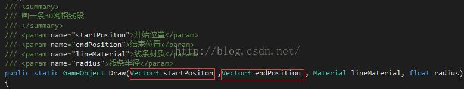
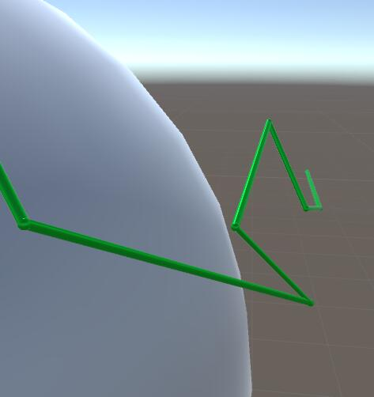
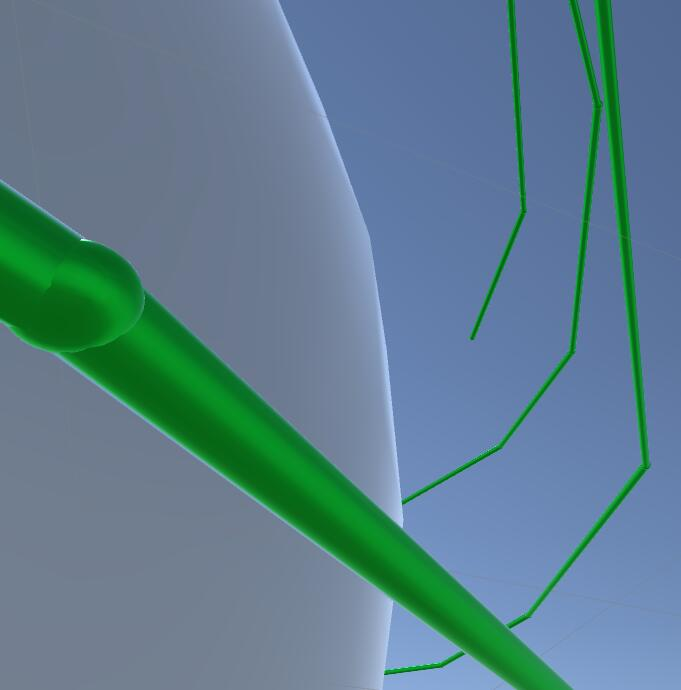
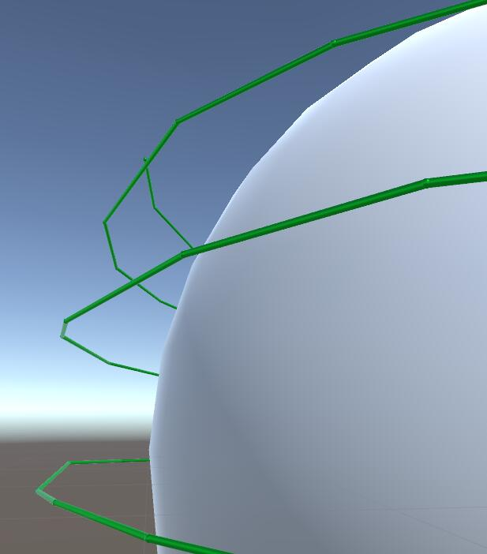
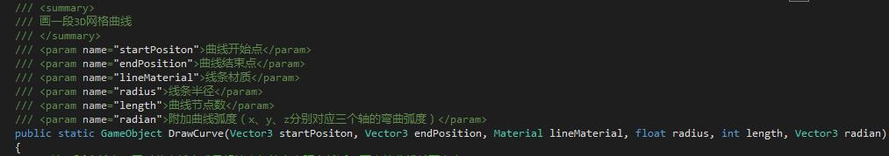
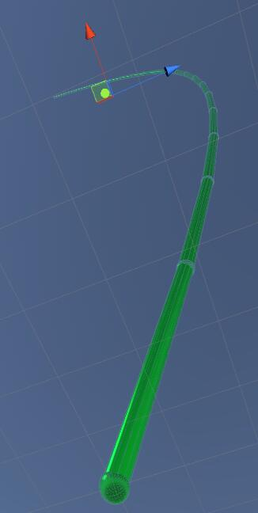
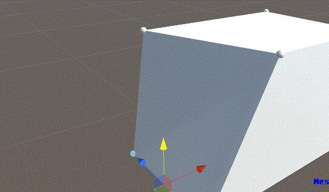
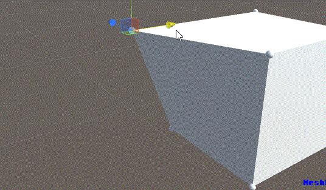
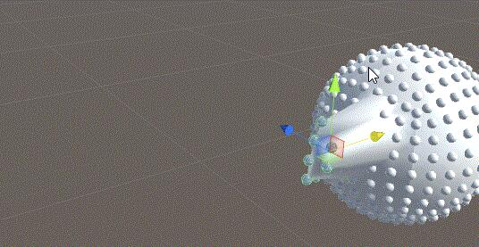
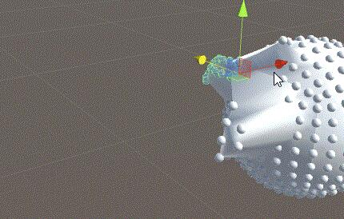

# Unity插件 - MeshEditor（一） 3D线段作画 & 模型网格编辑器


之前，因为工作需要，项目中需要动态生成很多的电线，不能事先让模型做好，更不能用LineRenderer之类的，因为画出来没有3D的效果，最主要是拐角的时候还容易破面，而我们要的是真真实实纯3D的电线，网上找了很多类似于画线的插件，但都没有我想要的效果，索性，我就自己想着动手写一个，这也是这个插件的由来。


之后也是工作上的问题，经常因为模型上的一些细微改动而重新导入模型，替换起来很麻烦，所以尝试着实现能在unity里改动模型的顶点，当然这个方法网上的例子较多，不过在我整合改进了之后，操作起来更加的方便，暂时还没有添加顶点以及删除顶点的功能，不过后续我会逐渐加入这些功能。


# **MeshEditor功能点一：3D网格线段作画**


****

只需要给定起始点以及结束点的两个vector3，以及为其指定材质和半径，便可以画出一条线段，效果如下：







这里实现的方式是分别在起始点的位置画出一个六边形的面，两者相对之后，再分别将两个面对应的六个顶点相连并画出三角形：（部分代码）

```csharp
bool trade = false;


//线段所在轴


        float Xgap = Mathf.Abs(startPositon.x - endPosition.x);


        float Ygap = Mathf.Abs(startPositon.y - endPosition.y);


        float Zgap = Mathf.Abs(startPositon.z - endPosition.z);


 


        Vector3[] _Vertices = new Vector3[24];


        if (Xgap >= Ygap && Xgap >= Zgap)


        {


            Vector3 middle;


//线段方向对调（有时候需要获取线段位置时必须获取它的开始位置）


            if (startPositon.x < endPosition.x)


            {


                middle = startPositon;


                startPositon = endPosition;


                endPosition = middle;


                trade = true;


            }


//创建线段


            _Vertices = new Vector3[24]


            {


                new Vector3(startPositon.x, startPositon.y, startPositon.z + radius),


                new Vector3(startPositon.x, startPositon.y + Mathf.Sin(3.14f/180*30) * radius, startPositon.z + Mathf.Cos(3.14f/180*30) * radius),


                new Vector3(startPositon.x, startPositon.y + Mathf.Sin(3.14f/180*60) * radius, startPositon.z + Mathf.Cos(3.14f/180*60) * radius),


                new Vector3(startPositon.x, startPositon.y + radius, startPositon.z),


                new Vector3(startPositon.x, startPositon.y + Mathf.Sin(3.14f/180*60) * radius, startPositon.z - Mathf.Cos(3.14f/180*60) * radius),


                new Vector3(startPositon.x, startPositon.y + Mathf.Sin(3.14f/180*30) * radius, startPositon.z - Mathf.Cos(3.14f/180*30) * radius),


                new Vector3(startPositon.x, startPositon.y, startPositon.z - radius),


                new Vector3(startPositon.x, startPositon.y - Mathf.Sin(3.14f/180*30) * radius, startPositon.z - Mathf.Cos(3.14f/180*30) * radius),


                new Vector3(startPositon.x, startPositon.y - Mathf.Sin(3.14f/180*60) * radius, startPositon.z - Mathf.Cos(3.14f/180*60) * radius),


                new Vector3(startPositon.x, startPositon.y - radius, startPositon.z),


                new Vector3(startPositon.x, startPositon.y - Mathf.Sin(3.14f/180*60) * radius, startPositon.z + Mathf.Cos(3.14f/180*60) * radius),


                new Vector3(startPositon.x, startPositon.y - Mathf.Sin(3.14f/180*30) * radius, startPositon.z + Mathf.Cos(3.14f/180*30) * radius),


 


                new Vector3(endPosition.x, endPosition.y, endPosition.z + radius),


                new Vector3(endPosition.x, endPosition.y + Mathf.Sin(3.14f/180*30) * radius, endPosition.z + Mathf.Cos(3.14f/180*30) * radius),


                new Vector3(endPosition.x, endPosition.y + Mathf.Sin(3.14f/180*60) * radius, endPosition.z + Mathf.Cos(3.14f/180*60) * radius),


                new Vector3(endPosition.x, endPosition.y + radius, endPosition.z),


                new Vector3(endPosition.x, endPosition.y + Mathf.Sin(3.14f/180*60) * radius, endPosition.z - Mathf.Cos(3.14f/180*60) * radius),


                new Vector3(endPosition.x, endPosition.y + Mathf.Sin(3.14f/180*30) * radius, endPosition.z - Mathf.Cos(3.14f/180*30) * radius),


                new Vector3(endPosition.x, endPosition.y, endPosition.z - radius),


                new Vector3(endPosition.x, endPosition.y - Mathf.Sin(3.14f/180*30) * radius, endPosition.z - Mathf.Cos(3.14f/180*30) * radius),


                new Vector3(endPosition.x, endPosition.y - Mathf.Sin(3.14f/180*60) * radius, endPosition.z - Mathf.Cos(3.14f/180*60) * radius),


                new Vector3(endPosition.x, endPosition.y - radius, endPosition.z),


                new Vector3(endPosition.x, endPosition.y - Mathf.Sin(3.14f/180*60) * radius, endPosition.z + Mathf.Cos(3.14f/180*60) * radius),


                new Vector3(endPosition.x, endPosition.y - Mathf.Sin(3.14f/180*30) * radius, endPosition.z + Mathf.Cos(3.14f/180*30) * radius)


            };


        }
```




同时，提供起点终点以及弯曲弧度还能画出一段曲线，效果如下：



这里实现的方式是从起点开始到终点分别以给定的弯曲值及分段值画出一系列线段：（部分代码）

```csharp
//注：弧度越大，同时节点越少或是起始点与结束点距离越近，画出的曲线越不真实


        if (length % 2 != 0) length += 1;


        //曲线过渡点


        Vector3 LostMedium;


        Vector3 NewMedium;


        //曲线平均衰减值


        float xD = (endPosition.x - startPositon.x) / length;


        float yD = (endPosition.y - startPositon.y) / length;


        float zD = (endPosition.z - startPositon.z) / length;


        //曲线减速衰减值


        float XWeakValue = radian.x / (length / 2);


        float YWeakValue = radian.y / (length / 2);


        float ZWeakValue = radian.z / (length / 2);


        //曲线弧度延伸值


        float XBendingValue = 0;


        float YBendingValue = 0;


        float ZBendingValue = 0;


 


        GameObject _Line = new GameObject("Curve");


        _Line.transform.localScale = Vector3.one;


        _Line.transform.position = Vector3.zero;


        _Line.transform.rotation = Quaternion.Euler(0, 0, 0);


 


        XBendingValue += radian.x;


        YBendingValue += radian.y;


        ZBendingValue += radian.z;


        LostMedium = startPositon;


        NewMedium = new Vector3(startPositon.x + xD + XBendingValue, startPositon.y + yD + YBendingValue, startPositon.z + zD + ZBendingValue);


        Draw(LostMedium, NewMedium, lineMaterial, radius).transform.SetParent(_Line.transform);


//循环画线段


        for (int i = 2; i <= length / 2; i++)


        {


            XBendingValue += (radian.x - XWeakValue * (i - 1));


            YBendingValue += (radian.y - YWeakValue * (i - 1));


            ZBendingValue += (radian.z - ZWeakValue * (i - 1));


            LostMedium = NewMedium;


            NewMedium = new Vector3(startPositon.x + xD * i + XBendingValue, startPositon.y + yD * i + YBendingValue, startPositon.z + zD * i + ZBendingValue);


            Draw(LostMedium, NewMedium, lineMaterial, radius).transform.SetParent(_Line.transform);


        }
```


# **MeshEditor功能点二：模型网格顶点篡改**


为任意模型添加我们的模型网格编辑器脚本，我们就可以随意拖动顶点修改模型网格，编辑完成之后记得删除脚本，以保存修改，原模型不会被修改，最终改动的模型只是原模型的一个克隆体，所以不用担心会破坏网格，效果如下：



这里实现的方式是获取到模型的所有顶点，并创建可操作圆球与顶点一一对应，控制圆球的同时刷新模型顶点。

源码见[第二篇博客](http://blog.csdn.net/qq992817263/article/details/51579913)

-----by MeshEditor