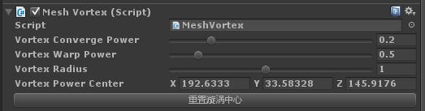
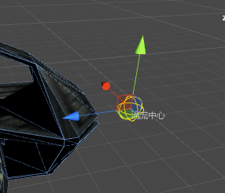
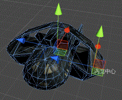
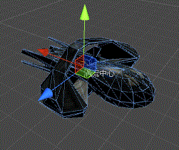
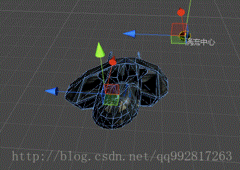

# Unity插件 - MeshEditor（九） 模型涡流扭曲特效（黑洞吸引特效）

先上一张效果图：


类似于将模型吸入一个涡流中心的效果，最开始我想做的是在一个球形区域产生吸引力，将模型整个拉扯成一堆堆的碎片，吸进去再混合搅拌......结果做出来不堪入目，感觉就是一堆面片被吸到某一区域然后在里面各种乱飞......

然后，就倒退一步，再倒退一步......大概也就做成了现在这个样子，感觉没什么技术难点，随便看看算了，我也只是凭着兴致胡乱搞搞哈。


# 1、原理：


非常简单，大概思路就是遍历所有顶点，然后通通被涡流中心吸引过去，这里为了达到一种引力的效果，越靠近涡流中心的点吸引力会越大。


主要代码，Update()中，关于扭曲度，这是在涡流中心的一个旋转的球进行自转的角度，可以忽略：


```csharp
//扭曲度叠加


            _VortexWarpPower += VortexWarpPower;


 


            _SphereObj.transform.rotation = Quaternion.Euler(0, _VortexWarpPower * (180 / Mathf.PI), 0);


            Graphics.DrawMesh(_Sphere, _SphereObj.transform.localToWorldMatrix, _Material, gameObject.layer);


 


            //吸引所有顶点


            for (int i = 0; i < _Vertexs.Length; i++)


            {


                float dis = Vector3.Distance(_Vertexs[i], _VortexPowerCenter);


                if (dis > VortexRadius)


                    _Vertexs[i] = ToBeNearCenter(_Vertexs[i], dis);


            }


 


            _Mesh.vertices = _Vertexs;


            //扭曲度重置


            if (_VortexWarpPower >= (2 * Mathf.PI))


            {


                _VortexWarpPower -= (2 * Mathf.PI);


            }
```


向涡流中心靠近：


```csharp
/// <summary>


    /// 向涡流中心靠近


    /// </summary>


    Vector3 ToBeNearCenter(Vector3 vertex,float speed)


    {


        vertex += (_VortexPowerCenter - vertex) * (VortexConvergePower / speed);


        return vertex;


    }
```

这里speed是一个由距离决定的衰减值。


核心代码就这两段，是不是简单到爆......（当然一些基本的属性定义之类的就省略了）


# 2、属性面板如下：





Vortex Converge Power：涡流中心的吸引力

Vortex Warp Power：涡流中心的旋转力

Vortex Radius：涡流中心半径

Vortex Power Center：涡流中心位置

重置涡流中心：点击可以将涡流中心重新置于transform的position


涡流中心位置可以在场景中拖拽随意调节：（黄色外圈描述着涡流的半径）




# 3、运行：


在任意静态模型物体上添加脚本MeshVortex，然后在任何位置调用外部开关BeginVortex()，运行场景就可以看到效果：


再上几张效果图：


（涡流中心在机翼）




（涡流中心在内部）




（涡流中心在天边）




-----by MeshEditor