# Unity插件 - MeshEditor（二） 模型网格编辑器（高级）

源码已上传至github，并持续更新，链接请看底部。（本帖跟随github持续更新）

继先前的一篇[MeshEditor](http://blog.csdn.net/qq992817263/article/details/51512668)之后，MeshEditor第二版发布，这次在先前的基础上加入了为模型新增顶点以及删除顶点的功能，还有多项针对顶点的操作，类似于顶点塌陷的功能将会有效的降低模型面数（目标最好是仅有材质没有贴图的模型），这次我将以一个例子来大致讲解"模型网格编辑器（高级）"的多项功能，例子是：制作一个剑痕模型。

传送门（[模型破碎](http://blog.csdn.net/qq992817263/article/details/51789584)，[模型融化](http://blog.csdn.net/qq992817263/article/details/51832884)，[模型镜像](http://blog.csdn.net/qq992817263/article/details/53320181)）

传送门（超强进阶版[MeshMaker](http://blog.csdn.net/qq992817263/article/details/75213659)）

好了，我们进入正题：

# **第一步：**

首先，我们在场景中新建一个Cube，并为其添加我们的模型网格编辑器（高级）组件，先前一版的编辑器并未移除，也并未融合，虽然先前一版只支持更改顶点的位置，但在很多情况下或许只需要这个功能。

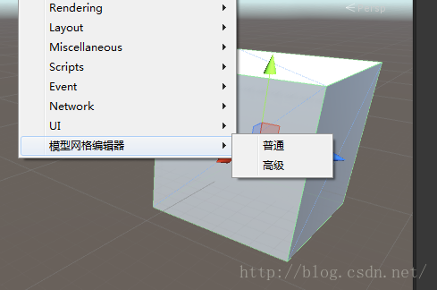

# **第二步：**

打开我们的模型网格编辑辅助界面，Window-> 模型网格编辑辅助界面。

创建顶点：选中两直接相连顶点之后，在两点之间新增一个顶点，注意新顶点会自动与原两点所组三角面的其他点相连，从而组成新的三角面，因为，在unity中不包含在三角面中的点和线是不能存在的。

删除顶点：选中任意一个顶点之后，删除此顶点，注意同时被删除的还有这个顶点所关联的所有三角面，请慎重操作，Ctrl + Z是不能返回的。

相交位移：选中两个顶点之后，将两个顶点以两者相对的方向移动至两者相距的中心位置。

镜像位移：选中两个顶点之后，将两个顶点的位置相对调换，注意，你如果不想制作出一些奇形怪状的东西的话，请慎用此功能。

两点塌陷：选中两个顶点之后，将第二个点合并至第一个点，多余的无依靠的面将会被删除。（此操作可以有效降低模型面数）

多点塌陷：选中两个以上顶点之后，将所有顶点合并至第一个点，多余的无依靠的面将会被删除。（此操作可以有效降低模型面数）

# **第三步：**

选中Cube直接相连的两个顶点，在两者之间创建一个新顶点。（只有存在直接连线的顶点之间才可以新建顶点）

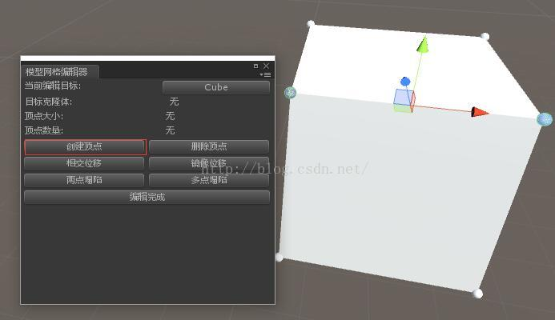

# **第四步：**

将新创建的顶点往上拖，形成剑痕的一方尖角。

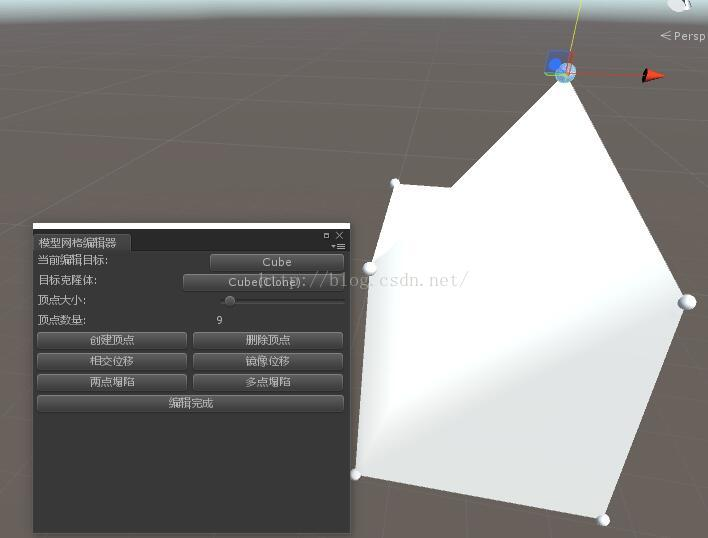

# **第五步：**

我们转到模型背面，选中背向尖角的两个点，执行相交位移（或者两点塌陷）。

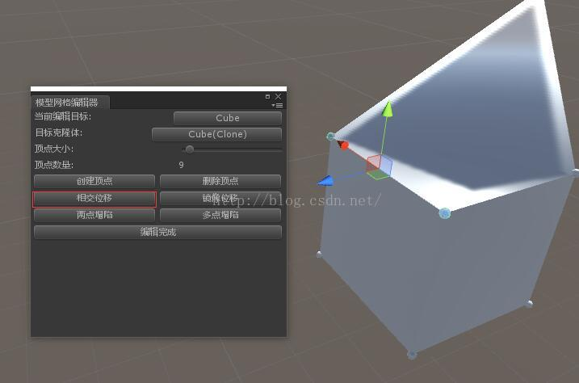

# **第六步：**

我们可以看到两个点被重合为一个点了，这是剑痕的剑锋部分。

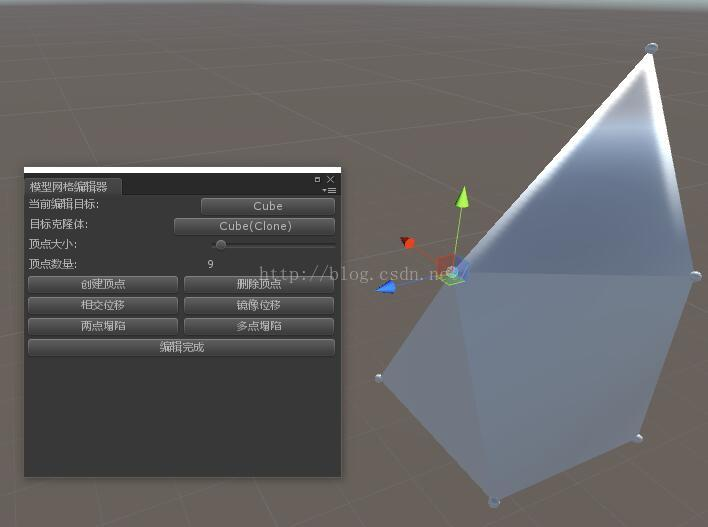

# **第七步：**

我们再转到模型下部，再新建一个点作为剑痕的另一方尖角。

# **第八步：**

将尖角拉出。

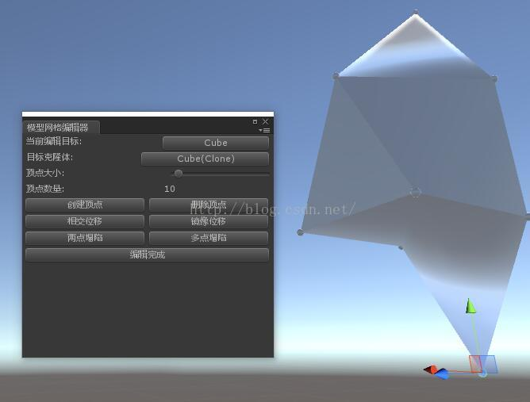

# **第九步：**

再选中下部尖角背面的两个顶点，执行相交位移（或两点塌陷）。

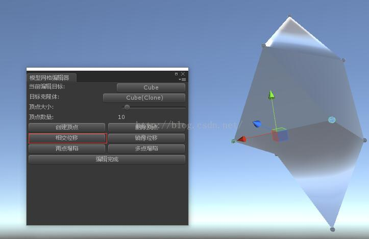

# **第十步：**

一个长长的两面尖的剑痕就已经有些样子了不是,我们可以调节背面让其更薄。

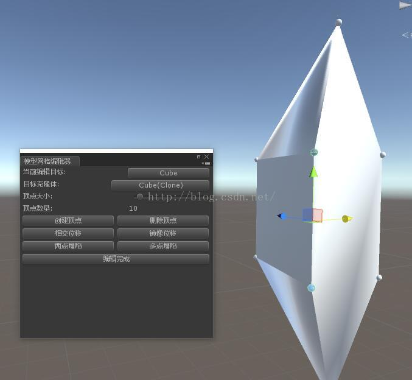

# **第十一步：**

我们继续调节剑痕的背部，让他表现得更薄。

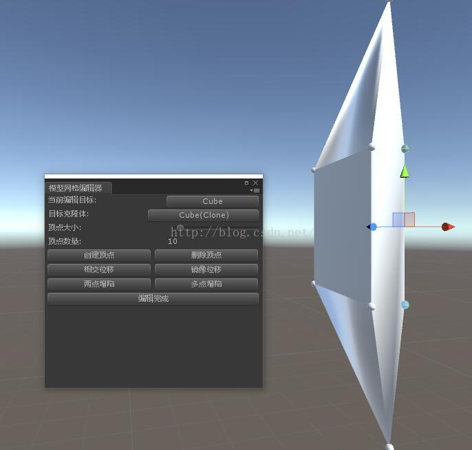

# **第十二步：**

我们再拉长一下两端的尖角，让他表现得更长。

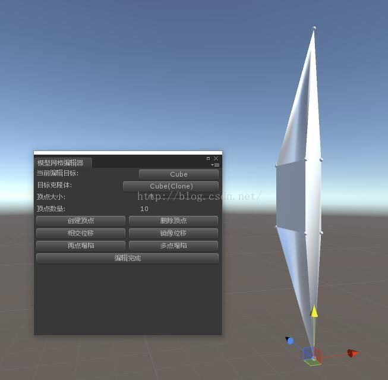

# **第十三步：**

好了，接下来是重点了，我们要让他更细更薄。

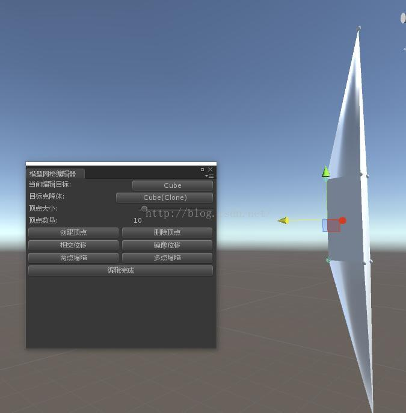

# **第十四步：**

这下完成了，记得点击编辑完成，如果点击之后没效果，可以直接手动移除Cube上的模型编辑脚本。

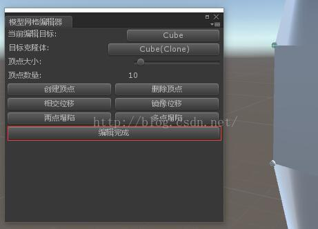

# **最后的效果：**

我们之前创建的Cube是不会被修改的，修改的模型会自动生成一个克隆体。

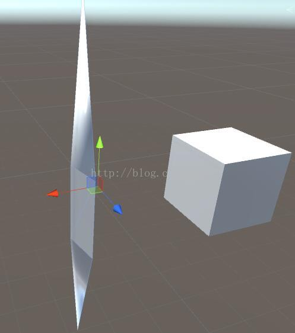

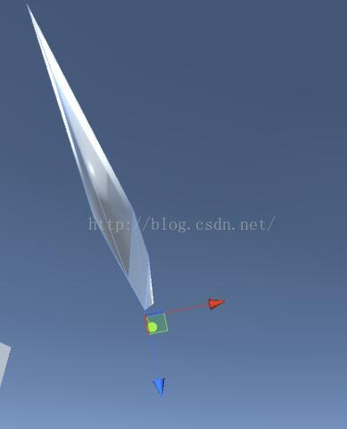

当然不止是Cube，MeshEditor针对的是任何带有网格的物体，外部导入的模型我们也可以随心所欲的进行我们想要的修改的，让我们来玩一玩龙之谷的卡拉翰吧。

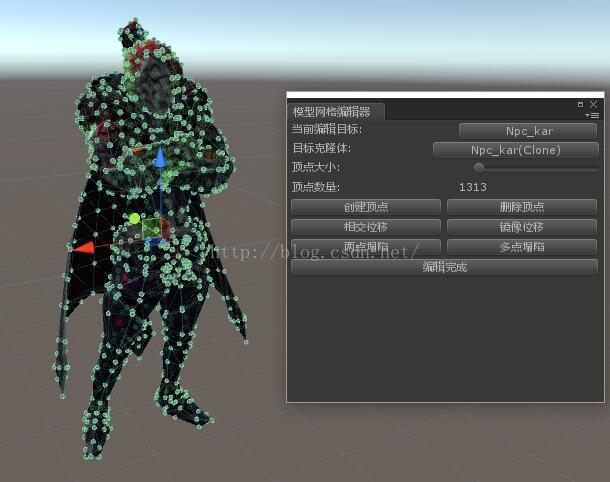

我们可以微调一下人物的面部，把鼻子拉长。

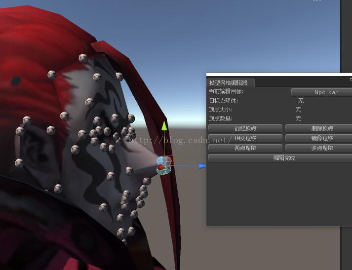

或者将眼睛变得更大。

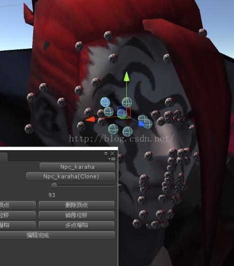

不过可别对有贴图的模型进行删除顶点的操作，你会发现被你删除的那块面直接空了，最主要的是材质会丢失，当然删除之后再选中边缘顶点塌陷就可以补全空白了，但UV可能会乱。

github源码链接:<https://github.com/coding2233/MeshEditor>

-----by MeshEditor