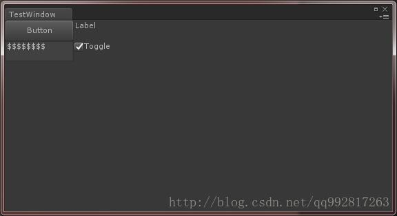
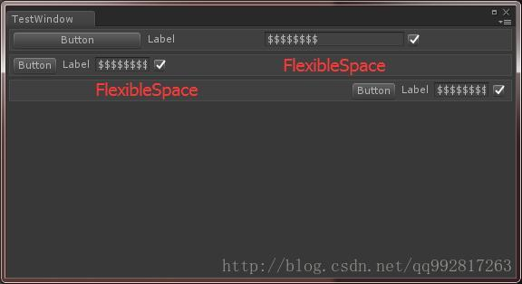
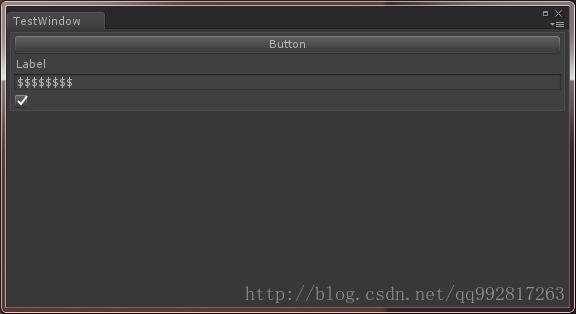
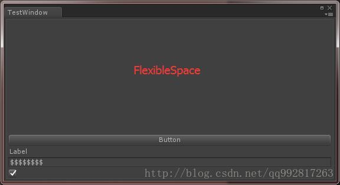
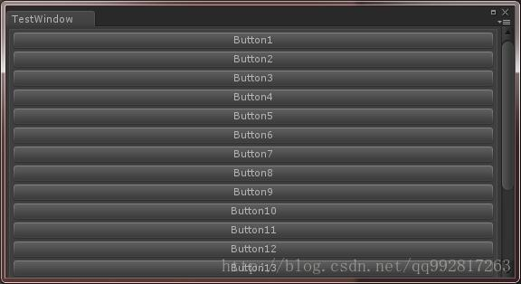
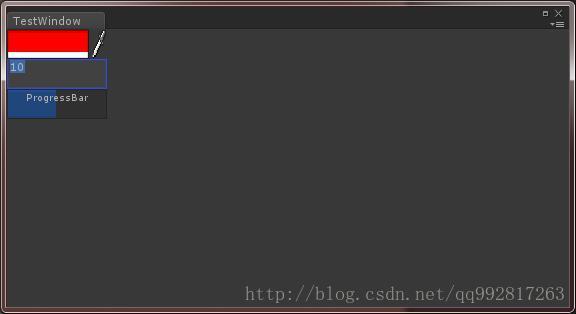
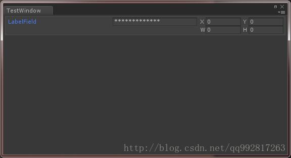

# Unity编辑器开发（二）：四大GUI系统

## **前言**

首先，对于编辑器中的GUI系统，我们可以分为四大类：
 1、UnityEngine.GUI
 2、UnityEngine.GUILayout
 3、UnityEditor.EditorGUI
 4、UnityEditor.EditorGUILayout

## **GUI系统**

这是运用最广泛的GUI系统，所属命名空间UnityEngine，用其绘制的所有控件不带有自动布局效果，需要手动指定每个控件的绘制位置和大小，**自适应性较弱**，但**开发自由度较高**。

**注意：GUI系统可以在发布后使用，也可以在编辑器中使用。**

### **GUI系统的控件使用例子**

```csharp
    private void OnGUI()
    {
        GUI.Button(new Rect(0, 0, 100, 30), "Button");
        GUI.Label(new Rect(100, 0, 100, 30), "Label");
        GUI.PasswordField(new Rect(0, 30, 100, 30), "Password", '$');
        GUI.Toggle(new Rect(100, 30, 100, 30), true, "Toggle");
    }
1234567
```



## **GUILayout系统**

带自动布局的GUI系统，所属命名空间UnityEngine，用其绘制的所有控件都带有自动布局效果，**自适应性较强**，但**开发自由度较低**。

**注意：GUILayout系统可以在发布后使用，也可以在编辑器中使用。**

### **GUILayout系统的控件使用例子**

#### **水平布局**

```csharp
    private void OnGUI()
    {
        GUILayout.BeginHorizontal("Box"); //开始一个水平布局
        GUILayout.Button("Button");
        GUILayout.Label("Label");
        GUILayout.PasswordField("Password", '$');
        GUILayout.Toggle(true, "");
        GUILayout.EndHorizontal();        //结束一个水平布局

        GUILayout.BeginHorizontal("Box"); //开始一个水平布局
        GUILayout.Button("Button");
        GUILayout.Label("Label");
        GUILayout.PasswordField("Password", '$');
        GUILayout.Toggle(true, "");
        GUILayout.FlexibleSpace();        //创建一个自适应的空白区域，也即是填满本次布局中的这部分空间
        GUILayout.EndHorizontal();        //结束一个水平布局

        GUILayout.BeginHorizontal("Box"); //开始一个水平布局
        GUILayout.FlexibleSpace();        //创建一个自适应的空白区域，也即是填满本次布局中的这部分空间
        GUILayout.Button("Button");
        GUILayout.Label("Label");
        GUILayout.PasswordField("Password", '$');
        GUILayout.Toggle(true, "");
        GUILayout.EndHorizontal();        //结束一个水平布局
    }
12345678910111213141516171819202122232425
```



#### **垂直布局**

```csharp
    private void OnGUI()
    {
        GUILayout.BeginVertical("Box"); //开始一个垂直布局
        GUILayout.Button("Button");
        GUILayout.Label("Label");
        GUILayout.PasswordField("Password", '$');
        GUILayout.Toggle(true, "");
        GUILayout.EndVertical();        //结束一个垂直布局
    }
123456789
```



```csharp
    private void OnGUI()
    {
        GUILayout.BeginVertical("Box"); //开始一个垂直布局
        GUILayout.FlexibleSpace();      //创建一个自适应的空白区域，也即是填满本次布局中的这部分空间
        GUILayout.Button("Button");
        GUILayout.Label("Label");
        GUILayout.PasswordField("Password", '$');
        GUILayout.Toggle(true, "");
        GUILayout.EndVertical();        //结束一个垂直布局
    }
12345678910
```



#### **滚动视野**

```csharp
    private Vector2 _scroll;
    private void OnGUI()
    {
        _scroll = GUILayout.BeginScrollView(_scroll);//开始一个滚动视野
        GUILayout.BeginVertical("Box");              //开始一个垂直布局
        for (int i = 0; i < 20; i++)
        {
            GUILayout.Button("Button" + (i + 1));
        }
        GUILayout.EndVertical();                     //结束一个垂直布局
        GUILayout.EndScrollView();                   //结束一个滚动视野
    }
123456789101112
```



## **EditorGUI系统**

适用于编辑器的GUI系统，所属命名空间UnityEditor，用其绘制的所有控件不带有布局效果，需要手动指定每个控件的绘制位置和大小，跟GUI系统的差别是其拥有部分编辑器专用控件，且其只能运行在编辑器内，**自适应性较弱**，但**开发自由度较高**。

**注意：EditorGUI系统不可以在发布后使用，只能在编辑器中使用。**

\###**EditorGUI系统的控件使用例子**

```csharp
    private void OnGUI()
    {
        EditorGUI.ColorField(new Rect(0, 0, 100, 30), Color.red);
        EditorGUI.DoubleField(new Rect(0, 30, 100, 30), 10);
        EditorGUI.ProgressBar(new Rect(0, 60, 100, 30), 0.5f, "ProgressBar");
    }
123456
```



## **EditorGUILayout系统**

带自动布局的EditorGUI系统，所属命名空间UnityEditor，用其绘制的所有控件都带有自动布局效果，跟GUILayout系统的差别是其拥有部分编辑器专用控件，且其只能运行在编辑器内，**自适应性较强**，但**开发自由度较低**。

**注意：EditorGUILayout系统不可以在发布后使用，只能在编辑器中使用。**

\###**EditorGUILayout系统的控件使用例子**

```csharp
    private void OnGUI()
    {
        EditorGUILayout.BeginHorizontal("Box");    //开始一个水平布局
        EditorGUILayout.LabelField("LabelField");
        EditorGUILayout.PasswordField("PasswordField");
        EditorGUILayout.RectField(Rect.zero);
        EditorGUILayout.EndHorizontal();           //结束一个水平布局
    }
12345678
```



以上四个GUI系统可以混用，**EditorGUI**和**EditorGUILayout**系统中的控件多是带Field，可见其用意主要是用来展示字段的值，**GUI**系统由于不带布局，所以在编辑器开发中使用的较少，除非有时候需要创建高自由度的界面时会首选他，**GUILayout**系统开发编辑器工具是使用得最多的。
 当然，这里只是对四大系统做粗略的介绍，其详细的功能以及控件将在后续的文章中阐述。