# 虚幻4渲染编程（动画篇）【第二卷：动画系统源码分析】

这一节没有具体的效果实现，只是把动画系统捋一下。如果想掌握一个系统，首先还是要从原理入手吧，知道它底下都干了什么。

我是一个技术美术，代码能力有限，如有错误还请各路大神指正。

我们先捋一下这几个类的关系

我这里就直接上截图了：

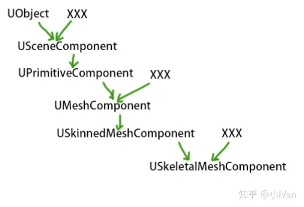

可以看到

如上图所示可以看到是这么一个关系（XXX可以不用去管它暂时，这些不是我们关心的重点）

从UObject到UMeshComponent是图元汇编的基础，骨骼模型其实也是属于图源汇编阶段范畴的，这部分的分析在我的图元汇编篇有详细描述了（图元汇编篇第一节传送门）

小IVan：虚幻4渲染编程（图元汇编篇）【第一卷：CableComponent的原理及Unity实现】

zhuanlan.zhihu.com

下面来主要研究是后半部分。

我们来到USkinnedMeshComponent，找到CreateSceneProxy，可以看到这里在抽取我们导入的骨骼模型资源的渲染资源数据：

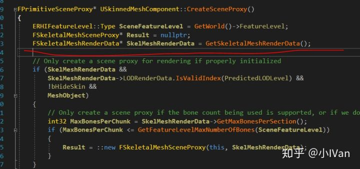

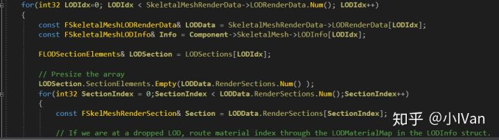

这里的思路和我们之前抽取staticmesh资源数据的思路是一样的（详见图元汇编篇第四卷），只不过这里是骨骼模型资源数据罢了。

抽取了模型资源之后就是进行渲染操作啦，渲染逻辑在这里：

在骨骼更新之前我们下断点，可以看到如下画面

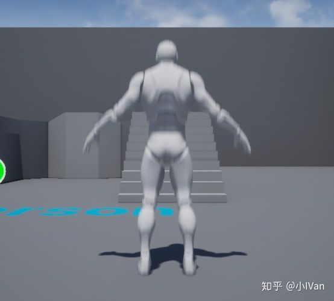

如果不进行骨骼Transform的更新，我们得到的只是一个TPose，要让它动起来，我们需要更新骨骼数据，骨骼数据再驱动模型，从而动起来。

这里进行骨骼的transform计算

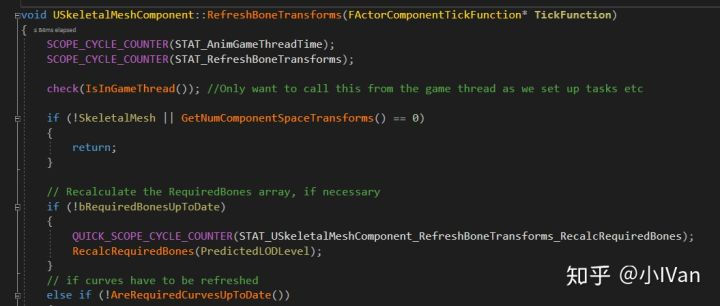

在RefreshBoneTransform会调用动画数据的收集

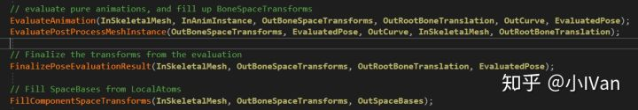

完成FillComponentSpaceTransforms之后，就能看到我们的骨骼数据了

然后人物动了起来

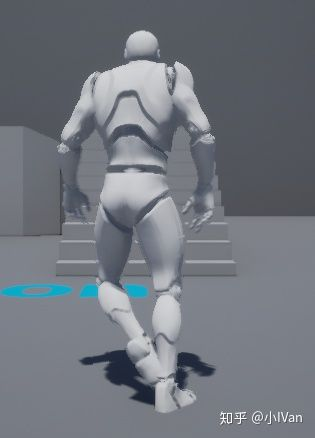

那么问题来了，这些函数的数据是哪里来的呢，这些函数是如何填充骨架transform的呢，于是我们找到了如下代码

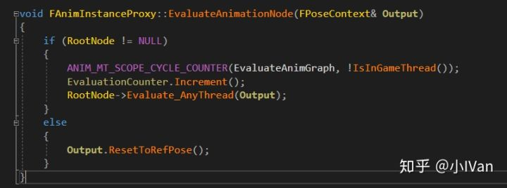

看到EvalueateAnimationNode之后一切就清晰了，这些数据是抽取的AnimationNode的。这些AnimationNode在哪里呢？答案就在下图。

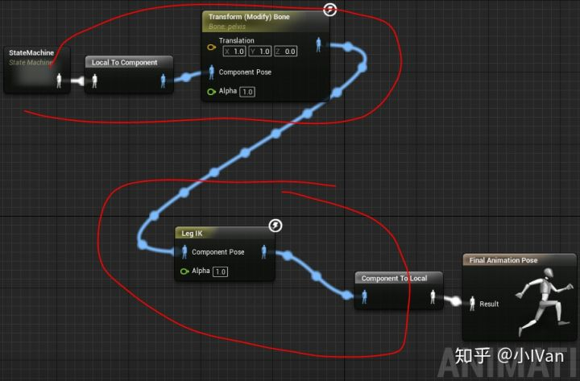

这些AnimNode会去采集UAnimationAsset种的曲线数据，这些Node控制动画的混合，输出。

就拿TransformBone节点为例，我们它的evaluate函数打个断点

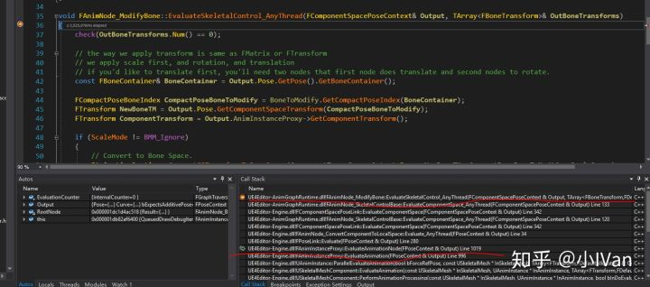

一切已经非常清晰了。

再来是Update的顺序，使用过动画蓝图的话，就会对NativeUpdateAnimation这个函数非常熟悉了。那么动画蓝图的update和骨骼的update是谁先谁后呢

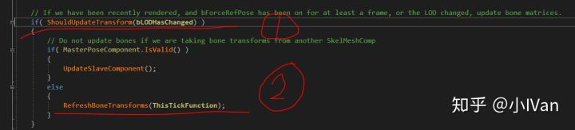

（一部分）勾的函数就会调用NativeUpdateAnimation，可以看到，动画蓝图的update在骨骼transform的update之前。

------

最后来总结一下虚幻的动画系统

## **（1）动画系统所用到的资源**

当我们把动画模型资源导入引擎，会生成以下几个原始源文件

【1】动画模型网格资源

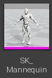

它储存了模型资源的信息，如顶点，索引缓冲，蒙皮权重，顶点格式工厂类型，顶点uv和法线，morph等等信息。

【2】物理资产

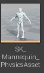

与物理相关的资产，由骨架信息生成

【3】骨架资产

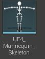

储存了骨架树等信息

【4】动画资产

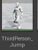

就是存的动画曲线信息，至于什么AnimMontage，BlendSpace这些，是把这些动画资产进行组合，然后采样动画资产信息的时候会按照这些组合方式进行采样。以blendspace1D为例，在采样动画数据的时候，会把动画A和动画B按照Alpha进行混合。

## **（2）动画蓝图**

动画蓝图主要分为两部分，一部分是AnimInstance，一部分是AnimGraph。

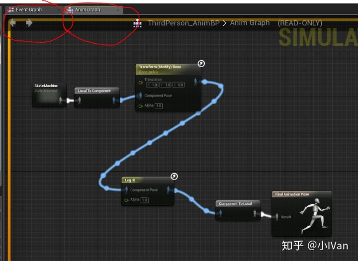

AnimInstance会在AnimGraph之前调用更新，AnimInstance更像是个数据处理器，处理好了数据再给后面阶段的AnimGraph用。AnimGraph负责组织AnimNode，每个AnimNode里面封装了一部分对骨骼的操作逻辑，比如IK或者lookAt等等。RefreshBoneTransforms会去调用AnimGraph所组织的AnimNode的Evalueate方法来刷新骨骼的transform。这些transform再被提交给渲染线程。渲染线程的GetDynamicElement再把信息传给DrawingPolicy然后绘制。

简而言之就是，我们用AnimInstance控制数据。然后我们再用AnimInstance计算出的数据来操作AnimGraph进而来控制骨架的运动。场景代理再把我们算出的骨架数据传给渲染线程，渲染线程再把变形后的模型画出来。

## **（3）动画状态机**

动画状态机到底是个什么。

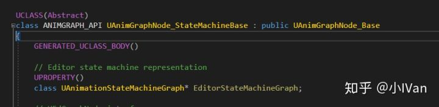

其实它就是一个比较复杂的AnimNode（动画节点）而已！不要把它想得那么高端。

下面通过一系列图来形象再描述一下动画状态机的作用：

假设现在我组合好了一个人物再站立时候的AnimGraph01

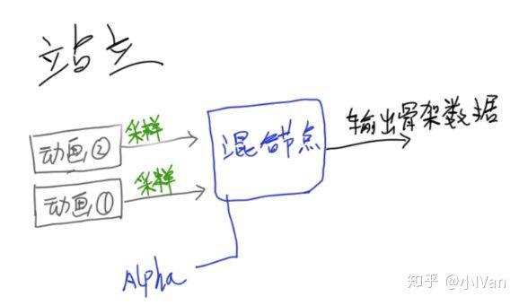

然后我又组合出了一个跑步的AnimGraph02

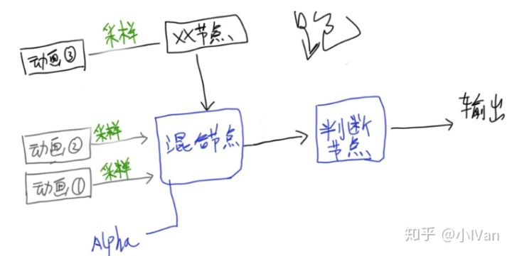

我现在需要根据不同的条件来切换这两个graph，于是状态机横空出世。可以把状态机理解为一个超级复杂的if节点。如果什么什么条件，输出AnimGraph01的数据，如果什么什么条件输出AnimGraph02的数据。

用材质编辑器的思路来对比学习一下：

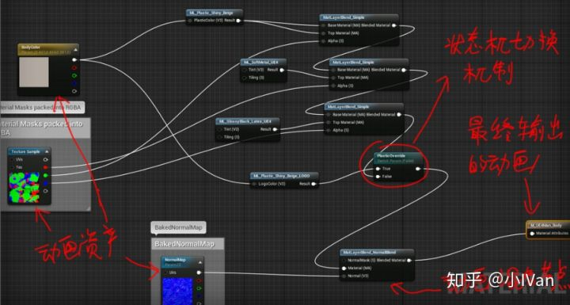

**这里只是举个方便理解的例子哈，原理肯定是完全不一样的。原理的具体分析在文章前半部分了。**

搞清楚这些原理之后，动画系统状态机的构建等操作就再也不在迷茫了。我看有很多人想尽各种办法，硬背参数和节点用法都来了。感觉没什么必要哈。

------

虚幻4动画系统大的骨架就是这样了，当然还有很多小的细节，不过这些细节都是建立在这个大的流程上的。比如AnimNotify，如何采样动画数据混合等等。

我只是个美术，代码功力有限。如有错误，还请各路大神留言斧正。

Enjoy it ！
