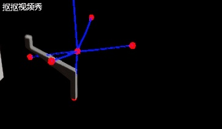
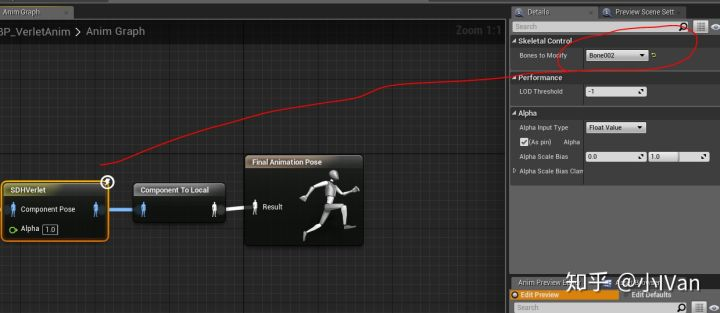
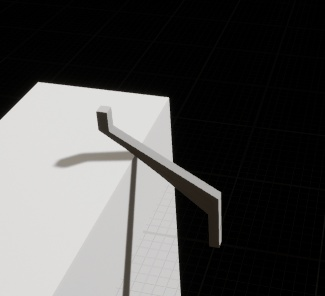
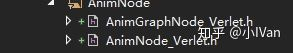
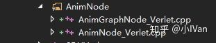
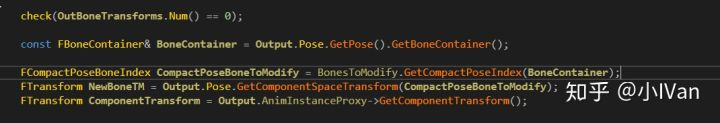
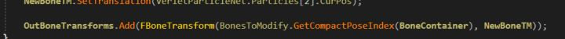
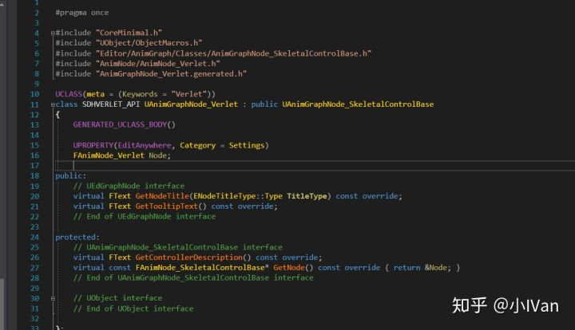
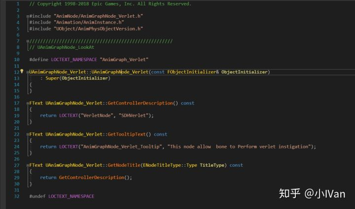
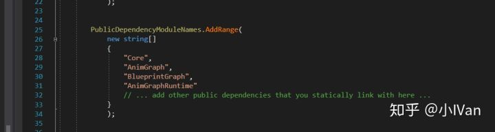

# 虚幻4渲染编程（动画篇）【第六卷：自定义动画节点】

https://zhuanlan.zhihu.com/p/52266316

有时候会有一些特别的骨架解算控制需求，这时候就需要自己解算骨架数据了。在虚幻引擎中可以通过添加自定义的骨架解算节点来达到这个目的。




<svg x="16" y="18.5" class="GifPlayer-icon"></svg>

我这里做了个粗略的解算，我把骨架的一端绑定在了一个动力学粒子上。




**并且可以为动画节点加入碰撞，让动画能和场景交互。**




<svg x="16" y="18.5" class="GifPlayer-icon"></svg>

下面将一步一步完成这个节点。

------







首先需要定义两个类，一个是AnimGraphNode类和AnimNode类。AnimGraphNode类是给编辑器用的，用于定义编辑器的节点。AnimNode类则是负责具体的执行逻辑，解算等工作。

AnimNode_Verlet.h

```text
#pragma once

#include "CoreMinimal.h"
#include "UObject/ObjectMacros.h"
#include "BoneIndices.h"
#include "BoneContainer.h"
#include "BonePose.h"
#include "BoneControllers/AnimNode_SkeletalControlBase.h"
#include "CommonAnimTypes.h"

#include "VerletParticleNet.h"

#include "AnimNode_Verlet.generated.h"

/**
*	Verlet controller that make a bone to Perform verlet instigation
*/
USTRUCT(BlueprintInternalUseOnly)
struct SDHVERLET_API FAnimNode_Verlet : public FAnimNode_SkeletalControlBase
{
	GENERATED_USTRUCT_BODY()

	FAnimNode_Verlet();
	virtual ~FAnimNode_Verlet();

	//Bones to attach, VerletMeshNet will caculate these bone
	UPROPERTY(EditAnywhere, Category = "SkeletalControl")
	FBoneReference BonesToModify;

	// FAnimNode_Base interface
	virtual void GatherDebugData(FNodeDebugData& DebugData) override;
	// End of FAnimNode_Base interface

	// FAnimNode_SkeletalControlBase interface
	virtual void EvaluateSkeletalControl_AnyThread(FComponentSpacePoseContext& Output, TArray<FBoneTransform>& OutBoneTransforms) override;
	virtual bool IsValidToEvaluate(const USkeleton* Skeleton, const FBoneContainer& RequiredBones) override;
	// End of FAnimNode_SkeletalControlBase interface

private:
	// FAnimNode_SkeletalControlBase interface
	virtual void InitializeBoneReferences(const FBoneContainer& RequiredBones) override;
	// End of FAnimNode_SkeletalControlBase interface


private:

	SimpleVerletTreeParticleNetMesh VerletParticleNet;
};
```

AnimNode_Verlet.cpp

```text
#include "AnimNode/AnimNode_Verlet.h"
#include "SceneManagement.h"
#include "Engine/SkeletalMeshSocket.h"
#include "Animation/AnimInstanceProxy.h"
#include "AnimationCoreLibrary.h"

#include "../Public/AnimNode/AnimNode_Verlet.h"
#include "SceneManagement.h"
#include "Engine/SkeletalMeshSocket.h"
#include "Animation/AnimInstanceProxy.h"
#include "AnimationCoreLibrary.h"
#include "Engine/Engine.h"
#include "Materials/MaterialInstanceDynamic.h"

FAnimNode_Verlet::FAnimNode_Verlet()
{
	
	//VerletParticleNet = new SimpleVerletTreeParticleNetMesh();
	
	VerletParticleNet.bDrawDebug = true;

}

FAnimNode_Verlet::~FAnimNode_Verlet()
{
// 	if (VerletParticleNet != nullptr)
// 	{
// 		delete VerletParticleNet;
// 		VerletParticleNet = nullptr;
// 	}
}

void FAnimNode_Verlet::GatherDebugData(FNodeDebugData & DebugData)
{
}

void FAnimNode_Verlet::EvaluateSkeletalControl_AnyThread(FComponentSpacePoseContext & Output, TArray<FBoneTransform>& OutBoneTransforms)
{
	check(OutBoneTransforms.Num() == 0);

	const FBoneContainer& BoneContainer = Output.Pose.GetPose().GetBoneContainer();

	FCompactPoseBoneIndex CompactPoseBoneToModify = BonesToModify.GetCompactPoseIndex(BoneContainer);
	FTransform NewBoneTM = Output.Pose.GetComponentSpaceTransform(CompactPoseBoneToModify);
	FTransform ComponentTransform = Output.AnimInstanceProxy->GetComponentTransform();

	VerletParticleNet.VerletInstigation();
	VerletParticleNet.SolveConstraint();
	FCollisionResponseContainer ResponsChannel;
	ResponsChannel.SetResponse(ECC_WorldDynamic, ECollisionResponse::ECR_MAX);
	VerletParticleNet.PerformCollision(GEngine->GetWorld(), ECollisionChannel::ECC_Camera, ResponsChannel);
	VerletParticleNet.DrawDebug(GEngine->GetWorld());

	NewBoneTM.SetTranslation(VerletParticleNet.Particles[2].CurPos);

	OutBoneTransforms.Add(FBoneTransform(BonesToModify.GetCompactPoseIndex(BoneContainer), NewBoneTM));
}

bool FAnimNode_Verlet::IsValidToEvaluate(const USkeleton * Skeleton, const FBoneContainer & RequiredBones)
{
	return (BonesToModify.IsValidToEvaluate(RequiredBones));
}

void FAnimNode_Verlet::InitializeBoneReferences(const FBoneContainer& RequiredBones)
{
	BonesToModify.Initialize(RequiredBones);

	//Build Verlet particle mesh
	VerletParticleNet.BuildVerletparticleMesh();
}
```


这些函数看名字其实就知道是干啥的了，这里主要关注一下EvaluateSkeletalControl_AnyThread这个函数，它是负责骨架更新的。




这段代码是通过骨架的引用找到骨架的index然后从BoneContainner中取出那根骨头。




最后这里把位置信息set进骨架里。

现在有了底层的解算类之后，还需要一个对应的负责对应编辑器那个UI的类AnimGraphNode类。







非常简单的逻辑，主要是负责节点的名字信息，分类，接口等等。

最后记得在Build.cs里加入下面的模块




Enjoy it 

编辑于 2018-12-13
