# 虚幻4渲染编程（动画篇）【第三卷：骨架控制---上篇】

上一节讨论了虚幻动画系统的整个架构，了解了底层原理之后就可以开始做东西啦。这一节比较简单，用引擎自带的功能就可以实现了，下一节再开始自定义AnimNode。

我目前做了几个部分的骨架控制：

（1）腿部IK解算

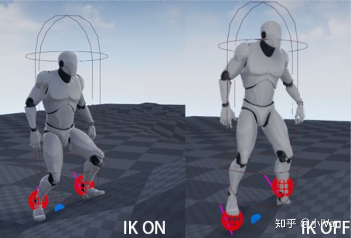

（2）脚部绑定解算

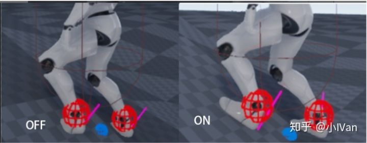

（3）盆骨高度控制

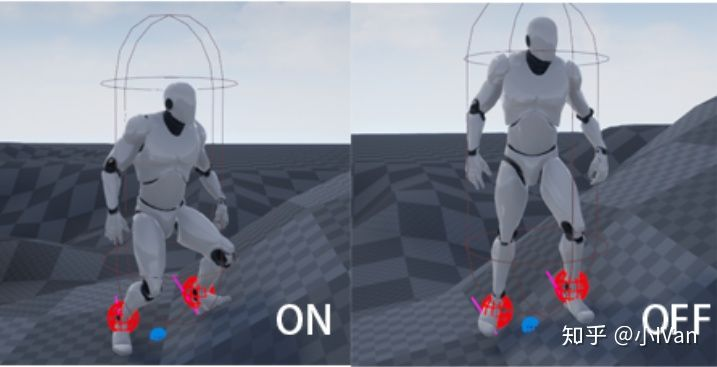

（4）身体转向运动控制

（开启转向倾斜）

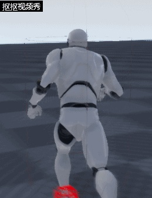

<svg x="16" y="18.5" class="GifPlayer-icon"></svg>

（关闭转向倾斜）

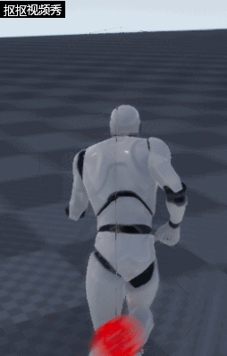

<svg x="16" y="18.5" class="GifPlayer-icon"></svg>

（5）身体重心控制

（关闭）

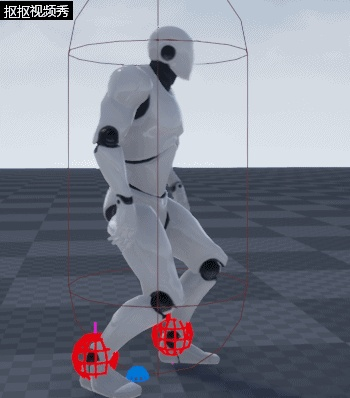

<svg x="16" y="18.5" class="GifPlayer-icon"></svg>

（开启）

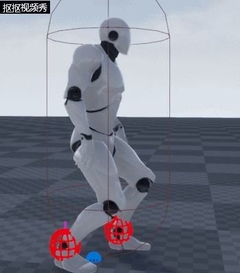

<svg x="16" y="18.5" class="GifPlayer-icon"></svg>

如果需要还可以做得更细致，我这里做得比较简单，不过本章就暂时先讨论上面五点内容。

下面就开始一步一步完成上述的功能吧，如有错误还请各路大神斧正。

------

## **资源准备**

我们需要准备好各种动画资源：

我这里使用的是官方默认的小白人，所以我直接导出资源了，不过导出来后的资源没有绑定控制器，所以我自己对小白人重新制作绑定器

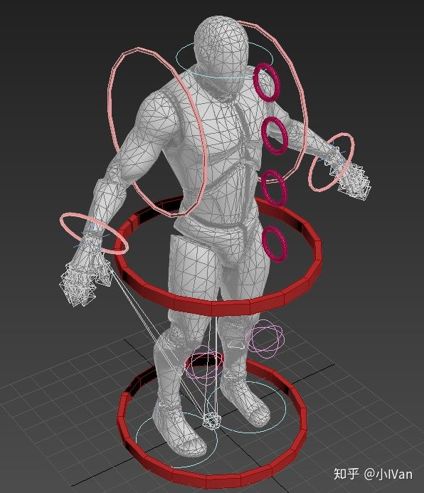

然后我们要准备向左转的奔跑动画，向右转的奔跑动画

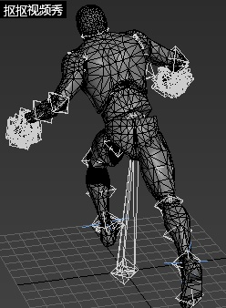

<svg x="16" y="18.5" class="GifPlayer-icon"></svg>

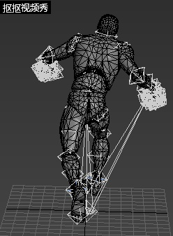

<svg x="16" y="18.5" class="GifPlayer-icon"></svg>

然后就是前后左右倾斜的pos了，在AnimOffset中把他们拼凑起来

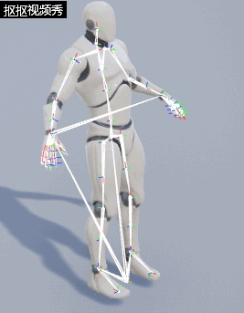

<svg x="16" y="18.5" class="GifPlayer-icon"></svg>

然后是再新建个AnimBlend2D把我们的奔跑动画，行走和Idle拼凑起来

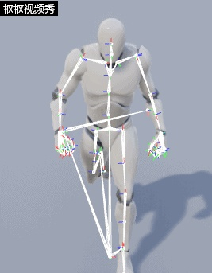

<svg x="16" y="18.5" class="GifPlayer-icon"></svg>

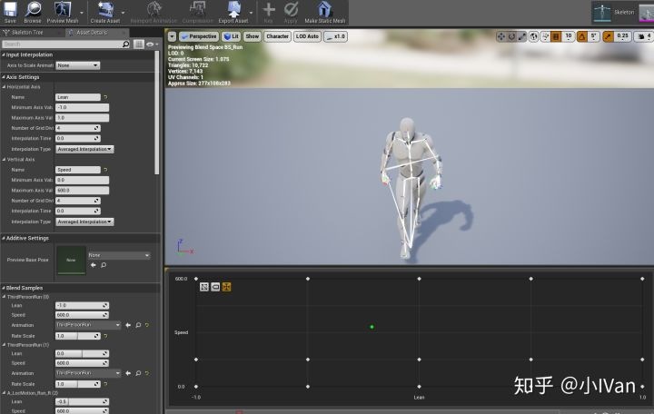

然后我们的资源就准备好了

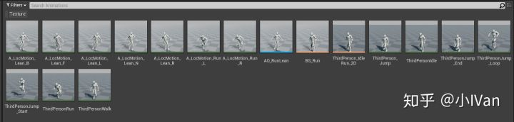

如果还想做什么转身，抬脚，摔倒，起身，预测跳跃什么的，肯定就还需要追加相应的动画资源。

------

## **脚部IK解算**

IK的算法原理网上一搜一大堆。动画师可能会疑惑，为啥这里还需要IK解算呢，我明明在K动画的时候给脚部加了IK绑定器的啊，动画本身就自带IK效果的。其实这里是没错的，但是忽略了一点，动画自身的IK效果已经被烘焙成了静态动画数据，如果在地形起伏变化的奔跑过程中，静态数据是不会变化的，也就是说动画会穿帮，脚会插入地下，所以这里需要对骨骼进行实时IK解算，来纠正动画的问题，这里IK解算的结果和动画数据对骨骼作用的结果应该是叠加关系，纠正关系。

这个节点的使用方法请看官方文档，我这里晒出我的数据

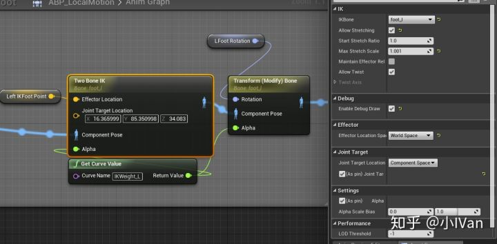

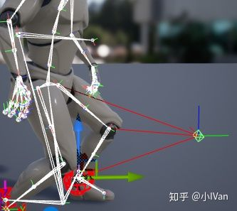

那个JoinTarget动画师应该很熟悉了，是控制IK解算平面的那个三角方向的。

EffectorLocation就是IK末端的位置，这个位置会驱动整个IK相关的骨头。

先暂时不要管那个GetCurveValue控制的alpha，先来看看IK解算的一个关键的地方就是EffectorLocation的位置是如何算出来的

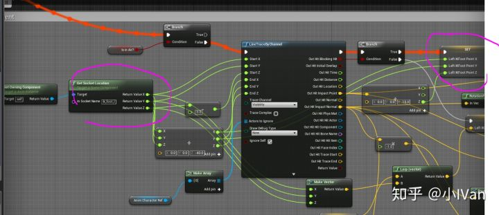

答案是从脚部骨骼做射线检测，这个射线检测的距离不要太长，不然会导致脚拖地，但是即使这样做还是会让脚有闪动，所以我做了一个权重混合

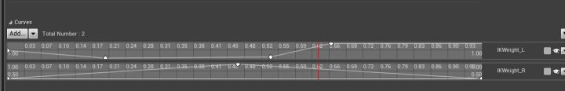

然后在AnimGraph中获取这个权重值就可以了

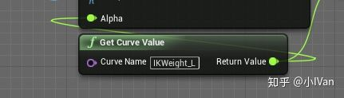

把这个曲线转换成MetaCurve，就可以在其他动画中复用这个曲线了

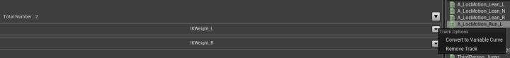

右脚也是同理。

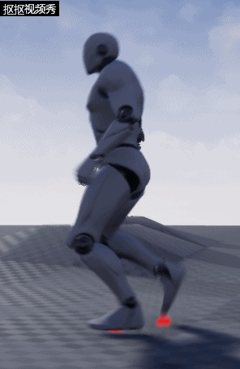

<svg x="16" y="18.5" class="GifPlayer-icon"></svg>

------

## **脚部绑定解算**

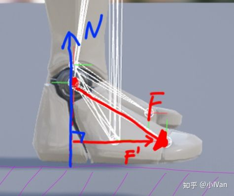

我们需要始终让F'和N保持垂直即可

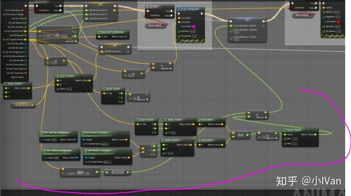

这就是一个纯数学问题，我目前只绑定了朝前的朝向，当然还可以绑定左右的朝向，然后算出Rotation之后把这个Rotation加在原来的脚部上即可

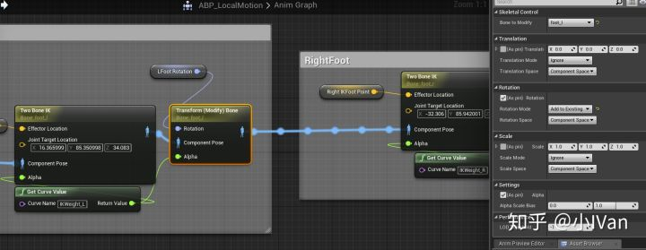

------

## **盆骨控制**

先来看个图

如果不做盆骨控制，人会变成这样，但实际上人的盆骨（重心）会在这种情况下的时候向下移动，如果人在网上运动的话，应该是往向上迈的脚做左下移动，所以对盆骨进行骨架控制比较重要。我这里是从人的盆骨位置做射线检测，然后计算盆骨应该在的位置，这又是个数学问题了。

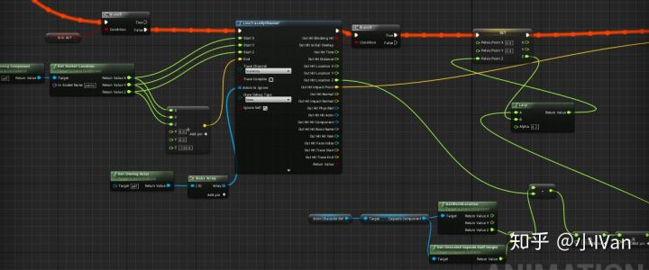

------

## **身体转向运动控制**

先来看个图

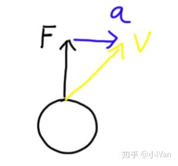

我们之所以能够转身，是因为我们身体倾斜导致有一个加速度a，我们现在正在超F方向移动，但是速度已经在加速度a的影响下与运动方向产生了夹角。此时我们就可以用这个值来控制我们的动画的倾斜程度。

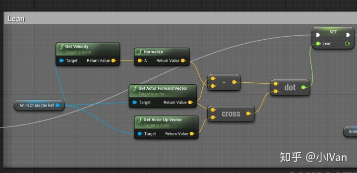

要让速度能和运动方向产生足够我们使用的夹角大小，我们通过调整character movementcomponent的rotationspeed来实现

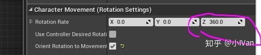

调小它就可以了。为了让运动更有质感，可以操作如下几个值：

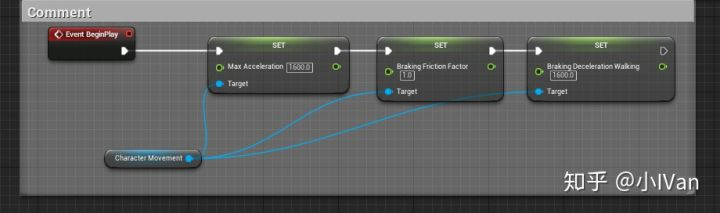

------

## **重心控制**

人物移动的时候需要根据速度来控制重心，速度越快，重心应该越靠前。减速的时候身体重心应该向后，这时我们可以使用AnimOffset来控制

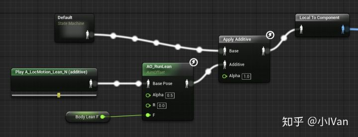

------

自此我们完成了简单的Local Motion系统。还有很多可以加的功能，后面会慢慢实现它们。

Enjoy it！！！
