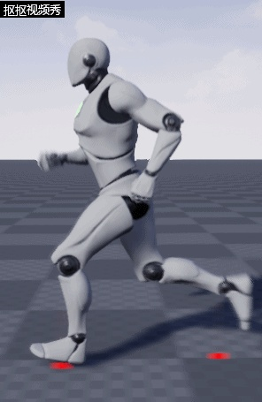
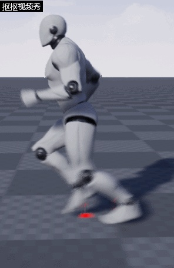
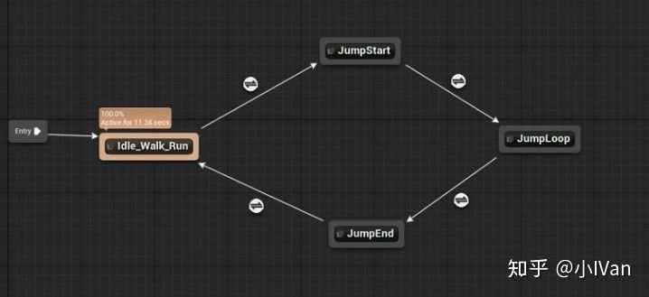
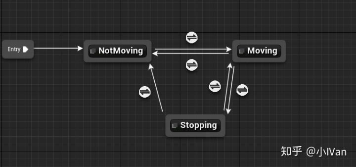
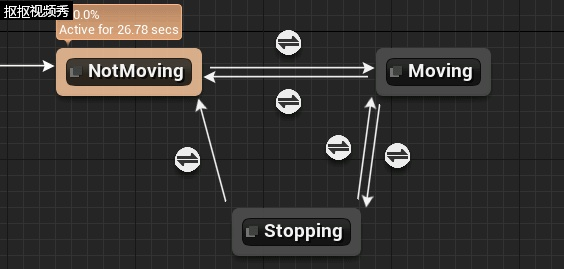

# 虚幻4渲染编程（动画篇）【第四卷：骨架控制---中篇】

这一部分会在上一部分的基础上，加上停脚缓冲。这主要是使用**多状态机嵌套**的办法

**开启脚部缓冲：**

<svg x="16" y="18.5" class="GifPlayer-icon"></svg>

**关闭脚部缓冲：**

<svg x="16" y="18.5" class="GifPlayer-icon"></svg>

先以官方默认的小白人状态机为例开始分析，下面是官方示例的状态机：

可以看到，在地面上移动的状态只是Idle_Walk_Run，这三个状态是合在一起的。但是我们可以把它拆开，因为我们多增加了一种状态那就是停顿。

我们在这个状态里面再加一个状态机把Idle_Walk_Run再在内部拆解成三个状态

这样就有停顿状态了，然后移动状态机之间的切换应该是这样的：

<svg x="16" y="18.5" class="GifPlayer-icon"></svg>

Enjoy It ！
