# 虚幻4渲染编程（动画篇）【第一卷：先从引擎编辑器入手】

**动画篇概述：**

虚幻4提供了一套强大的动画解决方案，当然肯定有不足的啦。在本篇我们将一起探索次世代游戏动画的一些东西。本人只是个小技术美术如有错误还请各路大神斧正。本节先从编辑器上层我们能看到的东西入手，先全浏览下制作虚幻4引擎动画的方式步骤，然后再深入底层。

首先想要跟着本篇思路走你需要具备以下知识

（1）关键帧动画基本理论，如果没有建议去看动画师生存手册。

（2）能使用3Dmax或者Maya制作动画，充分了解bip骨骼或者什么别的骨骼系统，如果能自己用CS骨骼搭建人体骨架就更好了。

（3）C++和虚幻4编程。

好下面就让我们开始吧。

**【1】资源导入**

我们在做引擎动画之前需要资源，这个资源当然就是动画师产出的美术动画资源啦。虚幻对动画资产的骨骼有着比较严格的要求，不然你导都导入不进去。

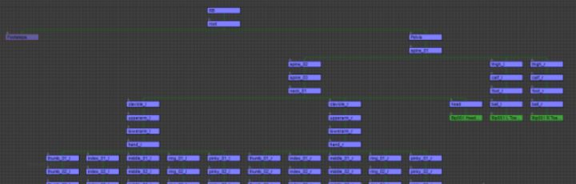

首先来看一下Max里的骨架树

（注意，在资源制作之前一定要记得调好单位，比如骨骼的单位是cm，动画的单位是inch，会导致一系列bug，比如动画通知无法触发。在动画制作之前调好单位cm）

骨架树只能有一根根骨

我做了很多项目发现，根骨位置在脚底是最好的，记得根骨的TransForm必须是全部归零状态

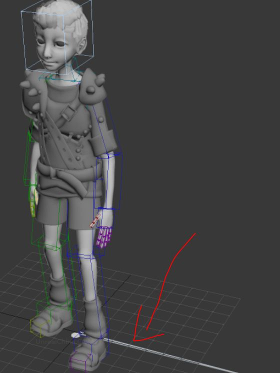人物模型是我自己做的，有点丑请见谅

做好这些设置后就能导出了，下面是我的导出设置

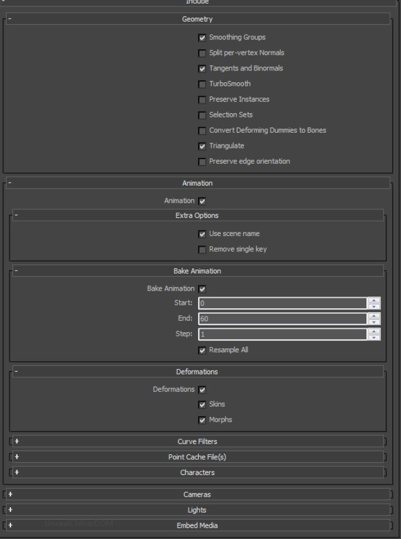

这个ReSampleAll很关键，勾选和不勾选要看情况而定。

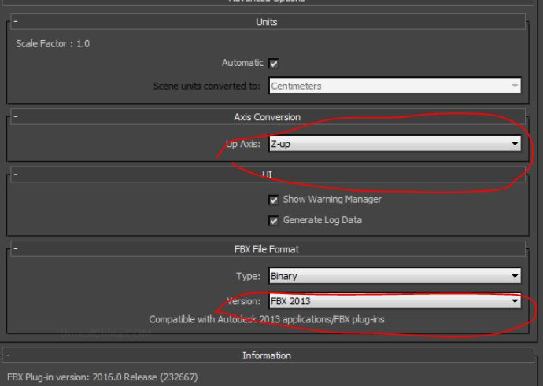

虚幻是Z-Up的然后最下面的FBX版本最好选择虚幻官方推荐的版本，14年的时候虚幻官方土建用13版，17年的时候虚幻官方推荐16版，可以自己去官方文档查一下，一定要使用官方推荐版本，不然有些数据导不进去比如Morph数据如果不用正确版本，很容易损坏。

**【2】资源概览**

导入后我们会得到以下三个文件：

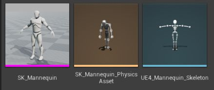

第一个骨架网格文件，里面存储了模型的网格LOD数据，Morpher数据，APEXClothing数据等，动画相关的资产种类比较多，我们需要搞清楚这些资产里面到底存了什么。

第二个就是物理资产了，是物理相关的一些东西。第三个是骨骼资产。骨骼资产储存了骨架树。

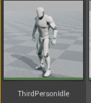

动画资源储存的是动画序列帧数据

然后还有一些是引擎里创建的

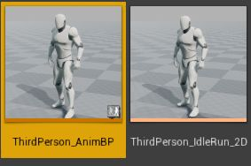

动画蓝图其实是AnimGraph和AnimInstance和合体。AnimInstance实现了逻辑层对动画的操作。AnimGraph就是组织各种动画资源的。

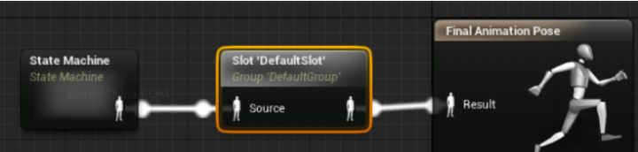

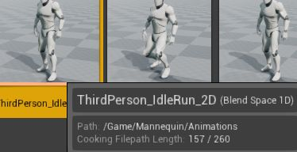

像BlendSpace，和动画蒙太奇这些资源是组织动画序列帧资源的，然后AnimGraph可以把他们又当成一个新资源来使用。

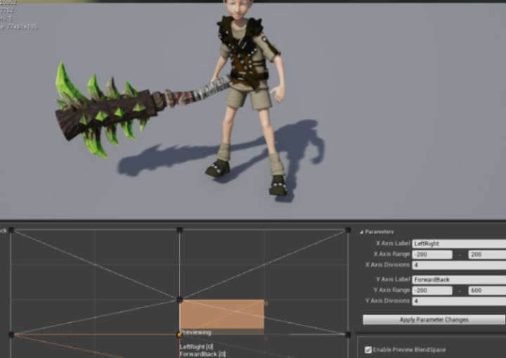

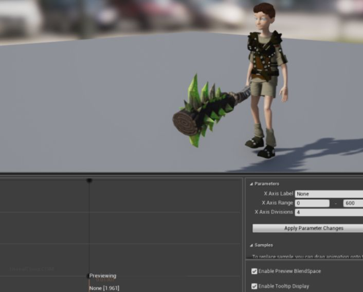

虚幻4动画复杂就复杂在这里，后面我们将对这块进行详细研究。

**【3】动画通知**

动画通知的主要作用就是当动画播放到某一帧时，需要触发个什么事情。比如我一脚踩下去，需要脚在伸直瞬间触发一个地板塌陷的动作。动画通知就是个代理，允许我们延迟调用。

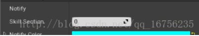

我们还能为它定义更多复杂的内容。比如加入更多的数据区分，或者多层调用。

后面将对第二部分详细研究

Enjoy It！
