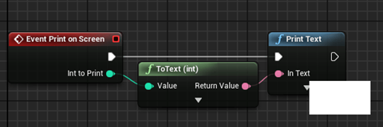
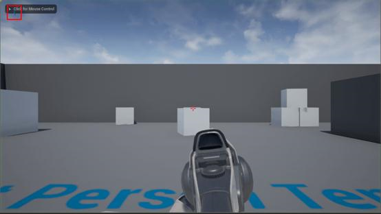

# 虚幻引擎4：在C++中调用蓝图函数

2019年1月24日 星期四

10:46

 

翻译：王成林 ( 麦克斯韦的麦斯威尔 ) 审校：黄秀美（厚德载物）

 

以前的虚幻版本，要想实现某个函数在任意蓝图调用，必须通过C++实现。在本篇教程中，我将为你们展示如何在C++中调用（在蓝图中实现的）函数。我们需要以下步骤：

​    \1. 在C++中声明相应的函数

​    \2. 在蓝图中实现该函数

​    \3. 调用被覆盖的函数

让我们开始吧！

 

**声明蓝图函数**

我将要创建的函数需要一个数字作为输入并将它显示在我们的视口中。

我创建了一个名为MyActor的类，它继承自Actor。然后我添加了以下功能（23-24行）：

注意1：永远使用int32来代替int，因为int型取决于编译器的大小，你也许会得到编译错误。

注意2：BlueprintImplementableEvent的意思是以下函数将在蓝图编辑器中进行实现。

既然完成了第一步，我们就可以在代码中调用该函数了。切换到源文件，在BeginPlay（）方法中使用任意整数作为输入变量调用PrintOnScreen函数（在这个例子中我使用的是1）：

注意：正如评论中所提示的那样，BeginPlay（）函数会在游戏开始时或者当actor生成时被调用。

 

**在蓝图中实现函数**

这一步需要我们创建一个基于上述C++类的蓝图类。这意味着我要添加一个蓝图类，它的父类是我在上一步骤中创建的MyActor类。如果你完成了上一步，打开你的蓝图然后：

​    \1. 在函数菜单中点击“+”符号

​    \2. 选择覆盖（Override）

​    \3. 选择函数PrintOnScreen（编辑器在此时会生成一个新的节点）

​    \4. 从新出现的节点拖出一根线，然后选择Print Text函数。

​    \5. 将Int toPrint连接到Text

​    \6. 编译

你应该得到了类似以下图片中的内容：

现在**别忘了在关卡中放置蓝图**然后按下播放。

你应该在视口的左上角看到你输入的数字（我的是1）。

 

**【版权声明】**

原文作者未做权利声明，视为共享知识产权进入公共领域，自动获得授权。

 

来自 <[*http://gad.qq.com/program/translateview/7190237*](http://gad.qq.com/program/translateview/7190237)> 

 
