# 虚幻4渲染编程（环境模拟篇）【第八卷：海洋模拟-中-在UE中实现FFT海洋】

## 简介：

先上一下效果。因为是GPU的FFT海洋模拟，所以效率非常高。我这里只做了波形的部分，shading放到下一卷介绍

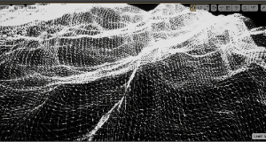

<svg x="16" y="18.5"><g fill="#ffffff"></g></svg>

上一篇推导了海洋模拟的基础理论，实现了Gerstner Wave。这一卷在Unreal中实现FFT海洋。在UnrealEngine4中实现的难度我觉得至少比在OpenGL或者DX中实现难10倍，比在Unity中实现难20倍（手动狗头）。

再来梳理下FFT海洋实现步骤。

（1）构造一个高斯分布，这一步可以再CPU中完成也可以再GPU中完成，反正它只算一遍。

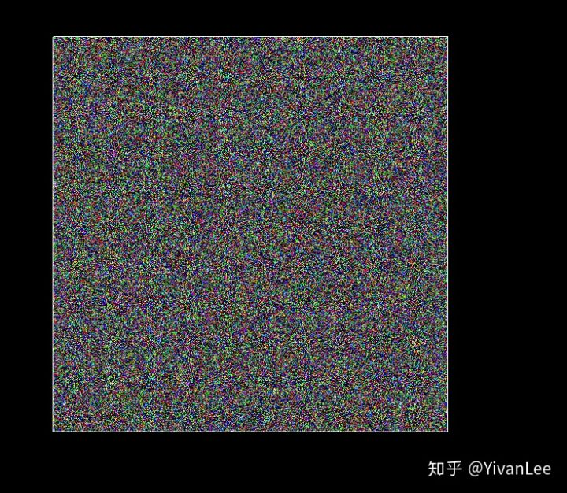

（2）构造HZero

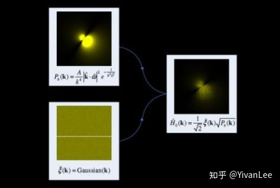


（3）构造Twiddle。这一步也是既可以在GPU中完成，或者可以在CPU中完成。它也只需要构造一次。它可以在所有过程之前构造。


（4）构造FrequencyXYZ

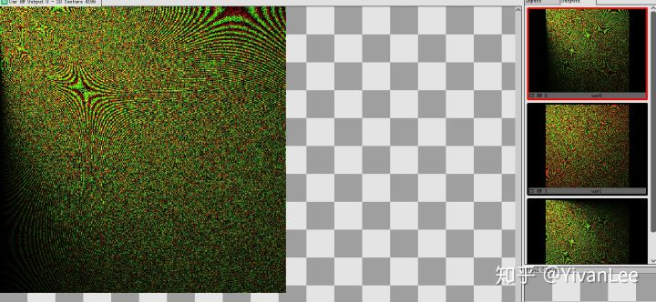

（5）完成了这些之后对FrequencyXYZ进行IFFT蝶形变换


我给个GIF可以看到蝶形变换的整个过程。下面是把XZY三个频谱图从频率反变换到空间域的过程如下。


<svg x="16" y="18.5" class="GifPlayer-icon"></svg>

（6）用上面变换得到的高度图构造法线，这一步就很简单了。

------

## 【1】OceanRenderer的设计

首先我们需要对海洋渲染器这个类进行一下设计，因为我发现如果不事先设计好渲染程序，到后期根本没法写下去了，因为整个过程涉及到了大量的渲染资源，Shader，状态，Uniform Buffer，乒乓缓冲蝶形变换等。

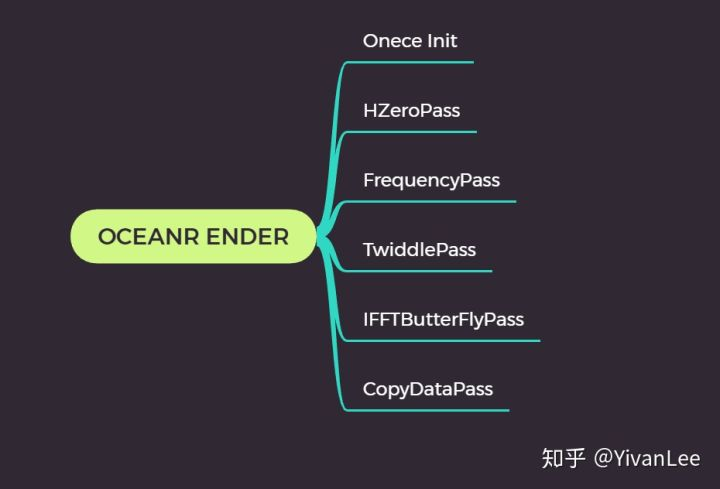

OceanRenderer会有OneceInit的逻辑负责初始化一些只需要画一次的成员。HZeroPass负责构造HZero，FrequencyPass负责构造XYZ频谱。TwiddlePass负责IFFT的旋转因子。IFFTButterFlyPass负责IFFT运算。CopyDataPass负责把CS计算出来的结果拷贝到RT上供渲染管线使用。

------

## 【2】UOceanComponent

首先我们需要一个ActorComponent来负责把引擎的上层数据，RenderTarget传到OceanRenderer中

```text
#pragma once

#include "CoreMinimal.h"
#include "UObject/ObjectMacros.h"
#include "Runtime/Engine/Classes/Components/ActorComponent.h"
#include "Engine/Classes/Engine/TextureRenderTarget2D.h"
#include "OceanComponent.generated.h"

class OceanRender;

UCLASS(hidecategories = (Object, LOD, Physics, Collision), editinlinenew, meta = (BlueprintSpawnableComponent), ClassGroup = Rendering, DisplayName = "OceanComponent")
class SDHOCEAN_API UOceanComponent : public UActorComponent
{
	GENERATED_BODY()

public:

	UOceanComponent(const FObjectInitializer& ObjectInitializer);
	//~ Begin UActorComponent Interface.
	virtual void OnRegister() override;
	virtual void TickComponent(float DeltaTime, enum ELevelTick TickType, FActorComponentTickFunction *ThisTickFunction) override;

	UPROPERTY(BlueprintReadWrite, EditAnywhere, Category = "OceanComponent")
	UTextureRenderTarget2D* PhillipsRenderTarget2D;
	UPROPERTY(BlueprintReadWrite, EditAnywhere, Category = "OceanComponent")
	UTextureRenderTarget2D* OmegaRenderTarget2D;

	UPROPERTY(BlueprintReadWrite, EditAnywhere, Category = "OceanComponent")
	UTextureRenderTarget2D* DisplacementRenderTarget2D_Y;
	UPROPERTY(BlueprintReadWrite, EditAnywhere, Category = "OceanComponent")
	UTextureRenderTarget2D* DisplacementRenderTarget2D_X;
	UPROPERTY(BlueprintReadWrite, EditAnywhere, Category = "OceanComponent")
	UTextureRenderTarget2D* DisplacementRenderTarget2D_Z;

	UPROPERTY(BlueprintReadWrite, EditAnywhere, Category = "OceanComponent")
	UTexture2D* OmegaTexture2D;
	UPROPERTY(BlueprintReadWrite, EditAnywhere, Category = "OceanComponent")
	UTexture2D* PhillipsNoiseTexture2D;
	//void InitGaussianNoise();

	FRHITexture* GetRHITextureFromRT(UTextureRenderTarget2D* RenderTarget);
	
	void RenderOcean(float DeltaTime);
	float TimeValue;
	//The OceanRenderer
	OceanRender* OcenRenderer;

	UPROPERTY(BlueprintReadWrite, EditAnywhere, Category = "OceanComponent")
	bool bStopCalculateOcean;

private:

	bool bHaveInitTwiddle;

};
```

非常简单的类，然后定义我们的OceanRenderer

```text
class OceanRender
{
public:

	OceanRender()
		:bDrawCPUTwiddleTexture(true)
	{
		OceanHZeroPass = new OceanRenderHZeroPass;
		FrequencyPass = new FrequencySpectrumPass;
		OceanTwiddlePass = new OceanRenderTwiddlePass;
		ButterFlyPassY = new OceanRenderButterFlyPass;
		ButterFlyPassX = new OceanRenderButterFlyPass;
		ButterFlyPassZ = new OceanRenderButterFlyPass;
		CopyButterFlyPassY = new CopyDataPass;
		CopyButterFlyPassX = new CopyDataPass;
		CopyButterFlyPassZ = new CopyDataPass;
	}

	~OceanRender() 
	{
		delete OceanTwiddlePass;
		delete FrequencyPass;
		delete OceanHZeroPass;
		delete ButterFlyPassY;
		delete ButterFlyPassX;
		delete ButterFlyPassZ;
		delete CopyButterFlyPassY;
		delete CopyButterFlyPassX;
		delete CopyButterFlyPassZ;
	}

	FRHITexture* GetRHITextureFromRT(UTextureRenderTarget2D* RenderTarget)
	{
		FTextureReferenceRHIRef OutputRenderTargetTextureRHI = RenderTarget->TextureReference.TextureReferenceRHI;
		checkf(OutputRenderTargetTextureRHI != nullptr, TEXT("Can't get render target %d texture"));
		FRHITexture* RenderTargetTextureRef = OutputRenderTargetTextureRHI->GetTextureReference()->GetReferencedTexture();

		return RenderTargetTextureRef;
	}

	OceanRenderHZeroPass* OceanHZeroPass;
	FrequencySpectrumPass * FrequencyPass;
	OceanRenderTwiddlePass* OceanTwiddlePass;
	OceanRenderButterFlyPass* ButterFlyPassY;
	OceanRenderButterFlyPass* ButterFlyPassX;
	OceanRenderButterFlyPass* ButterFlyPassZ;
	CopyDataPass* CopyButterFlyPassY;
	CopyDataPass* CopyButterFlyPassX;
	CopyDataPass* CopyButterFlyPassZ;

	void DrawTwiddleIndiceTexture_CPU(UTexture2D* RenderTexture2D);
	bool bDrawCPUTwiddleTexture;
};
```

它管理了各个pass以及各个pass的调用。

------

## 【3】RenderPass的设计与实现

我的一个pass的设计如下：


用一个pass类来管理Shader.usf，ShaderClass和渲染需要的各种资源。

## HZeroPass

下面实现我们OceanRenderer需要的第一个Pass：HZeroPass

OceanHZeroPass.h

```text
#pragma once

#include "CoreMinimal.h"
#include "UObject/ObjectMacros.h"
#include "RHI/Public/RHIResources.h"
#include "RHI/Public/RHICommandList.h"
#include "Classes/Engine/World.h"

struct OceanRenderHZeroPassSetupData
{
	int32 OutputSizeX;
	int32 OutputSizeY;
	EPixelFormat OutputUAVFormat;
	ERHIFeatureLevel::Type FeatureLevel;
	UTexture2D* PhillipsNoiseTexture2D;
	float WorldTimeSeconds;
};

//Pass data that The render resource using for each pass 
class OceanRenderHZeroPass
{
public:

	OceanRenderHZeroPass();
	~OceanRenderHZeroPass() 
	{
		//We can't release PhillipsNoiseRHITexture
		if (PhillipsNoiseTextureSRV->IsValid())
			PhillipsNoiseTextureSRV->Release();
		if (OutputSurfaceTexture->IsValid())
			OutputSurfaceTexture->Release();
		if (OutputSurfaceTextureSRV->IsValid())
			OutputSurfaceTextureSRV->Release();
		if (OutputSurfaceTextureUAV->IsValid())
			OutputSurfaceTextureUAV->Release();
	}

	void InitPass(const OceanRenderHZeroPassSetupData& SetupData);

	void Draw(const OceanRenderHZeroPassSetupData& SetupData, FRHITexture* DebugRenderTargetRHITexture = nullptr);

	FTexture2DRHIRef OutputSurfaceTexture;
	FUnorderedAccessViewRHIRef OutputSurfaceTextureUAV;
	FShaderResourceViewRHIRef OutputSurfaceTextureSRV;

	FTexture2DRHIRef PhillipsNoiseRHITexture;
	FShaderResourceViewRHIRef PhillipsNoiseTextureSRV;

private:

	//Flag tell us weather we can use this pass
	bool bPassSuccessInit;
	//mark we can only excute initpss function once
	bool bShouldInitPass;
};
```

OceanHZeroPass.cpp

```text
#include "SDHOcean/Private/OceanPass/OceanHZeroPass.h"

#include "Runtime/RHI/Public/RHIResources.h"

#include "RenderCore/Public/GlobalShader.h"
#include "RenderCore/Public/ShaderParameterUtils.h"
#include "RenderCore/Public/ShaderParameterMacros.h"

#include "Classes/Engine/World.h"
#include "Public/GlobalShader.h"
#include "Public/PipelineStateCache.h"
#include "Public/RHIStaticStates.h"
#include "Public/SceneUtils.h"
#include "Public/SceneInterface.h"
#include "Public/ShaderParameterUtils.h"
#include "Public/Logging/MessageLog.h"
#include "Public/Internationalization/Internationalization.h"
#include "Public/StaticBoundShaderState.h"
#include "RHI/Public/RHICommandList.h"
#include "RHI/Public/RHIResources.h"
#include "Engine/Classes/Kismet/KismetRenderingLibrary.h"
#include "Runtime/Engine/Classes/Kismet/GameplayStatics.h"

#include "Math/UnrealMathUtility.h"


BEGIN_GLOBAL_SHADER_PARAMETER_STRUCT(FOceanBasicUniformBufferData, )
SHADER_PARAMETER(FVector4, A_V_windDependency_T)
SHADER_PARAMETER(FVector4, W_unused_unused)
SHADER_PARAMETER(FVector4, width_height_Lx_Lz)
SHADER_PARAMETER(float, TotalTimeElapsedSeconds)
END_GLOBAL_SHADER_PARAMETER_STRUCT()
IMPLEMENT_GLOBAL_SHADER_PARAMETER_STRUCT(FOceanBasicUniformBufferData, "OceanBasicUniformBuffer");

class FOceeanComputeShader_Phlip : public FGlobalShader
{
	DECLARE_SHADER_TYPE(FOceeanComputeShader_Phlip, Global)
public:
	FOceeanComputeShader_Phlip() {}
	FOceeanComputeShader_Phlip(const ShaderMetaType::CompiledShaderInitializerType& Initializer)
		: FGlobalShader(Initializer)
	{
		//TODO Bind pramerter here
		PhlipSurface.Bind(Initializer.ParameterMap, TEXT("PhlipSurface"));
		PhiipNoiseTexture.Bind(Initializer.ParameterMap, TEXT("PhiipNoiseTexture"));
	}
	static bool ShouldCompilePermutation(const FGlobalShaderPermutationParameters& Parameters)
	{
		return IsFeatureLevelSupported(Parameters.Platform, ERHIFeatureLevel::SM5);
	}
	static void ModifyCompilationEnvironment(const FGlobalShaderPermutationParameters& Parameters, FShaderCompilerEnvironment& OutEnvironment)
	{
		FGlobalShader::ModifyCompilationEnvironment(Parameters, OutEnvironment);
	}
	virtual bool Serialize(FArchive& Ar) override
	{
		bool bShaderHasOutdatedParameters = FGlobalShader::Serialize(Ar);
		//Serrilize something here
		Ar << PhlipSurface << PhiipNoiseTexture;
		return bShaderHasOutdatedParameters;
	}

	void BeginUseComputeShaderPhlip(FRHICommandList& RHICmdList, FUnorderedAccessViewRHIRef SurfaceTextureUAV, FShaderResourceViewRHIRef PhilipNoiseTextureSRV)
	{
		FComputeShaderRHIParamRef ComputeShaderRHI = GetComputeShader();

		if (PhlipSurface.IsBound())
			RHICmdList.SetUAVParameter(ComputeShaderRHI, PhlipSurface.GetBaseIndex(), SurfaceTextureUAV);
		if (PhiipNoiseTexture.IsBound())
			RHICmdList.SetShaderResourceViewParameter(ComputeShaderRHI, PhiipNoiseTexture.GetBaseIndex(), PhilipNoiseTextureSRV);
	}

	void EndUseComputeShaderPhlip(FRHICommandList& RHICmdList)
	{
		FComputeShaderRHIParamRef ComputeShaderRHI = GetComputeShader();

		if (PhlipSurface.IsBound())
			RHICmdList.SetUAVParameter(ComputeShaderRHI, PhlipSurface.GetBaseIndex(), FUnorderedAccessViewRHIRef());
	}

	void SetOceanUniformBuffer(FRHICommandList& RHICmdList, const FOceanBasicUniformBufferData& OceanStructData)
	{
		SetUniformBufferParameterImmediate(RHICmdList, GetComputeShader(), GetUniformBufferParameter<FOceanBasicUniformBufferData>(), OceanStructData);
	}

private:
	FShaderResourceParameter PhlipSurface;
	FShaderResourceParameter PhiipNoiseTexture;
};
IMPLEMENT_SHADER_TYPE(, FOceeanComputeShader_Phlip, TEXT("/Plugin/SDHOcean/HZeroGenerator.usf"), TEXT("ComputeHZero"), SF_Compute);


OceanRenderHZeroPass::OceanRenderHZeroPass()
{
	bPassSuccessInit = false;
	bShouldInitPass = true;
}

void OceanRenderHZeroPass::InitPass(const OceanRenderHZeroPassSetupData& SetupData)
{
	if (bShouldInitPass)
	{
		FRHIResourceCreateInfo CreateInfo;
		OutputSurfaceTexture = RHICreateTexture2D(SetupData.OutputSizeX, SetupData.OutputSizeY, SetupData.OutputUAVFormat, 1, 1, TexCreate_ShaderResource | TexCreate_UAV, CreateInfo);
		OutputSurfaceTextureUAV = RHICreateUnorderedAccessView(OutputSurfaceTexture);
		OutputSurfaceTextureSRV = RHICreateShaderResourceView(OutputSurfaceTexture, 0);

		if (SetupData.PhillipsNoiseTexture2D != nullptr)
		{
			PhillipsNoiseRHITexture = (FRHITexture2D*)(SetupData.PhillipsNoiseTexture2D->TextureReference.TextureReferenceRHI->GetReferencedTexture());
			PhillipsNoiseTextureSRV = RHICreateShaderResourceView(PhillipsNoiseRHITexture, 0);
		}

		if (OutputSurfaceTexture && OutputSurfaceTextureUAV && OutputSurfaceTextureSRV && PhillipsNoiseRHITexture && PhillipsNoiseTextureSRV)
			bPassSuccessInit = true;
	}

	bShouldInitPass = false;
}

void OceanRenderHZeroPass::Draw(const OceanRenderHZeroPassSetupData& SetupData, FRHITexture* DebugRenderTargetRHITexture /*= null*/)
{
	if (bPassSuccessInit == false) 
		return;

	ENQUEUE_RENDER_COMMAND(OceanRenderHZeroTextureCommand)
	(
		[SetupData, this, DebugRenderTargetRHITexture](FRHICommandListImmediate& RHICmdList)
		{
			check(IsInRenderingThread());

			TShaderMapRef<FOceeanComputeShader_Phlip> OceanComputeShader(GetGlobalShaderMap(SetupData.FeatureLevel));
			RHICmdList.SetComputeShader(OceanComputeShader->GetComputeShader());
			OceanComputeShader->BeginUseComputeShaderPhlip(RHICmdList, OutputSurfaceTextureUAV, PhillipsNoiseTextureSRV);

			//Update uniform buffer
			FOceanBasicUniformBufferData OceanBasicUniformData;
			OceanBasicUniformData.A_V_windDependency_T = FVector4(30, 150, 0.25, 0);
			OceanBasicUniformData.W_unused_unused = FVector4(0.5, 0.5, 0.0f, 0.0f);
			OceanBasicUniformData.width_height_Lx_Lz = FVector4(SetupData.OutputSizeX, SetupData.OutputSizeY, 2000.0f, 2000.0f);
			OceanBasicUniformData.TotalTimeElapsedSeconds = SetupData.WorldTimeSeconds;
			OceanComputeShader->SetOceanUniformBuffer(RHICmdList, OceanBasicUniformData);

			DispatchComputeShader(RHICmdList, *OceanComputeShader, SetupData.OutputSizeX / 32, SetupData.OutputSizeY / 32, 1);
			OceanComputeShader->EndUseComputeShaderPhlip(RHICmdList);

			if (DebugRenderTargetRHITexture != nullptr)
				RHICmdList.CopyToResolveTarget(OutputSurfaceTexture, DebugRenderTargetRHITexture, FResolveParams());
		}
	);
}
```

HZeroPass.usf

```text
#include "/Engine/Private/Common.ush"

#define PI       3.1415926536f
#define TWOPI    (2.f*PI)

#define GRAVITY  981.0f //gravitational acceleration (cm/s^2)
#define HALF_SQRT_2	0.7071068f

RWTexture2D<float4> PhlipSurface;
Texture2D<float4> PhiipNoiseTexture;

float2 Get_K(in float2 pos)
{
    float2 k;
    float4 width_height_Lx_Lz = OceanBasicUniformBuffer.width_height_Lx_Lz;
    k.x = (pos.x * TWOPI / width_height_Lx_Lz.z);
    k.y = (pos.y * TWOPI / width_height_Lx_Lz.w);
    return k;
}

float GetPhillipsSpectrum(in float2 k)
{
    float windDependency = OceanBasicUniformBuffer.A_V_windDependency_T.z;
    float A = OceanBasicUniformBuffer.A_V_windDependency_T.x;
    float V = OceanBasicUniformBuffer.A_V_windDependency_T.y;
    float2 W = OceanBasicUniformBuffer.W_unused_unused.xy;

    float L = (V * V) / GRAVITY;
   
    float l = L * 0.001f;
    
    float ksqr = dot(k, k);
    
    float result = 0.0f;
    if (ksqr > 0.0f)  //avoid division by 0
    {
        float2 Wn = normalize(W); //normalize wind direction 
        float2 kn = normalize(k);
        float kdotw = dot(kn, Wn);
        float k4 = ksqr * ksqr;
        float kL2 = ksqr * L * L;
        float exp_term = A * exp(-1.0f / kL2);

        float P_k = (exp_term / k4) * (kdotw * kdotw); //resulting Phillips spectrum

		//introduce wind dependency
        if (kdotw < 0.0f)
        {
            P_k *= windDependency;
        }
		
		//finally suppress waves smaller than a small length (l<<L)
        result = P_k * exp(-ksqr * l * l);
    }
    return result;
}


[numthreads(32, 32, 1)]
void ComputeHZero(uint3 ThreadId : SV_DispatchThreadID)
{
    float2 pos = ThreadId.xy; //screen space position   
    float2 K = Get_K(pos);
    float4 gaussRand = PhiipNoiseTexture.Load(int3(ThreadId.xy, 0));
         
    float phil = sqrt(GetPhillipsSpectrum(K));
    float phil_m = sqrt(GetPhillipsSpectrum(-K));

    //set the Phillips spectrum to variables with a more meaningful name
    float P_k = phil;
    float P_km = phil_m;

    //H0(k)
    float2 H0k = P_k * gaussRand.xy * HALF_SQRT_2;
    float2 H0mK = P_km * gaussRand.zw * HALF_SQRT_2;

    PhlipSurface[pos] = float4(H0k, H0mK);
}
```

在Render函数中调用HZerPass可以得到如下结果

```text
	//Compute HZero data
	OceanRenderHZeroPassSetupData HZeroPassData;
	HZeroPassData.FeatureLevel = GetWorld()->FeatureLevel;
	HZeroPassData.OutputSizeX = 512;
	HZeroPassData.OutputSizeY = 512;
	HZeroPassData.OutputUAVFormat = PF_FloatRGBA;
	HZeroPassData.PhillipsNoiseTexture2D = PhillipsNoiseTexture2D;
	HZeroPassData.WorldTimeSeconds = TimeValue;
	OcenRenderer->OceanHZeroPass->InitPass(HZeroPassData);
	OcenRenderer->OceanHZeroPass->Draw(HZeroPassData);
```

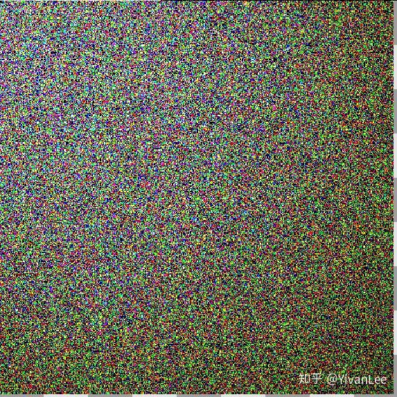

## FrequencyPass

Frequency.h

Frequencypass需要根据HZeroPass的计算结果，计算出XYZ三个轴向的Frequency。

```text
#pragma once

#include "CoreMinimal.h"
#include "UObject/ObjectMacros.h"
#include "RHI/Public/RHIResources.h"
#include "RHI/Public/RHICommandList.h"
#include "Classes/Engine/World.h"

struct FrequencySpectrumPassSetupData
{
	int32 OutputSizeX;
	int32 OutputSizeY;
	EPixelFormat OutputUAVFormat;
	ERHIFeatureLevel::Type FeatureLevel;
	FShaderResourceViewRHIRef HZeroTextureSRV;
	float WorldTimeSeconds;
};

//Pass data that The render resource using for each pass 
class FrequencySpectrumPass
{
public:

	FrequencySpectrumPass();
	~FrequencySpectrumPass()
	{
		//We can't release PhillipsNoiseRHITexture
		if (SurfaceTextureX->IsValid())
			SurfaceTextureX->Release();
		if (SurfaceTextureX_UAV->IsValid())
			SurfaceTextureX_UAV->Release();
		if (SurfaceTextureX_SRV->IsValid())
			SurfaceTextureX_SRV->Release();

		if (SurfaceTextureY->IsValid())
			SurfaceTextureY->Release();
		if (SurfaceTextureY_UAV->IsValid())
			SurfaceTextureY_UAV->Release();
		if (SurfaceTextureY_SRV->IsValid())
			SurfaceTextureY_SRV->Release();

		if (SurfaceTextureZ->IsValid())
			SurfaceTextureZ->Release();
		if (SurfaceTextureZ_UAV->IsValid())
			SurfaceTextureZ_UAV->Release();
		if (SurfaceTextureZ_SRV->IsValid())
			SurfaceTextureZ_SRV->Release();
	}

	void InitPass(const FrequencySpectrumPassSetupData& SetupData);

	void Draw(const FrequencySpectrumPassSetupData& SetupData, FTextureRHIParamRef DebugRenderTarget = nullptr);

	FTexture2DRHIRef SurfaceTextureX;
	FUnorderedAccessViewRHIRef SurfaceTextureX_UAV;
	FShaderResourceViewRHIRef SurfaceTextureX_SRV;

	FTexture2DRHIRef SurfaceTextureY;
	FUnorderedAccessViewRHIRef SurfaceTextureY_UAV;
	FShaderResourceViewRHIRef SurfaceTextureY_SRV;

	FTexture2DRHIRef SurfaceTextureZ;
	FUnorderedAccessViewRHIRef SurfaceTextureZ_UAV;
	FShaderResourceViewRHIRef SurfaceTextureZ_SRV;

	FShaderResourceViewRHIRef HZeroTextureSRV;

private:

	//Flag tell us weather we can use this pass
	bool bPassSuccessInit;
	//mark we can only excute initpss function once
	bool bShouldInitPass;
};
```

Frequency.cpp

```text
#include "SDHOcean/Private/OceanPass/FrequencySpectrum.h"

#include "Runtime/RHI/Public/RHIResources.h"

#include "RenderCore/Public/GlobalShader.h"
#include "RenderCore/Public/ShaderParameterUtils.h"
#include "RenderCore/Public/ShaderParameterMacros.h"

#include "Classes/Engine/World.h"
#include "Public/GlobalShader.h"
#include "Public/PipelineStateCache.h"
#include "Public/RHIStaticStates.h"
#include "Public/SceneUtils.h"
#include "Public/SceneInterface.h"
#include "Public/ShaderParameterUtils.h"
#include "Public/Logging/MessageLog.h"
#include "Public/Internationalization/Internationalization.h"
#include "Public/StaticBoundShaderState.h"
#include "RHI/Public/RHICommandList.h"
#include "RHI/Public/RHIResources.h"
#include "Engine/Classes/Kismet/KismetRenderingLibrary.h"
#include "Runtime/Engine/Classes/Kismet/GameplayStatics.h"

#include "Math/UnrealMathUtility.h"

BEGIN_GLOBAL_SHADER_PARAMETER_STRUCT(FOceanFrequencyDrawData, )
SHADER_PARAMETER(float, OceanTime)
SHADER_PARAMETER(float, WaveAmplitude)
SHADER_PARAMETER(float, WindDependency)
SHADER_PARAMETER(float, WindSpeed)
SHADER_PARAMETER(FVector, WindDir)
END_GLOBAL_SHADER_PARAMETER_STRUCT()
IMPLEMENT_GLOBAL_SHADER_PARAMETER_STRUCT(FOceanFrequencyDrawData, "FOceanFrequencyDrawData");

class FOceeanComputeShader_FrequencySpectrum : public FGlobalShader
{
	DECLARE_SHADER_TYPE(FOceeanComputeShader_FrequencySpectrum, Global)
public:
	FOceeanComputeShader_FrequencySpectrum() {}
	FOceeanComputeShader_FrequencySpectrum(const ShaderMetaType::CompiledShaderInitializerType& Initializer)
		: FGlobalShader(Initializer)
	{
		//TODO Bind pramerter here
		SurfaceTextureX.Bind(Initializer.ParameterMap, TEXT("SurfaceTextureX"));
		SurfaceTextureY.Bind(Initializer.ParameterMap, TEXT("SurfaceTextureY"));
		SurfaceTextureZ.Bind(Initializer.ParameterMap, TEXT("SurfaceTextureZ"));
		HZeroTextureSRV.Bind(Initializer.ParameterMap, TEXT("HZeroTextureSRV"));
	}
	static bool ShouldCompilePermutation(const FGlobalShaderPermutationParameters& Parameters)
	{
		return IsFeatureLevelSupported(Parameters.Platform, ERHIFeatureLevel::SM5);
	}
	static void ModifyCompilationEnvironment(const FGlobalShaderPermutationParameters& Parameters, FShaderCompilerEnvironment& OutEnvironment)
	{
		FGlobalShader::ModifyCompilationEnvironment(Parameters, OutEnvironment);
	}
	virtual bool Serialize(FArchive& Ar) override
	{
		bool bShaderHasOutdatedParameters = FGlobalShader::Serialize(Ar);
		//Serrilize something here
		Ar << SurfaceTextureX << SurfaceTextureY << SurfaceTextureZ << HZeroTextureSRV;
		return bShaderHasOutdatedParameters;
	}

	void BeginUseComputeShader(
		FRHICommandList& RHICmdList, 
		FUnorderedAccessViewRHIRef SurfaceTextureUAVX, 
		FUnorderedAccessViewRHIRef SurfaceTextureUAVY, 
		FUnorderedAccessViewRHIRef SurfaceTextureUAVZ, 
		FShaderResourceViewRHIRef HZeroSurfaceTextureSRV
	)
	{
		FComputeShaderRHIParamRef ComputeShaderRHI = GetComputeShader();

		if (SurfaceTextureX.IsBound())
			RHICmdList.SetUAVParameter(ComputeShaderRHI, SurfaceTextureX.GetBaseIndex(), SurfaceTextureUAVX);
		if (SurfaceTextureY.IsBound())
			RHICmdList.SetUAVParameter(ComputeShaderRHI, SurfaceTextureY.GetBaseIndex(), SurfaceTextureUAVY);
		if (SurfaceTextureZ.IsBound())
			RHICmdList.SetUAVParameter(ComputeShaderRHI, SurfaceTextureZ.GetBaseIndex(), SurfaceTextureUAVZ);
		if (HZeroTextureSRV.IsBound())
			RHICmdList.SetShaderResourceViewParameter(ComputeShaderRHI, HZeroTextureSRV.GetBaseIndex(), HZeroSurfaceTextureSRV);
	}

	void EndUseComputeShader(FRHICommandList& RHICmdList)
	{
		FComputeShaderRHIParamRef ComputeShaderRHI = GetComputeShader();

		if (SurfaceTextureX.IsBound())
			RHICmdList.SetUAVParameter(ComputeShaderRHI, SurfaceTextureX.GetBaseIndex(), FUnorderedAccessViewRHIRef());
		if (SurfaceTextureY.IsBound())
			RHICmdList.SetUAVParameter(ComputeShaderRHI, SurfaceTextureY.GetBaseIndex(), FUnorderedAccessViewRHIRef());
		if (SurfaceTextureZ.IsBound())
			RHICmdList.SetUAVParameter(ComputeShaderRHI, SurfaceTextureZ.GetBaseIndex(), FUnorderedAccessViewRHIRef());
		if (HZeroTextureSRV.IsBound())
			RHICmdList.SetShaderResourceViewParameter(ComputeShaderRHI, HZeroTextureSRV.GetBaseIndex(), FShaderResourceViewRHIRef());
	}

	void SetOceanUniformBuffer(FRHICommandList& RHICmdList, const FOceanFrequencyDrawData& OceanStructData)
	{
		SetUniformBufferParameterImmediate(RHICmdList, GetComputeShader(), GetUniformBufferParameter<FOceanFrequencyDrawData>(), OceanStructData);
	}

private:
	FShaderResourceParameter SurfaceTextureX;
	FShaderResourceParameter SurfaceTextureY;
	FShaderResourceParameter SurfaceTextureZ;
	FShaderResourceParameter HZeroTextureSRV;
};
IMPLEMENT_SHADER_TYPE(, FOceeanComputeShader_FrequencySpectrum, TEXT("/Plugin/SDHOcean/FrequencySpectrum.usf"), TEXT("ComputeFrequency"), SF_Compute);


FrequencySpectrumPass::FrequencySpectrumPass()
{
	bPassSuccessInit = false;
	bShouldInitPass = true;
}

void FrequencySpectrumPass::InitPass(const FrequencySpectrumPassSetupData& SetupData)
{
	if (bShouldInitPass)
	{
		FRHIResourceCreateInfo CreateInfo;
		SurfaceTextureX = RHICreateTexture2D(SetupData.OutputSizeX, SetupData.OutputSizeY, SetupData.OutputUAVFormat, 1, 1, TexCreate_ShaderResource | TexCreate_UAV, CreateInfo);
		SurfaceTextureX_UAV = RHICreateUnorderedAccessView(SurfaceTextureX);
		SurfaceTextureX_SRV = RHICreateShaderResourceView(SurfaceTextureX, 0);

		SurfaceTextureY = RHICreateTexture2D(SetupData.OutputSizeX, SetupData.OutputSizeY, SetupData.OutputUAVFormat, 1, 1, TexCreate_ShaderResource | TexCreate_UAV, CreateInfo);
		SurfaceTextureY_UAV = RHICreateUnorderedAccessView(SurfaceTextureY);
		SurfaceTextureY_SRV = RHICreateShaderResourceView(SurfaceTextureY, 0);

		SurfaceTextureZ = RHICreateTexture2D(SetupData.OutputSizeX, SetupData.OutputSizeY, SetupData.OutputUAVFormat, 1, 1, TexCreate_ShaderResource | TexCreate_UAV, CreateInfo);
		SurfaceTextureZ_UAV = RHICreateUnorderedAccessView(SurfaceTextureZ);
		SurfaceTextureZ_SRV = RHICreateShaderResourceView(SurfaceTextureZ, 0);

		HZeroTextureSRV = SetupData.HZeroTextureSRV;

		if (SurfaceTextureX && 
			SurfaceTextureX_UAV && 
			SurfaceTextureX_SRV &&
			SurfaceTextureY &&
			SurfaceTextureY_UAV &&
			SurfaceTextureY_SRV &&
			SurfaceTextureZ &&
			SurfaceTextureZ_UAV &&
			SurfaceTextureZ_SRV &&

			HZeroTextureSRV
			)
			bPassSuccessInit = true;
	}

	bShouldInitPass = false;
}

void FrequencySpectrumPass::Draw(const FrequencySpectrumPassSetupData& SetupData, FTextureRHIParamRef DebugRenderTarget /* = nullptr */)
{
	if (bPassSuccessInit == false) 
		return;

	ENQUEUE_RENDER_COMMAND(FrequencySpectrumCommand)
	(
		[SetupData, this, DebugRenderTarget](FRHICommandListImmediate& RHICmdList)
		{
			check(IsInRenderingThread());

			TShaderMapRef<FOceeanComputeShader_FrequencySpectrum> OceanComputeShader(GetGlobalShaderMap(SetupData.FeatureLevel));
			RHICmdList.SetComputeShader(OceanComputeShader->GetComputeShader());
			OceanComputeShader->BeginUseComputeShader(RHICmdList, SurfaceTextureX_UAV, SurfaceTextureY_UAV, SurfaceTextureZ_UAV, HZeroTextureSRV);

			//Update uniform buffer
			FOceanFrequencyDrawData OceanBasicUniformData;
			OceanBasicUniformData.OceanTime = SetupData.WorldTimeSeconds * 0.1;
			OceanBasicUniformData.WindSpeed = 150.0f;
			OceanBasicUniformData.WaveAmplitude = 30.0f;
			OceanBasicUniformData.WindDependency = 0.25f;
			OceanBasicUniformData.WindDir = FVector(0.5, 0.5, 0);
			OceanComputeShader->SetOceanUniformBuffer(RHICmdList, OceanBasicUniformData);

			DispatchComputeShader(RHICmdList, *OceanComputeShader, SetupData.OutputSizeX / 32, SetupData.OutputSizeY / 32, 1);
			OceanComputeShader->EndUseComputeShader(RHICmdList);

			if (DebugRenderTarget != nullptr)
				RHICmdList.CopyToResolveTarget(SurfaceTextureY, DebugRenderTarget, FResolveParams());
		}
	);
}
```

Frequency.usf

```text
#include "/Engine/Private/Common.ush"

#define PI       3.1415926536f
#define TWOPI    (2.f*PI)

#define GRAVITY  981.0f //gravitational acceleration (cm/s^2)
#define HALF_SQRT_2	0.7071068f

Texture2D<float4> HZeroTextureSRV;

RWTexture2D<float2> SurfaceTextureX;
RWTexture2D<float2> SurfaceTextureY;
RWTexture2D<float2> SurfaceTextureZ;

float2 Get_K(in float2 pos)
{
    
    float2 k;
    const float4 width_height_Lx_Lz = float4(512, 512, 2000, 2000);
    k.x = (pos.x * TWOPI / width_height_Lx_Lz.z);
    k.y = (pos.y * TWOPI / width_height_Lx_Lz.w);
    return k;
}

[numthreads(32, 32, 1)]
void ComputeFrequency(uint3 ThreadId : SV_DispatchThreadID)
{
    float2 pos = ThreadId.xy; //screen space position   
    	 
    float4 h0k_h0mk = HZeroTextureSRV.Load(int3(pos, 0));

    float2 K = Get_K(pos); //get the wave vector 

    //start calculating H(k,t) first then Dx and Dz
    const float gTime = FOceanFrequencyDrawData.OceanTime;
    const float T = 0;
    const float2 H0k = h0k_h0mk.xy;
    const float2 h0_mk = h0k_h0mk.zw;
  
	//angular frequency is following the dispersion relation:
	//            out_omega^2 = g*k
    float omega = sqrt(GRAVITY * length(K));

    float sin_v, cos_v;
    sincos(omega * gTime, sin_v, cos_v);

    //Dy vertical displacement
    float2 HKt;
    HKt.x = (H0k.x + h0_mk.x) * cos_v - (H0k.y + h0_mk.y) * sin_v;
    HKt.y = (H0k.x - h0_mk.x) * sin_v + (H0k.y - h0_mk.y) * cos_v;

    float Ksqr = dot(K, K);
    float rsqr_k = 0;
    if (Ksqr > 1e-12f)
    {
        rsqr_k = 1 / sqrt(Ksqr);
    }
    float2 Knorm = K * rsqr_k;

    //Dx,Dz horizontal displacements in frequency domain
    float2 DxKt = float2(HKt.y * Knorm.x, -HKt.x * Knorm.x);
    float2 DzKt = float2(HKt.y * Knorm.y, -HKt.x * Knorm.y);
	
    //output frequency spectrum for dx,dy,dz to UAVs
    SurfaceTextureX[pos] = DxKt;
    SurfaceTextureY[pos] = HKt;
    SurfaceTextureZ[pos] = DzKt;
}
```

在OceanRender函数中调用之后可以得到如下结果。注意RenderTexture的格式


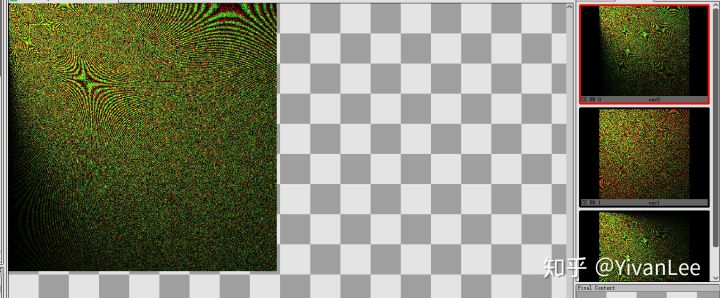

## TwiddlePass

Twiddlepass负责生成IFFT过程蝶形变换需要用到的旋转因子。IFFT变换的时候直接去查因子就能快速算出结果。

TwiddlePass.h

```text
#pragma once

#include "CoreMinimal.h"
#include "UObject/ObjectMacros.h"
#include "RHI/Public/RHIResources.h"
#include "RHI/Public/RHICommandList.h"
#include "Classes/Engine/World.h"

struct OceanRenderTwiddlePassSetupData
{
	int32 OutputSizeX;
	int32 OutputSizeY;
	EPixelFormat OutputUAVFormat;
	ERHIFeatureLevel::Type FeatureLevel;
};

//Pass data that The render resource using for each pass 
class OceanRenderTwiddlePass
{
public:

	OceanRenderTwiddlePass();
	~OceanRenderTwiddlePass()
	{
		if (OutputSurfaceTexture->IsValid())
			OutputSurfaceTexture->Release();
		if (OutputSurfaceTextureSRV->IsValid())
			OutputSurfaceTextureSRV->Release();
		if (OutputSurfaceTextureUAV->IsValid())
			OutputSurfaceTextureUAV->Release();
	}

	void InitPass(const OceanRenderTwiddlePassSetupData& SetupData);

	void Draw(const OceanRenderTwiddlePassSetupData& SetupData, FRHITexture* DebugRenderTargetRHITexture = nullptr);

	FTexture2DRHIRef OutputSurfaceTexture;
	FUnorderedAccessViewRHIRef OutputSurfaceTextureUAV;
	FShaderResourceViewRHIRef OutputSurfaceTextureSRV;

private:
	//Flag tell us weather we can use this pass
	bool bPassSuccessInit;
	//mark we can only excute initpss function once
	bool bShouldInitPass;
};
```

TwiddlePass.cpp

```text
#include "SDHOcean/Private/OceanPass/OceanTwiddlePass.h"

#include "RenderCore/Public/GlobalShader.h"
#include "RenderCore/Public/ShaderParameterUtils.h"
#include "RenderCore/Public/ShaderParameterMacros.h"

#include "Classes/Engine/World.h"
#include "Public/GlobalShader.h"
#include "Public/PipelineStateCache.h"
#include "Public/RHIStaticStates.h"
#include "Public/SceneUtils.h"
#include "Public/SceneInterface.h"
#include "Public/ShaderParameterUtils.h"
#include "Public/Logging/MessageLog.h"
#include "Public/Internationalization/Internationalization.h"
#include "Public/StaticBoundShaderState.h"
#include "RHI/Public/RHICommandList.h"
#include "RHI/Public/RHIResources.h"
#include "Engine/Classes/Kismet/KismetRenderingLibrary.h"
#include "Runtime/Engine/Classes/Kismet/GameplayStatics.h"

#include "Math/UnrealMathUtility.h"


class FOceeanComputeShader_TwiddleIndice : public FGlobalShader
{
	DECLARE_SHADER_TYPE(FOceeanComputeShader_TwiddleIndice, Global)
public:
	FOceeanComputeShader_TwiddleIndice() {}
	FOceeanComputeShader_TwiddleIndice(const ShaderMetaType::CompiledShaderInitializerType& Initializer)
		: FGlobalShader(Initializer)
	{
		//TODO Bind pramerter here
		TwiddleIndiceSurface.Bind(Initializer.ParameterMap, TEXT("TwiddleIndices"));
	}
	static bool ShouldCompilePermutation(const FGlobalShaderPermutationParameters& Parameters)
	{
		return IsFeatureLevelSupported(Parameters.Platform, ERHIFeatureLevel::SM5);
	}
	static void ModifyCompilationEnvironment(const FGlobalShaderPermutationParameters& Parameters, FShaderCompilerEnvironment& OutEnvironment)
	{
		FGlobalShader::ModifyCompilationEnvironment(Parameters, OutEnvironment);
	}
	virtual bool Serialize(FArchive& Ar) override
	{
		bool bShaderHasOutdatedParameters = FGlobalShader::Serialize(Ar);
		//Serrilize something here
		Ar << TwiddleIndiceSurface;
		return bShaderHasOutdatedParameters;
	}

	void BeginUseComputeShaderTwiddle(FRHICommandList& RHICmdList, FUnorderedAccessViewRHIRef SurfaceTextureUAV)
	{
		FComputeShaderRHIParamRef ComputeShaderRHI = GetComputeShader();

		if (TwiddleIndiceSurface.IsBound())
			RHICmdList.SetUAVParameter(ComputeShaderRHI, TwiddleIndiceSurface.GetBaseIndex(), SurfaceTextureUAV);
	}
	void EndUseComputeShaderTwiddle(FRHICommandList& RHICmdList)
	{
		FComputeShaderRHIParamRef ComputeShaderRHI = GetComputeShader();

		if (TwiddleIndiceSurface.IsBound())
			RHICmdList.SetUAVParameter(ComputeShaderRHI, TwiddleIndiceSurface.GetBaseIndex(), FUnorderedAccessViewRHIRef());
	}

private:
	FShaderResourceParameter TwiddleIndiceSurface;
};
IMPLEMENT_SHADER_TYPE(, FOceeanComputeShader_TwiddleIndice, TEXT("/Plugin/SDHOcean/TwiddleIndex.usf"), TEXT("OceanTwiddleIndiceMainCSY"), SF_Compute);


OceanRenderTwiddlePass::OceanRenderTwiddlePass()
{
	bPassSuccessInit = false;
	bShouldInitPass = true;
}

void OceanRenderTwiddlePass::Draw(const OceanRenderTwiddlePassSetupData& SetupData, FRHITexture* DebugRenderTargetRHITexture /* = nullptr */)
{
	ENQUEUE_RENDER_COMMAND(OceanRenderTwiddleIndiceTextureCommand)
	(
		[SetupData, this, DebugRenderTargetRHITexture](FRHICommandListImmediate& RHICmdList)
		{
			check(IsInRenderingThread());

			TShaderMapRef<FOceeanComputeShader_TwiddleIndice> OceanComputeShader(GetGlobalShaderMap(SetupData.FeatureLevel));
			RHICmdList.SetComputeShader(OceanComputeShader->GetComputeShader());
			OceanComputeShader->BeginUseComputeShaderTwiddle(RHICmdList, OutputSurfaceTextureUAV);
			DispatchComputeShader(RHICmdList, *OceanComputeShader, SetupData.OutputSizeX / 32, SetupData.OutputSizeY / 32, 1);
			OceanComputeShader->EndUseComputeShaderTwiddle(RHICmdList);

			FResolveParams ResolveParm;
			//ResolveParm.Rect = FResolveRect(0, 0, TextureSize, TextureSize);
			//ResolveParm.DestRect = FResolveRect(0, 0, TextureSize, TextureSize);
			RHICmdList.CopyToResolveTarget(OutputSurfaceTexture, DebugRenderTargetRHITexture, ResolveParm);
		}
	);
}

void OceanRenderTwiddlePass::InitPass(const OceanRenderTwiddlePassSetupData& SetupData)
{
	if (bShouldInitPass)
	{
		FRHIResourceCreateInfo CreateInfo;
		OutputSurfaceTexture = RHICreateTexture2D(SetupData.OutputSizeX, SetupData.OutputSizeY, SetupData.OutputUAVFormat, 1, 1, TexCreate_ShaderResource | TexCreate_UAV, CreateInfo);
		OutputSurfaceTextureUAV = RHICreateUnorderedAccessView(OutputSurfaceTexture);
		OutputSurfaceTextureSRV = RHICreateShaderResourceView(OutputSurfaceTexture, 0);

		if (OutputSurfaceTexture && OutputSurfaceTextureUAV && OutputSurfaceTextureSRV)
			bPassSuccessInit = true;
	}

	bShouldInitPass = false;
}
```

TwiddlePass.usf

```text
#include "/Engine/Private/Common.ush"

#define COHERENCY_GRANULARITY 32

#define M_PI   3.1415926535897932384626433832795f
#define PI   3.1415926535897932384626433832795f
#define M_2PI (2.0f*M_PI)

//Number of samples is fixed for this release
static const int N = 512;

//number of stages
static const int log2_N = (int) (log(N) / log(2));

RWTexture2D<float4> TwiddleIndices;

struct Complex
{
    float Re;
    float Im;
};

Complex Add(Complex c1, Complex c2)
{
    Complex c;
    c.Re = c1.Re + c2.Re;
    c.Im = c1.Im + c2.Im;
    return c;
}

Complex Sub(Complex c1, Complex c2)
{
    Complex c;
    c.Re = c1.Re - c2.Re;
    c.Im = c1.Im - c2.Im;
    return c;
}

Complex Mul(Complex c1, Complex c2)
{
    Complex c;
    c.Re = c1.Re * c2.Re;
    c.Im = c1.Im * c2.Im;
    return c;
}

Complex Conj(Complex c)
{
    c.Im = -c.Im;
    return c;
}

[numthreads(1, 32, 1)]
void OceanTwiddleIndiceMainCSY(uint3 ThreadId : SV_DispatchThreadID)
{
	// Set up some variables we are going to need  
    float sizeX, sizeY;
    TwiddleIndices.GetDimensions(sizeX, sizeY);

    float k = ThreadId.y * sizeY / pow(2.0, ThreadId.x + 1) % sizeY;

    // Twiddle factor
    Complex Twiddle;
    Twiddle.Re = cos(2 * PI * k / sizeY);
    Twiddle.Im = sin(2 * PI * k / sizeY);

    // Stride
    int ButterflySpan = pow(2, ThreadId.x);

    // Judege ButterflyWing is TopWing or BottomWing
    int ButterflyWing;
    if (ThreadId.y % pow(2, ThreadId.x + 1) < pow(2, ThreadId.x))
        ButterflyWing = 1;
    else
        ButterflyWing = 0;

    // First stage, bit reserved indices
    if (ThreadId.x == 0)
    {
        // Invert Order
        int InitIndices[512];
        int Levels = log2(sizeY);
        int i;
        for (i = 0; i < Levels; i++)
            InitIndices[i] = 0;
        for (i = 0; i < Levels; i++)
        {
            int Stride = 1 << i;
            int Add = 1 << (Levels - 1 - i);
            for (int j = 0; j < sizeY; j++)
            {
                if ((j / Stride) % 2 != 0)
                    InitIndices[j] += Add;
            }
        }

        if (ButterflyWing == 1)
            TwiddleIndices[ThreadId.xy] = float4(Twiddle.Re, Twiddle.Im, InitIndices[ThreadId.y], InitIndices[ThreadId.y + 1]);
        else
            TwiddleIndices[ThreadId.xy] = float4(Twiddle.Re, Twiddle.Im, InitIndices[ThreadId.y - 1], InitIndices[ThreadId.y]);
    }
    // Log2N stage
    else
    {
        if (ButterflyWing == 1)
            TwiddleIndices[ThreadId.xy] = float4(Twiddle.Re, Twiddle.Im, ThreadId.y, ThreadId.y + ButterflySpan);
        else
            TwiddleIndices[ThreadId.xy] = float4(Twiddle.Re, Twiddle.Im, ThreadId.y - ButterflySpan, ThreadId.y);
    }

    //TwiddleIndices[ThreadId.xy] = float4(1, 0, 0, 1);

}
```

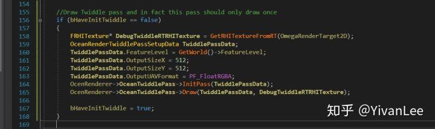

需要强调的是TwiddlePass只能执行一次。

------

## IFFTButterFlyPass

前面的Pass准备好Twiddle和FrequencyX，FrequencyY，FrequencyZ以后就可以开始IFFT蝶形变换了，这一步是把Frequency中的频率变到空间域中。

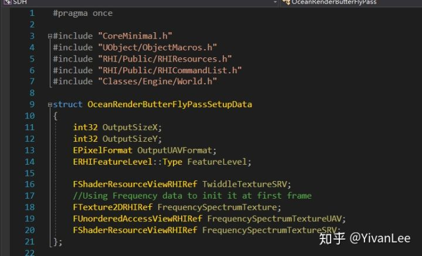

SetupData会把Twiddle，和FrequencyXYZ中的一张传进来，然后IFFTPass自己还会有一张UAV，和一个空的FInaleTextureSRV。

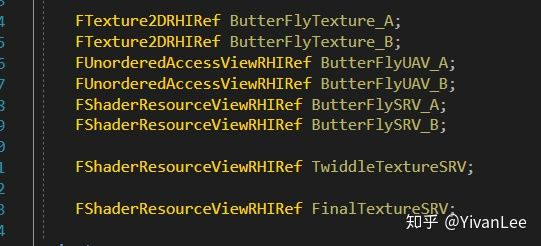

FinalTextureSRV是用来拿到乒乓蝶形变换后的那张最终输出的UAV对应的Texture的SRV的。


在Draw函数中我们需要做一个乒乓缓冲来迭代每次结果。Draw的时候我们需要在水平方向和竖直方向进行FFT变换，每次变换根据TwiddleTexture的Stage进行查询。Stage使用一个UniformBuffer传到shader里，从而不让shader采到无用像素


IFFTButterFlyPass.h

```text
#pragma once

#include "CoreMinimal.h"
#include "UObject/ObjectMacros.h"
#include "RHI/Public/RHIResources.h"
#include "RHI/Public/RHICommandList.h"
#include "Classes/Engine/World.h"

struct OceanRenderButterFlyPassSetupData
{
	int32 OutputSizeX;
	int32 OutputSizeY;
	EPixelFormat OutputUAVFormat;
	ERHIFeatureLevel::Type FeatureLevel;

	FShaderResourceViewRHIRef TwiddleTextureSRV;
	//Using Frequency data to init it at first frame
	FTexture2DRHIRef FrequencySpectrumTexture;
	FUnorderedAccessViewRHIRef FrequencySpectrumTextureUAV;
	FShaderResourceViewRHIRef FrequencySpectrumTextureSRV;
};

//Pass data that The render resource using for each pass 
class OceanRenderButterFlyPass
{
public:

	OceanRenderButterFlyPass();
	~OceanRenderButterFlyPass()
	{
		//ButterFlyTexture_A and ButterFlyUAV_A and ButterFlySRV_A is created by other pass, we can't release it
		if (ButterFlyTexture_B->IsValid())
			ButterFlyTexture_B->Release();
		if (ButterFlyUAV_B->IsValid())
			ButterFlyUAV_B->Release();
		if (ButterFlySRV_B->IsValid())
			ButterFlySRV_B->Release();
	}

	void InitPass(const OceanRenderButterFlyPassSetupData& SetupData);

	void Draw(const OceanRenderButterFlyPassSetupData& SetupData, FRHITexture* DebugRenderTargetRHITexture = nullptr);

	FTexture2DRHIRef ButterFlyTexture_A;
	FTexture2DRHIRef ButterFlyTexture_B;
	FUnorderedAccessViewRHIRef ButterFlyUAV_A;
	FUnorderedAccessViewRHIRef ButterFlyUAV_B;
	FShaderResourceViewRHIRef ButterFlySRV_A;
	FShaderResourceViewRHIRef ButterFlySRV_B;

	FShaderResourceViewRHIRef TwiddleTextureSRV;

	FShaderResourceViewRHIRef FinalTextureSRV;

private:
	//Flag tell us weather we can use this pass
	bool bPassSuccessInit;
	//mark we can only excute initpss function once
	bool bShouldInitPass;
};
```

IFFTOceanPass.cpp

```text
#include "SDHOcean/Private/OceanPass/OceanFFTButterFlyPass.h"

#include "RenderCore/Public/GlobalShader.h"
#include "RenderCore/Public/ShaderParameterUtils.h"
#include "RenderCore/Public/ShaderParameterMacros.h"

#include "Classes/Engine/World.h"
#include "Public/GlobalShader.h"
#include "Public/PipelineStateCache.h"
#include "Public/RHIStaticStates.h"
#include "Public/SceneUtils.h"
#include "Public/SceneInterface.h"
#include "Public/ShaderParameterUtils.h"
#include "Public/Logging/MessageLog.h"
#include "Public/Internationalization/Internationalization.h"
#include "Public/StaticBoundShaderState.h"
#include "RHI/Public/RHICommandList.h"
#include "RHI/Public/RHIResources.h"
#include "Engine/Classes/Kismet/KismetRenderingLibrary.h"
#include "Runtime/Engine/Classes/Kismet/GameplayStatics.h"

#include "Math/UnrealMathUtility.h"

BEGIN_GLOBAL_SHADER_PARAMETER_STRUCT(FCSIFFTData, )
SHADER_PARAMETER(uint32, Stage)
SHADER_PARAMETER(uint32, Dir)
END_GLOBAL_SHADER_PARAMETER_STRUCT()
IMPLEMENT_GLOBAL_SHADER_PARAMETER_STRUCT(FCSIFFTData, "IFFTData");

static uint32 GetStage(const uint32 N) {
	if (N == 0)
		return -1;
	return StaticCast<uint32>((log(StaticCast<float>(N)) / log(2.0f)));
}

class FOceeanComputeShader_IFFT : public FGlobalShader
{
	DECLARE_SHADER_TYPE(FOceeanComputeShader_IFFT, Global)
public:
	FOceeanComputeShader_IFFT() {}
	FOceeanComputeShader_IFFT(const ShaderMetaType::CompiledShaderInitializerType& Initializer)
		: FGlobalShader(Initializer)
	{
		//TODO Bind pramerter here
		InputSurface.Bind(Initializer.ParameterMap, TEXT("PreviousSurface"));
		OutputSurface.Bind(Initializer.ParameterMap, TEXT("OutputSurface"));
		TwiddleTexture.Bind(Initializer.ParameterMap, TEXT("TwiddleTexture"));
	}

	static bool ShouldCompilePermutation(const FGlobalShaderPermutationParameters& Parameters)
	{
		return IsFeatureLevelSupported(Parameters.Platform, ERHIFeatureLevel::SM5);
	}

	static void ModifyCompilationEnvironment(const FGlobalShaderPermutationParameters& Parameters, FShaderCompilerEnvironment& OutEnvironment)
	{
		FGlobalShader::ModifyCompilationEnvironment(Parameters, OutEnvironment);
	}

	virtual bool Serialize(FArchive& Ar) override
	{
		bool bShaderHasOutdatedParameters = FGlobalShader::Serialize(Ar);
		//Serrilize something here
		Ar << InputSurface << OutputSurface << TwiddleTexture;
		return bShaderHasOutdatedParameters;
	}

	void BeginUseComputeShaderIFFT(
		FRHICommandList& RHICmdList
		, FUnorderedAccessViewRHIRef OutputTextureUAV
		, FShaderResourceViewRHIRef InputTextureSRV
		, FShaderResourceViewRHIRef TwiddleTextureSRV
	)
	{
		FComputeShaderRHIParamRef ComputeShaderRHI = GetComputeShader();

		if (OutputSurface.IsBound())
			RHICmdList.SetUAVParameter(ComputeShaderRHI, OutputSurface.GetBaseIndex(), OutputTextureUAV);
		if (InputSurface.IsBound())
			RHICmdList.SetShaderResourceViewParameter(ComputeShaderRHI, InputSurface.GetBaseIndex(), InputTextureSRV);
		if (TwiddleTexture.IsBound())
			RHICmdList.SetShaderResourceViewParameter(ComputeShaderRHI, TwiddleTexture.GetBaseIndex(), TwiddleTextureSRV);
	}

	void EndUseComputeShaderIFFT(FRHICommandList& RHICmdList)
	{
		FComputeShaderRHIParamRef ComputeShaderRHI = GetComputeShader();

		if (OutputSurface.IsBound())
			RHICmdList.SetUAVParameter(ComputeShaderRHI, OutputSurface.GetBaseIndex(), FUnorderedAccessViewRHIRef());
		if (InputSurface.IsBound())
			RHICmdList.SetShaderResourceViewParameter(ComputeShaderRHI, OutputSurface.GetBaseIndex(), FShaderResourceViewRHIRef());
		if (TwiddleTexture.IsBound())
			RHICmdList.SetShaderResourceViewParameter(ComputeShaderRHI, TwiddleTexture.GetBaseIndex(), FShaderResourceViewRHIRef());
	}

	void SetOceanUniformBuffer(FRHICommandList& RHICmdList, const FCSIFFTData& IFFTData)
	{
		SetUniformBufferParameterImmediate(RHICmdList, GetComputeShader(), GetUniformBufferParameter<FCSIFFTData>(), IFFTData);
	}

private:
	FShaderResourceParameter InputSurface;
	FShaderResourceParameter OutputSurface;
	FShaderResourceParameter TwiddleTexture;
};
IMPLEMENT_SHADER_TYPE(, FOceeanComputeShader_IFFT, TEXT("/Plugin/SDHOcean/OceanIFFTCompute.usf"), TEXT("ComputeButterflyCS"), SF_Compute);

OceanRenderButterFlyPass::OceanRenderButterFlyPass()
{
	bPassSuccessInit = false;
	bShouldInitPass = true;
}

void OceanRenderButterFlyPass::Draw(const OceanRenderButterFlyPassSetupData& SetupData, FRHITexture* DebugRenderTargetRHITexture /* = nullptr */)
{
	ENQUEUE_RENDER_COMMAND(FOceanIFFTCommand)
	(
		[SetupData, this, DebugRenderTargetRHITexture](FRHICommandListImmediate& RHICmdList)
		{
			check(IsInRenderingThread());
			TShaderMapRef<FOceeanComputeShader_IFFT> ComputeShader(GetGlobalShaderMap(SetupData.FeatureLevel));
			RHICmdList.SetComputeShader(ComputeShader->GetComputeShader());

			FShaderResourceViewRHIRef SRV[2];
			SRV[0] = ButterFlySRV_A;
			SRV[1] = ButterFlySRV_B;
			FUnorderedAccessViewRHIRef UAV[2];
			UAV[0] = ButterFlyUAV_A;
			UAV[1] = ButterFlyUAV_B;

			const uint32 StageNumber = GetStage(SetupData.OutputSizeX);

			const uint32 GroupThreadX = SetupData.OutputSizeX / 32;
			const uint32 GroupThreadY = SetupData.OutputSizeY / 32;

			FCSIFFTData IFFTData;

			uint32 FrameIndex = 0;
			for (uint32 Dir = 0; Dir < 2; ++Dir)
			{
				IFFTData.Dir = Dir;
				for (uint32 StageIndex = 0; StageIndex < StageNumber; ++StageIndex)
				{
					IFFTData.Stage = StageIndex;

					const uint32 InputBufferIndex = FrameIndex % 2;
					const uint32 OutputBufferIndex = (FrameIndex + 1) % 2;
					ComputeShader->BeginUseComputeShaderIFFT(RHICmdList, UAV[OutputBufferIndex], SRV[InputBufferIndex], TwiddleTextureSRV);
					ComputeShader->SetOceanUniformBuffer(RHICmdList, IFFTData);
					DispatchComputeShader(RHICmdList, *ComputeShader, GroupThreadX, GroupThreadY, 1);
					ComputeShader->EndUseComputeShaderIFFT(RHICmdList);

					FrameIndex++;
				}
			}
			FinalTextureSRV = SRV[(FrameIndex % 2)];
		}
	);
}

void OceanRenderButterFlyPass::InitPass(const OceanRenderButterFlyPassSetupData& SetupData)
{
	if (bShouldInitPass)
	{
		ButterFlyTexture_A = SetupData.FrequencySpectrumTexture;
		ButterFlyUAV_A = SetupData.FrequencySpectrumTextureUAV;
		ButterFlySRV_A = SetupData.FrequencySpectrumTextureSRV;

		TwiddleTextureSRV = SetupData.TwiddleTextureSRV;

		FRHIResourceCreateInfo CreateInfo;
		ButterFlyTexture_B = RHICreateTexture2D(SetupData.OutputSizeX, SetupData.OutputSizeY, SetupData.OutputUAVFormat, 1, 1, TexCreate_ShaderResource | TexCreate_UAV, CreateInfo);
		ButterFlyUAV_B = RHICreateUnorderedAccessView(ButterFlyTexture_B);
		ButterFlySRV_B = RHICreateShaderResourceView(ButterFlyTexture_B, 0);

		if (ButterFlySRV_A && ButterFlyTexture_A && ButterFlyUAV_A && ButterFlySRV_B && ButterFlyTexture_B && ButterFlyUAV_B && TwiddleTextureSRV)
			bPassSuccessInit = true;
	}

	bShouldInitPass = false;
}
```

OceanIFFTCompute.usf

```text
#include "/Engine/Private/Common.ush"

float2 mult(in float2 c0, in float2 c1)
{
    float2 c;
    c.x = c0.x * c1.x - c0.y * c1.y;
    c.y = c0.x * c1.y + c0.y * c1.x;
    return c;
}

float2 add(in float2 c0, in float2 c1)
{
    float2 c;
    c.x = c0.x + c1.x;
    c.y = c0.y + c1.y;
    return c;
}

//Texture should be replaced with not typed buffer (i.e. structured buffer etc.) because they are more efficent
Texture2D<float4> TwiddleTexture; //Twiddle factors/indices texture
Texture2D<float2> PreviousSurface; //previous pass data
RWTexture2D<float4> OutputSurface; //output surface 

//RWStructuredBuffer<float4>	g_DstData        : register(u0);
//RWTexture2D<float4>	        g_DstDataTexture : register(u1);

void HorizontalButterfly(in uint2 AbsoluteThreadId)
{
    int stage = IFFTData.Stage;

    float4 data = TwiddleTexture.Load(int3(stage, AbsoluteThreadId.x, 0)).xyzw;
    float2 p_ = PreviousSurface.Load(int3(data.z, AbsoluteThreadId.y, 0)).xy;
    float2 q_ = PreviousSurface.Load(int3(data.w, AbsoluteThreadId.y, 0)).xy;
    float2 w_ = data.xy;

	//Butterfly operation
    float2 H = add(p_, mult(w_, q_));

    OutputSurface[AbsoluteThreadId] = float4(H, 0, 0);
}


void VerticalButterfly(in uint2 AbsoluteThreadId)
{
    int stage = IFFTData.Stage;

    float4 data = TwiddleTexture.Load(int3(stage, AbsoluteThreadId.y, 0)).xyzw;
    float2 p_ = PreviousSurface.Load(int3(AbsoluteThreadId.x, data.z, 0)).xy;
    float2 q_ = PreviousSurface.Load(int3(AbsoluteThreadId.x, data.w, 0)).xy;
    float2 w_ = data.xy;

	//Butterfly operation
    float2 H = add(p_, mult(w_, q_));

    OutputSurface[AbsoluteThreadId] = float4(H, 0, 0);
}

//Butterfly Kernel 
[numthreads(32, 32, 1)]
void ComputeButterflyCS(uint3 GlobalThreadIndex : SV_DispatchThreadID)
{
	//OutputSurface0[GlobalThreadIndex.xy] = InputTexture.Load(int3(GlobalThreadIndex.xy,0));
	[branch]
    if (IFFTData.Dir == 0)
    {
        HorizontalButterfly(GlobalThreadIndex.xy);
    }
    else
    {
        VerticalButterfly(GlobalThreadIndex.xy);
    }
}
```

我们需要在Render函数中分别对XYZ执行三次Draw


## CopyDataPass

这个pass就非常简单了，就是把ComputeShader计算出来的SRV画到RT上

CopyDataPass.h

```text
#pragma once

#include "CoreMinimal.h"
#include "UObject/ObjectMacros.h"
#include "RHI/Public/RHIResources.h"
#include "RHI/Public/RHICommandList.h"
#include "Classes/Engine/World.h"

struct CopyPassSetupData
{
	int32 OutputSizeX;
	int32 OutputSizeY;
	ERHIFeatureLevel::Type FeatureLevel;
	FShaderResourceViewRHIRef ResorceToCopy;
};

//Simple draw SRV to rendertarget
class CopyDataPass
{
public:

	CopyDataPass(){}
	~CopyDataPass(){}

	void Draw(CopyPassSetupData& SetupData, UTextureRenderTarget2D* RenderTarget);
};
```

CopyPass.cpp

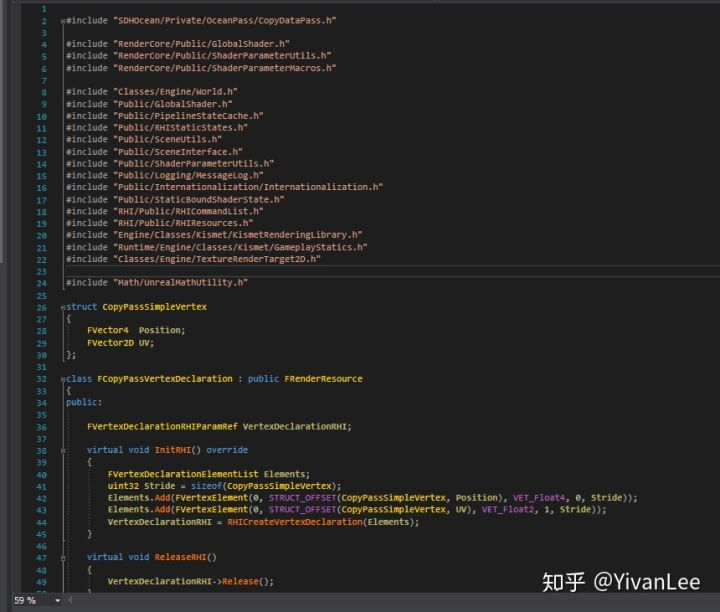

这里因为需要采贴图所以需要自己声明一个顶点格式

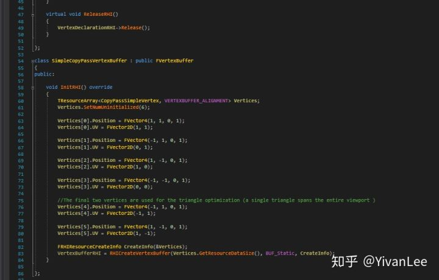

下面是一个平铺屏幕空间的VB

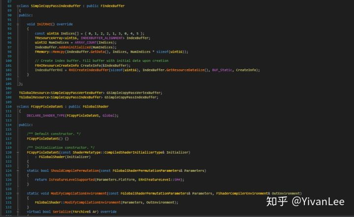

BV对应的IB，并且要在全局实例化它们。最后就可以开始制作简单的PS了

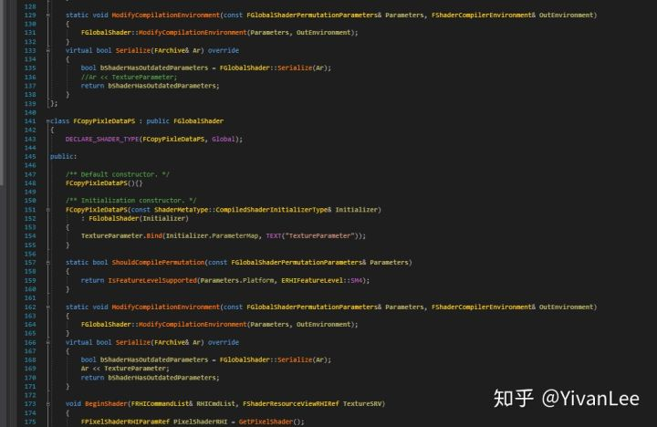

最后设置好渲染管线的各个状态然后调用Draw即可

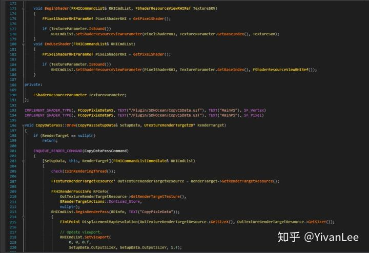

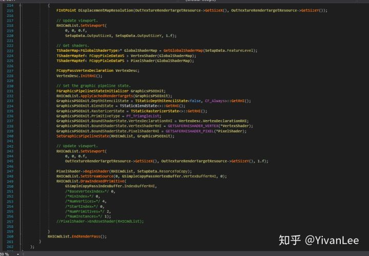

shader也非常简单直接把SRV用load函数draw到RT上就可以了

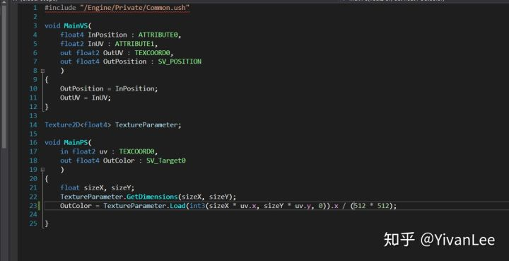

最后在海洋渲染主函数中调用XYZ三次拷贝


最后直接把XYZ的置换贴图丢到材质里就可以进入渲染阶段了

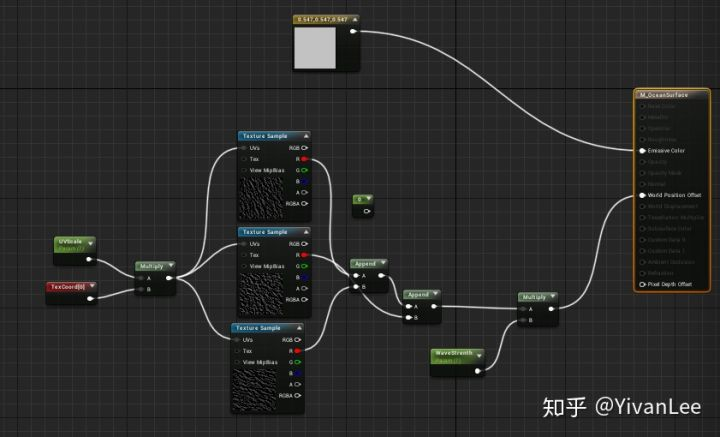


<svg x="16" y="18.5" class="GifPlayer-icon"></svg>

<iframe allowfullscreen="" src="https://www.zhihu.com/video/1117846976418463744?autoplay=false&amp;useMSE=" frameborder="0"></iframe>


调整菲利普频谱的生成函数就可以动态实时调整海面的起伏

<iframe allowfullscreen="" src="https://www.zhihu.com/video/1117849279871537152?autoplay=false&amp;useMSE=" frameborder="0"></iframe>


FFT海洋比起其它几种制作海洋的方式优点就在于波形丰富，可以实时方便调整，适用于动态天气的海洋。如果想要制作浮力等效果，FFT的方法也能提供足够的模拟计算资源。

------

至此我们完成了FFT海洋的波形部分，可以看到整个过程十分艰辛，难度真的是在其它环境里实现的好几十倍。有时候误打误撞得到了一些奇怪的效果，比如翻滚的云海

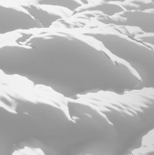

<svg x="16" y="18.5" class="GifPlayer-icon"></svg>

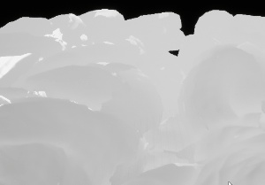

<svg x="16" y="18.5" class="GifPlayer-icon"></svg>

下一节我将介绍海面的Shading部分。

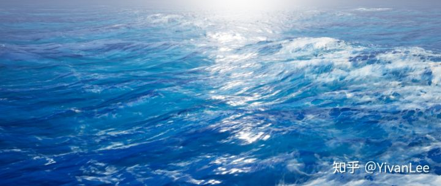

Enjoy it.