# 虚幻4渲染编程（环境模拟篇）【第三卷：体积云天空模拟(3)---高层云】

目前业内流行有两种体积云模拟的方式，模型+特殊shader法，RayMarching法。我前两篇文章已经对它们都做了介绍。当然还有些比较非主流的，比如粒子云法，点云法。这篇将作为体积云天空模拟部分的终篇，如果有一些更好的方法，我会更新这三篇文章。前面两篇介绍了它的原理。这里将记录Ray  Marching法的完整具体实现方法。

https://zhuanlan.zhihu.com/p/50535249

[虚幻4渲染编程（环境模拟篇）【第一卷：体积云天空模拟(1)---层云】](Volume cloud sky.md)

[虚幻4渲染编程（环境模拟篇）【第二卷：体积云天空模拟(2)---3D体纹理低云】](Volume cloud sky_2.md)

------

下面是使用ray marching的办法构造天空。第一步是构造出一个体积场。我使用3D Value Noise

<iframe allowfullscreen="" src="https://www.zhihu.com/video/1048682116862308352?autoplay=false&amp;useMSE=" frameborder="0"></iframe>


下面是我的Noise生成函数的代码


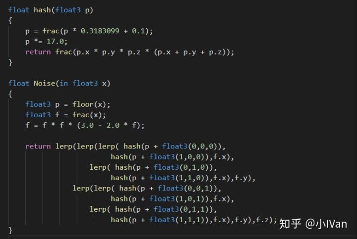

分形部分的代码


raymarching部分的代码如下：


这部分逻辑非常简单，从视口方向发射射线，每0.01单位的距离采样一次，并且把采样结果累加起来。因为我们的摄像机是世界空间的，而noise使用的是另一个空间的（这里把它叫作Noise  Space吧），所以我们需要对其进行尺寸缩放转换。所以我乘了一个0.001的缩放值。

现在得到了一个体积场，但是这个体积场还离我需要的云的效果还很远。云除了有一定的形状结构外，还要相对于世界的高度等。

用目前这种积分方式是渲染不出云海的


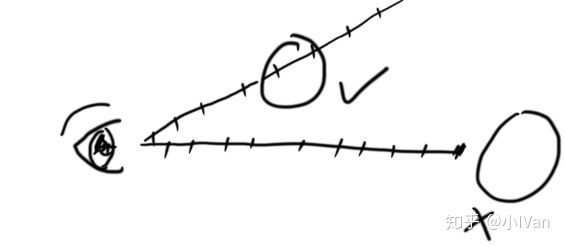

因为迭代次数有限，根本不可能渲染到很远的地方，于是我改进了一下积分的步长算法，让步长不是等距的。


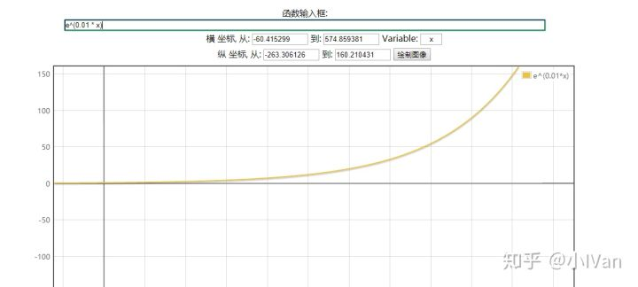

```text
curpos += rd * exp(0.01 * i) * stepsize;
```

可以看到算法改进前后的差别

（等距）


（非等距）


改进后能够追踪到更远的距离而且不会影响近处的效果。但是这仍然达不到云海的需求，因为对于这种方法来说还是无法追踪覆盖云海那种超大范围的空间。改进步长算法已经不能满足要求了，因为如果继续拉高步长的增长曲线已经会出现明显的不连续了。所以这时候就需要重新定位追踪起始点的位置。


可以进行一次求交，算出云层的位置然后从这个位置再开始raymarching，这样就能达到非常远的距离。


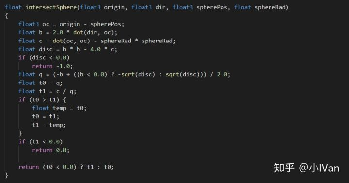


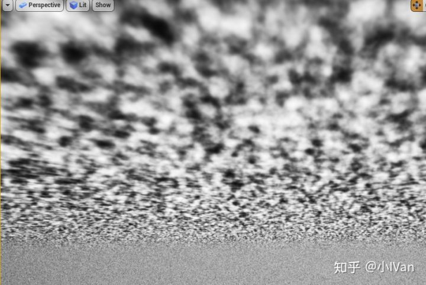

再对整个天球和噪波做一些调整，用smoothstep控制一下它的衰减


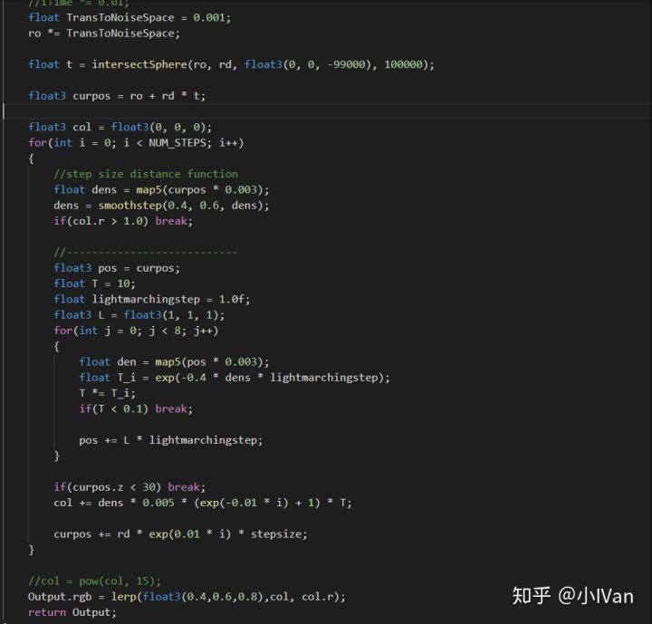

在控制衰减和数值调整后，于是我们可以得到一个非常粗略的天空。


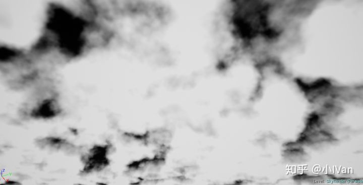

可以看到云的形状还不够,现在这个形状实在太“噪波”了，云朵的光影也不正确。于是下面就来根据这两点来进行完善。

【云朵的光影】


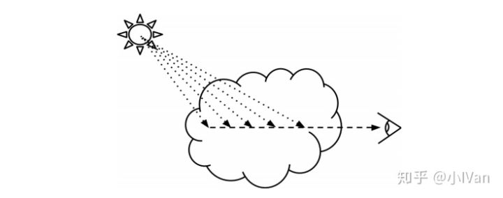

在每次迭代积分云层浓度的时候，还需要向太阳光方向积分能量衰减。我们每次循环积分云的浓度的时候得到一个位置，然后再用这个位置作为向太阳方向积分的起始点，太阳方向作为积分方向，再次积分。


沿着太阳方向积分能量其实就是对云做light shading的过程，做light shading自然就需要建立光照模型。云的光线传播有反射和散射。光线大致是像下图那样传播的


所以对上图的光线进行数学建模。首先考虑到光线传播的能量衰减：

下面是衰减公式

 


用这种最简单的能量衰减公式可以得到如下效果


调整下smoothstep的范围，进一步控制一下云的形状，把高层的杂云clip掉即可得到如下效果：


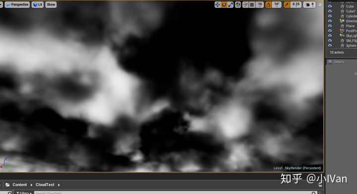

<iframe allowfullscreen="" src="https://www.zhihu.com/video/1049319392206286848?autoplay=false&amp;useMSE=" frameborder="0"></iframe>


离想要的效果又进了一步了。

但是这里面有一个不正确的地方是光照和浓度积分没有分开，将光照和浓度剥离后即可得到如下效果


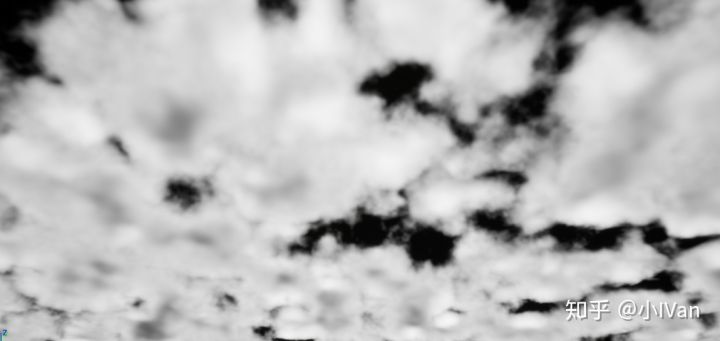


除了衰减，光线还会在云层中散射。散射计算常用到Henyey Greenstein模型。


其函数图像如图所示，g代表云层的各向同性大小


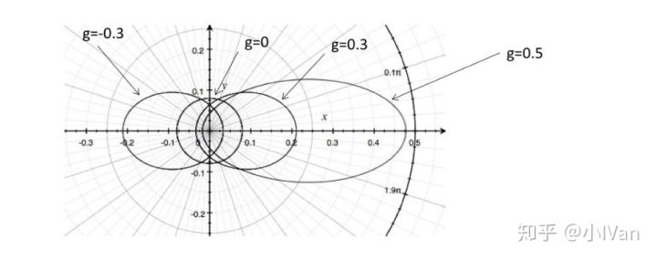


Horizon zero drawn又对HenyeyGreenstein模型又进行了完善

 

使用上述 Horizon zero drawn 的光照模型可以得到如下效果：


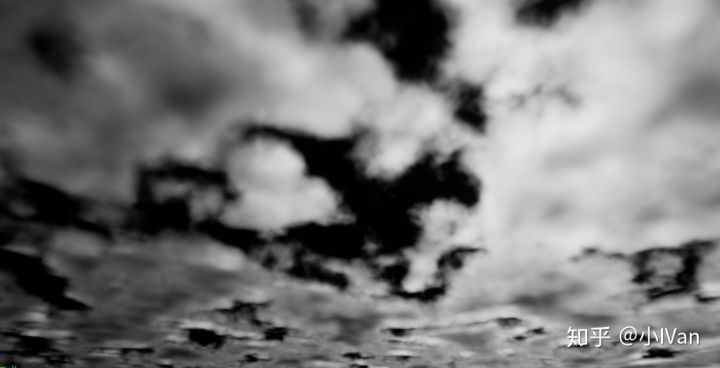

给天空加上着色和运动后

<iframe allowfullscreen="" src="https://www.zhihu.com/video/1049779262244163584?autoplay=false&amp;useMSE=" frameborder="0"></iframe>


代码如下：

```text
#define NUM_STEPS 128

float hash(float3 p)
{
    p = frac(p * 0.3183099 + 0.1);
    p *= 17.0;
    return frac(p.x * p.y * p.z * (p.x + p.y + p.z));
}

float Noise(in float3 x)
{
    float3 p = floor(x);
    float3 f = frac(x);
    f = f * f * (3.0 - 2.0 * f);

    return lerp(lerp(lerp( hash(p + float3(0,0,0)), 
                        hash(p + float3(1,0,0)),f.x),
                   lerp( hash(p + float3(0,1,0)), 
                        hash(p + float3(1,1,0)),f.x),f.y),
               lerp(lerp( hash(p + float3(0,0,1)), 
                        hash(p + float3(1,0,1)),f.x),
                   lerp( hash(p + float3(0,1,1)), 
                        hash(p + float3(1,1,1)),f.x),f.y),f.z);
}

float map5(in float3 p)
{
    float3 q = p;
    float f = 0.0f;
    f  = 0.50000 * Noise( q );
    q = q * 2.02;
    f += 0.25000 * Noise( q );
    q = q * 2.03;
    f += 0.12500 * Noise( q );
    q = q * 2.01;
    f += 0.06250 * Noise( q );
    q = q * 2.02;
    f += 0.03125 * Noise( q );
	return clamp(f, 0.0, 1.0);
}

float map3( in float3 p )
{
    float3 q = p;
    float f = 0.0f;
    f  = 0.50000 * Noise( q );
    q = q * 2.02;
    f += 0.25000 * Noise( q );
    q = q * 2.03;
    f += 0.12500 * Noise( q );
	return clamp(f, 0.0, 1.0);
}

//origin		: Ray origin position
// dir			: Ray direction
//spherePos		: Sphere center position
//sphere Rad	： Sphere radius
float intersectSphere(float3 origin, float3 dir, float3 spherePos, float sphereRad)
{
	float3 oc = origin - spherePos;
	float b = 2.0 * dot(dir, oc);
	float c = dot(oc, oc) - sphereRad * sphereRad;
	float disc = b * b - 4.0 * c;
	if (disc < 0.0)
		return -1.0;    
    float q = (-b + ((b < 0.0) ? -sqrt(disc) : sqrt(disc))) / 2.0;
	float t0 = q;
	float t1 = c / q;
	if (t0 > t1) {
		float temp = t0;
		t0 = t1;
		t1 = temp;
	}
	if (t1 < 0.0)
		return 0.0;
    
    return (t0 < 0.0) ? t1 : t0;
}

float Lighting(float3 ro, float3 rd, float3 curpos)
{   
    float en = 0.0f;
    float3 L = float3(1, 1, 1);
    float3 lightpos = curpos;
    float lightstepsize = 0.9;
    float lightden = 0;

    float cos = dot(L, rd);
    float g = 0.3;
    float hen = (1- g*g) / pow((1 + g*g - 2 * g * cos), 3/2) / (4 * 3.1415);
    hen *= 1.5;

    for(int i = 0; i < 4; i++)
    {
        lightden = map3(lightpos * 0.002);
        lightpos += L * lightstepsize * exp(0.01 * i);
    }

    //hen *= 2 * exp(-lightden) * (1 - 2 * exp(2 * lightstepsize * 4));

    en = exp(- 1.2 * lightden * i);
    en = smoothstep(0.01, 0.99, en);
    
    return en * hen;
}

float4 mainImage(float2 fragCoord, float2 iResolution, float iTime, float3 rd, float3 ro, float3 wpos, Texture2D remap, SamplerState remapSampler)
{
    float4 Output = float4(0, 0, 0, 1);
    float stepsize = 3;

    //iTime *= 0.01;
    float TransToNoiseSpace = 0.001;
    ro *= TransToNoiseSpace;

    float t = intersectSphere(ro, rd, float3(0, 0, -99000), 100000);

    float3 curpos = ro + rd * t;
    curpos += float3(iTime, 0, 0);
    
    float4 col = float4(0, 0, 0, 0);
    for(int i = 0; i < NUM_STEPS; i++)
    {
        if(curpos.z < 30) break;

        //step size distance function
        float dens = map5(curpos * 0.002);
        dens = smoothstep(0.4, 0.55, dens);

        float3 pos = curpos;
        float T = Lighting(ro, rd, curpos);

        col.rgb += dens * 0.2 * (exp(-0.01 * i) + 1);
        col.a += T * 0.005;

        curpos += rd * exp(0.01 * i) * stepsize;
    }

    //col = pow(col, 15);
    //Output.rgb = lerp(float3(0.4,0.6,0.8), col.rgb * 10 , col.r);
    Output.rgb = col.rgb * col.a;
    
    return Output;
}

//return  mainImage(fragCoord, iResolution, iTime, rd, ro, wpos, remap, remapSampler);

// fragCoord
// iResolution
// iTime
// rd
// ro
// wpos
// remap
```


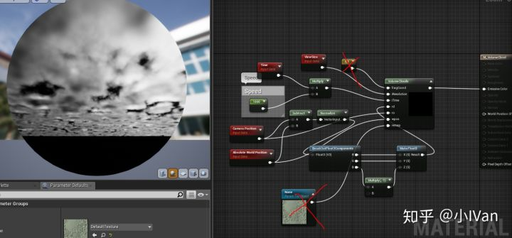

如果想让云朵拥有更多细节，可以考虑在Noise函数上下功夫。我把Map5换成Map7可以得到更多细节并且性能损失也较少。最后我们可以得到如下效果：


------

在做天空的过程中，很多次失败还无意间做出了很多意想不到的有趣效果

【水下效果】


<iframe allowfullscreen="" src="https://www.zhihu.com/video/1049259569792036864?autoplay=false&amp;useMSE=" frameborder="0"></iframe>


【丑陋的山洞效果】

<iframe allowfullscreen="" src="https://www.zhihu.com/video/1049313146904350720?autoplay=false&amp;useMSE=" frameborder="0"></iframe>


接下来的环境模拟篇将开启可交互植物模拟的篇章。

Enjoy it 。

------

## **Next：**

小IVan：虚幻4渲染编程（环境模拟篇）【第三卷：体积云天空模拟(4) - 基于Texture的体积云】

zhuanlan.zhihu.com

------

参考文章：

【1】[http://www.oceanopticsbook.info/view/scattering/the_henyeygreenstein_phase_function](https://link.zhihu.com/?target=http%3A//www.oceanopticsbook.info/view/scattering/the_henyeygreenstein_phase_function)

【2】[http://killzone.dl.playstation.net/killzone/horizonzerodawn/presentations/Siggraph15_Schneider_Real-Time_Volumetric_Cloudscapes_of_Horizon_Zero_Dawn.pdf](https://link.zhihu.com/?target=http%3A//killzone.dl.playstation.net/killzone/horizonzerodawn/presentations/Siggraph15_Schneider_Real-Time_Volumetric_Cloudscapes_of_Horizon_Zero_Dawn.pdf)
