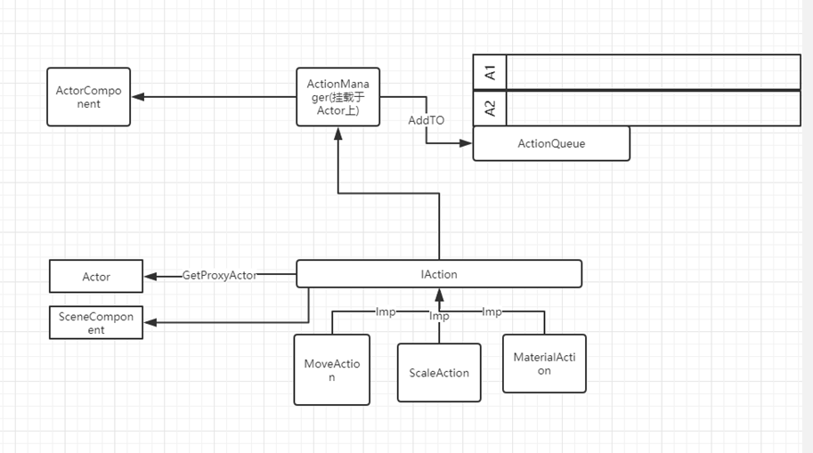
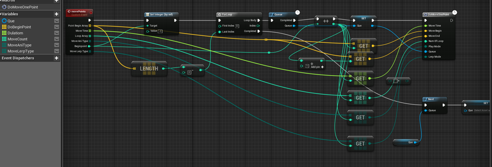
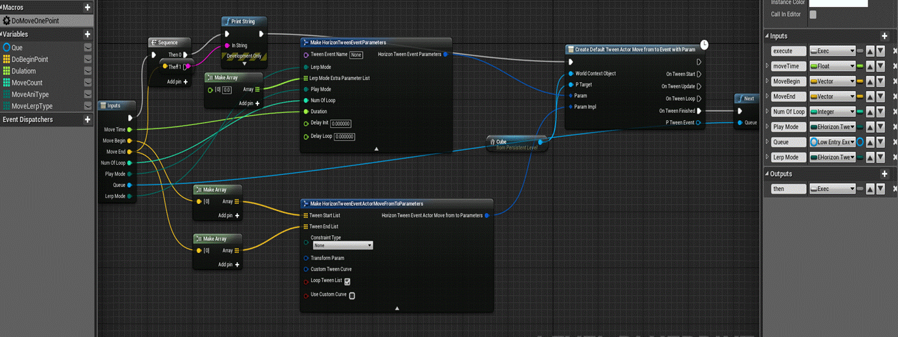

**（原****)****UE4** **制作执行队列（****Action Queue)**

2018年10月9日 星期二

10:05

队列和树在游戏开发中是比较常见的数据结构，在一定范围能保证执行的顺序。

结合一些设计模式技巧，往往可以做一些神器。

 

如加载块chunk管理，任务系统（当然也可以使用行为树来做复杂的任务系统）。

 

小得不能再小的demo

1, 让小球按照指定的action执行。（类似于Tween-Sequence)

UML图：

具体使用（比较随意）

1、Actor中使用

 

封装队列

 

 

单个执行

 

 

2、队列执行任性行为

 

采取了实现队列接口或继承方式

 

接口有DoBegin和DoEnd的接口方法

 

管理者管理队列中一个DoEnd后Queue取出下一个执行，直到QUEUE完成。

 
