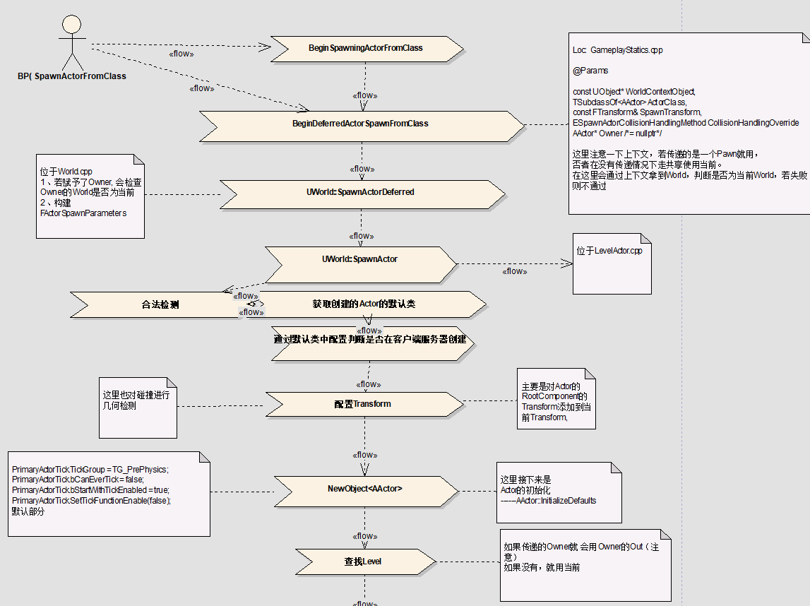
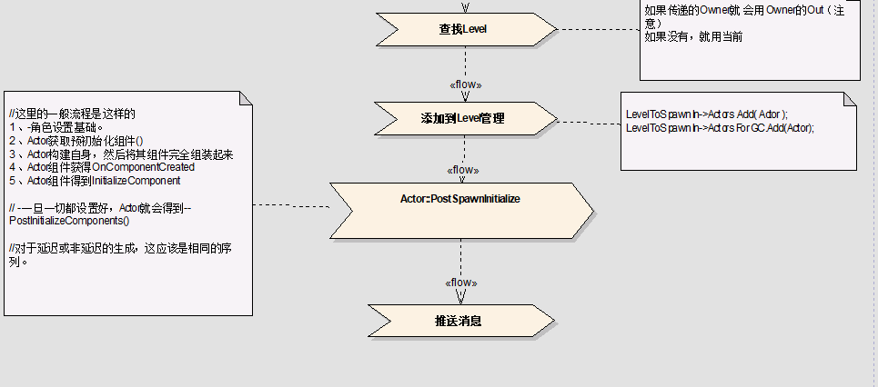

# （原）Unreal-GamePlayer-Actor解析(1)

2018年10月18日 星期四

13:51

 

@author 白袍小道

 

前言

​        属于Unreal的 GamePlay 框架中Actor细节部分。主要关于Actor及其相关部件和实体的几个部分的展开，力求解决下述问题：

​        1、Actor LifeSpan 总体和细节，知道主要以及可以和为何。

​        2、GamePlay  对actor的管理是如何进行

​        3、actor相关组件的解析，一是清楚这样做的优缺点（搬山），二是清楚为何？

 

 

正文：

​       顺带蓝图这部分一起稍微分析了主要有创建，消除，内存，Actor的相关组件。

先大致的过下蓝图上的输入部分，这里注意蓝图属于一个虚拟机管理（其实就是UE的模块）

一、Actor创建过程

这里仅限在Actor部分，UObject的管理在B部分【这里涉及UObject垃圾回收，生命周期，Root查找]

 

 

 

 
