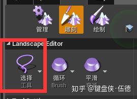
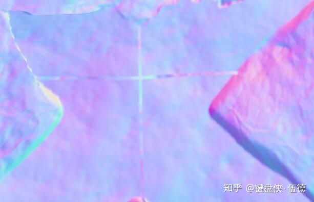

# Houdini Terrian & UE4 （五）按选区更新地形


## 导言

关于地形更新我们还差最后一步了啦！

对于按component提交更新而言，不方便的地方还是很显而易见的，所以我们需要祭出最好用的大杀器，按选取更新。这样我们就可以最细致的对一块地形提交修改了。

当然，还有两个遗留问题会在本文中提到。


## 关于选区

UE4自带了一个画刷选区的功能，我们就是利用这个功能，把选出来的区域单独的提交修改。




## 提交选区

选区更新的话，我们就不再需要去一块一块的点选component了，我们可以直接通过GetSelectedRegionComponents() 函数来获得选区所在的componet。

```cpp
//.........
if ( bExportOnlySelected )
{
    const ULandscapeInfo * LandscapeInfo = LandscapeProxy->GetLandscapeInfo();
    if ( LandscapeInfo && !LandscapeInfo->IsPendingKill() )
    {
        // Get the currently selected components
        SelectedComponents = LandscapeInfo->GetSelectedComponents();
    }

////////////////////////////////
    if (SelectedComponents.Num() <= 0)
    {
        // if no components is selected, maybe use region to fetch components
        SelectedComponents = LandscapeInfo->GetSelectedRegionComponents();
    }
////////////////////////////////

    if ( bAutoSelectComponents && SelectedComponents.Num() <= 0 && AssetBounds.IsValid )
 //.......   
```


然后我们通过下面的函数来把选区的数据提取出来，可以看到，UE4地形的选区居然是float 0～1的，我们就不需要再去转换了，可以直接作为一个mask提交到houdini engine中。（提交的方法可以完全参照其他mask）

```cpp
bool FHoudiniLandscapeUtils::GetLandscapeRegionLayerData(ULandscapeInfo* LandscapeInfo, int32 MinX, int32 MinY, int32 SizeX, int32 SizeY, TArray<float>& LayerData, HAPI_VolumeInfo& LayerVolumeInfo)
{
	LayerData.Empty();
	bool HasRegionInfo = false;
	for (int32 Y = MinY; Y < MinY + SizeY; Y++)
	{
		for (int32 X = MinX; X < MinX + SizeX; X++)
		{
			float RegionSelect = LandscapeInfo->SelectedRegion.FindRef(FIntPoint(X, Y));
			LayerData.Add(RegionSelect);
			if(RegionSelect > 0.0f)
			{ 
				HasRegionInfo = true;
			}
		}
	}
	if (!HasRegionInfo)
	{
		// no region info
		return false;
	}
	// init VolumeInfo
}
```

## 更新地形

通过上面的方法我们已经可以把选区作为一个mask提交到houdini engine中了，我们可以在hda里利用这个mask来做更新，当然，这么做显然不够方便。

所以这里我们把返回的数据用插件做一个mask功能，只更新选区内的数据，选区外的数据依然保留原状

```cpp
void FHoudiniLandscapeUtils::AdjustHeightDataByRegion(ULandscapeInfo* LandscapeInfo, TArray<uint16>& HeightData, ComponentRectInfo& rect, int32& UnrealXStride, TArray<float>& RegionData)
{
	int XSize,YSize;
	TArray<uint16> OldHeightData;
	GetLandscapeData(LandscapeInfo, rect.MinX, rect.MinY, rect.MaxX, rect.MaxY, OldHeightData, XSize, YSize);

	// new height data and old height data should be same size
	check(HeightData.Num() == OldHeightData.Num())

	for (int32 x = 0; x < XSize; x++)
	{
        for (int32 y = 0; y < YSize; y++)
        {
            int32 OriginIndex = (y + rect.RelativeMinY) * UnrealXStride + (x + rect.RelativeMinX);
            float RegionValue = RegionData[OriginIndex];
            int32 i = y * XSize + x;
            // adjust the final value by region value
            // 把原有高度和更新后高度的差值乘以region的值，让region不为1的地方能够有渐变。
            HeightData[i] = OldHeightData[i] + (uint16)(((float)HeightData[i] - (float)OldHeightData[i]) * RegionValue);
        }
    }
}
```

对于layer就省事儿一些，我们只需要把更新的weight值乘上region的强度就行了。

```cpp
void FHoudiniLandscapeUtils::AdjustWeightDataByRegion(TArray<uint8>& WeightData, ComponentRectInfo& rect, int32& UnrealXStride, TArray<float>& RegionData)
{
	int XSize = rect.MaxX - rect.MinX + 1;
	int YSize = rect.MaxY - rect.MinY + 1;

	for (int32 x = 0; x < XSize; x++)
	{
		for (int32 y = 0; y < YSize; y++)
		{
			int32 OriginIndex = (y + rect.RelativeMinY) * UnrealXStride + (x + rect.RelativeMinX);
			float RegionValue = RegionData[OriginIndex];
			int32 i = y * XSize + x;
			// adjust the final value by region value
			WeightData[i] = (uint8)((float)WeightData[i] * RegionValue);
		}
	}
}
```

当然，更新高度之前先获取选区信息，我们的选区也不用生成真实layer。

做完后我们可以就看到地形按照我们的选区做出了修改。


## 遗留问题1——法线不连续

法线不连续是什么样呢，就是如下图所示：




可以看到中间有一个很明显的十字，如同更新地形的时候把她们遗漏掉了一样。

是的没错就是遗漏掉了。在LandscapeEdit.SetHeightData中，component的边缘是不会去计算法线的，因为UE4官方认为边缘法线会涉及其他区域所以干脆不管了。

那么我们一块一块component去提交就会发现component之间的法线都是没有被处理到的，虽然我们之前已经将选区边缘做了锁进来避免整体外缘的法线问题，但是多个选区交接的法线还是不好处理。

苦于没有什么好办法，在不修改引擎源码的前提下，只能辛苦自己重构代码了。

借鉴地形雕刻工具的设计思路，我们把所有选区的原有数据先作为一个cache，然后在cache上面更新我们本次要做的修改，最后整个cache一起提交，就能解决component接缝处的问题。

```cpp
// copy the origin height data as a cache
TSet<ULandscapeComponent*> CurrentComponents;
int RelativeMaxX = RelativeMinX + UnrealXSize - 1;
int RelativeMaxY = RelativeMinY + UnrealYSize - 1;
PreviousInfo->GetComponentsInRegion(RelativeMinX + 1, RelativeMinY + 1, RelativeMaxX - 1, RelativeMaxY - 1, CurrentComponents);
for (ULandscapeComponent* CurComponent : CurrentComponents)
{
	CombineHeighData(CurComponent, RelativeMinX, RelativeMinY, RelativeMaxX, RelativeMaxY, CachedHeightData);
}

// overide the cache with new data
for (ComponentRectInfo& node : ComponentRects)
{
	TArray<uint16> ComponentHeightData;
	GetDataByComponentRect(IntHeightData, UnrealXSize, node, ComponentHeightData);
	RemapHeightData(ComponentHeightData, LandscapeTransform.GetScale3D(), FoundLandscape->GetTransform().GetScale3D(), ZeroInDigit);
	if (HasRegionData)
	{
		AdjustHeightDataByRegion(PreviousInfo, ComponentHeightData, node, UnrealXSize, RegionData);
	}
	CombineArrayData(CachedHeightData.GetData(), ComponentHeightData.GetData(), 0, 0, UnrealXSize - 1, UnrealYSize - 1, 
		node.RelativeMinX, node.RelativeMinY, node.RelativeMaxX, node.RelativeMaxY);
	
}

LandscapeEdit.SetHeightData(RelativeMinX, RelativeMinY, RelativeMaxX, RelativeMaxY, CachedHeightData.GetData(), 0, true);
```

这样接缝处的法线不连续问题就得到了解决。


## 遗留问题2——layer被清除

之前我们提过，houdini  engine plugin中在提交地形更新之前会先把由houdini  导入的layer全部删除。对于整体更新来说影响不大，但是对于选区更新来说，更新一个小区域意味着整个地形的layer都丢了，这可不行。所以我们希望在清除layer的时候也只清楚我们选择的component内的layer。

```cpp
bool
FHoudiniLandscapeUtils::RestoreLandscapeFromFile( ALandscapeProxy* LandscapeProxy, bool bLandscapeExportSelectionOnly /*= false*/)
{
   //.........
    // Delete the added layer
    FName LayerName = LandscapeInfo->Layers[LayerIndex].LayerName;
    if (!bLandscapeExportSelectionOnly)
    {
        LandscapeInfo->DeleteLayer(CurrentLayerInfo, LayerName);
    }
    else
    {
        TSet< ULandscapeComponent * > SelectedComponents;
        // Get the currently selected components
        SelectedComponents = LandscapeInfo->GetSelectedComponents();

        if (SelectedComponents.Num() <= 0)
        {
            // if no components is selected, maybe use region to fetch components
            SelectedComponents = LandscapeInfo->GetSelectedRegionComponents();
        }

        for (ULandscapeComponent* Comp : SelectedComponents)
        {
            FLandscapeEditDataInterface LandscapeEdit(LandscapeInfo);
            Comp->DeleteLayer(CurrentLayerInfo, LandscapeEdit);
        }
    }

    //.........
}
```

## 总结

到这里，Houdini Terrian & UE4部分基本就告一段落了。Terrian部分的功能肯定不止这么多，houdini还支持植被散布等功能，等后续涉及到的时候再回头来写了。

当然。我肯定是去研究更加黑科技的功能啦！是什么呢，点个关注敬请期待吧～