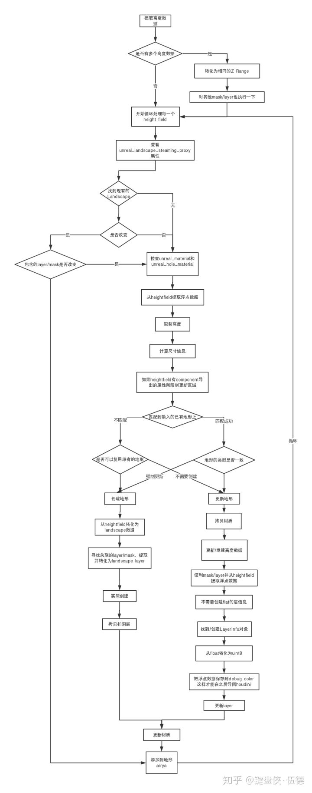
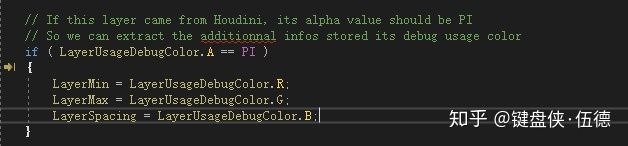
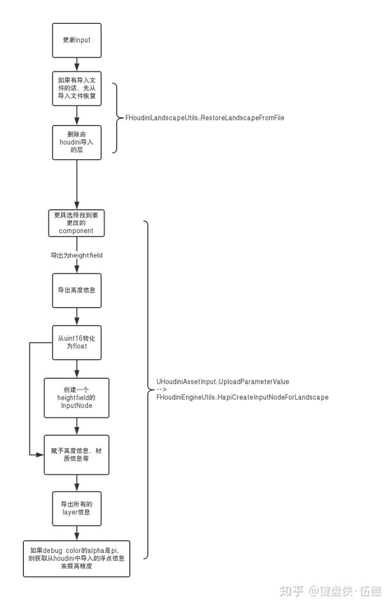

# Houdini Terrian & UE4 （二）mask & layer 制作流程优化

不会写策划案的美术不是好程序


## **导言**

上个文章中我们已经操作了一遍Houdini & UE4的管线。但是应用到实际工作中时会发现其实还是有很多不方便的地方。

比如当你自己定义的layer导入houdini engine再导出后，会变成temp里的layerinfo文件。

再次input地形的话，自己定义的layer就没有了。

再然后，如果修改了houdini engine导出的层，会发现修改的信息并不能正确的传入houdini engine。

当然一些world compostion相关的易用性和区域更新也是很大的问题。但是这些会放在后面来讲，欢迎关注哦！


## **houdini导出地形到UE4**

在解决问题之前，我们还是应该先啃一下代码，抛开其他流程不管，我们直接关注最后创建地形的地方。

UHoudiniAssetComponent::CreateAllLandscapes 

------->

FHoudiniLandscapeUtils::CreateAllLandscapes

这里就是最终创建地形的地方了，大致的流程是从houdini engine吧cook好的地形数据取出来，读取一些属性，从houdini的float数据转化为UE4的uint8数据，然后创建新的地形或者是更新到输入的地形当中。

具体的流程可以看下面的流程图，了解清楚了houdini engine 导入地形到UE4中的流程后，我们就可以在其中想要修改流程的地方做自己的定制啦！
 



还有一个藏得比较深的代码是，houdini engine在将layerinfo导入后，会把原来的的float数据保存在debugcolor中，用于导回houdini engine的时候保留一个较高的精度。




## **UE4将地形输入到houdini engine**

我们再看一下地形输入houdini engine的流程，其实和导入一样，主要还是一些数据的提取和float->uint8的转化。



再反复的踩坑和调试之后，发现流程中有一步恢复导入数据的代码，后面居然夹带了清除由houdini engine导入的层的功能。这就很奇怪了，上面明明还特意把信息存在debugcolor中用于导回，这里居然反手就是一波清空（懵逼脸）。


## **关于layer的一些定制化**

在看完流程之后，这里做两处简单的修改，是的真的很简单啦。

讲道理下面这两部都是隐式的处理并不太有很好，有需要的话可以修改houdiniengine的slate部分，让操作流程更加友好。


1、layername或者layerinfoname中带有_custom的话，不传入houdini的层。

```text
bool
FHoudiniLandscapeUtils::CreateHeightfieldFromLandscape(
    ALandscapeProxy* LandscapeProxy, HAPI_NodeId& CreatedHeightfieldNodeId )
{
    ...
    
     // 1. Extract the uint8 values from the layer
     TArray<uint8> CurrentLayerIntData;
     FLinearColor LayerUsageDebugColor;
     FString LayerName;
     if ( !GetLandscapeLayerData( LandscapeInfo, n, CurrentLayerIntData, LayerUsageDebugColor, LayerName ) )
     continue;
    
////////////////////////////////////////////////////
    // Exclude the layers with "_custom"  it indicate this layers is customized and only use in Unreal
    if (LayerName.Contains(TEXT("_custom")) || LandscapeInfo->Layers[n].LayerInfoObj->GetName().Contains(TEXT("_custom")))
    {
        continue;
    }
////////////////////////////////////////////////////

    // 2. Convert unreal uint8 values to floats
    // If the layer came from Houdini, additional info might have been stored in the DebugColor to convert the data back to float
    HAPI_VolumeInfo CurrentLayerVolumeInfo;
    TArray < float > CurrentLayerFloatData;
    if ( !ConvertLandscapeLayerDataToHeightfieldData(
        CurrentLayerIntData, XSize, YSize, LayerUsageDebugColor,
        CurrentLayerFloatData, CurrentLayerVolumeInfo ) )
        continue;
        
    ...
}
```


2、layername中带有_remain的话，不会在输入houdini engine的时候被清除

```text
bool
FHoudiniLandscapeUtils::RestoreLandscapeFromFile( ALandscapeProxy* LandscapeProxy )
{
    ...
    // Iterate on the landscape info's layer to remove any layer that could have been added by Houdini
    for (int LayerIndex = 0; LayerIndex < LandscapeInfo->Layers.Num(); LayerIndex++)
    {
        ULandscapeLayerInfoObject* CurrentLayerInfo = LandscapeInfo->Layers[LayerIndex].LayerInfoObj;
        if ( SourceLayers.Contains( CurrentLayerInfo ) )
            continue;
          
////////////////////////////////////////////////////  
        // Exclude the layer with "_remain" so it wont be clear before upload to houdini
        FString CurLayerName = LandscapeInfo->Layers[LayerIndex].LayerName.ToString();
        if (CurLayerName.Contains(TEXT("_remain")))
        {
            continue;
        }
////////////////////////////////////////////////////

        // Delete the added layer
        FName LayerName = LandscapeInfo->Layers[LayerIndex].LayerName;
        LandscapeInfo->DeleteLayer(CurrentLayerInfo, LayerName);
    }
    ...
}
```

## **总结**

在我们看过一遍地形在UE4和houdini engine中导入和导出的代码后，已经对整体流程有了一个基础的了解，也是为后面的定制化开发打下了一个基础。

这里我们只是做了两个简单的修改，来修改layer导入导出的流程，为一些非houdini engine制作的layer加上保护，使得地形可以在UE4中编辑也可以在houdini中编辑。

下一篇会介绍如何定制化的把houdini engine中制作的地形导入UE4并拆散为关卡流，用于开启了world composition的大世界场景制作，欢迎关注！

如果图看不清，可以打开下面有道云笔记的链接。