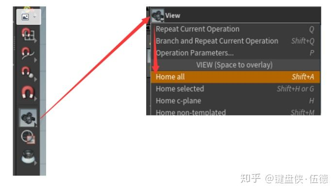
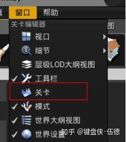
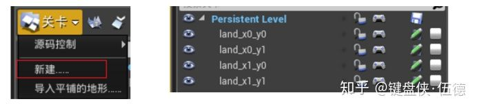
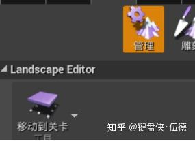
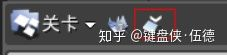
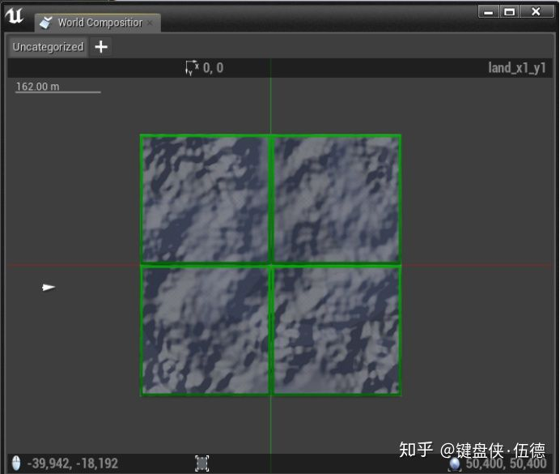
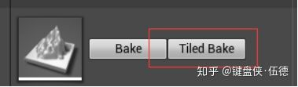
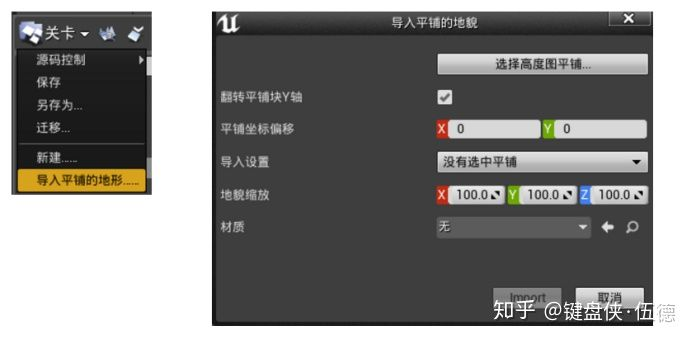
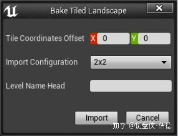
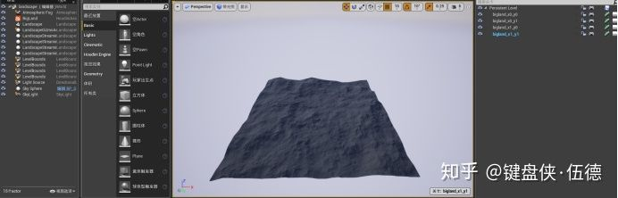

# Houdini Terrian & UE4 （三）world composition 支持

## **导言**

前面我们已经了解了Houdini&UE4的工作流程，也啃了一部分houdini engine的代码。当然，我们做了一些小小的优化让Layer能够按照我们的想法做保留。但这些仅仅是一个开始。

world composition是UE4中很重要的一个功能，它把一个场景拆成多个子关卡，来优化大场景的加载问题。对于大地形，首先需要保留地形的连续完整，其次还要可以分布的加载，所以我们需要将一个Landscape切成多个proxy放在对应的子关卡中来满足上面这两点。

然而原生的houdini engine插件并不支持这一功能（如果在houdini中切块导入UE4，这些地形块是不连续的），所以我们要修改houdini engine引擎来手动解决这个问题。

## **创建地形**

首先我们在houdini中做一个比较大的地形，参照官方给的尺寸，我们在houdini中新建一个heightfield，依然是简单的加个noise，就可以准备导入ue4了。

注意的是，houdini中新建的大地形会受到相机裁剪，如果想要看到地形的全貌，可以按照下面的步骤操作，也算是个小tips~

显示整个地形

## **如果不修改插件**

在着手修改插件之前，我们可以先明确一下手动划分子关卡的步骤，也是便于我们更加明晰插件自动分块的流程。

首先我们将地形导入UE4，在场景中生成它，然后我们把它bake出来。

打开关卡窗口。

在这里我们可以新建一些子关卡，并且右键加载进来。

双击一个关卡，这样这个关卡就变成了当前关卡，随后地形也会移动进来。

地形管理中选中移动到关卡，下面还可以选择一个尺寸。

在地形中选中地形component，选中的同时，地形就会分配到当前关卡了。我们可以通过显示隐藏子关卡来确认有没有正确的移动过去。

最后，我们可以看到地形被成功分块加载到了四个子关卡中。

当然也可以做一些小测试，比如用雕刻工具调整一下地形高度，可以看出虽然分块了，但是地形依旧是连续。

可以看到，这仅仅是分成2x2，如果我们有一张8k*8k的地图需要拆分成更多比如64哥tile，这个操作工程量就相当巨大了。

## **规划导出流程**

根据上面的操作流程，其实分块的步骤还是很简单的，我们在地形的Bake流程中，先规划分块的数量，在对每一块新建关卡并且把对应的component导入到新的子关卡中，就会由world composition合并到一起了。

## **修改Houdini Engine**

其实步骤中的每一个功能本身都是由引擎的代码来实现了，我们在自己定制的过程中，完全可以借鉴UE4引擎本身的代码。

**第一步**我们在Houdini  Engine本身的Bake按钮后面加一个Tiled  Bake按钮，新按钮就是我们用来分块导出的程序入口啦。我们可以参照FHoudiniEngineBakeUtils::BakeLandscape来定义一个新的TiledBakeLandscape.

**第二步**我们需要弹出一个对话框，让使用工具的人能够输入一些信息，这里我们参照引擎自带的导入平铺地形这个窗体（STiledLandcapeImportDlg）来定制我们自己的窗体。

 拷贝STiledLandcapeImportDlg的代码到我们引擎的目录后，删掉一些没用的slate，加上我们自己需要的输入就行了。

 注意的是，这里的2x2尺寸是我们通过已有地形在xy上的component数量来生成的一串儿选项。

**第三步**我们在获得了输入之后，就可以进入自动化分块的正式流程了，这里我们可以参照两个地方的代码。

-  一个是FWorldTileCollectionModel::ImportTiledLandscape_Executed()，这是我们上面提到的导入平铺地形的代码，从代码中我们可以了解到创建新关卡和分配地形相关的实现方式。
-  还有一个是FLandscapeToolStrokeMoveToLevel::Apply()，这个就是管理工具中选择地形component并移动到新关卡的功能啦。

在我们的流程中，用对x,y的双层循环来创建新的关卡，把brush选择地形改为直接计算要导入新关卡的Component，最后按照FLandscapeToolStrokeMoveToLevel::Apply()里面的实现方式进行对高度图和权重图的一些列复制，就完成啦！

编译，启动，选择hda，Tiled Bake，重新打开场景，加载所有子关卡，bingo！

##  是不是看起来很简单，其实坑贼多

新建关卡并保存后，worldbrowser中的接口都是没有暴露出来的，所以我们没有办法使用那些代码，其实我们只需要调用world->worldcomposition.scan()就可以吧新建的关卡加载到世界关卡中了，编辑器插件相关的代码只能扔掉。最后很愚蠢的在到处完成后提示一下重新打开场景（不修改源码没别的办法了，我尝试过代码重新加载场景，但是会出现漏加载子关卡的情况，而且后续代码可能会崩溃哦~）

移动地形的代码中，都是基于CurrentLevel来做的。我们要找到这些地方并且改为我们New出来的World的Persistent_Level才对，否则会看到一个引用外部映射的报错（保存的时候）。

ALandscape::SplitHeightmap不知道为什么是个链接错误（err2019），无奈。拷贝一份到houdini engine中，记得增加一个指定level作为outlevel，不要用CurrentLevel。

剩下的想到再补充。

## **后记**

可能直接看文章看到这里蛮懵的，但是真的需要做的话，你做完的时候说不定就想回来给我多点几个赞了。

虽然看起来功能不大，也是近千行代码（躺雷过程少说看了近万行代码），这里就只写一个思路，不贴代码了，如果有遇到问题，欢迎咨询哦~ 先点赞再咨询哦！

下一章会写关于按区域/选区提交houdini更新相关的功能，欢迎关注哦！