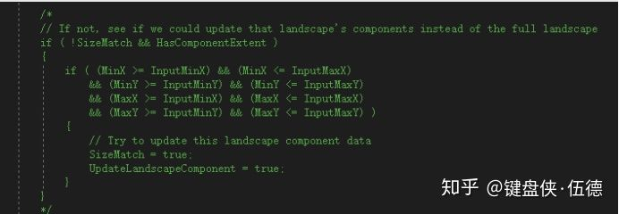
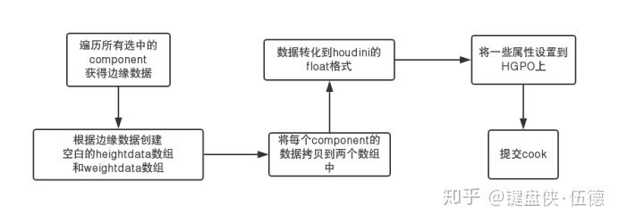
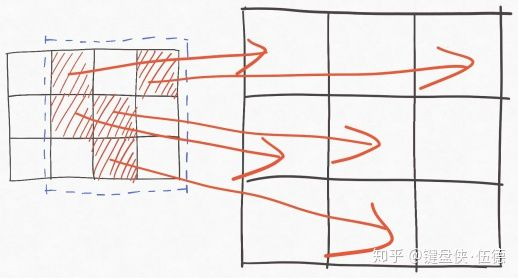
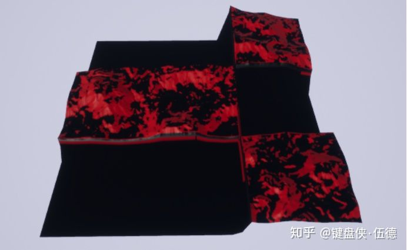
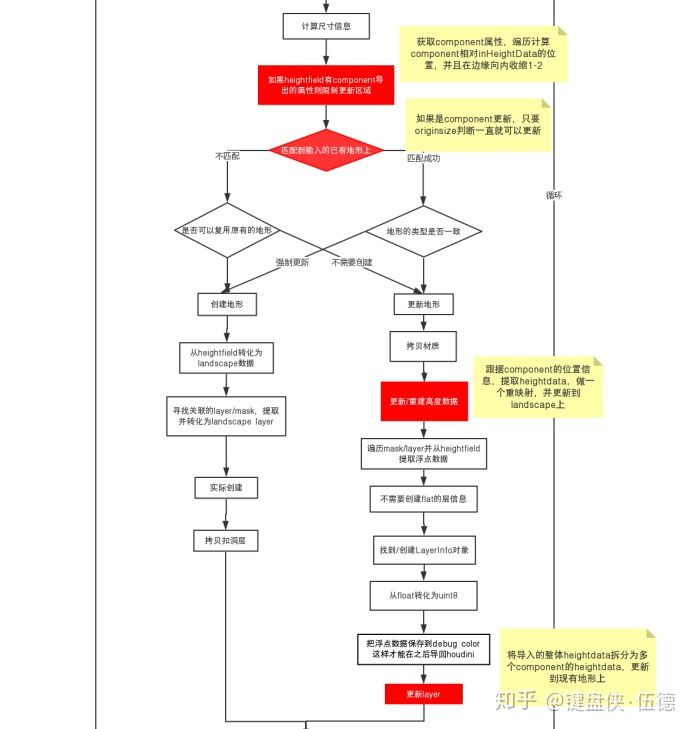
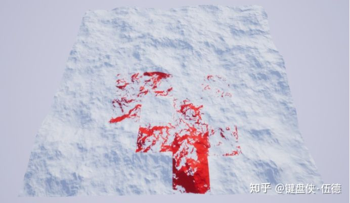

# Houdini Terrian & UE4 （四）landscape component多选更新

[](https://www.zhihu.com/people/kbmwooder)

[键盘侠·伍德](https://www.zhihu.com/people/kbmwooder)

不会写策划案的美术不是好程序


## **导言**

在我们支持了导出为支持world composition的Tile后，马上就又一个新的麻烦事出现了。

这么大的地形，不可能每一次对整个地形进行更新，我们需要支持对单个地块进行更新，让整个场景开发对协同工作更加的友好。

然后我们可以看到，在输入地形的地方是有导出选中Landscape Component Only的选项的，然而无论如何设置，都只能cook到一个新的地形块上，无法更新原来的地形。


在CreateAllLandscape中可以看到，在检查是否有输入的地形可以更新的地方，这段代码是注释掉的。（为什么这里被注释掉了，在我自己做完最基础的对component的更新后猜测，大概是官方弃坑了-  -！）（这个代码是2018年12月提交的，已经过去半年，未见更新。）



所以，我们得自己去实现一套基于component的更新了。

Houdini技术体系 基础管线（三） ：UE4 Landscape Component的多选支持 下篇

www.cnblogs.com

这是我最初看到的多选component更新的处理思路，也感谢traceyang大佬提供的思路。当然。我觉得如果我们的pipeline需要涉及到美术进行hda制作的流程修改，就太不智能了。我想做到的是，保持UE4和houdini的流程独立，但是解决掉多选component提交带来的问题（完全更新，边缘处理等）。

## **解决思路**

在选择了多块地形后，我们根据最大范围构造一个完整地形，但是这个地形中我们只输入我们需要的数据给houdini  engine去处理。这样我们既保证了给到houdini  engine一个完整的地形，同时让输入的数据尽可能的小，尽可能减少houdini的cook消耗。


## **输出给houdini engine**

我们找到原来houdini engine写的按component的地方。直接抛弃（CV）原来的的一套逻辑，自己从头写（gai）起。

```cpp
// FHoudiniEngineUtils::HapiCreateInputNodeForLandscape
if ( !bExportOnlySelected || ( SelectedComponents.Num() == NumComponents ) )
{
    // Export the whole landscape and its layer as a single heightfield node
    bSuccess = FHoudiniLandscapeUtils::CreateHeightfieldFromLandscape( LandscapeProxy, CreatedHeightfieldNodeId );
}
else
{
    //  Each selected landscape component will be exported as separate volumes in a single heightfield
    // bSuccess = FHoudiniLandscapeUtils::CreateHeightfieldFromLandscapeComponentArray( LandscapeProxy, SelectedComponents, CreatedHeightfieldNodeId );
    
    // 可以看到原来的注释，我的做法是。直接不用他那一套。自己写一套将component合并，整体导入houdini engine去cook
    bSuccess = FHoudiniLandscapeUtils::CreateHeightfieldFromLandscapeComponentArrayNoSplit( LandscapeProxy, SelectedComponents, CreatedHeightfieldNodeId );
}
```

首先，虽然我们的地形被分成了多个LandscapeSteamProxy，但是他们共享一个LandscapeInfo，他们GetLandscapeActor的结果也是我们最初bake出来哪个完整地形，所以只要LandscapeInfo是同一个，我们就很容易把component放在一块儿处理了。





其中，attribute我们需要保存两个数据，一个是整个地形的size,还有一个是每个component的相对位置。地形size的数据保存就不说了，就是最基础保存操作。

但是，component的位置由于长度不确定，需要有一个合适的保存方式。这里顺便提一下HAPI中的属性保存。

name          属性名

const [HAPI_AttributeInfo](https://link.zhihu.com/?target=https%3A//www.sidefx.com/docs/hengine/struct_h_a_p_i___attribute_info.html) *  attr_info

——其中count是属性的数量，tuplesize是每个属性的长度。

——比如2个vector，就是count = 2，tuplesize = 3

——对于owner

——[HAPI_ATTROWNER_DETAIL](https://link.zhihu.com/?target=https%3A//www.sidefx.com/docs/hengine/_h_a_p_i___common_8h.html%23ab8e5b8743050848e96767af662b23f1da5afd3bdd1b261e6b1f2e61502b35775a) geo自身属性

——[HAPI_ATTROWNER_PRIM](https://link.zhihu.com/?target=https%3A//www.sidefx.com/docs/hengine/_h_a_p_i___common_8h.html%23ab8e5b8743050848e96767af662b23f1daec45a1256eb509fe0c3a3e42ec61deeb) 表面上的属性

——[HAPI_ATTROWNER_POINT](https://link.zhihu.com/?target=https%3A//www.sidefx.com/docs/hengine/_h_a_p_i___common_8h.html%23ab8e5b8743050848e96767af662b23f1dab13518ffecaf5b95fa67935c5246194e) point上的属性

——[HAPI_ATTROWNER_VERTEX](https://link.zhihu.com/?target=https%3A//www.sidefx.com/docs/hengine/_h_a_p_i___common_8h.html%23ab8e5b8743050848e96767af662b23f1dad5921efa46031bdd8c6dce02a47a0324) 顶点上的属性

const int * data_array    输入数据的数组

start     从第几个attr开始取，每次取tuplesize个值

length  取多少个attr的值

可以看到，HAPI中的属性构建是支持二维数组形式的，讲道理应该很好用，其实吧，这个attributeinfo里面的count是不能大于owner的数量的，比如我们的地形，只有一个face，所以我们存在PRIM上count也不能大于1。

所以我们想要保存多个component的数据就只能靠trick了。

```cpp
bool FHoudiniLandscapeUtils::AddLandscapeCombinedComponentExtentAttributes(const HAPI_NodeId& NodeId, const HAPI_PartId& PartId, TArray<TArray<int32>>& ComponentRect, int ComponentNum)
{
	// Create an AttributeInfo
	HAPI_AttributeInfo AttributeInfo;
	FMemory::Memzero< HAPI_AttributeInfo >(AttributeInfo);
	AttributeInfo.count = 1;
	AttributeInfo.tupleSize = 1;
	AttributeInfo.exists = true;
	AttributeInfo.owner = HAPI_ATTROWNER_PRIM;
	AttributeInfo.storage = HAPI_STORAGETYPE_INT;
	AttributeInfo.originalOwner = HAPI_ATTROWNER_INVALID;

	// Add the landscape_component_rect primitive attribute
	HOUDINI_CHECK_ERROR_RETURN(FHoudiniApi::AddAttribute(
		FHoudiniEngine::Get().GetSession(),
		NodeId, PartId, "landscape_component_rect_count", &AttributeInfo), false);

	HOUDINI_CHECK_ERROR_RETURN(FHoudiniApi::SetAttributeIntData(
		FHoudiniEngine::Get().GetSession(),
		NodeId, PartId, "landscape_component_rect_count", &AttributeInfo,
		&ComponentNum, 0, AttributeInfo.count), false);

	AttributeInfo.tupleSize = 4;
	for (int32 i = 0; i < ComponentNum; i++)
	{
		char RectName[128];
		sprintf_s(RectName, "landscape_component_rect%d", i);
		// Add the landscape_component_rect primitive attribute
		HOUDINI_CHECK_ERROR_RETURN(FHoudiniApi::AddAttribute(
			FHoudiniEngine::Get().GetSession(),
			NodeId, PartId, RectName, &AttributeInfo), false);

		HOUDINI_CHECK_ERROR_RETURN(FHoudiniApi::SetAttributeIntData(
			FHoudiniEngine::Get().GetSession(),
			NodeId, PartId, RectName, &AttributeInfo,
			ComponentRect[i].GetData(), 0, AttributeInfo.count), false);
	}
	return true;
}
```

 到这里，如果我们可以先做一半的测试。可以看到。我们的地形可以按照我们想要的效果送进houdini engine去cook了。



## **更新地形**

更新流程肯定是离不开我们熟悉的CreateAllLandscape函数了。我们在原有流程的基础上加上我们的多选更新机制。[原图](https://zhuanlan.zhihu.com/p/68111850)



这里其实就是一个反向操作，输入的时候我们怎么合并，这里就怎么拆回去。基本上都是一些对数组的逐个运算啦，并不难（也就调试了一通宵）。

这里还是贴一下GetAttribute的代码，主要还是崭露一下自己的骚写法。

```cpp
bool FHoudiniLandscapeUtils::GetLandscapeCombinedComponentExtentAttributes(const FHoudiniGeoPartObject& HoudiniGeoPartObject, TArray<ComponentRectInfo> &outComponentRect)
{
	if (!FHoudiniEngineUtils::HapiCheckAttributeExists(
		HoudiniGeoPartObject, "landscape_component_rect_count", HAPI_ATTROWNER_PRIM))
		return false;

	// Create an AttributeInfo
	HAPI_AttributeInfo AttributeInfo;
	FMemory::Memzero< HAPI_AttributeInfo >(AttributeInfo);

	TArray<int32> IntData;
	if (!FHoudiniEngineUtils::HapiGetAttributeDataAsInteger(
		HoudiniGeoPartObject, "landscape_component_rect_count", AttributeInfo, IntData, 0, HAPI_ATTROWNER_PRIM))
		return false;

	int count = IntData[0];

	for (int32 i = 0; i < count; i ++)
	{
		char RectName[128];
		sprintf_s(RectName, "landscape_component_rect%d", i);
		if (!FHoudiniEngineUtils::HapiGetAttributeDataAsInteger(
			HoudiniGeoPartObject, RectName, AttributeInfo, IntData, 0, HAPI_ATTROWNER_PRIM))
			return false;

		ComponentRectInfo RectInfo(IntData[0], IntData[1], IntData[2], IntData[3]);
		outComponentRect.Add(RectInfo);
	}

	return true;
}
```

还有就是重新映射高度的算法：因为从houdini把高度转换回UE4的uint16的高度时，为了尽可能保持精度，会有一个放大和压缩的操作。

也可以看到，导入的地形，如果我们不在插件设置里勾选(use unreal scale)的话，导入的地形Z轴缩放和XY轴是不一致的。（当然，能不勾选还是不勾选，毕竟精度还是很重要的。）

反复琢磨代码，其实Z轴的缩放值就是当前地形的高度范围除以uint16来算出的（相当于float值按照最大范围计算一个int值，然后通过缩放再把比例正常化）。

所以如果我们不做重映射的话，我们的component的正常缩放值和当前地形的缩放值会不匹配，生成的地形会有高度差。

```cpp
// We need the Digit (Unreal) value of Houdini's zero for the scale calculation
// ( float and int32 are used for this because 0 might be out of the landscape Z range!
// when using the full range, this would cause an overflow for a uint16!! )
float HoudiniZeroValueInDigit = (float)FMath::RoundToInt((0.0 - (double)FloatMin) * ZSpacing + DigitCenterOffset);
float ZOffset = -( HoudiniZeroValueInDigit - 32768.0f ) / 128.0f * LandscapeScale.Z;
outZeroInDigit = HoudiniZeroValueInDigit; // 从这里取到zero
LandscapePosition.Z += ZOffset;


void FHoudiniLandscapeUtils::RemapHeightData(TArray<uint16>& HeightData, FVector NewScale, FVector OldScale, float ZeroInDigit)
{
	for (uint16& HeightValue : HeightData)
	{
		float FinalHeight = ((float)HeightValue - ZeroInDigit) * NewScale.Z / OldScale.Z + 32768.f;
		FinalHeight = FMath::Clamp(FinalHeight, 0.0f, (float)UINT16_MAX);
		HeightValue = (uint16)FMath::RoundToInt(FinalHeight);
	}
}
```

更新代码，搞定！可以看到。输入结果按选中的component更新了地形，通过边缘收缩，边缘也没有什么明显的错误导入。



------

## **后记**

看起来是做完了，其实还是给自己留了坑的，又一个可以预见的问题是，虽然我们只是更新了component，但是前面我们提到，houdini导入的layer在导回houdini时会被清除，这可不是我们想要的结果，但是这里的处理我觉得还是根据项目需求来做比较好。（干脆不清除任何layer或者只清除当前component的layer信息而不是整个地形的）。

做完也可以看到。按照component的更新还是很生硬，根据traceyang的设想，我们还可以更具地形选区的brush来做更新，放在下一篇讲啦（别催，看代码很头疼的）。

能看到这里的都是勇士，勇士不如点给个赞再走啊！