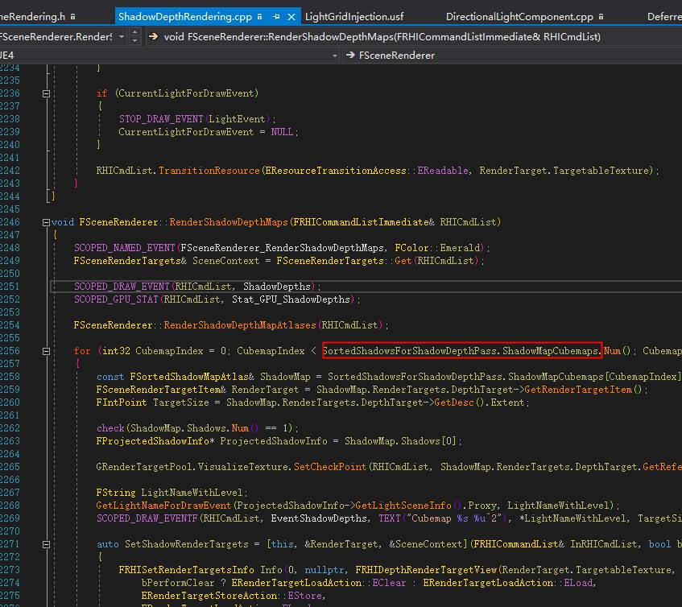
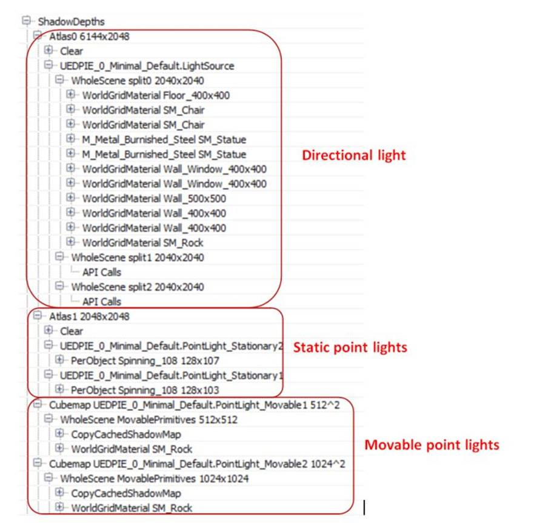
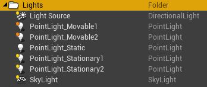
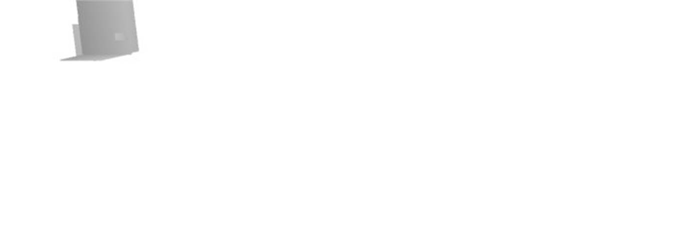
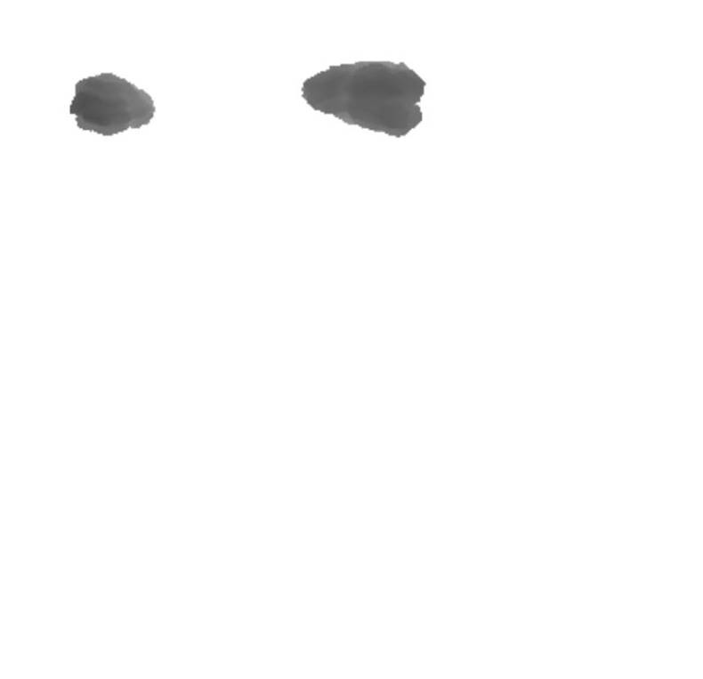
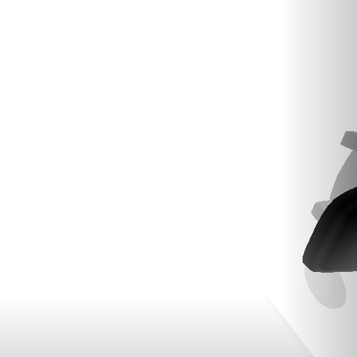
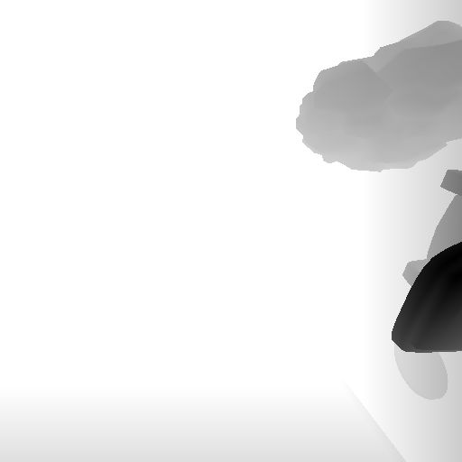
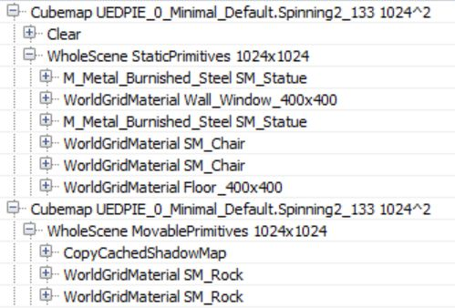

# Unreal ShadowDepth

2019年3月25日

17:41

@author:

黑袍小道

 

源码Debug_RenderDoc

 

 

第一步：平行光的ShadowDepthMap烘培部分,由于ShadowRender 只需要顶点着

 

 

 

 

 

 

 

阴影的渲染

接下来一步是阴影计算render pass(ShadowDepths)。

静态（stationary）的平行光，两个可移动（movable）的点光源以及一个静止（static）的点光源。所有光源都会计算阴影。

对于静态光源，渲染器会为静态物体烘焙阴影，并为动态物体计算阴影。对于可移动的光源每一帧都需要为所有物体计算阴影（完全动态）。最终对于静态物体其阴影会被烘焙入光照贴图（lightmap），所以这些阴影在渲染中不会出现。

对于平行光我添加了分三个层级的级联阴影（cascaded shadowmaps），以观察UE4是怎么处理这个功能的。UE4创建了一个3x1的格式为R16_TYPELESS的纹理（每行3个tile，每层阴影一个），每一帧清除一次（意味着每一帧所有层都要更新，而不会有隔帧更新之类的优化）。随后，在Atlas0 render pass中所有物体会被渲染进对应的阴影tile中。

从上面的drawcall列表可看出只有Split0需要渲染一些物体，其他块是空的。阴影在渲染时无需pixel shader，这能使得阴影的渲染速度翻倍。值得注意的是无论平行光是静止的还是动态的，渲染器会将所有物体（包括静态物体）都渲染到阴影贴图中。

接下来是Atlas1 render pass，这一步将渲染所有静态点光源的阴影。在我的场景中只有那块岩石模型被标记为动态物体。对于静态光源的动态物体，UE4使用逐物体阴影贴图，保存在一个纹理图集（texture atlas）中，意味着对于每一个光源，每一个物体都会渲染一个shadowmap。

最后，对于动态光源，UE4使用传统的立方体阴影（cubemap shadowmap，在CubemapXX passes中)，使用一个geometry shader来选择要渲染到cubemap的哪个面上（以减少draw call）。在这一步只渲染动态物体，所有静态物体会被缓存起来。CopyCachedShadowMap这一步会把阴影缓存复制进来，然后在此之上渲染动态物体的阴影深度。下图是一个动态光源的立方体阴影缓存中一个面的内容（CopyCachedShadowMap这一步的输出）

这是渲染了动态物体（石头）后的结果：

静态物体的阴影缓存不会再每一帧重新生成，因为渲染器知道（我们场景中的）这一光源没有移动（尽管被标记为动态光源）。如果光源移动了，渲染器会在每一帧渲染动态物体前把所有静态物体重新绘制入阴影缓存中（这一步我在另一个测试中证实）：

唯一一个静态光源（static light）完全没有出现在drawcall列表中，意味着这个光源不会影响动态物体，只会通过光照贴图去影响静态物体。

在本文最后提个建议，如果在你的场景中有静态光源（stationary light）请确保在编辑器中测试性能前烘焙光照（我不确定在standalone模式下运行时是否需要这样），如果不烘焙的话UE4会将它当做动态光源并渲染立方体阴影，而不是逐物体阴影。

 

 

 

关于ShadowRendering

2019年3月26日

11:20
