

# 虚幻4渲染编程（灯光篇）【第一卷：各种ShadowMap】

2018年12月26日 星期三

16:02

灯光篇开篇概述：

灯光在游戏里非常重要，游戏画面的整体感觉，游戏运行的效率都和它息息相关。然而虚幻把这些逻辑封得死死地。各种概念和庞大的系统常常令人束手无策。本篇将从灯光光影的原理入手，先自己实现一些灯光再自己动手打光做效果，想必这样会事半功倍。

本小节将在虚幻中用蓝图脚本“手连”各种基础ShadowMap。感谢技术美术图形交流群的小伙伴们的共同探讨@。

 

最基础的ShadowMap

shadow map的原理网上一搜一大把。总的来说就是：“在灯光方向架一台摄像机，获取深度图，然后再正常渲染自己的场景，再在正常渲染场景的时候把fragment转换到光源空间，把它和之前渲染的Shadowmap中高度深度作比较，看它是否在影子里，如果是就返回0，不是就返回1”。上述就是最原始的shadow map了。下面就在虚幻中实现它吧。

首先创建几个资源

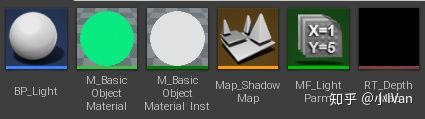

在BP_Light中创建一个SceneComponent和一个SceneCapture2D，然后设置它的参数，把RT_DepthMap设置给它。如图所示：

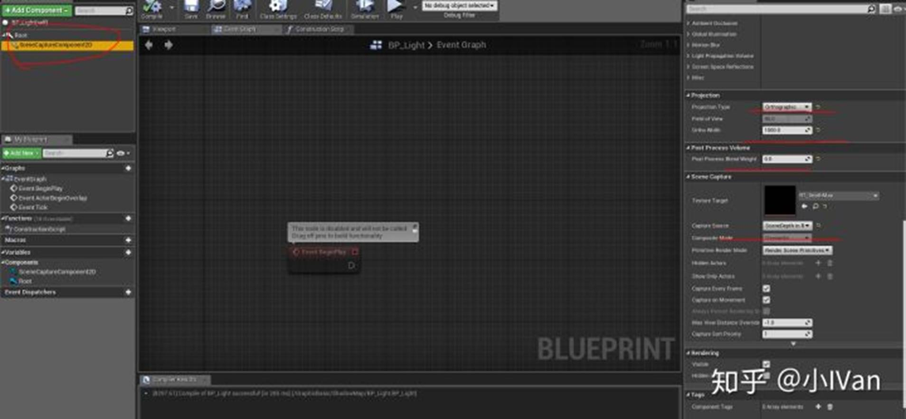

然后创建一个MaterialParamerterCollection

因为我们在材质里直接“连”我们的shadow map，但是在材质层拿不到视口矩阵和投影矩阵，所以我们自己构建我们的矩阵。矩阵的推导可以去看看龙书d3d11的shadow map那一章

首先在BP_Light的构造函数中，先把灯光的位置传进去

然后构造我们的灯光摄像机视口矩阵

 

然后是构造灯光摄像机投影矩阵

 

 

 

下面来设置我们的RT_DepthMap，精度越高影子效果相对来说会好些。

有了灯光位置和两个矩阵还有一张深度图，就可以开始在材质里做事情了。

在M_BasicObjectMaterial里，首先先把当前摄像机的像素位置变换到灯光摄像机空间

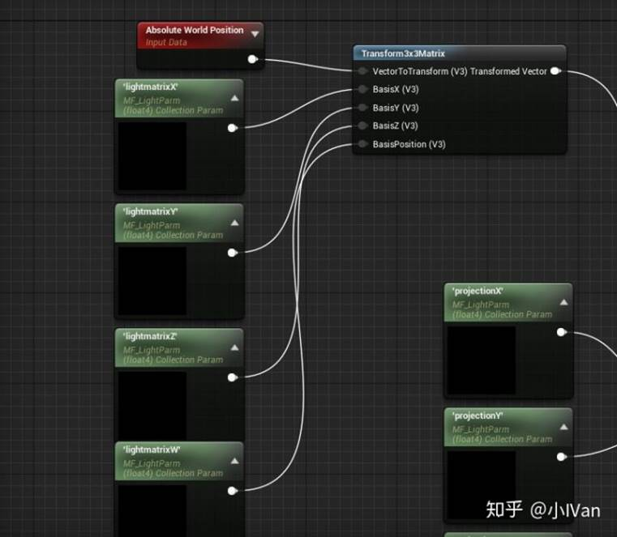

然后再变换到投影空间

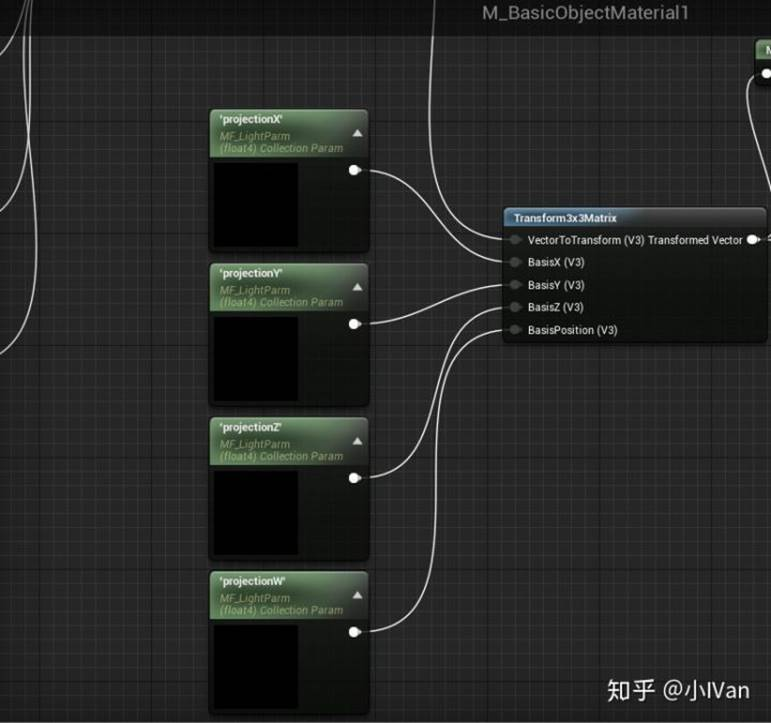

然后再把它变换到【0-1】范围内

 

把深度图里的值（刚才渲染的）和它本身的值作比较。如果当前像素的摄像机方向上有遮挡，那么深度图里去除的值会比当前它的深度值小，如果小就说明此物体在阴影中。所以返回0

然后在场景里放两个模型，把灯光蓝图脚本拖进去，将会看到

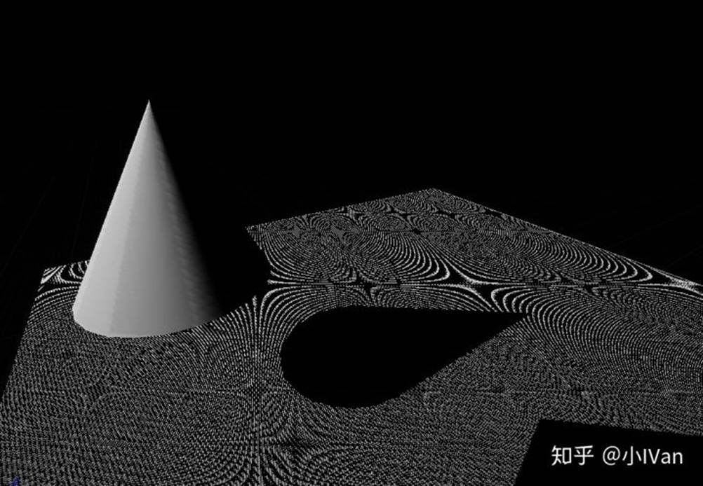

调整材质中的bias值

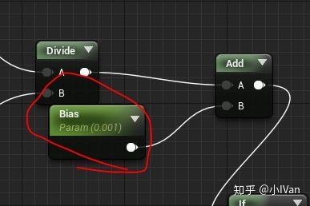

你将会看到

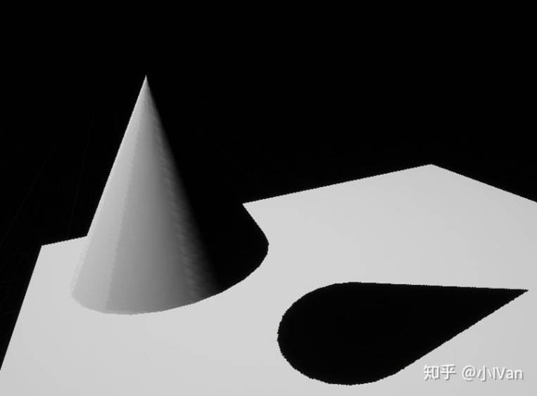

但是这有个问题，就是影子的锯齿很严重。造成这个的原因是因为那个比较操作是离散的，是在影子里就是0，不是就是1。下面有很多方法来改进它。

 

PCF（percentage-closer filtering）

下面来对影子进行柔化处理。

对阴影周围进行范围采样然后取平均值，这样可以造出柔和的影子

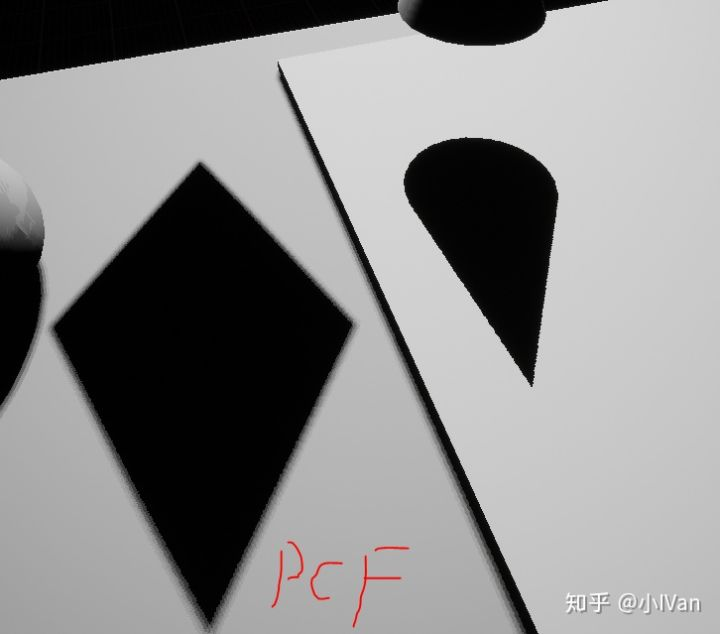

可以看到影子的质量有明显提高，但是PCF缺点也很明显就是需要多重采样，而且效果上不符合物理规律。下面就来实现它吧。

来到M_BasicObjectMaterial里，我们对影子生成部分做如下修改

建一个CustomNode命名为PCF

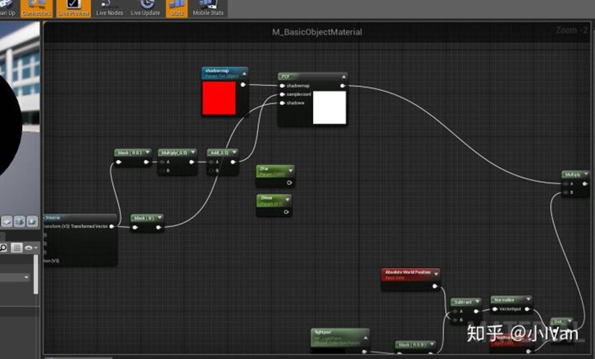

CustomNode的代码如下

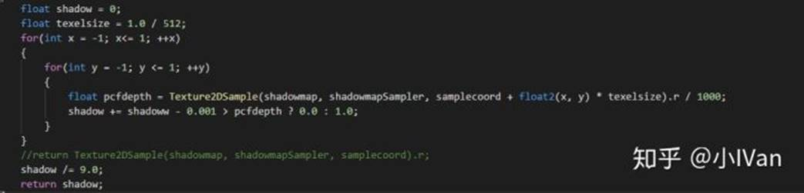

设置如下：

然后我们就可以得到柔和的影子了，如果想要更好的效果可以增加采样循环的次数。

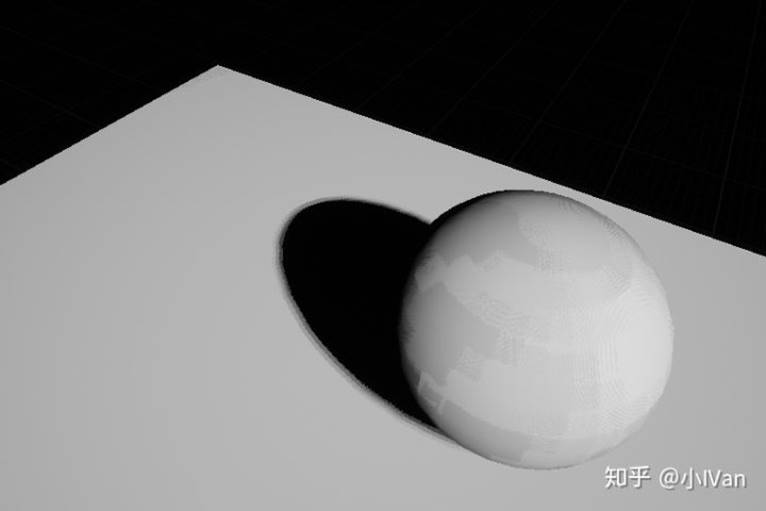

 

PCSS（Percentage Closer Soft Shadow）

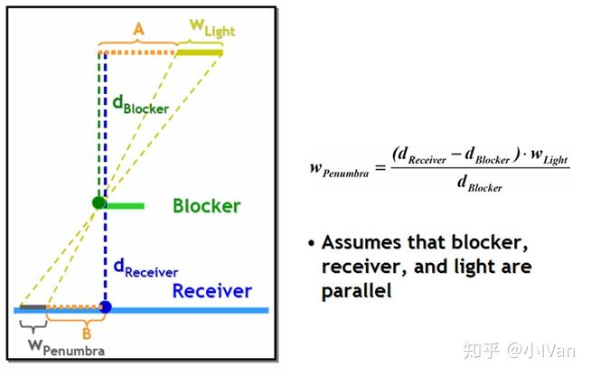

正常情况下，物体相距越远，影子会越弱越模糊，光源和半影成相似三角形，我们需要计算这个距离来动态改变我们PCF半影的半径。我的采样循环次数比较少所以看起来有点突兀。可以增大采样次数解决这个问题。

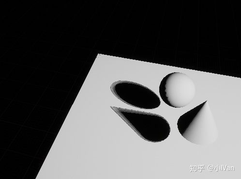

只需要修改M_BasicObjectMaterial种的CustomNode的代码即可。代码如下：

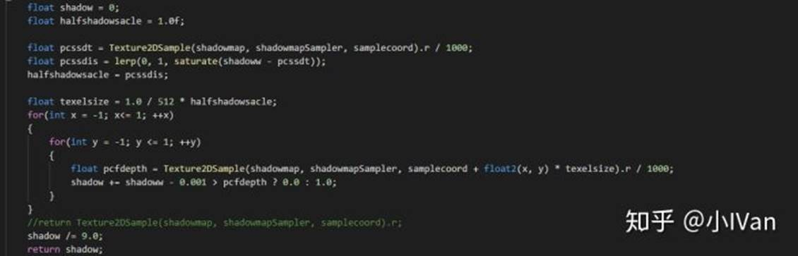

 

Irregular PCF

在PCF的基础上，对Offset做随机采样，可以得到更好的效果。

对M_BasicObjectMaterial的CustomNode做如下修改

代码：

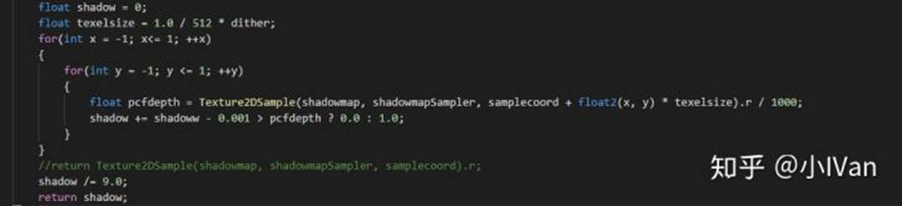

 

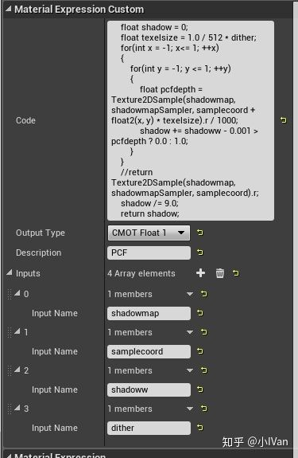

 

还有CSM，VSM，ESM等后面的文章会来实现它们。

Enjoy it！

 

【参考文章】

【1】[cybercser/OpenGL_3_3_Tutorial_Translation](http://link.zhihu.com/?target=https%3A//github.com/cybercser/OpenGL_3_3_Tutorial_Translation/blob/master/Tutorial%252016%2520Shadow%2520mapping.md)

【2】[阴影映射 - LearnOpenGL CN](http://link.zhihu.com/?target=https%3A//learnopengl-cn.github.io/05%2520Advanced%2520Lighting/03%2520Shadows/01%2520Shadow%2520Mapping/%23pcf)

【2】[Softshadow with GLUT,GLSL and PCF](http://link.zhihu.com/?target=http%3A//fabiensanglard.net/shadowmappingPCF/)

【4】[https://developer.download.nvidia.com/presentations/2008/GDC/GDC08_SoftShadowMapping.pdf](http://link.zhihu.com/?target=https%3A//developer.download.nvidia.com/presentations/2008/GDC/GDC08_SoftShadowMapping.pdf)

【5】[https://blog.csdn.net/jc_laoshu/article/details/69657579](http://link.zhihu.com/?target=https%3A//blog.csdn.net/jc_laoshu/article/details/69657579)

【6】[投影矩阵的推导(Deriving Projection Matrices)](http://link.zhihu.com/?target=https%3A//blog.csdn.net/zhanghua1816/article/details/23121735)

编辑于 2018-10-29

「真诚赞赏，手留余香」

 

来自 <<https://zhuanlan.zhihu.com/p/44349703>> 

 

 

 

 

 

 

