# 虚幻4渲染编程（灯光篇）【第二卷：体积光】

2018年12月26日 星期三

16:03

体积光在游戏里被越来越多地用到，对烘托场景气氛，提高游戏的逼格有比较重要的作用。这篇就来由浅入深研究一下这个东西。从容易的做法到高端做法依次递进。

首先先来分析一下体积光该如何模拟，在模拟之前还是需要基于现实来观察

# 

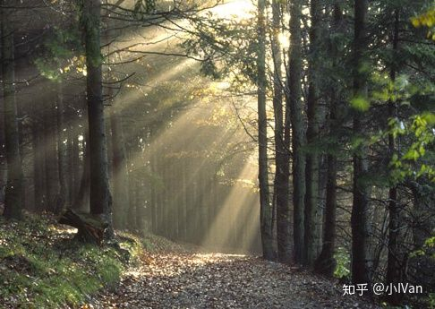

可以把体积光模拟分为以下几个部分

（1）光线在介质中传播的衰减

（2）因为有物体的遮挡，体积光会有物体的遮挡影子，可以看到上图光柱因为有物体的遮挡被打散得成一条一条的。

（3）一些细节加成，如尘埃，照亮反弹等。

 

【1】模型 || Bilboard体积光。

我先不说做法，先上效果：


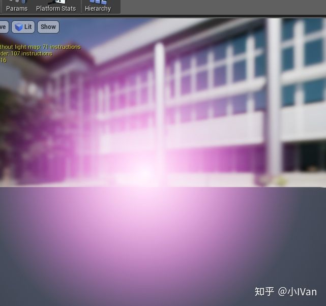

 


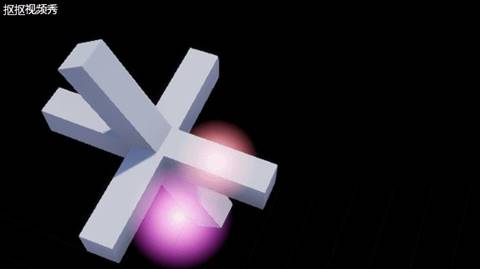

是不是感觉像是那么回事呢。这种体积光是最简单的一种，就是直接拿个模型或者billboard把一个addtive混合模式的材质叠上去就可以了，甚至还可以使用贴图去控制它们的形状。这种做法在如今的手机游戏上十分常见，高级的做法手机上也跑不了啊（2018年）。


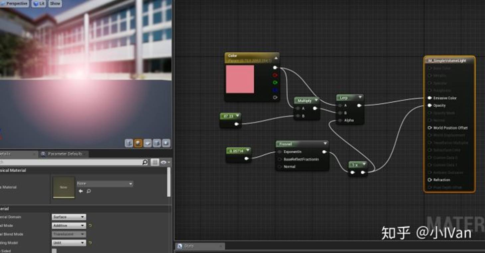

体积光就是对光在介质中传播的模拟。这里的话我使用指数型衰减材光线亮度。

当然还有很多对上述办法的改进方法，比如加一些尘埃的贴图叠在上面模拟体积光中的尘埃等等。


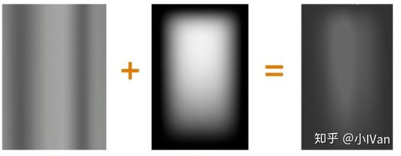

 


我一直主张多种方法技术混合使用，比如玩家能进入的区域，就用比较昂贵的方法做，中远景其实使用这些简单的体积光是比较好的选择。

对于使用模型或者billboard的体积光还有一些改进就是根据视角来改变模型的形状。常见的办法有把模型画两遍，第一遍沿灯光方向拉扯模型，第二遍正常画模型等等。

总得来说都是在对体积光的三大特征（文章开头所说的那三条）做模拟。

 

【2】ScreenSpace径向模糊

第一种方法非常简单非常便宜，但是缺点也显而易见，那就是很容易露馅儿。玩家的尽头推得比较近或者镜头快速大角度移动的时候，就显得非常假。所以又想了其它办法来思考对体积光的模拟。

假设现在我们有一条光带，并且我们把这盏灯画到了屏幕上。


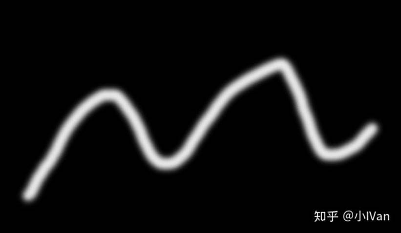

如果它向下发射光线，并且假设周围存在空气（微小颗粒），那么光线会发生衰减

能够想到比较简单的做法就是把它的图像向下模糊


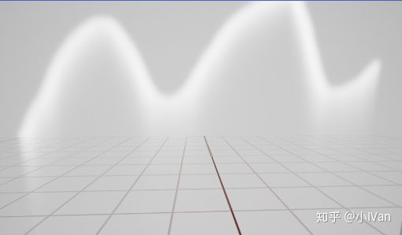

下面是我的代码


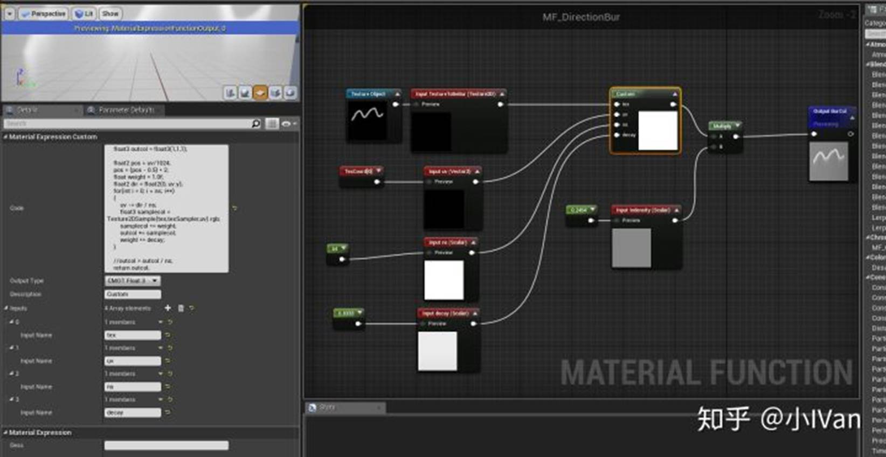

float Custom(texture2D tex, sampler texSampler, float2 uv, int ns, float decay)
 {
     float outcol = 0;

float2 pos = uv/512;
     pos = (pos - 0.5) * 2;
     float weight = 1.0f;
     float2 dir = float2(0, 1);
     for(int i = 0; i < ns; i++)
     {
         uv -= dir / ns;
         float samplecol = Texture2DSample(tex,texSampler,uv).a;
         samplecol *= weight;
         outcol += samplecol;
         weight *= decay;
     }

outcol = outcol / ns;
     return outcol;
 }

上面只是个快速演示，在游戏中我们可以渲染stencil，对stencil做这种处理。但是这种十分不好控制因为这就是个有方向的模糊。

 

【3】RayMarching

体积光可以被认为是在介质中均匀散射（没有阻挡的情况下）。所以我的最终图像上每一个像素的亮度应该是对这个方向上能量的积分。

所以我们得到了一个充斥着光的场景。现在模拟了光，剩下的就是模拟体积光的被遮挡的现象了。


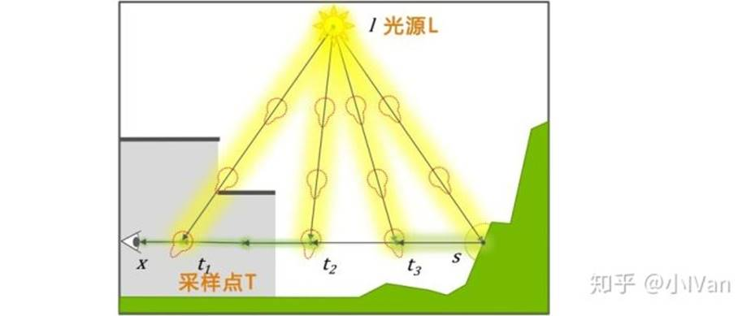

现在我们只是从屏幕发射光线，对所有光线进行积分，但是每考虑到遮挡。如果采样点和光线的连线被遮挡了，那这个采样点所采到的值应该低一些才对。这是不是很熟悉，这其实就是shadowmap的思路啦。

[小IVan：虚幻4渲染编程（灯光篇）【第一卷：各种ShadowMap】zhuanlan.zhihu.com](https://zhuanlan.zhihu.com/p/44349703)

[](https://zhuanlan.zhihu.com/p/44349703)

我们在世界空间架一台摄像机，然后抓一张深度图，用shadowmap的方法对场景进行投射。你将会看到：


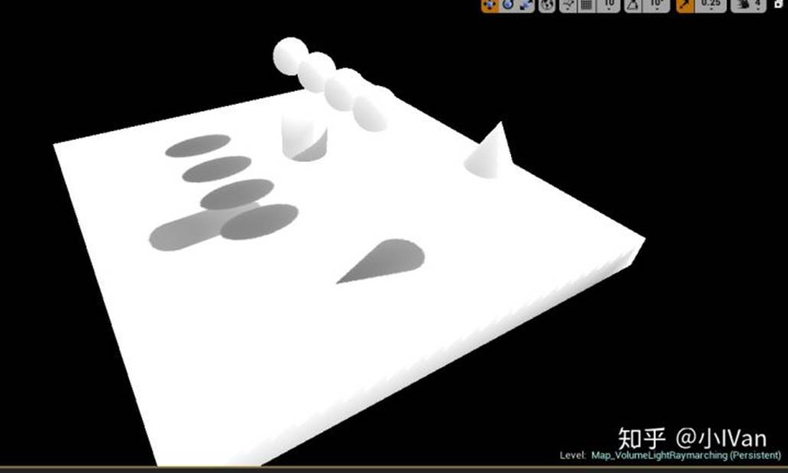

 


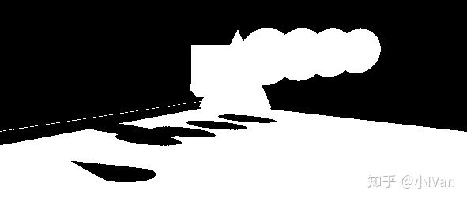

 


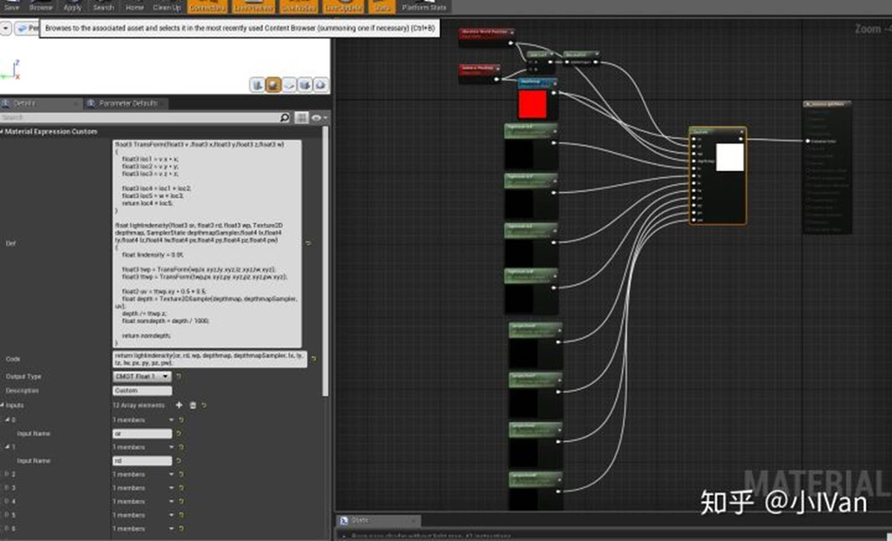

上面的Custom节点被我改造过，如果自己不会改引擎的你可以使用我的unrealshadertoy插件。customnode中的代码如下：

float3 TransForm(float3 v ,float3 x,float3 y,float3 z,float3 w)
 {
     float3 loc1 = v.x * x;
     float3 loc2 = v.y * y;
     float3 loc3 = v.z * z;

float3 loc4 = loc1 + loc2;
     float3 loc5 = w + loc3;
     return loc4 + loc5;
 }

float lightindensity(float3 or, float3 rd, float3 wp, Texture2D depthmap, SamplerState depthmapSampler,float4 lx,float4 ly,float4 lz,float4 lw,float4 px,float4 py,float4 pz,float4 pw)
 {
     float lindensity = 0.0f;

float3 twp = TransForm(wp,lx.xyz,ly.xyz,lz.xyz,lw.xyz);
     float3 ttwp = TransForm(twp,px.xyz,py.xyz,pz.xyz,pw.xyz);
     

```
 float2 uv = ttwp.xy * 0.5 + 0.5;
 float depth = Texture2DSample(depthmap, depthmapSampler, uv);
 depth /= ttwp.z;
 float nomdepth = depth / 1000;
```

float boc = ttwp.z - 0.01 > nomdepth ? 0 : 1;

return boc;
 }

return lightindensity(or,  rd,  wp,  depthmap,  depthmapSampler, lx, ly, lz, lw, px, py, pz, pw);

 

下一步就是从摄像机方向发射光线，对光线进行积分，每个采样点判断一下于光线方向上的遮挡信息，如果被遮挡，那么此处采样点的能量将小于其它地方。

我们可以得到如下的效果：


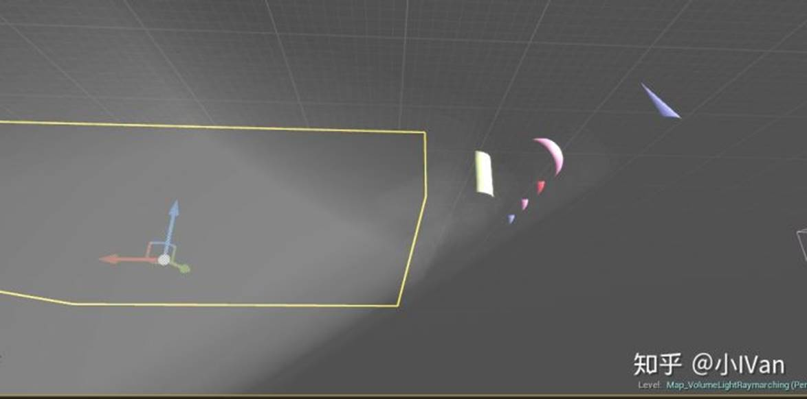

材质如下：


代码如下：

float3 TransForm(float3 v ,float3 x,float3 y,float3 z,float3 w)
 {
     float3 loc1 = v.x * x;
     float3 loc2 = v.y * y;
     float3 loc3 = v.z * z;

float3 loc4 = loc1 + loc2;
     float3 loc5 = w + loc3;
     return loc4 + loc5;
 }

float lightindensity(float3 or, float3 rd, float3 wp, Texture2D depthmap, SamplerState depthmapSampler,float4 lx,float4 ly,float4 lz,float4 lw,float4 px,float4 py,float4 pz,float4 pw)
 {
     float lindensity = 0.0f;

int maxstep = 64;
     float lengthperstep = 20;
     float lightinsperlit = 0.01;
     float lightinsperunlit = 0.005;
     float3 pos = or;
     for(int i = 0; i < maxstep; i++)
     {
         float3 twp = TransForm(pos,lx.xyz,ly.xyz,lz.xyz,lw.xyz);
         float3 ttwp = TransForm(twp,px.xyz,py.xyz,pz.xyz,pw.xyz);
     

```
     float2 uv = ttwp.xy * 0.5 + 0.5;
     float depth = Texture2DSample(depthmap, depthmapSampler, uv);
     depth /= ttwp.z;
     float nomdepth = depth / 1000;
```

bool boc = ttwp.z - 0.05 > nomdepth ? 0 : 1;

if(boc)
         {
             lindensity += lightinsperunlit;
         }
         else
         {
             lindensity += lightinsperlit;
         }

pos = pos + rd * lengthperstep;

}

return lindensity;
 }
 //写在Custom节点主code里的代码
 return lightindensity(or,  rd,  wp,  depthmap,  depthmapSampler, lx, ly, lz, lw, px, py, pz, pw);

我这里采样了64次，光线每次向前迭代20个单位。其实比较粗糙了。把精度加大，采样次数128，单步10单位试试。

其实还有很多改进空间，欢迎大神留言讨论。

Enjoy it！

 

参考资料

【1】[Shadertoy](http://link.zhihu.com/?target=https%3A//www.shadertoy.com/view/MdG3RD)

【2】[http://advances.realtimerendering.com/s2014/wronski/bwronski_volumetric_fog_siggraph2014.pdf](http://link.zhihu.com/?target=http%3A//advances.realtimerendering.com/s2014/wronski/bwronski_volumetric_fog_siggraph2014.pdf)

【3】[游戏开发相关实时渲染技术之体积光](https://zhuanlan.zhihu.com/p/21425792)

 

来自 <<https://zhuanlan.zhihu.com/p/47621988>> 
