# 虚幻4渲染编程（材质进阶篇）【第一卷：影视剧各种衣料--上】

## **专题概述：**

最近古墓丽影新作看的人心里直痒痒，用最新的RTX技术，让整个游戏画面又提升了一个档次。但是里面的材质衣料都是欧美的东西，所以我打算在游戏里自己实现一下中国的一些高级材质。最近正逢一部清宫剧很火，里面的服饰道具都非常华丽，所以想以它为参考在游戏里实现剧中的各类材质（侵删）。

这一小节来研究一下剧中的各类衣料。不得不感叹中国的衣料真的比欧美高大上多了，我们在穿绫罗绸缎的时候西方人还在穿麻布（手动滑稽）。如有错误还请各路大神指正（比如把绸和缎混淆什么的）

------

首先我们需要知道绫罗绸缎的各类区别，知乎上刚好有一篇不错的讨论

绫、罗、绸、缎、丝、帛、锦、绢的区别是什么？

www.zhihu.com

【一：吉服】

一起来实现富察皇后穿的这件吉服吧。距离太远看不清到底有没有用金线银线。皇后穿的叫“缂丝石青地八团龙棉褂。从光泽上看应该里面掺有除棉以外的其它材料。

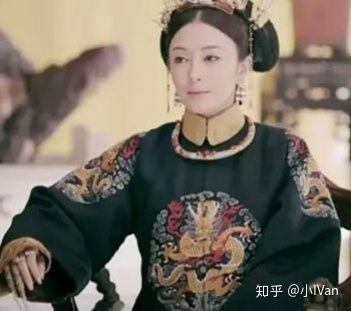图片来自网络

首先我们需要先把模型的大型做好，衣物大型是表现重点之一，我们先调好参数用cloth修改器，计算出一个还OK的模型出来。

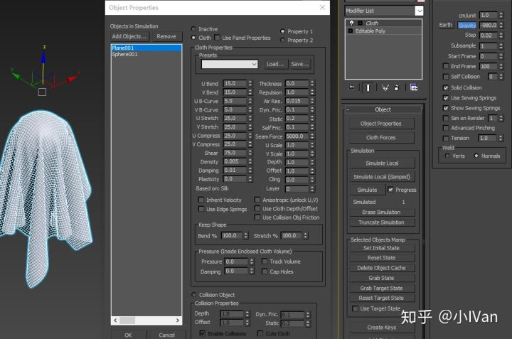

这件吉服的材质我使用迪士尼的那套BRDF。因为富察皇后的吉服非常细腻，衣服的纹理细节小到已经不能用法线表现了，所以使用Rouphness来表现这么细节的效果。**小于0.5mm大小的细节使用Normal来表现都不太合适了**。效果如下：

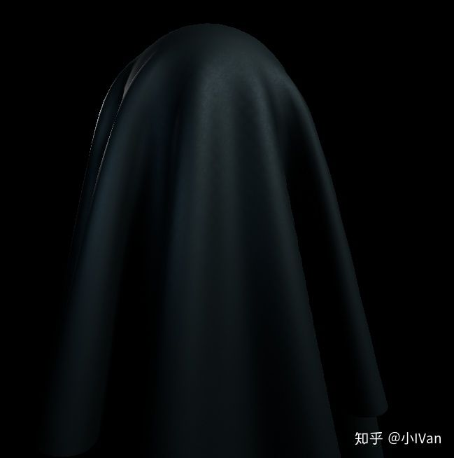

注意吉服的料子是青石色的。

------

【二：常服】

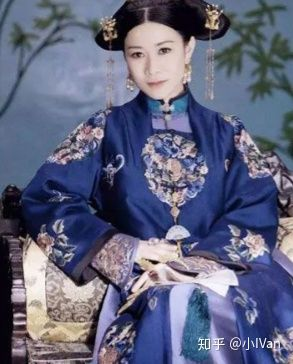图片来自网络

上图应该是锦或缎？质地比纱要硬一些，光泽度较高。我们还是使用迪士尼那套BRDF来模拟，在模型大型上可以把模拟参数的韧度调高些。因为这种材料的反射度较高，所以需要格外注意CubeMap。

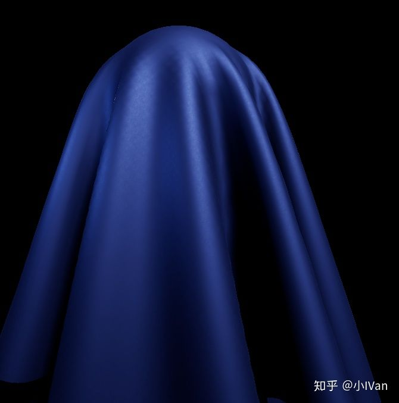

常服中还有一种比较素的布料

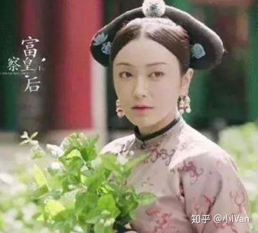

我们算两次BRDF，第一次使用标准的，第二次算microfacet的，最后通过一个权重值插值在一起最后和DIffuse相加

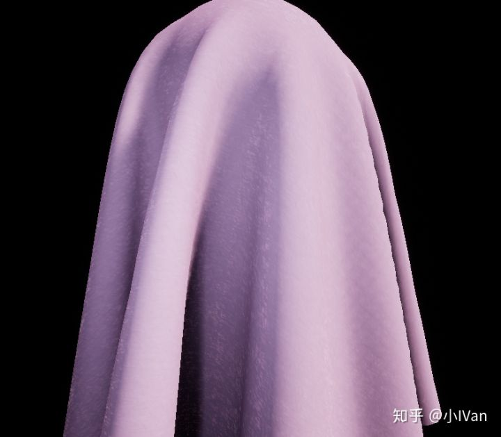

还有一种是有各向异性高光+有一点点隐约透明纱状感觉的袍子

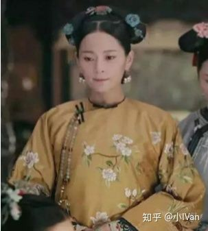

这种的话我们需要使用各向异性高光模型+OpacityMask。OpacityMask贴图的Clip值做小一点

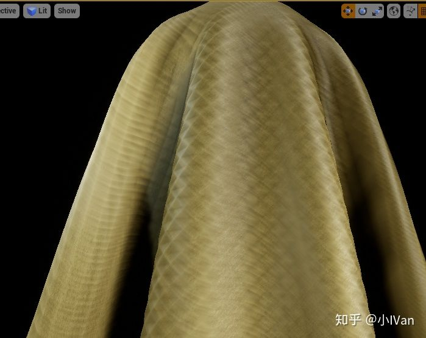

------

【三：孔雀羽线】

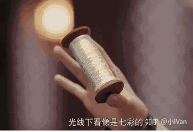图片来自网络

延禧攻略中提到的孔雀羽线是真实存在的。1958年的时候，北京定陵出土了一件“织金孔雀羽妆花纱龙袍”，是明朝万历皇帝穿的。之所以孔雀羽线会发出七彩光，是因为光的散射。要模拟这个效果我们需要动手改引擎的BRDF模型了。我们不需要管灯光摄进羽线做了什么事情，只管它出来之后的分布即可，可以看到从羽线射出来的光会被散射开。

把散射加到反射计算的F项中

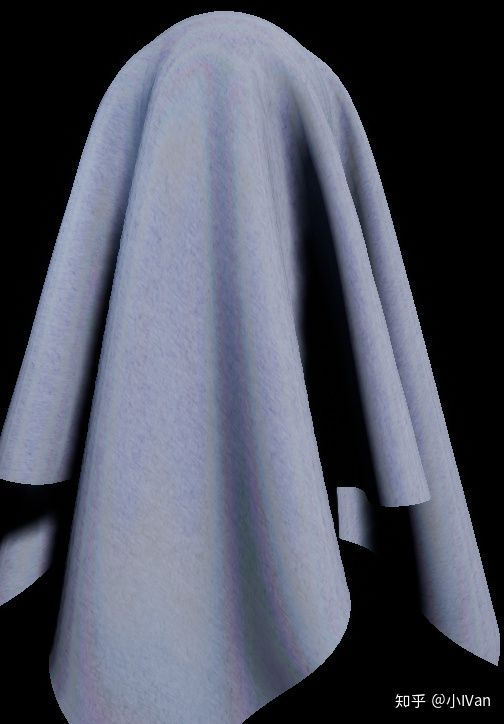

最后就得到了孔雀羽线布料啦。

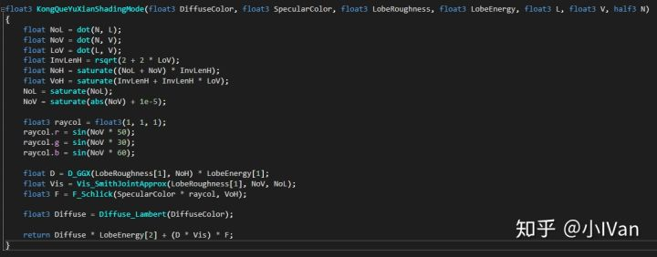

这个公式还不完美，还需要仔细再推敲推敲。

【四：丝绸，棉布，毛毯】

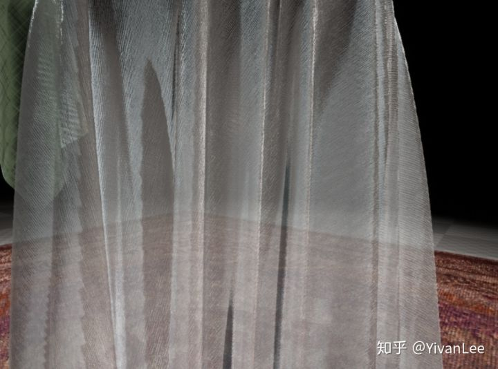

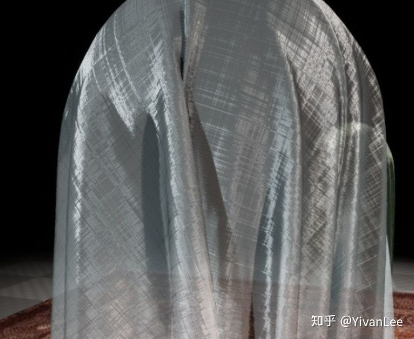

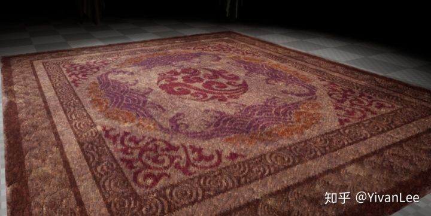

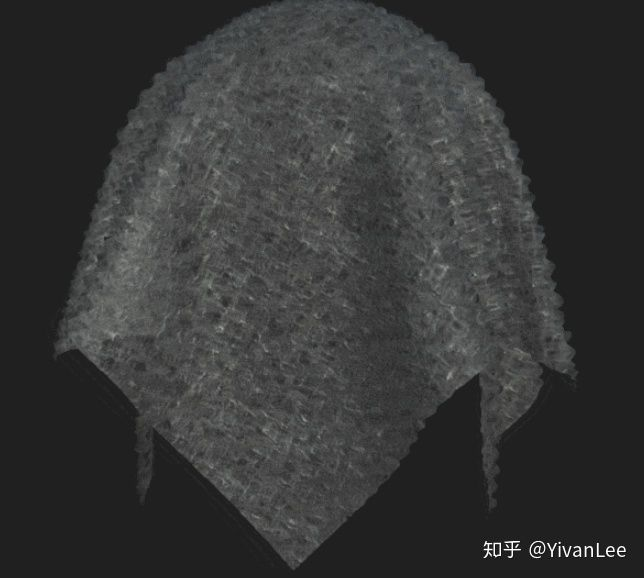

具体做法请看我上篇文章：<https://zhuanlan.zhihu.com/p/37601940>

------

剧中还有很多漂亮的材质，后面我们再慢慢实现他们  Enjoy It
