# 基于DF(Distance Field)的网格体材质混合

**距离场Distance Field基础**

距离场是代表静态网格体表面的 **有向距离场（Signed Distance Field）**，简单来说就是空间中的每个点都保存了一个到最近一个网格体表面的值，网格体外是正值，网格体内是负值。

举一些应用例子

1. 追踪光线中，计算网格体交叉的时候安全的排除掉空白空间。
2. 追踪光线时，通过距离参数可以计算出近似的椎体交叉点，让阴影和天空遮蔽更加柔和。

*在UE4中，DF是离线生成的，无法在运行时生成。

**基础设置**

DF主要在光影上的应用比较多，但是本文其实是利用了DF来做材质纹理的功能，所以基础设置中一些无关的部分我们暂且跳过，详细的设置可以看[官方文档](http://api.unrealengine.com/CHN/Engine/Rendering/LightingAndShadows/MeshDistanceFields/Reference/index.html#buildsettings)中的说明。

我们在**项目设置（Project Settings）——>渲染（Rendering)——>光照（Lighting）**中勾选**生成网格体距离场（Generate Mesh Distance Fields）**就能开启项目的DF功能。根据提示重启之后会看到生成网格体df的弹窗，生成之后我们场景的DF立体纹理就被创建出来了。

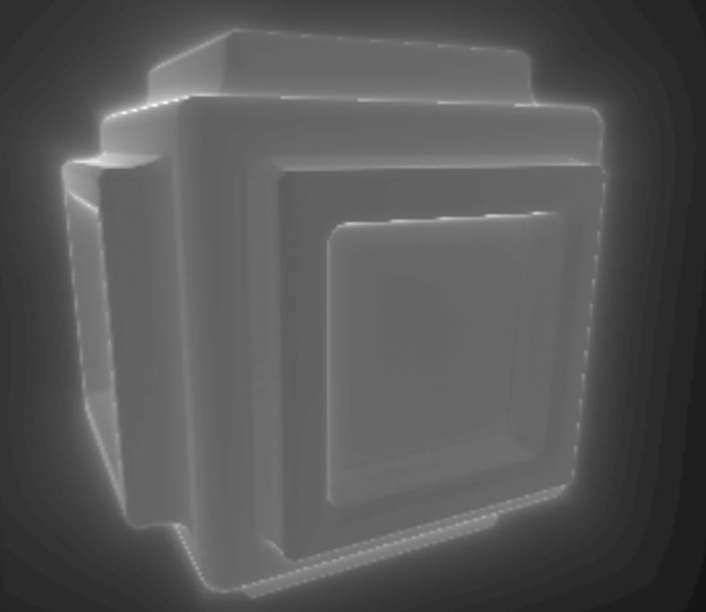

*此处有两个优化选项：

- **压缩网格体距离场（Compress Mesh Distance Fields）** 启用后，可以保存在内存中压缩的距离场体积纹理。这会减少距离场占用的内存量，但如果使用关卡流送，当流送切入这些关卡时，会在游戏中造成卡顿。
- **八位网格体距离场（Eight Bit Mesh Distance Fields）** 启用后，能够以8位定点格式代替默认的16位 浮点格式保存“距离场”体积纹理。它占用的内存量仅为之前的一半，却可以减少较大或较薄网格体中的某些失真。

**局限性

- ​    仅支持feature level 5平台（DX-11及更高版本）
- ​    仅支持静态网格体、实例静态网格体、植物叶子和地形（高度场）。
- ​    英特尔显卡上禁用了所有网格体距离场功能，因为HD 4000在RHICreateTexture3D调用中会挂起以分配大型图集。

**应用前检查**

选择**显示（Show）** > **可视化（Visualize）** > **网格体距离场（Mesh Distance Fields）**就可以看到场景内的df信息了。

如果看到的是一片漆黑的话，检查一下 **项目设置（Project Settings）——>渲染（Rendering)——>默认设置（Default Setting）**中的**Extend default Luminance range in Auto Exposure setting**是否在**未勾选**状态。

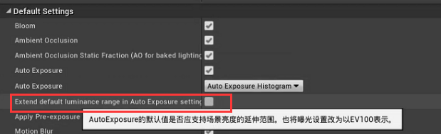

如果还是看不到距离场信息。可能是硬件或者dx版本不支持了。

**材质混合的设计思路**

**为什么要做这个功能？**

我看到的作者们和我一样大概都是被 星球大战:前线 中的这种混合效果惊艳到了。（真的不是项目美术直接提了这个需求）

从下面的对比中可以看到：左图中没有做任何混合，边缘很生硬。中间一张图做了材质分层，但是，可以看到明显的法线突变，依然差强人意。而右图中的DF混合给人的感觉就很舒服了。

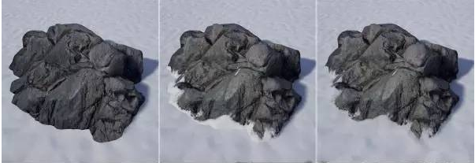

**怎么实现这个效果呢？**

首先这是个blend，所以基本框架依然是两种贴图的混合。关键的部分在于混合权重的计算，这时候距离场就派上用处了。

首先我们通过每一个像素上的DF值来lerp两个贴图，这样就能够在模型贴近其他表面的时候在相交的地方显现出第二种材质了。

我们还可以利用DF信息调整边缘像素的深度来让表面之间的穿插更加柔和。

最后是利用DF来让材质接缝处表面做一些凹陷或者突出。做出一种类似侵蚀的效果。

这样我们的模型就能和地形做一个很好的融合了。

**具体实现**

话不多说直接上图，首先是核心的df计算部分，关键就是这个**DistanceToNearestSurvace**,这就是我们获取到的DF强度。这里最右边输出的信息就可以去做贴图混合啦。

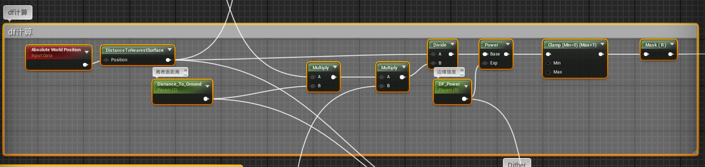

然后我们做一个像素深度偏移的柔和效果。

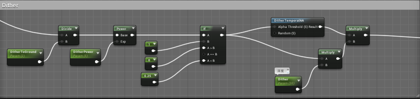

借鉴大佬的思路，我们这里加一个法线连续，让融合更加明显（<https://zhuanlan.zhihu.com/p/67101714>）

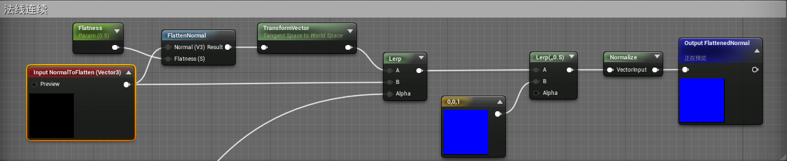

然后是我们提到的边缘displacement的一个侵蚀感的效果。

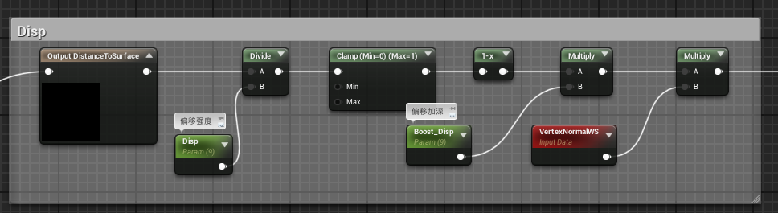

以上三个就是我们实现的主要部分啦，接下来我们想要进一步优化这个效果，我们不希望边缘的表现过于原话，这样显得不真实，所以我们给边缘加一个mask，让混合边缘更加逼真。当然，为了让mask在附着的时候能够不失真，我们这里需要triplanar一下。

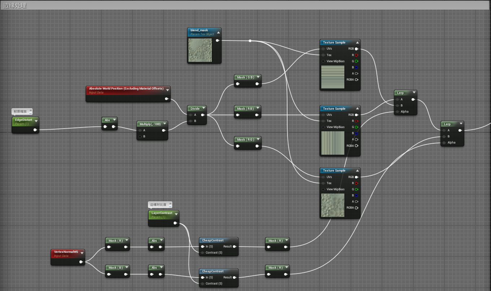

最后，还想到一个小小的优化效果，就是加一个风向，让侵蚀感能够在某一侧加重，另一侧减弱。这里其实就是一个类似菲涅尔的算法。我们把这个值融合到前面的参数里就可以达到我们想要的效果了。

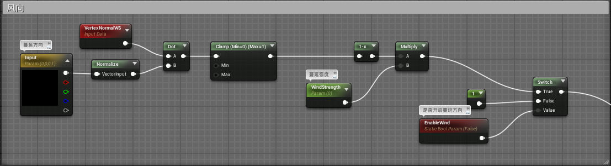

我把这些方法封装成了一个Material Function，下面是全家福照片

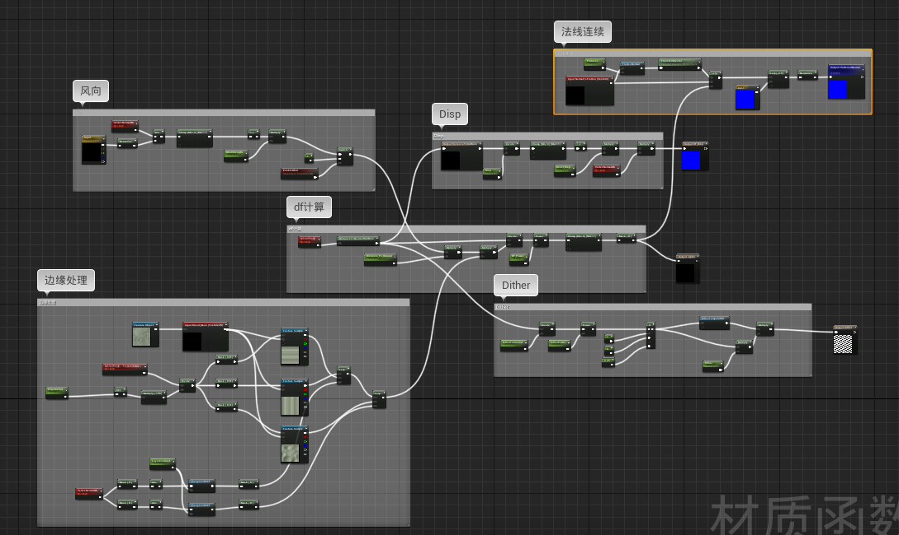

最后我们就可以举个栗子了！

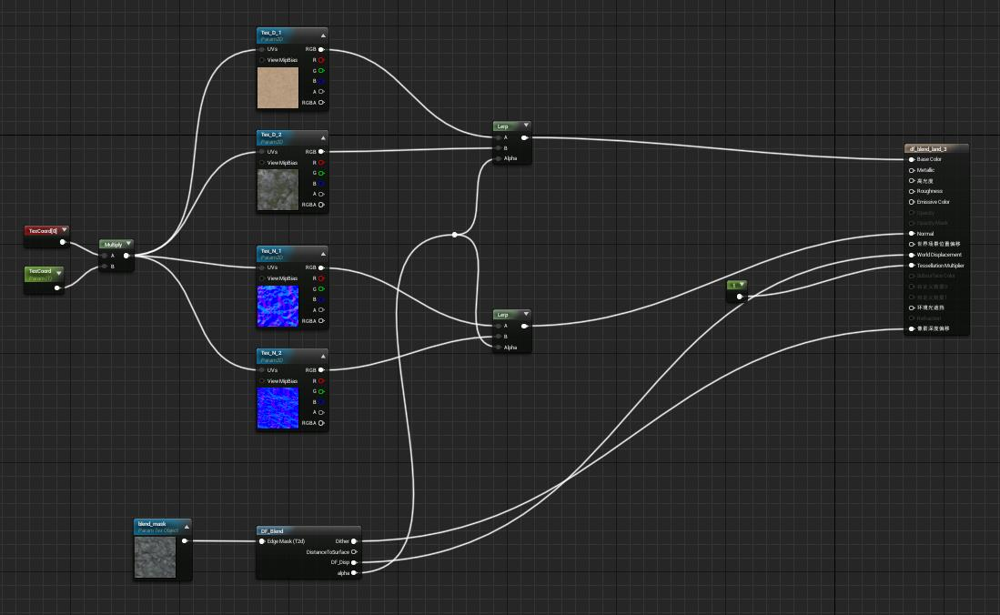

*这里要注意的是，要关闭网格体自己的DF，否则就不只是与地形的接缝处有混合效果了，模型本身凹凸的地方也会有混合效果。

测试场景里截个图（自己做的表现太糙了，还是借个图吧。侵删）

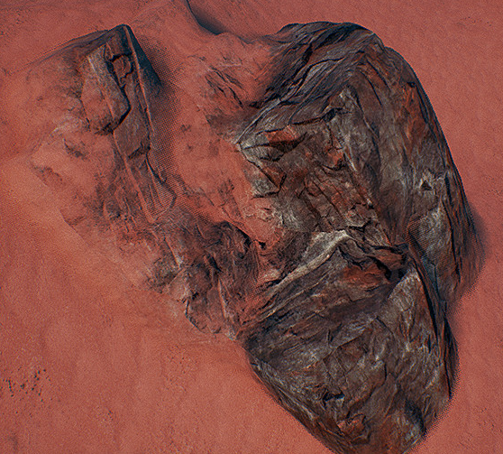

bingo！

ps：

第一次写技术文档呢，不知道有没有哪里不妥欢迎交流。

其实这个算法大部分是别人实现的。我这里只是一个小小的搬运工+小翻译。勿喷哦！

参考文档

<http://api.unrealengine.com/CHN/Engine/Rendering/LightingAndShadows/MeshDistanceFields/index.html>

<http://api.unrealengine.com/CHN/Engine/Rendering/LightingAndShadows/MeshDistanceFields/Reference/index.html#buildsettings>

嗯我主要是借了这位大佬的轮子，跪谢大佬，侵删。

<https://www.bilibili.com/video/av50268960?from=search&seid=11126542959666322696>

上面这位大佬主要是借了下面这位大佬的轮子。

<http://riteofilk.com/2017/07/29/blurring-the-edge-blending-meshes-with-terrain-in/>