# 虚幻4渲染编程(材质编辑器篇)【第八卷： BillBoardMaterialForInstance】

Unity和UE两大商业引擎已经有一定历史了，然而它们居然没有一套完整的Billboard解决方案，这让我感到非常神奇！！！所以打算写下完整的Billboard方案。


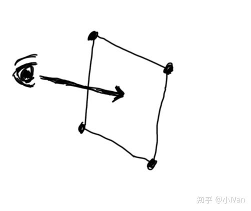图1

**本来是个很简单的事情!!!** 就是让面片时时刻刻面朝摄像机，但是因为引擎里各种各样的限制和因素，就把这件很简单的事情弄得很复杂。根据各种不同的情况吧Billboard的实现分为以下几类。

（1）在CPU里计算，在图元汇编阶段或者GamePlay层设置面片朝向。

（2）在Shader中计算其朝向。

（3）在使用DrawInstance的情况下在Shader中计算朝向。可以绘制大量Billboard。

下面就直接来讲目前最完善的的一种BillBoard Shader for Instancing。

------

## **【Billboard material for Instanced static mesh in Unreal Engine 4】**

首先需要制作一个面片，这个面片的LocalSpace首先就要正确。X轴与其垂直。


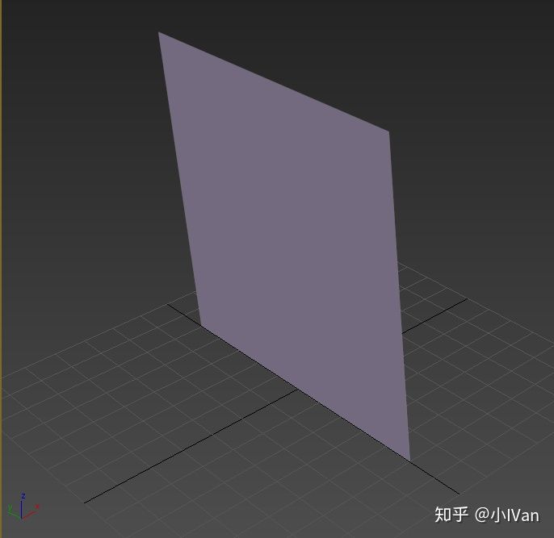图2

导入引擎和max保持一致。


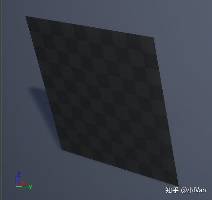图3

Billboard的面向摄像机这个计算其实在哪里做都可以，但是因为引擎的限制有些时候就不能随心所欲了。比如Unreal，我们在材质编辑器能触碰到VertexShader的地方就只有PositionOffset


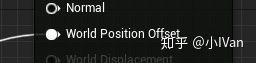

打开源码，会发现PositionOffset和WorldPosition是相加关系


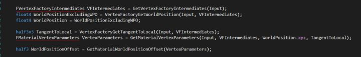

所以现在只能在WorldSpace计算BillBoard了。


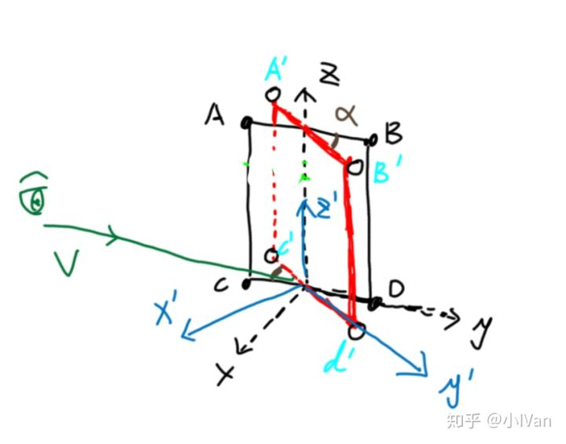图4


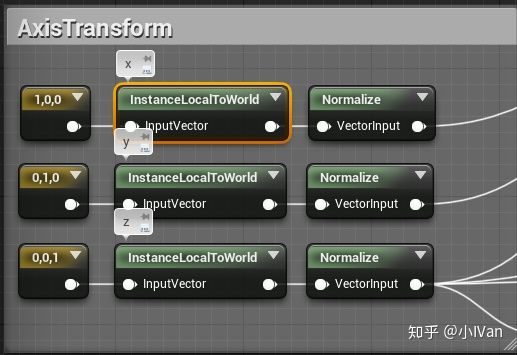

InstanceLocalToWorld代码，这里可以让引擎底层把Instance的Transform传上来。

```text
#if USE_INSTANCING
     return mul(InputVector,(MaterialFloat3x3)Parameters.InstanceLocalToWorld);
 #else 
     return mul(InputVector,GetLocalToWorld3x3());
 #endif
```

首先找到Instance的x，y，z在世界空间的朝向。如图4的黑色xyz坐标系所示。然后把顶点的世界空间坐标和轴点相减得到相对于轴点的向量


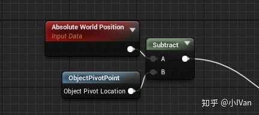

然后把这些向量映射到xyz轴上，得到点ABCD


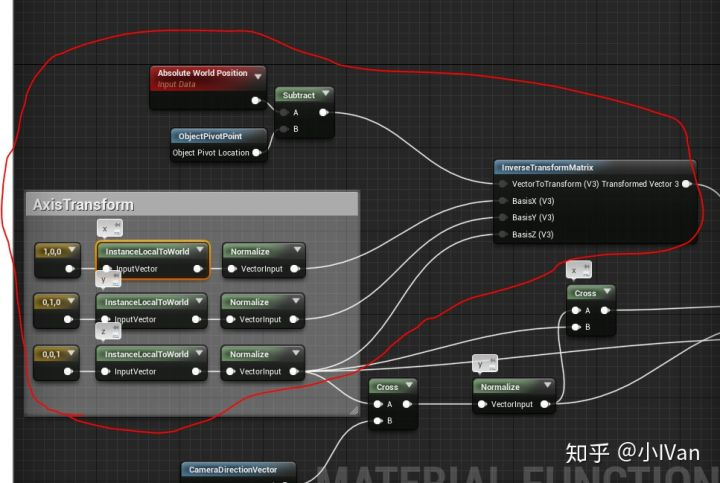

然后根据摄像机方向，转动XYZ使其于摄像机方向垂直得到x'y'z'


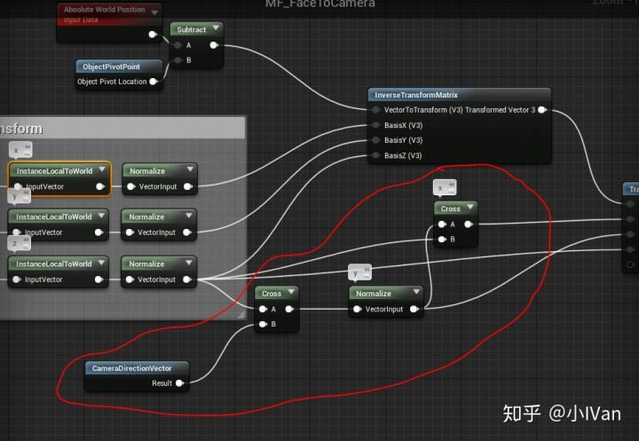

然后把ABCD映射到X'Y'Z'得到A'B'C'd'


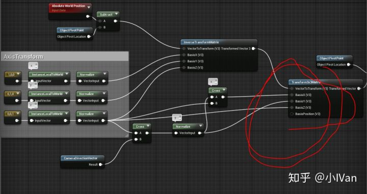

然后把相对于Pivot的A'B'C'd'变换到相对于世界原点坐标


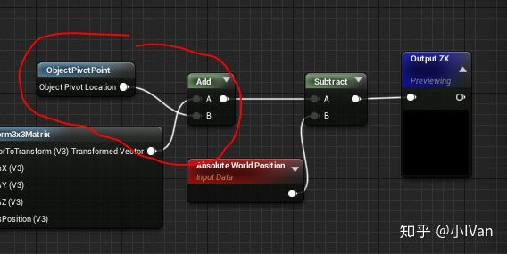

最后减去世界空间的绝对位置，和Shader底层的+=相抵消


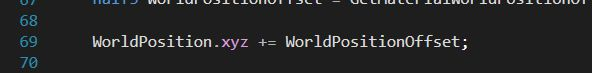

所以这里最后进入投影变换的顶点的坐标是原模型顶点的世界空间坐标向摄像机方向偏移后的顶点世界空间坐标。

于是就可以得到Instance的Billboard了。


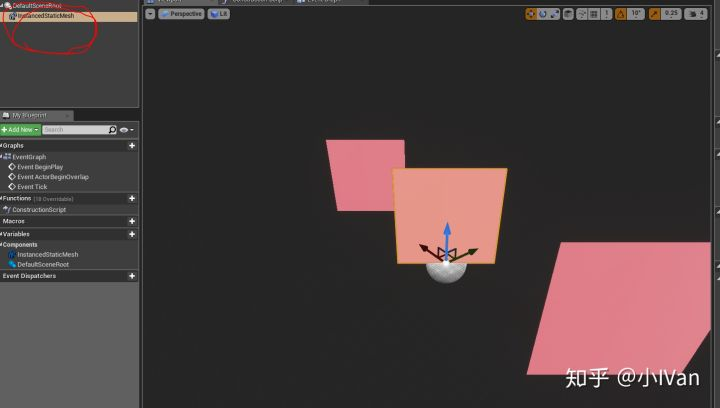


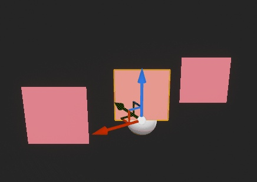

<svg x="16" y="18.5" class="GifPlayer-icon"></svg>

Instance的billboard允许我们在场景里画**几万个**。**这个方案对非Instance也同样适用。**

------

## **【Billboard material for instance in Unity】**

在Unity中的思路和Unreal有点不一样，因为Unity对底层的约束较小，所以可以直接在屏幕空间做BillBoard。大体思路是先把面片模型的所有顶点的LocalSpace归零，然后在CameraSpace把面片模型的顶点根据UV再重新展开。（不需要什么顶点色什么乱七八糟的骚操作）。


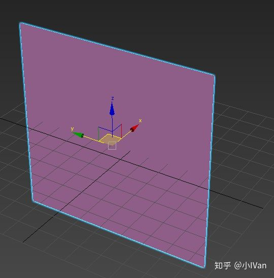

还是先做一个片，UV注意是平展开的。因为后面需要用UV来把面片在CameraSpace重新展开。


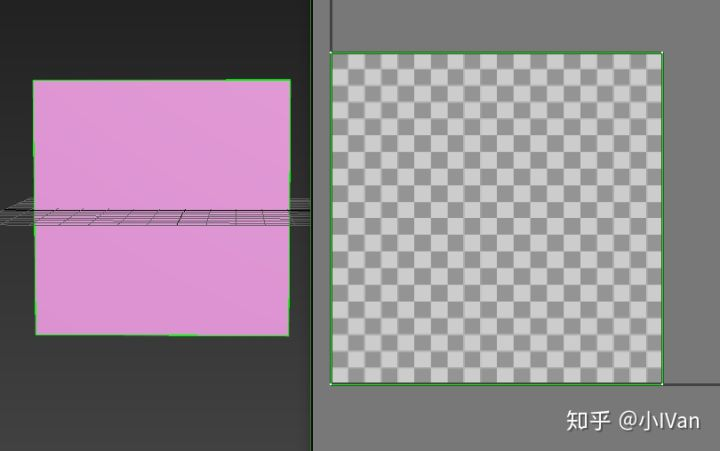

因为要使用Instacing所以需要给shader做一些设置


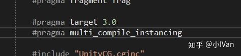


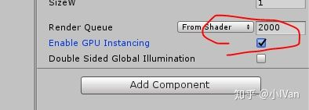

把顶点坐标归零


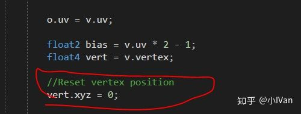

然后在摄像机空间用UV值把顶点重新展开


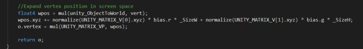

完整BillBoard代码如下：

```text
Shader "Unlit/S_BillBoard"
{
	Properties
	{
		_BaseColor("BaseColor", Color) = (1, 1, 1, 1)
		_SizeH("SizeH", Float) = 1
		_SizeW("SizeW", Float) = 1
	}
	SubShader
	{
		Tags { "RenderType"="Opaque" }
		LOD 100

		Pass
		{
			CGPROGRAM
			#pragma vertex vert
			#pragma fragment frag

			#pragma target 3.0
			#pragma multi_compile_instancing
			
			#include "UnityCG.cginc"

			struct appdata
			{
				float4 vertex : POSITION;
				float2 uv : TEXCOORD0;
				UNITY_VERTEX_INPUT_INSTANCE_ID
			};

			struct v2f
			{
				float2 uv : TEXCOORD0;
				float4 vertex : SV_POSITION;
				//If you want to access Instancing data in fragment shader
				//UNITY_VERTEX_INPUT_INSTANCE_ID
			};
	
			half4 _BaseColor;
			float _SizeW;
			float _SizeH;

			v2f vert (appdata v)
			{
				v2f o;

				UNITY_SETUP_INSTANCE_ID(v);
				//If you want to access Instancing data in fragment shader
				//UNITY_TRANSFER_INSTANCE_ID(v, o);

				o.uv = v.uv;

				float2 bias = v.uv * 2 - 1;
				float4 vert = v.vertex;
				
				//Reset vertex position
				vert.xyz = 0;

				//Expand vertex position in screen space
				float4 wpos = mul(unity_ObjectToWorld, vert);
				wpos.xyz += normalize(UNITY_MATRIX_V[0].xyz) * bias.r * _SizeW + normalize(UNITY_MATRIX_V[1].xyz) * bias.g * _SizeH;
				o.vertex = mul(UNITY_MATRIX_VP, wpos);

				return o;
			}
			
			fixed4 frag (v2f i) : SV_Target
			{
				half4 Output = half4(1, 1, 1, 1);

				Output = _BaseColor;

				return Output;
			}
			ENDCG
		}
	}
}
```


<svg x="16" y="18.5" class="GifPlayer-icon"></svg>

在FrameDebuger里可以看到


用这种办法可以绘制上万个Billboard，当然你不器用Instancing这种billboard方案依然适用。


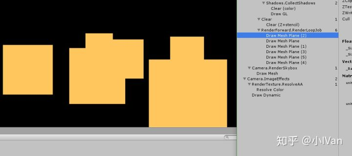

Enjoy it！
