# 虚幻4渲染编程(材质编辑器篇)【第五卷：布料,丝绸纱皮革棉】

现在的游戏对质感要求越来越高（我估计是硬件越来越好，可编程管线越来越来越完善）。游戏的画面已经越来越接近影视级，软光栅能被玩到这种水平也是令人惊叹。随着实时光线追踪追踪时代就要到来，这种差距只会越来越小，很多影视的制作思路和方法会被游戏借鉴甚至采用。

话题转回来，我们现在游戏仍然在大规模使用软光栅的办法，所以想要模拟出尽可能真实的游戏世界，我们还是需要很多trick。下面就一起来探索一下游戏世界中布料衣物的shading方法。本人只是个小技术美术，如有错误还请各路大神斧正。

------

## **【第一小节：棉&布】**

还是老规矩，先上效果

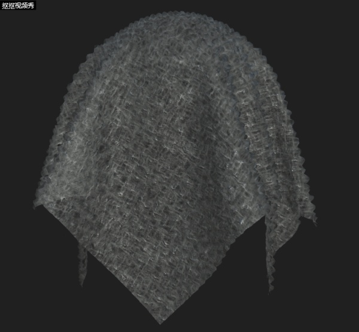

<svg x="16" y="18.5" class="GifPlayer-icon"></svg>

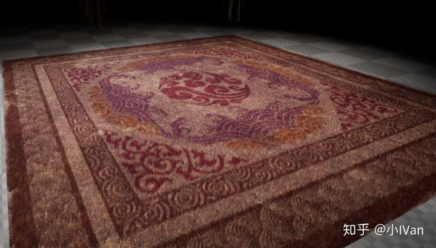

游戏里的这种短毛绒的感觉是有一套开发解决方案的，现在大致有四种方式来制作这种东西。**第一种是**：法线贴图+特殊高光着色+特殊AO。这种方式非常适合于手游，而且能出比较好的效果

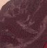手游巨省性能毛布

上面这个十分小的图就是这种方式做出来的，很抱歉这里我不能截完整衣服的效果图，但是就看这一小块应该能领悟到我说的意思了吧。因为手游的性能瓶颈，我们想要制造毛绒感只能在其他地方下功夫，高光计算部分就是个不错的地方。

**第二种是**：置换+法线+特殊高光着色。这个就是我最上面那个棉的制作方式。但是由于使用到了置换，所以性能嘛。。。。。不过端游是可以用的哈！

**第三种是**：视差+法线+特殊高光着色+特殊AO。这个效果就是我下面的那个毛毯。AO使用的是三维AO

**第四种是**：第四种就是Ray Casting的方式了嘛，这种方式巨费无比但是效果很好。

------

## **【第二小节：丝绸&纱】**

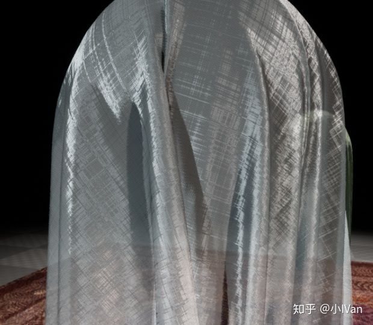

丝绸和纱的做法目前有两种方式：

**第一种**：半透+Tilling+特殊高光计算。这种方式效果其实比较好，但是就是透明乱序会令人十分头疼，解决办法就是我们自己再计算一次剔除。

剔除有几个办法，第一种是shader里强制剔除，还有一种是再渲染一个pass来剔除。这类文章很多啦我这里就不多说了。

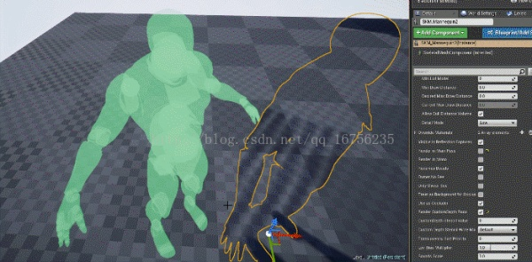

<svg x="16" y="18.5" class="GifPlayer-icon"></svg>

多渲染一个pass来剔除（上面那个水印是我CSDN博客地址，详细做法可以找这个地址去看我的博客）

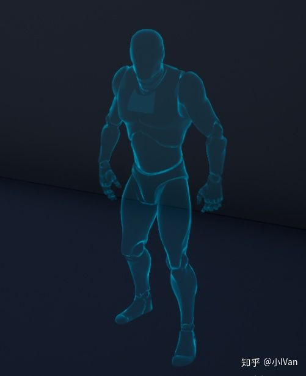shader里计算剔除

**第二种**：使用AlphaTest来做透明+特殊高光计算+特殊Diffuse计算，但是这种办法有个问题，就是边缘锐利，我们可以用alpha   dither的方式把锐利的边缘戳孔来解决，这种方式就不会有透明乱序的问题，我的第一幅图那个纱就是使用这种办法制作的。因为纱还有各向异性，所以需要使用各向异性高光。

最后就是Diffuse计算了。布料的Diffuse会有一点奇怪的地方，其实布料不应该使用默认PBR的那套diffuse计算方式的，所以虚幻提供了cloth特殊光照模型，请用那个光照模型来制作布料。那布料的diffuse和普通PBR的diffuse到底有什么区别呢。请看下面的图

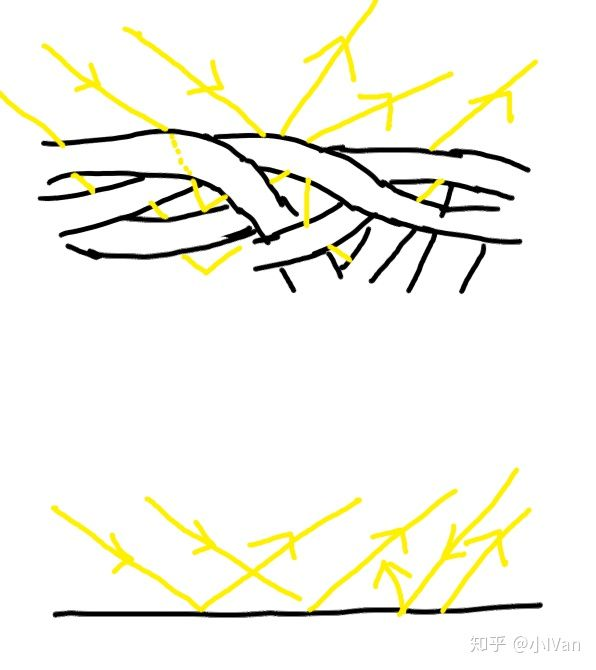

可以看到，纺织物的漫反射方式和普通物体的区别还是很大的。最终宏观表现就是，纺织物的暗部不会很黑。

------

## **【第三小节：皮革】**

其实皮革是所有布料里面最好做的，使用标准PBR模型就能轻易制作出来。皮革是介于金属和非金属之间的可以理解为半导体，主要使用细节法线tilling来使其与塑料产生区别。

以上就是布料的理论啦。Enjoy it！

------

上面说了这么多理论，其实并没有什么用哈。很多专栏或者博客也许会在上面就戛然而止然后发表文章了，然而真的并没有什么用。本专栏一向是本着一定要亲手做出来才行的宗旨。所以下面就来实现它们吧：

**首先先来说说布料**：

虚幻非常贴心地已经帮我们实现了布料材质模型了，其实如果没有，我们使用前几章介绍的知识也能自己做一个这种光照模型，当然它这里有了的话我们就直接用了。

我这里简单做了个材质球，这个其实就已经满足了我们对布料漫反射的要求了，再来上一次布料应该的漫反射模型：

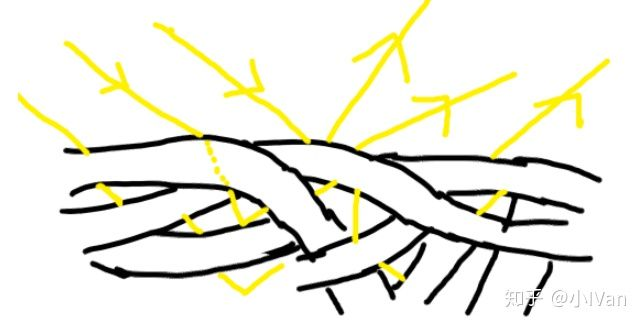

所以这里就不难理解为啥会有一个fuzzy color了。我们再来看看这个光照模型的代码

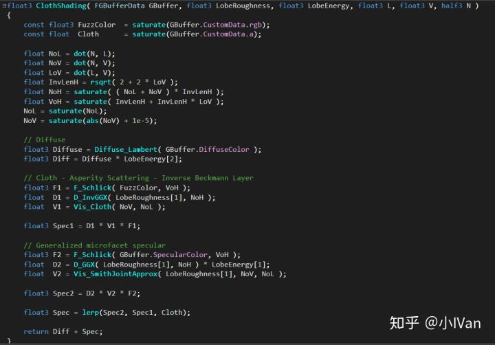

是不是一切就很清晰了呢，其实就是想模拟布料的那种特殊的漫反射。

首先光照模型对了之后，后面再加上法线再加上细节tilling，对布料效果的模拟还是十分棒的。

**其次就是丝绸了**

丝绸的尴尬点就在于如果你使用半透明的混合方式来制作，我们不得不解决透明乱序。

透明乱序的解决方法：

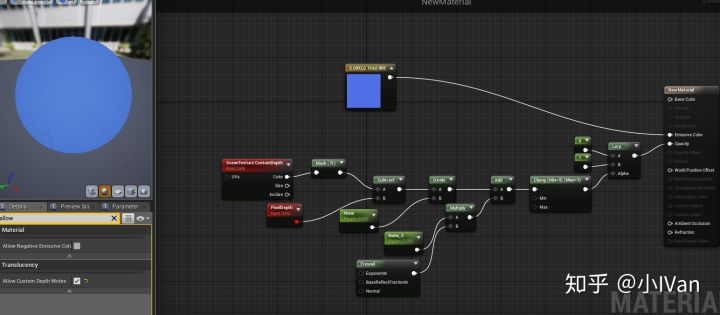

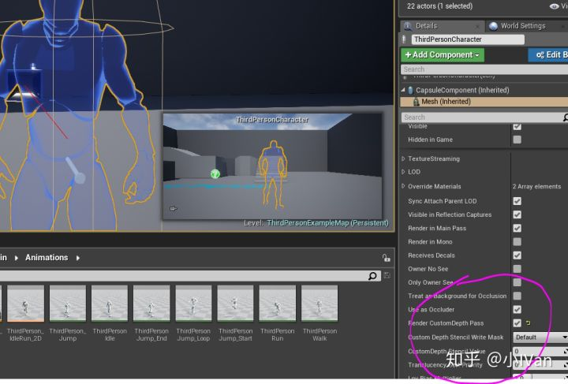

在shader种比较深度然后来手动剔除。

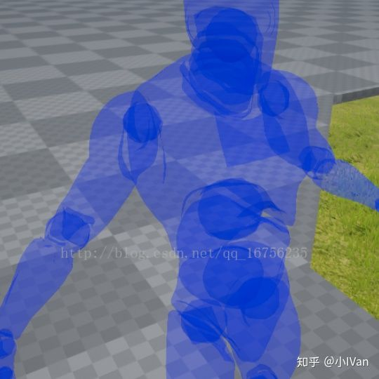水印是我CSDN博客，可以去我原博客看我的这篇文章

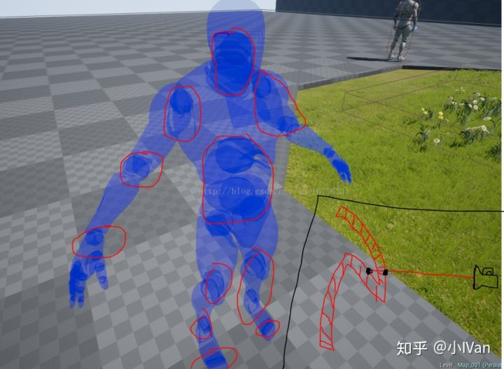

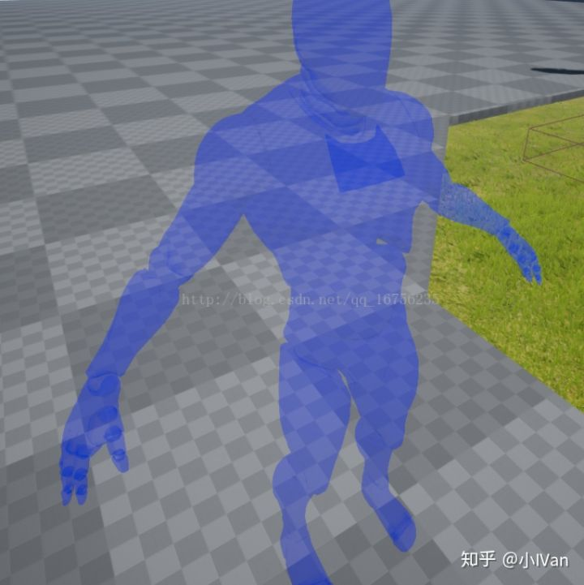

但是这种手动剔除其实是剔除不干净的，仔细看手指的地方。再渲染一个pass的方式能完美解决但是消耗感觉过高了。所以干脆使用其他办法。

虚幻官方的头发给了我们一个新思路，使用alphatest然后再锐利的边缘扎孔。

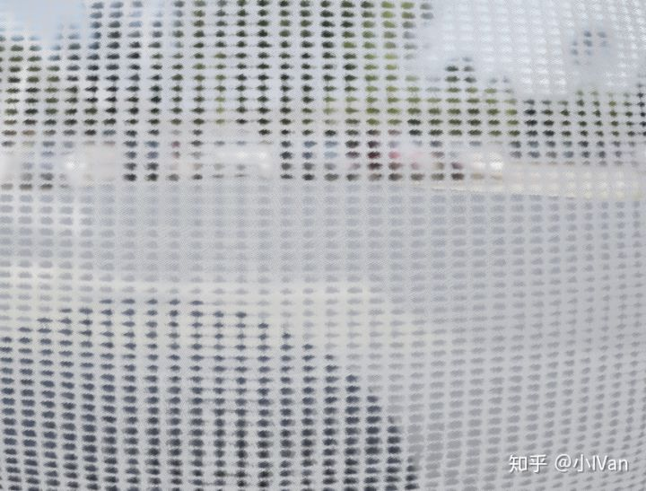

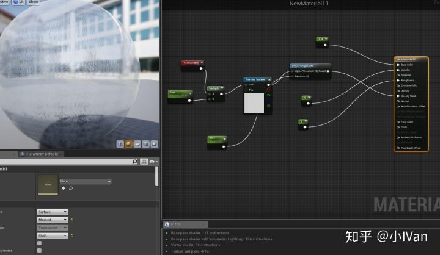

感觉这种方式也挺不错呢，虽然渐变过渡永远比不上alpha blend，这个就看自己的权衡了吧。
