# 虚幻4渲染编程(材质编辑器篇)【第二卷：自定义光照模型】

还是老规矩先上效果吧：

读过我前面一些博客的朋友对虚幻4的渲染流程有了一些大致的了解之后，那么我们现在可以开始着手开始修改虚幻4引擎了·。我们有些时候需要实现某些效果，就需要动手自己改引擎了。这是customnode或者是纯material无法做到的。有些人可能就要反驳了，“我纯用材质编辑器也能实现卡通材质啊”。但是无法忽略的一点是：在材质编辑器里制作的卡通材质无法接受光影。这时候有些人就想出了骚操作，用蓝图自己实现一个光源，渲染一张depthmap的RT然后传到material里去。这种方法其实过于麻烦，这相当于你抛弃掉了虚幻4的光照系统。这是得不偿失的。

阅读下面的内容你需要具备一下知识：

（1）C++

（2）对虚幻引擎及其渲染模块有一定了解，如果不了解可以先读读我之前的一些文章。

（3）HLSL

那么下面就以这个卡通材质为例，让我们一步步来定制自己的渲染管线。来看一下虚幻的GBuffer的数据有哪些吧：

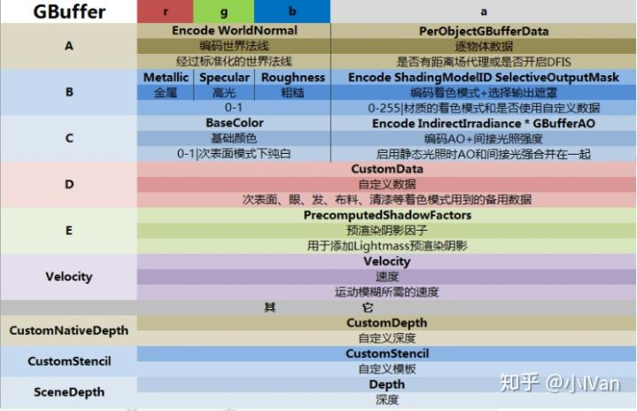

首先你得下载好一个源码版引擎，我使用的是4.19版引擎。也许在未来引擎会做更新，单应该变化不大。然后打开如下的文件：

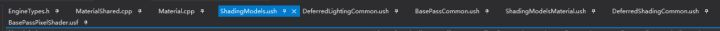

首先找到EngineTypes.h，找到EMaterialSamplerType这个枚举。这个枚举将会控制材质编辑器里的那个下展栏。然后我们加入我们的枚举成员MSM_MyShadingModel       UMETA(DisplayName="MyShadingModel")编译引擎后你将会看到如下的样子：

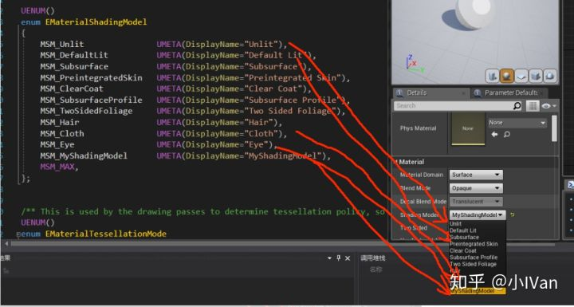

你将能在材质编辑器里找到自己的ShadingModel材质的枚举类型。

这一步只是让编辑器有了一个切换枚举，并不会让材质编辑的UI发生什么变化，比如material的节点上多出几个pin，禁用几个pin或者别的什么变化。现在我们需要激活几个pin接口，让我们能把变量“连上去”

接下来找到Material.cpp 我们找到bool UMaterial::IsPropertyActive(EMaterialProperty InProperty)这个函数。然后做如下图所示修改

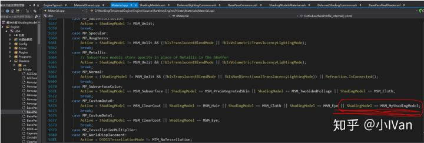

这样就能让材质编辑器在我们切换shadingmodel枚举的时候，实时增加一个CustomData的pin接口给我们用啦。

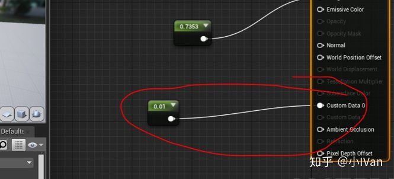

有了这个东西之后，我们还要让材质编辑器在切换瞬间告诉我们的shader：“我们应该用我们自定义的shader啦”。如何告诉shader应该跑我们MSM_MyShadingModel的shading分支逻辑呢？答案是使用宏。

打开MaterialShared.cpp，找到FMaterial::SetupMaterialEnvironment(

 EShaderPlatform Platform,

 const FUniformExpressionSet& InUniformExpressionSet,

 FShaderCompilerEnvironment& OutEnvironment

 )

这个函数我们做如下修改：添加如下代码

case MSM_MyShadingModel: OutEnvironment.SetDefine(TEXT("MATERIAL_SHADINGMODEL_MyShadingModel"),  TEXT("1")); break;  

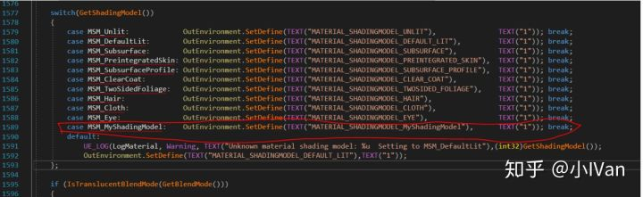

这个字符串会被压进shader里，成为宏。

做完这些我们就可以编译引擎了。可能会等待半小时左右。

编译好引擎之后，我们开始对shader层进行修改。

首先打开DefferedShadingCommon.ush文件，找到下图所示区域并做如下修改：在#define  SHADINGMODELID_EYE     9后面添加#define SHADINGMODELID_MyShadingModel  10  并且把SHADINGMODELID_NUM后的数字改为11

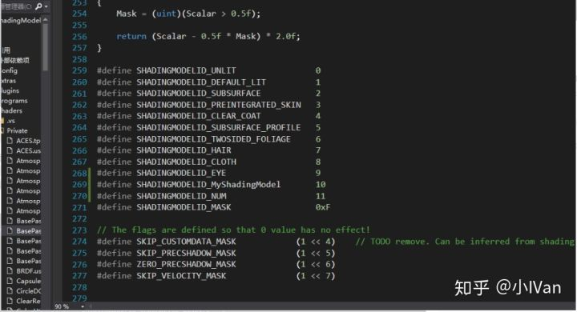

这个宏将作为我们shader跑哪根线路的判断依据。还是在这个文件里，翻到DefferedShadingCommon.ush的最底部，找到float3  GetShadingModelColor(uint ShadingModelID)函数，在case SHADINGMODELID_EYE:  return float3(0.3f, 1.0f, 1.0f);后面添加 case SHADINGMODELID_MyShadingModel:  return float3(0.4f, 0.0f, 0.8f);//紫色

如下图所示：

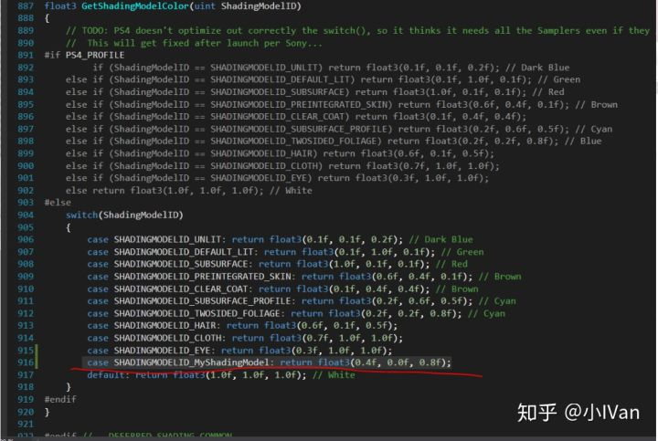

做完这个修改以后，我们就能在编辑器的ShadingModle预览模式下看到如下效果：

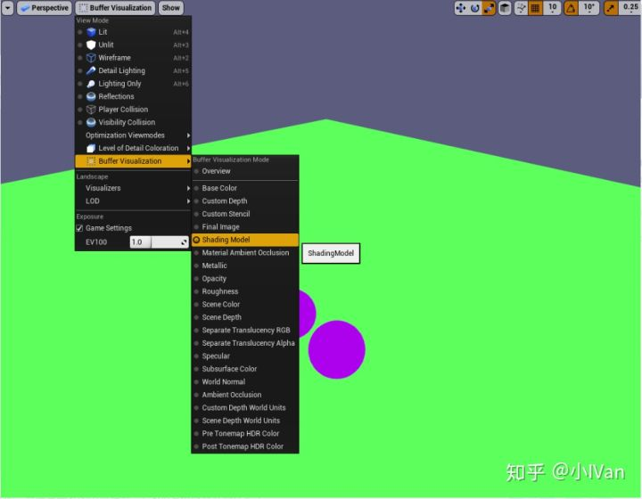

你能看到我们定义的颜色已经能在debug模式下看到了。说明一切顺利！！

下一步来到ShadingModelsMaterial.ush 找到void SetGBufferForShadingModel函数。我们在这个函数的最后面做如下修改：

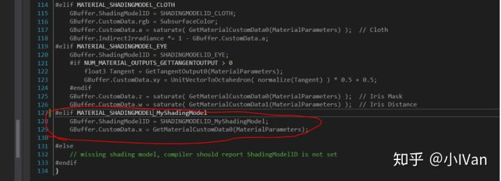

这里的MATERIAL_SHADINGMODEL_MyShadingModel是从c++层那里塞进来的，然后把这个ShadingModle的ID保存到GBuffer里作为后面管线使用的数据。这一步是给DefferedShadingCommon.ush使用的。

完成之后我们需要打开BassPassCommon.ush，打开CustomData的写入权限

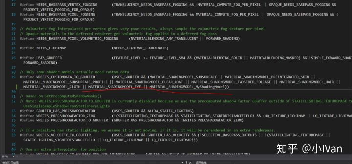

这一步的目的是当我们的shadingmode为MyShadingModel的时候，将CustomData的信息写入GBuffer。

然后来打DefferdLightingCommon.ush 找到GetDynamicLighting函数，我们对这个函数做如下修改：

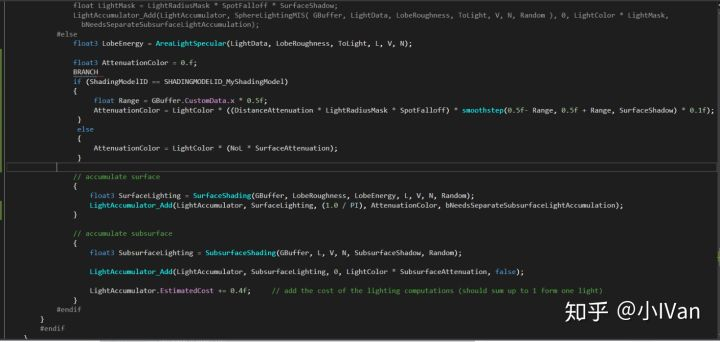

当然做了这个修改之后我们还需要对SurfaceShading函数再做修改：

打开ShadingModels.ush做如下修改：

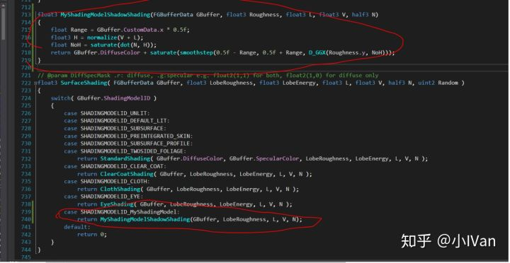

完成这一步之后，我们还要对透明模式下的代码进行修改。打开BasePassPixelShader做如下修改：

完成这一步之后，我们还要对透明模式下的代码进行修改。打开BasePassPixelShader做如下修改：

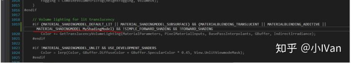

那么就完成了对引擎shader的定制啦！

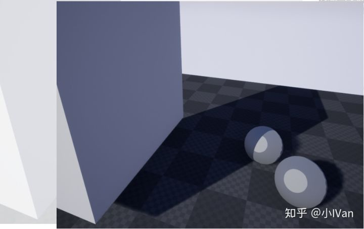

引擎的定制对项目还是很重要的，官方其实考虑更多的是通用和兼容，但是这往往就导致一点：用虚幻4做出来的游戏都长得差不多。不知道大家有没有发现这点。其实我对这点感受还是很明显的，现在的demo或者视频瞟一眼就知道是不是虚幻做的，因为大家的shader效果是一样的。这就会导致大量的同质化作品的出现，无法使你的项目脱颖而出。比如超龙珠斗士Z，那么精美的卡通渲染，肯定对引擎进行了大量的定制。

有没有发现，我们自己激活的哪个CustomData0 这个接口的名字在你切换成Eye的时候，它会变成其他名字。鉴于强烈的强迫症，看这个CustomData0真的很不舒服，所以我们就来自己定义一下材质输入接口的名字吧：

我们在Engine/Source/Editor/UnrealEd/Private/MaterialGraph.cpp的529行左右找到GetCustomDataPinName函数，然后做如下修改

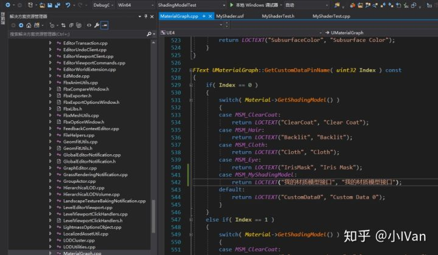

编译后你将会看到：

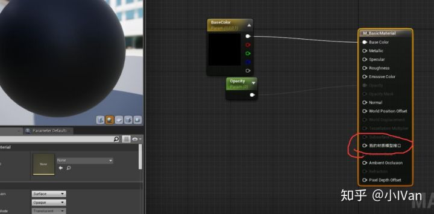

------

总得来说自己在延迟管线建个shadingmodle我们要做的事情如下：

（1）修改材质编辑器，不管是修改ShadingModel的Enum还是材质编辑器输出接口都是为了在材质编辑器层加入我们的光照模型和所需要的资源。

（2）在SetupMaterialEnvironment函数中把Shad ing ModelID设置进去，在Shader层也要对应修改让BasePass的时候把MaterialID渲染进Buffer中供LightingPass使用

（3）增加LightingPass的BRDF处理函数。

下面是我在4.22实现的简单卡通渲染，支持多光源。

<iframe allowfullscreen="" src="https://www.zhihu.com/video/1109121113321381888?autoplay=false&amp;useMSE=" frameborder="0"></iframe>

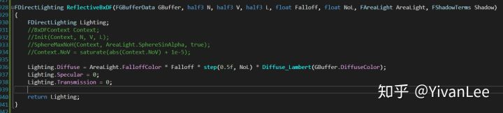

只要思路清晰不管引擎版本再怎么迭代都能轻松被我们驾驭

------

Enjoy it！！！
