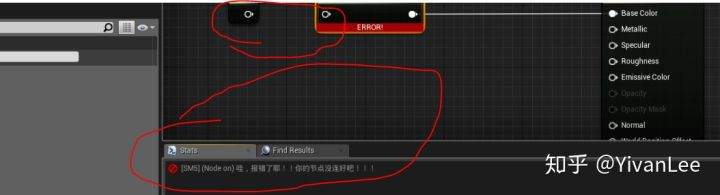
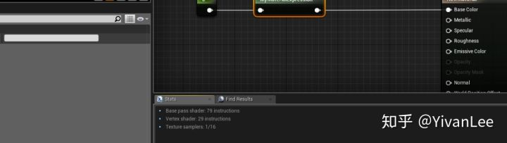
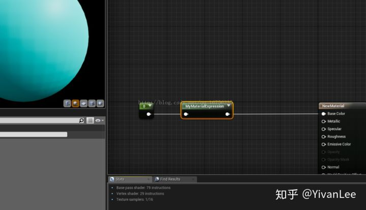
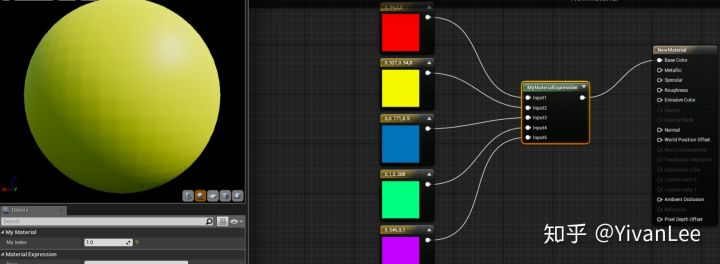

# 虚幻4渲染编程(材质编辑器篇)【第十一卷： 自定义材质节点】


## **简介：**

大部分情况下我们可以使用CustomNode或者Material Function完成对材质节点的封装，方便开发各种上层功能，但是有时候我们需要让材质编辑器和引擎底层强耦合的时候或者开发了什么新的材质编辑器功能的时候，我们就需要开发拓展材质编辑器的节点了。

------

最直观的，打开虚幻编辑器，我们随便连一个vector3到basecolor上，点编译按钮，我们就得到了一个材质。但是千万不要以为我们眼前看到东西就是shader。从本质上来说，我们眼前的材质节点只是包含一串HLSL代码的容器。

你可以打开引擎代码，找到如下目录（Source/Runtime/Engine/Classes/Material）就能看到引擎里所有材质节点的代码。找到HLSLMaterialTranslator，就会发现，这些节点里面保存的FString，里面加的就是HLSL代码。当我们在材质编辑器里面把线练好后，点下编译，材质节点就会依次执行，把里面的HLSl代码字符串抽出来，加到ShaderMap里，最后就得到了所谓的shader（简单粗暴）。下面就是Floor的HLSLTranslator里面的翻译代码，把节点翻译成HLSL代码

```text
virtual int32 Floor(int32 X) override
	{
		if(X == INDEX_NONE)
		{
			return INDEX_NONE;
		}
 
		if(GetParameterUniformExpression(X))
		{
			return AddUniformExpression(new FMaterialUniformExpressionFloor(GetParameterUniformExpression(X)),GetParameterType(X),TEXT("floor(%s)"),*GetParameterCode(X));
		}
		else
		{
			return AddCodeChunk(GetParameterType(X),TEXT("floor(%s)"),*GetParameterCode(X));
		}
	}
```

整理一下执行顺序。首先我们在编辑器连好材质，这些材质节点都会有调用HLSLTranslator的与这个材质节点相称的HLSLTranslator的代码，比如floor节点就会调用HLSLTranslator里的“virtual  int32 Floor(int32  X)”这个函数。HLSLTranslator再把这个函数里的HLSL代码字符串加到Shadermap里（加进去还有其他函数调用，并不是HLSLTRaslator直接做的这个操作，不过它是这个操作的发起者。）完成了shadermap的事情之后就是交给引擎的其他类去编译顶点着色器啦，像素着色器啦。。。后面的过程不作讨论了。大概的过程就是这样。

下面我就实现了一个自己的材质节点。首先创建一个MyMaterialExpression类，派生自UMaterialExpression。

下面是.h文件

```text
#pragma once
 
#include "CoreMinimal.h"
#include "UObject/ObjectMacros.h"
#include "MaterialExpressionIO.h"
#include "Materials/MaterialExpression.h"
#include "MyMaterialExpression.generated.h"
 
/**
 * 
 */
UCLASS(MinimalAPI, collapsecategories, hidecategories = Object)
class UMyMaterialExpression : public UMaterialExpression
{
	
	GENERATED_UCLASS_BODY()
 
	//材质节点的输入
	UPROPERTY()
	FExpressionInput Input;
 
 
	
#if WITH_EDITOR
	//调用HLSLTranlator的函数来翻译HLSL代码
	virtual int32 Compile(class FMaterialCompiler* Compiler, int32 OutputIndex) override;
	//材质节点的名字
	virtual void GetCaption(TArray<FString>& OutCaptions) const override;
#endif
	
};
```

Compile函数会调用HLSL翻译代码，把FString翻译成HLSL代码并把它赛道shadermap里。getCaption代码是这个材质节点在材质编辑器里的名字。FExpressionInput是材质节点的输入接口，可以定义多个入口，数量随意。

下面是.cpp

```text
#include "MyMaterialExpression.h"
#include "EditorSupportDelegates.h"
#include "MaterialCompiler.h"
#if WITH_EDITOR
#include "MaterialGraph/MaterialGraphNode_Comment.h"
#include "MaterialGraph/MaterialGraphNode.h"
#include "Framework/Notifications/NotificationManager.h"
#include "Widgets/Notifications/SNotificationList.h"
#endif //WITH_EDITOR
#define LOCTEXT_NAMESPACE "MaterialExpression"
UMyMaterialExpression::UMyMaterialExpression(const FObjectInitializer& ObjectInitializer)
	: Super(ObjectInitializer)
{
	// Structure to hold one-time initialization
	struct FConstructorStatics
	{
		FText NAME_Math;
		FConstructorStatics()
			: NAME_Math(LOCTEXT("MyMaterial", "MyMaterial"))
		{
		}
	};
	static FConstructorStatics ConstructorStatics;
 
#if WITH_EDITORONLY_DATA
	MenuCategories.Add(ConstructorStatics.NAME_Math);
#endif
}
 
 
#if WITH_EDITOR
int32 UMyMaterialExpression::Compile(FMaterialCompiler* Compiler, int32 OutputIndex)
{
	int32 Result = INDEX_NONE;
 
	if (!Input.GetTracedInput().Expression)
	{
		// 当输入口没有连线时报错，这个输出可以在材质编辑器里看到
		Result = Compiler->Errorf(TEXT("哇，报错了耶！！你的节点没连好吧！！！"));
	}
	else
	{
		//我只做了一个简单的返回一个颜色
		Result = Compiler->Constant3(0, 1, 1);
	}
 
	return Result;
}
 
void UMyMaterialExpression::GetCaption(TArray<FString>& OutCaptions) const
{
	OutCaptions.Add(TEXT("MyMaterialExpression"));
}
#endif // WITH_EDITOR
```

下面是效果图：报错信息是可以自己定义的，虽然不建议敲中文进代码里，这里只是做个示范。










大功告成啦。

我们可以再把节点做复杂一点，不知道有没有人发现虚幻的材质编辑器没有很多个接口的switch，我们可以自己做一个

.h

```text
#pragma once
 
#include "CoreMinimal.h"
#include "UObject/ObjectMacros.h"
#include "MaterialExpressionIO.h"
#include "Materials/MaterialExpression.h"
#include "MyMaterialExpression.generated.h"
 
/**
 * 
 */
UCLASS(MinimalAPI, collapsecategories, hidecategories = Object)
class UMyMaterialExpression : public UMaterialExpression
{
	
	GENERATED_UCLASS_BODY()
 
	//材质节点的输入
	UPROPERTY()
	FExpressionInput Input1;
	UPROPERTY()
	FExpressionInput Input2;
	UPROPERTY()
	FExpressionInput Input3;
	UPROPERTY()
	FExpressionInput Input4;
	UPROPERTY()
	FExpressionInput Input5;
	
	UPROPERTY(EditAnywhere, Category = "MyMaterial")
	float myIndex;
 
#if WITH_EDITOR
	//调用HLSLTranlator的函数来翻译HLSL代码
	virtual int32 Compile(class FMaterialCompiler* Compiler, int32 OutputIndex) override;
	//材质节点的名字
	virtual void GetCaption(TArray<FString>& OutCaptions) const override;
#endif
	
};
```

cpp

```text
#include "MyMaterialExpression.h"
#include "EditorSupportDelegates.h"
#include "MaterialCompiler.h"
#if WITH_EDITOR
#include "MaterialGraph/MaterialGraphNode_Comment.h"
#include "MaterialGraph/MaterialGraphNode.h"
#include "Framework/Notifications/NotificationManager.h"
#include "Widgets/Notifications/SNotificationList.h"
#endif //WITH_EDITOR
#define LOCTEXT_NAMESPACE "MaterialExpression"
UMyMaterialExpression::UMyMaterialExpression(const FObjectInitializer& ObjectInitializer)
	: Super(ObjectInitializer)
{
	// Structure to hold one-time initialization
	struct FConstructorStatics
	{
		FText NAME_Math;
		FConstructorStatics()
			: NAME_Math(LOCTEXT("MyMaterial", "MyMaterial"))
		{
		}
	};
	static FConstructorStatics ConstructorStatics;
 
	myIndex = 0.0f;
 
#if WITH_EDITORONLY_DATA
	MenuCategories.Add(ConstructorStatics.NAME_Math);
#endif
}
 
 
#if WITH_EDITOR
int32 UMyMaterialExpression::Compile(FMaterialCompiler* Compiler, int32 OutputIndex)
{
	int32 Result = INDEX_NONE;
 
	if (!Input1.GetTracedInput().Expression)
	{
		// 当输入口没有连线时报错，这个输出可以在材质编辑器里看到
		return Compiler->Errorf(TEXT("哇，报错了耶！！你的节点第一根线没连好！！！"));
	}
	if (!Input2.GetTracedInput().Expression)
	{
		// 当输入口没有连线时报错，这个输出可以在材质编辑器里看到
		return Compiler->Errorf(TEXT("哇，报错了耶！！你的节点第二根线没连好！！！"));
	}
	if (!Input3.GetTracedInput().Expression)
	{
		// 当输入口没有连线时报错，这个输出可以在材质编辑器里看到
		return Compiler->Errorf(TEXT("哇，报错了耶！！你的节点第三根线没连好！！！"));
	}
	if (!Input4.GetTracedInput().Expression)
	{
		// 当输入口没有连线时报错，这个输出可以在材质编辑器里看到
		return Compiler->Errorf(TEXT("哇，报错了耶！！你的节点第四根线没连好！！！"));
	}
	if (!Input5.GetTracedInput().Expression)
	{
		// 当输入口没有连线时报错，这个输出可以在材质编辑器里看到
		return Compiler->Errorf(TEXT("哇，报错了耶！！你的节点第五根线没连好！！！"));
	}
	
	int32 newIndex = myIndex;
 
	if (newIndex>5||newIndex<0)
	{
		return Compiler->Errorf(TEXT("index指数不对，应该在0到5之间"));
	}
 
	switch (newIndex)
	{
	case 0:
		return Input1.Compile(Compiler);
	case 1:
		return Input2.Compile(Compiler);
	case 2:
		return Input3.Compile(Compiler);
	case 3:
		return Input4.Compile(Compiler);
	case 4:
		return Input5.Compile(Compiler);
	}
	
	return Result;
}
 
void UMyMaterialExpression::GetCaption(TArray<FString>& OutCaptions) const
{
	OutCaptions.Add(TEXT("MyMaterialExpression"));
}
```

最后的结果：




Enjoy it ！
