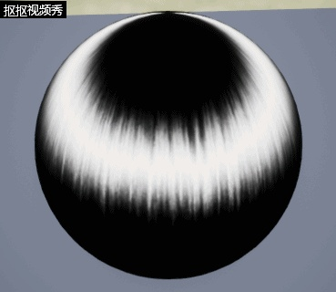
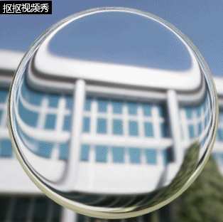
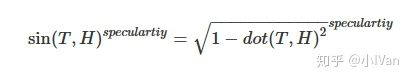
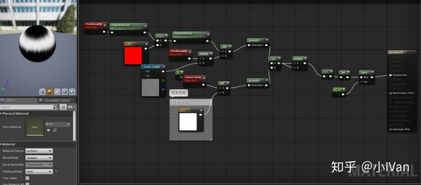
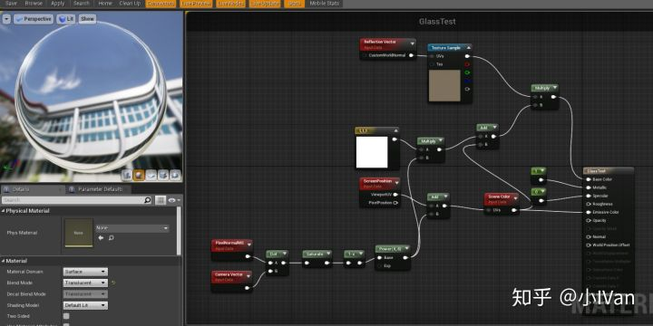

# 虚幻4渲染编程(材质编辑器篇)【第六卷：各向异性材质&玻璃材质】

先上效果吧：

各向异性材质

<svg x="16" y="18.5" class="GifPlayer-icon"></svg>

玻璃材质

<svg x="16" y="18.5" class="GifPlayer-icon"></svg>

材质编辑器篇的很多效果都非常简单，可以不改源码就能快速实现了。

------

## **各向异性：**

我们之前的高光会使用dot（N，H）来计算，不管你是PBR还是什么计算模型。各向异性的话是使用切线和H来计算，而不是N和H来计算。

------

## **玻璃材质：**

其实玻璃材质可以分为以下几部分：

（1）漫反射

玻璃可以认为它没有漫反射，或者非常微弱。

（2）透射

因为玻璃是透明的，后面的光从玻璃里面透射出来会把玻璃本身的颜色透射出来。

（3）折射

光穿过玻璃会产生偏移

（4）反射

其中漫反射和反射部分的可以用PBR的计算方式来解决，下面来解决折射。因为我们使用的是光栅化渲染所以我们如果用光栅化思想来理解折射的话，一句话概括为（对背景图扰动）。

于是我们可以得到下面的材质：

光栅化渲染可以用一句话概括：“把三维物体透射到二维屏幕上然后对其着色”。

材质编辑器篇主要是用材质编辑器做一些简单好玩的效果为主。如果有观点错误还请各路大神斧正。

Enjoy it！
