# 虚幻4渲染编程(材质编辑器篇)【第九卷：Image Based Lighting】


## 简介：

说到ImageBasedLighting第一个反应就是PBR中从Cubemap中采集数据然后把这些数据使用在环境反射中，但是实际上我们还有很多别的用法。

------

## 【1】在Cubemap中储存直接光信息。

我们搭建一个场景，里面只放灯光，如下图所示：


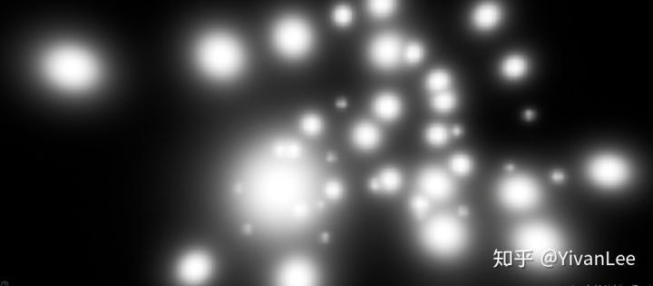

然后我们在引擎里抓一张Cubemap


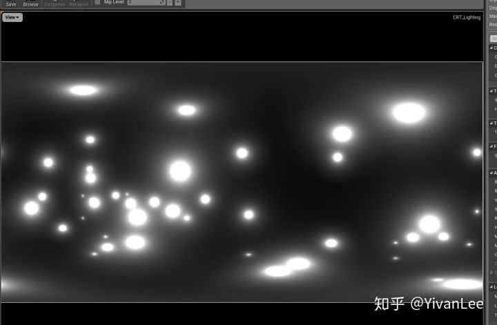

这样就能把海量的灯光烘焙在CubeMap里


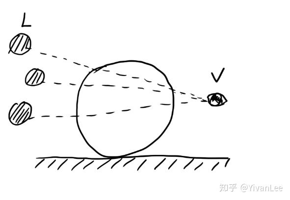

然后我们就能在材质里得到这些灯光透过一个物体的值了


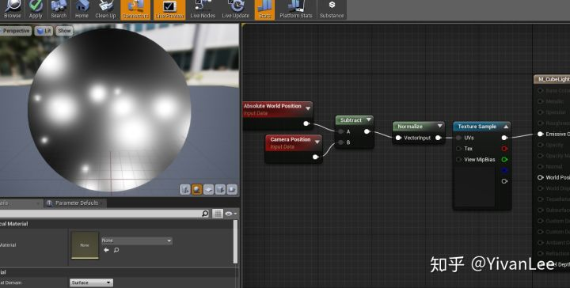

如果是使用reflection向量得到的就是光线反弹的值


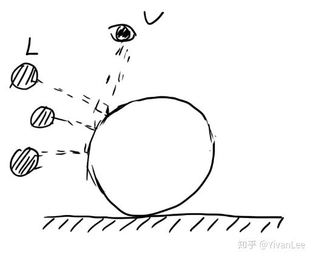

有了这个方法我们就可以制作水晶，玉石，宝石等材质了，还能在只有一个pass的情况下制作出假的透明折射效果。

## 【1】One Pass Transparent refraction


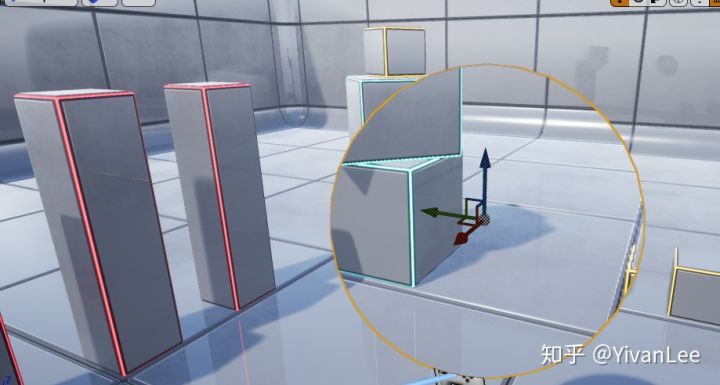


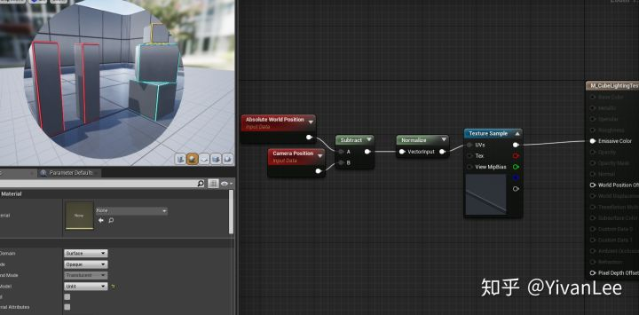

可以看到，一个pass就搞定了透明折射效果，这样我们就能制作透明水晶了，即使在手机上也能使用这种非常省的方法实现复杂效果


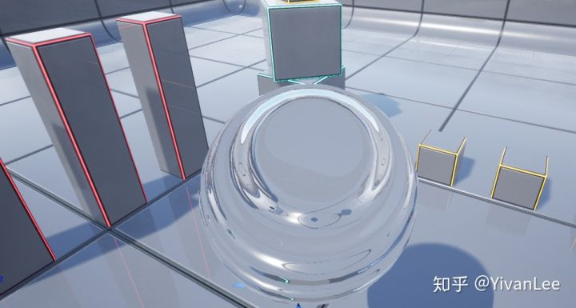

我的这里做得比较简单，直接法线和视角法向dot然后sin求一个折射角而且还是近似的，有兴趣的读者可以自己推一下公式，我这里只是快速演示一下，我就不把我的正确公式搞出来了。

------

目前我能想到的Cubemap有以下几个用处：

（1）烘焙环境光，用于计算环境光反射。


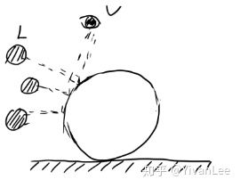

（2）烘焙一个空间中的大量点光源，我们其实还可以存各个灯光的位置方向等等。不一定是存强度，甚至可以是GI。把第一次反弹的GI存在第一张cubemap里把第二次反弹的GI值存第二张Cubemap里，比较疯狂的做法。


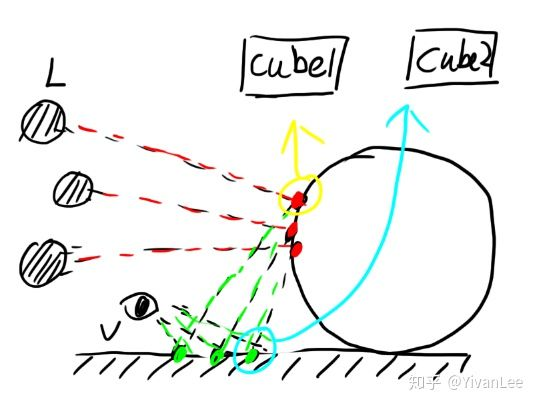

（3）为一个单独的物件制作一个pass的透明折射效果，手机游戏需求比较多。


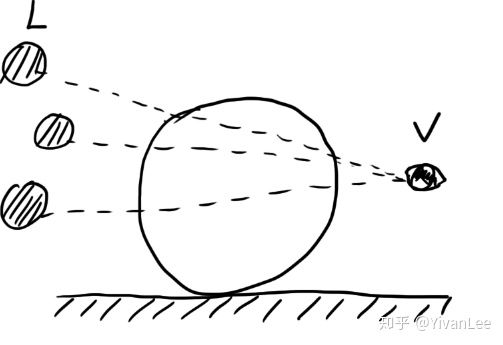

（4）烘焙一个点的光线因为几何因素产生的不同数据，比如光在一点的色散。


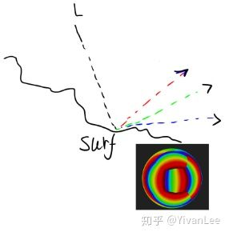

------

除了Cubemap，也可以使用2DTexture来做Cube映射，用经纬展开的方式采一张2Dtexture，可以把一张2DTexture当Cubemap使用。使用这种方式可以制作UV运动的Cubemap映射，缺点是有畸变。


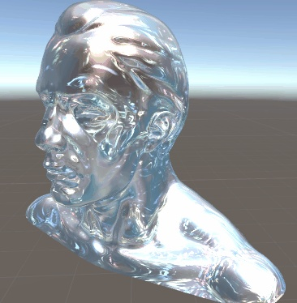

<svg x="16" y="18.5" class="GifPlayer-icon"></svg>

经纬度采样代码如下：

```text
//2D Cube sample
float3 CDir = R;
float2 center = float2(_StartsRotCenterX, _StartsRotCenterY);
float2 Pos = 1 / PI * float2(atan2(-CDir.z, -1 * CDir.x), 2 * asin(CDir.y));
Pos = 0.5 * Pos + float2(0.5, 0.5);
half3 Cube2DTexColor = tex2D(_StartsTex, Pos).rgb;
```


Enjoy it。
