# (原) MaterialEditor部- UmateriaEditor中  Node编译过程和使用（1）

2019年3月14日

16:27

 

@author: 白袍小道

转载说明原处

插件同步在GITHUB: DaoZhang_XDZ

 

最后YY需求（手滑）

1、在理清楚基础套路和细节后，自定义纹理资源，并加入到现有UE材质系统

2、制作一个简单的快速预览纹理在材质中的表现

3、输入的纹理支持GIF、RAW 、或自定义格式，统一转换到Utexture.并放入节点

 

效果：

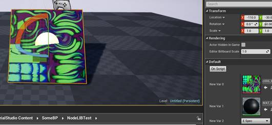

## 一、源码和API

1、Factory:

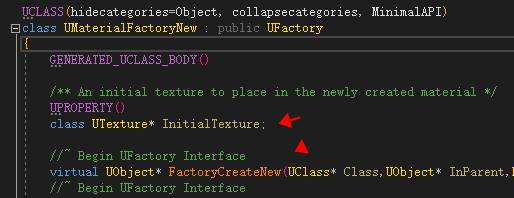

 

2、FExpressionOutput 和 FExpressionInput 

（Unreal的 Anim ，MAT  设计上 采用了倒着获取结果，结果的产生[理解为Node]和递归。并将Node作为存放逻辑的部分，这个方式可以运用到其他地方如任务系统，导航点等）

 

   `UObject*   UMaterialFactoryNew::FactoryCreateNew(UClass* Class,UObject* InParent,FName   Name,EObjectFlags Flags,UObject* Context,FFeedbackContext* Warn)`   `{`   `UMaterial*   NewMaterial = NewObject<UMaterial>(InParent, Class, Name, Flags);`   ` `   `if (   InitialTexture != nullptr )`   `{`   `// An   initial texture was specified, add it and assign it to the BaseColor`   `UMaterialExpressionTextureSample``* TextureSampler =   NewObject<UMaterialExpressionTextureSample>(NewMaterial);`   `{`   `//``这里是编辑记录`   `TextureSampler->MaterialExpressionEditorX   = -250;`   `TextureSampler->Texture   = InitialTexture;`   `//``纹理类型`   `TextureSampler->AutoSetSampleType();`   `}`   ` `   `NewMaterial->Expressions.Add(TextureSampler);`   ` `   `//FExpressionInput/OutPut   ``是表达式逻辑节点输入的抽象`   `FExpressionOutput&   Output = TextureSampler->GetOutputs()[0];`   `FExpressionInput&   Input = (TextureSampler->SamplerType == SAMPLERTYPE_Normal)`   `?   (FExpressionInput&)NewMaterial->Normal`   `:   (FExpressionInput&)NewMaterial->BaseColor;`   ` `   `Input.Expression   = TextureSampler;`   `Input.Mask   = Output.Mask;`   `Input.MaskR   = Output.MaskR;`   `Input.MaskG   = Output.MaskG;`   `Input.MaskB   = Output.MaskB;`   `Input.MaskA   = Output.MaskA;`   ` `   `NewMaterial->PostEditChange();`   `}`   ` `   `return   NewMaterial;`   `}`   

 

## 二、模拟实现：

   UFUNCTION(BlueprintCallable,Category=   "MaterialStudio|MatNodeLib")   static UMaterial* QuickPreviewTextureOnMaterialBNode(const   UTexture* pTexture,const UMaterial* pMaterial);   

 

其中：

Color ，Scale，Vector


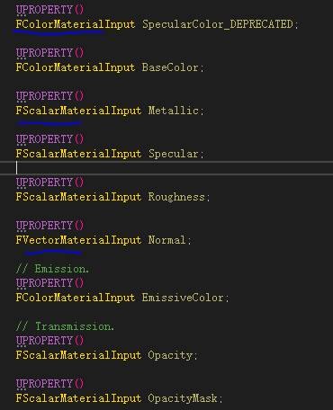

 

第一节Over

 

 

# (原) MaterialEditor部- UmateriaEditor中  Node编译过程和使用（2）

2019年3月15日

10:42

 

@白袍小道

转载说明原处

插件同步在GITHUB: DaoZhang_XDZ

 

## 需求：

1、梳理FexpressionInput和Output的编译和链接（套路和逻辑目的）

2、如何做到节点编译的驱动

3、增加自定义节点(非CustomNode)

 

## 说明：

提交编辑：

### 一、UMaterial::PostEditChangeProperty

### 二、FMaterialCompile 、FHLSLMaterialTranslator、material（materialInterface\Resouces)

 

**首先是一个熟悉的入口**

####  

#### *FMaterial::BeginCompileShaderMap*

   bool   FMaterial::BeginCompileShaderMap(   const FMaterialShaderMapId& ShaderMapId,    EShaderPlatform Platform,    TRefCountPtr<FMaterialShaderMap>&   OutShaderMap,    bool bApplyCompletedShaderMapForRendering)   

 

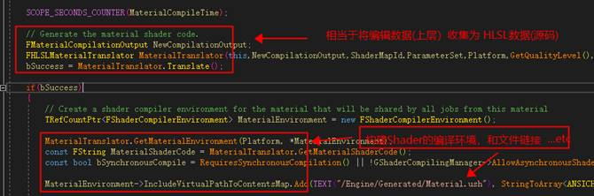

####  

#### *FHLSLMaterialTranslator*

最后的输入收集

 


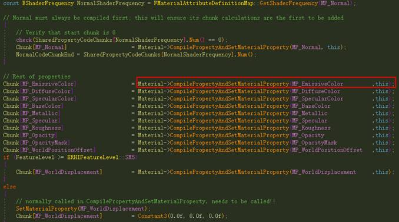

##  

#### *CompileProperty*

这里才是更具Property进入属性编译部分

   `Ret =   MaterialInterface->CompileProperty(Compiler,   MP_EmissiveColor);`   

 

#### *UMaterialInterface::CompileProperty*

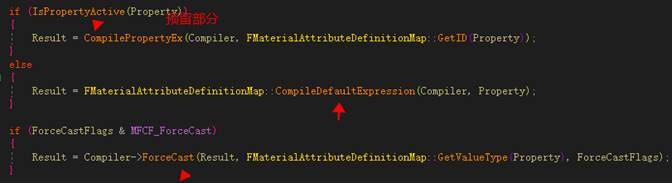

 

按照不同的输入属性表达式，进入CompileWith

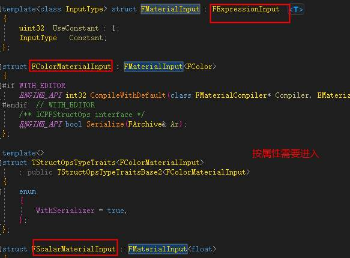

##  

#### *FExpressionInput::Compile* 

这里就到了真正节点逻辑

 

#### *说明总结图*


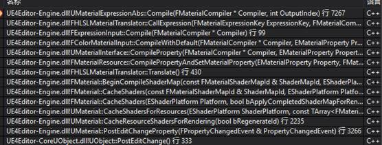

节点的编译：（树形组合）

这种方式类似于 整个大的编译，从结果反向到输入，层层递归。（每个节点都会加入自身的编译逻辑，并链接上下节点）

### 


# (原) MaterialEditor部- UmateriaEditor中  Node编译过程和使用（3）

2019年3月15日

15:06

 

@author: 白袍小道

转载说明原处，爱护劳动

插件同步在GITHUB: DaoZhang_XDZ

 

 

## 说明

1、本篇是接着-----(原) MaterialEditor部- UmateriaEditor中  Node编译过程和使用（2）

2、通过上一篇小的已经知道MaterialExpression的基础过程。下面进入到加入自定义

MaterialExpression的案例（为了方便这里就直接用ABS，Gif/RAWTexture为两个案例，GIF放到单独)

3、让自定义的MaterialExpression在MaterialEditor中的GraphyEditor中包含和使用。

 

效果

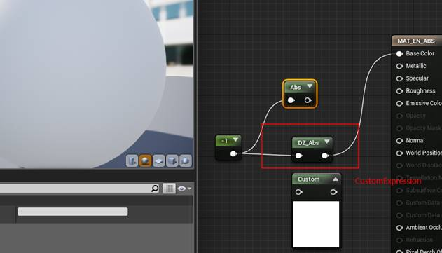

 

 

## 案例过程

### 一、基础

先来看一个关键地方

#### *MaterialExpressionClasses::InitMaterialExpressionClasses()*

（在这里会讲所有的UCLASS进行过滤获取MaterialExpression，并按照规则放入不同

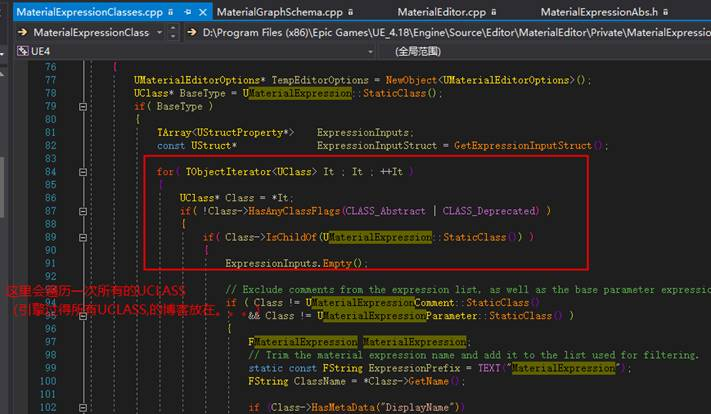

 

 

（附图，UCLASS的初始管理部分）

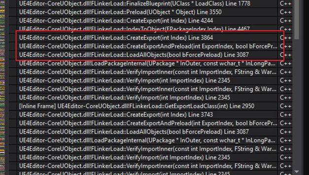

 

### 二、书写相关代码

下面代码就是ABS的迁移而已，有需要可以自己按规则书写

#### *1**、**UDZMatExpressionAbs*

a\  继承于UMaterialExpression

b\ 三个函数:构造，Compile，Caption

 

##### Construct

   `struct   FConstructorStatics`   `{`   `FText   NAME_Math;`   `FConstructorStatics()`   `:   NAME_Math(LOCTEXT("Math", "Math"))`   `{`   `}`   `};`   `static   FConstructorStatics ConstructorStatics;`   ` `   `#if   WITH_EDITORONLY_DATA`   `MenuCategories.Add(ConstructorStatics.NAME_Math);`   `#endif`   

```
 
 
```

##### Compile

关于Compile(案例中直接用了原来ABS的代码）

留心的话会知道在前一篇提到了FHLSLMaterialTranslator，其中FHLSLMaterialTranslator也是继承了MaterialCompile.完成实现。（当然也可以重新书写一个MaterialCompile)

 

##### FHLSLMaterialTranslator::ABS

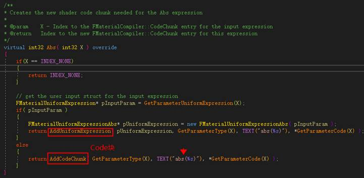

 

| ` `   `#if   WITH_EDITOR`   `int32   UDZMatExpressionAbs::Compile(FMaterialCompiler * Compiler, int32 OutputIndex)`   `{`   `int32   Result = INDEX_NONE;`   ` `   `if (!Input.GetTracedInput().Expression)`   `{`   `// an   input expression must exist`   `Result   = Compiler->Errorf(TEXT("Missing DZAbs input"));`   `}`   `else`   `{`   `//   evaluate the input expression first and use that as`   `// the   parameter for the Abs expression`   `//  Compiler``中已经实现ABS部分，一般基础都是包含了的，你也可以自由组合`   `//   ``如果新完全新加（跳入shader-HLSL篇）`   `Result = Compiler->Abs(Input.Compile(Compiler));`   `}`   ` `   `return   Result;`   `}`   `#endif` |      |
| ------------------------------------------------------------ | ---- |
| ` `   `void   UDZMatExpressionAbs::GetCaption(TArray<FString>& OutCaptions) const`   `{`   `OutCaptions``.Add(TEXT("DZ_Abs"));`   `}` |      |

 
