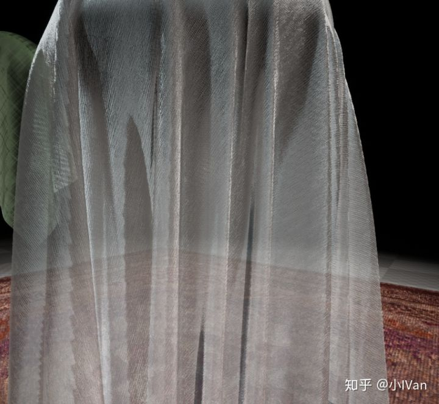
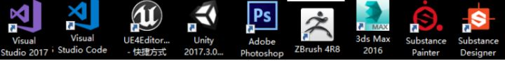
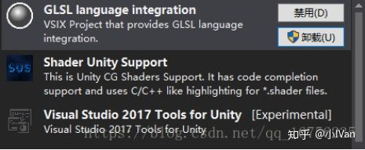
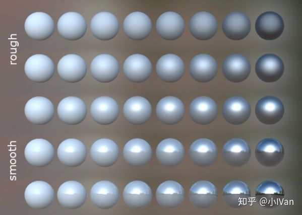
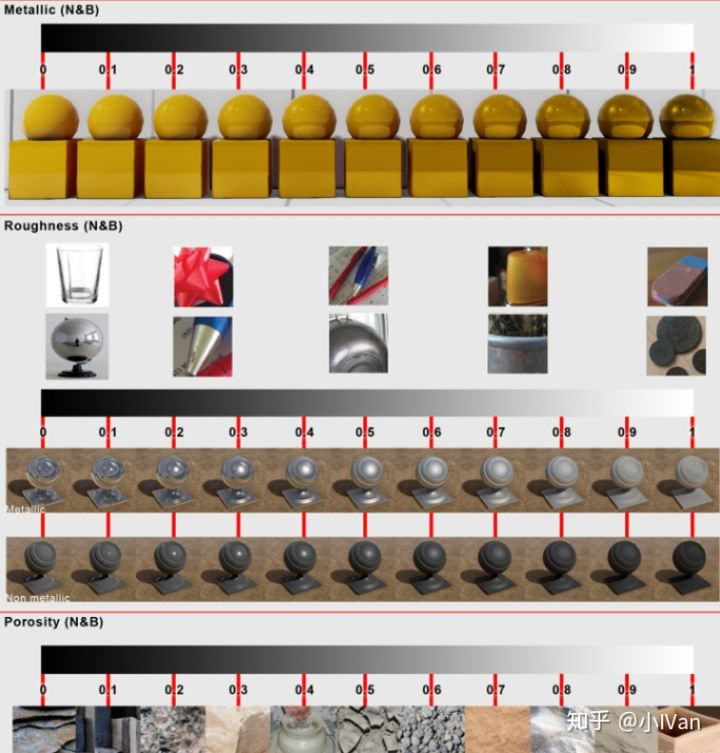

# 虚幻4渲染编程(材质编辑器篇)【第三卷：正式准备开始材质开发】

前面两章我们已经完成了对工具的研究，下面我们久正式开始启程啦！后面的内容可能就比较美术了。

还是老规矩上个效果先：

（高级纱材质）

不过这一节我们不会立刻开始开发材质，我们先探究一下材质的基础。（上面的可不是alpha blend，没有透明乱序和高光混合损失！）。上面那个效果我会在后面介绍布料的章节连同：丝绸，纱，布，皮，麻，镭射重金属，棉等一起介绍。

​    现在的次世代游戏，材质表现已经成为游戏中非常重要的一部分，本专栏将一步步简述游戏开发中的材质开发。

​     首先要普及一个概念，到底什么叫“材质”。是一个材质球吗？是一个shader吗？是几张贴图吗。我理解的材质准确地说应该叫  shading。请不要把它翻译为“着色”，我认为这是不对的。在计算机里shading包含了很多事情。一个材质的表现需要模型，贴图，shader，灯光，后期等一系列配合。

在我们开始我们的材质开发之旅之前我们需要具备以下知识：

（1）C++和C#

（2）DirectX+HLSL或者OpenGL+GLSL等，还需要直到一些图形学知识。

（3）3DMax或Maya，Photoshop，SusbtancePainter和SubstanceDesigner，Zbrush等DDC软件

（4）引擎的话需要掌握Unity和UnrealEngine4

  后面的文章将默认阅读者已经掌握或至少入门以上知识。如果你还没有掌握上述的知识，也不必担心，可以大家一起来讨论学习自然就会了。或者现在先去看以下上述罗列的基础知识。也可以去看看我以前的一些文章，希望有所帮助

下面是我们主要需要用到的软件：

其中VS的插件需要以下：

UnrealVS这个插件是虚幻引擎自带的，在引擎目录的extra下即可找到，其余的插件除VSAssist外全部都能在VS的拓展里找到。

VSCode需要以下插件：

也是直接在VSCode的拓展更新里就能找到。编写max脚本会非常方便。如果你喜欢用maya请跳过这一步。

​      下面我们来对材质作进一步探索。现在的游戏工业大致有两个走向，一个是真实向如刺客信条起源等。一个是风格化向，如塞尔达，二之国等。特别是欧美等大作，都是喜欢写实风格，但是其实不管是那种方向，其实都感觉你中有我我中有你。就拿神秘海域4来说，其实他写实的背后也做了不少风格化处理，这一点很好论证，你拿刺客信条的画面和神秘海域的做对比就能轻易发现，各个写实类游戏都有自己的风格化的东西在里面。一提到写实我们会常常听到PBR。所以到底什么是PBR呢？

​      PBR顾名思义，基于物理的渲染，可以更加准确地表示光和表面的相互作用。PBR其实是一套渲染方案，它不是一个材质球，不是几张贴图，不是SubstancePainter！！！我们在做PBR材质的时候，需要让我们的贴图是基于物理的，我们的shader是基于物理的，我们的灯光是基于物理的，我们的摄像机需要是基于物理的等等。如果只是shader的计算是基于物理的，那只能叫PBS。下面我们就来梳理一下PBR材质制作过程。

​      很多美术被很多错误的理论所误导，比如有些人会去根据经验，金属的metalic是多少，布料的Rouph是多少。这些其实会变化的，不同的引擎，不同的计算公式，这些值多多少少都会有变化，那么如何才能做出正确的效果呢，最好的办法就是在你们项目所在的环境下去实验，找出正确的那几个值。

我们可以做一个阵列，这样就一目了然了。

不同的项目不同的计算公式，这些值多多少少都会有所变化，我们可以去挨个实验，找出非金属，高光塑料皮革，亚光塑料皮革，高光金属，亚光金属的值，然后把这个值记录下来，以后就按照这个值去做。当然会有偏移，偏移造成的主要原因是脏迹挂痕造成的。

​      其实现在业界流行的这套PBR材质模型能够描述游戏内90%的材质效果，如金属石头，沙子泥土等等，但是这并不意味着有了这个我们能做一切事情了，有些比较特别的材质如宝石，头发，皮肤，眼睛，绒布，皮毛，羽毛等可能现在的这套比较流行的PBR材质模型就不适用了。而且PBR材质模型也有很多种，更多详情可以去网上搜搜PhysicbasedRendring相关文章。游戏内使用的基于物理的渲染大部分也都是拟合的。为什么头发布料不适用PBR那套模型公式呢？因为原理就不一样。想了解原理的话只有去看各大论文了，在RTR3里有对这些公式模型的详细描述。

## **【贴图】**

第一：BaseColor

既然是基于物理的渲染，贴图自然也要基于物理。BaseColor一般储存为sRGB，线性空间中的颜色值。线性空间和gama空间的关系必须要搞清楚。一般颜色的计算这些都是线性空间下的。在制作PBR材质的时候，Basecolor的亮度很有讲究。非金属的基本上应该服从正太分布，然后金属集中在240左右附近。

可以把PS的图像模式改成LAB模式，然后窗口打开直方图来检测BaseColor的制作是否合法。

BaseColor一般应该是一致的，平台的，没有过亮或过暗的，BaseColor应该只包含纯颜色信息不应该有光影信息。颜色代表了非金属材料的反射率，除了遮挡外，应该没有光照信息，黑色值不应该低于30  sRGB或50sRGB（如果材质颜色低于的话，你以为你是黑洞啊），亮度值不应高于240 sRGB

第二：Normal

法线贴图烘焙的时候主要是注意坐标空间，左右手坐标系。杜绝手动PS这些操作。除非你有特异功能可以人眼光线追踪。

第三：Metalic和Rouphness

金属度和光滑度这一点上需要特别注意，因为PBR模型其实是拟合的（也可以说是带有一定trick的）。所以其实并无法表现所有零到一各个数值的完美效果，我们只能取其中一小段来使用会比较完美。这个取值范围会根据不同的PBR模型不同的环境而变化。具体值需要自己取实验。

第四：贴图使用

在贴图的制作过程中，可能我们并不会刻意地去关心什么贴图应该绘制什么东西。可能这个问题会有点奇怪，但是仔细想想，美术在贴图制作过程中一般都是怎么好看怎么来，也不会刻意去关心到底贴图里面应该画什么。举个例子，布料的纹路到底应该怎么表现呢？画在Diffuse上？那那种有高光的布条怎么办？美术可能会说，这个好办，在光滑度或者金属度上也画上去啊！但是问题就来了，贴图就那么几张。假设贴图上能保存的我们肉眼能看到的纹理信息的总量是10单位，那么我们想尽可能多地表达我们的信息，那么就会涉及到储存空间不够用的问题。所以合理地分配什么信息储存在什么贴图上，可以有效地使我们贴图的利用率更高。比如水渍使用光滑度去表现就可以了，没必要使用Diffuse或者别的。这样还能避免过噪和贴图压缩带来的信息损失。

## **【模型】**

在游戏开发过程中其实会常常遇见一个问题，模型到底应该如何拆分？怎么建模怎么布线这些我就不多说了，这些都是角色师应该知道的。我们站在材质的角度上想这个问题。一个材质至少是一次DrawCall，如果角色材质过多，会导致DrawCall过多，当然DrawCall的多少和游戏运行效率不是必然关系。那么我们应该如何拆分模型呢？

可以确定的是，在其他外在因素一定的情况下，如果游戏瓶颈在Drawcall上的话，材质数量越少越好。当材质计算很复杂的情况下，可以把模型拆开使用两个材质，可能效率反而还有所提升。单单就从效果上说的话，如果引擎架构是像Unreal那种分材质模型或者光照模型的话，那么模型拆分就是根据光照模型的数量种类来拆，如果是像unity那种不分这些概念的话，那么就可以按照复杂度等因素来拆，其实这个还是一个比较灵活多变的概念，这里只是一个声明性的论述，希望引起大家的关注罢了。

## **【动画和物理模拟】**

有些人可能会疑问了，这不是材质么，跟动画和物理模拟有关系么。其实是有一定关系的，我们需要知道一些相关的东西。比如我们制作布料材质，我们需要去设定布料模拟状态下布料的运动状态的物理硬度这些。布料的表现，布料的物理模拟至少占了一半的比重。比如我们要做草的材质，这时候是需要考虑草的摆动因素的，如果草的摆动通过操控顶点着色器来实现的话。

至此我们大概描述了一下材质的一些东西。后面我们就会开始实际动手制作研究材质了。还有很多细节我们没有讨论到或者上面有很多东西还很粗略，后面我们慢慢来细化。
