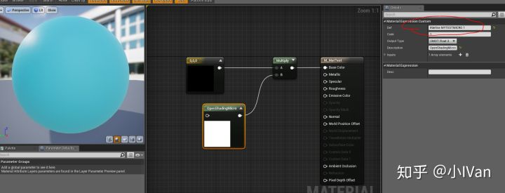
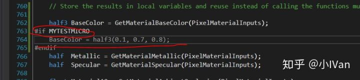
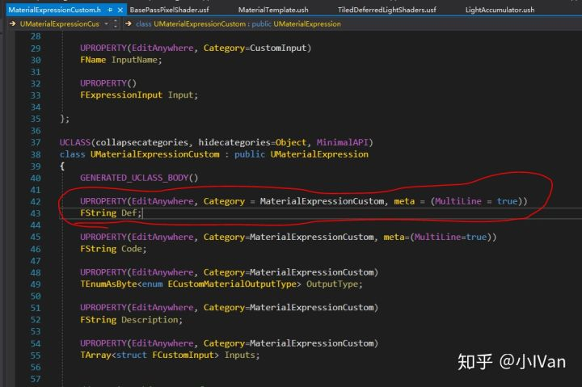
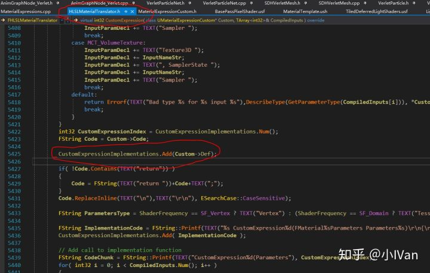
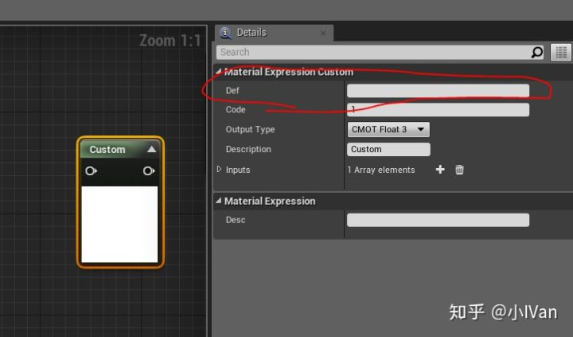
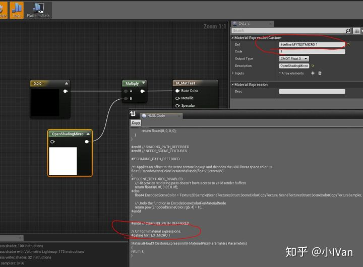
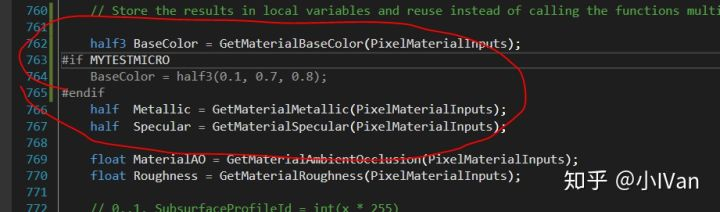

# 虚幻4渲染编程(材质编辑器篇)【第七卷：Modify RenderPipeline in ME】

## **My blog directory**

小IVan：专题概述及目录

zhuanlan.zhihu.com

## **Introduce：**

As  we all know, we can't modify the main render pipeline of unreal engine  4。We can only edit our shader in the material editor. If we want to do  something special which material editor can't meet our needs, Using c++  to modify the engine is currently the only viable method. My previous  article has detailed implementation steps for this method.

[小IVan：虚幻4渲染编程(材质编辑器篇)【第二卷：自定义光照模型】](https://zhuanlan.zhihu.com/p/36840778)

However,  Using c++ to modify the engine is not a good way. Because This method  is very inconvenient. Below I will introduce a way to modify the  rendering pipeline directly in the material editor.

------

Let's see the results first.

The  code shown above is relatively simple, but the goal of modifying the  rendering pipeline directly in the material editor has been achieved.

First we need to modify the source code of CustomNode。

Compile the engine, then open the material editor to add a CustomNode and you will see the following result.

If you write a macro to def, the macro will be pushed into the shader, and the rendering pipeline will get the macros.

Then we can write our code into the  engine shader, which can be easily enabled using the material editor.

Enjoy it ！
