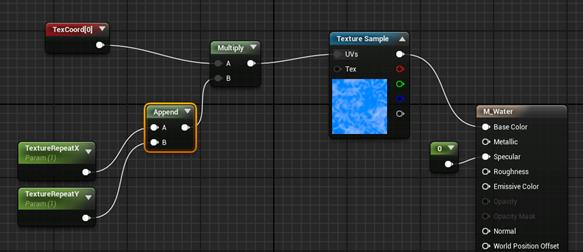

# UE4 – Programmatically create a new material and inner nodes

2019年3月15日

14:25

 

 

·         [View Larger Image](https://i2.wp.com/isaratech.com/wp-content/uploads/2017/11/UE4ProgrammaticallyCreate.png?fit=1018%2C440&ssl=1)

https://i2.wp.com/isaratech.com/wp-content/uploads/2017/11/UE4ProgrammaticallyCreate.png?fit=1018%2C440&ssl=1)

In this post, we will learn how to create a new material from Cpp code, create nodes and make links.

You can add this code into a custom plugin in order to magically create a new material when the user clicks on an editor button.

Remember, this code is designed to be execute into the editor. Your plugin must be an editor plugin. This code can’t work at runtime…

Create a new asset : Material

First of all, we must create a new asset programmatically, for instance, let’s create a new material with name « M_Material » into the root content folder « /Game/ ».

To do this, we need to create an **UPackage** (which is the storage object of our asset). Then, we use a material factory to create our **UMaterial**.

FString MaterialBaseName = "M_Material";
 FString PackageName = "/Game/";
 PackageName += MaterialBaseName;
 UPackage* Package = CreatePackage(NULL, *PackageName);

// Create an unreal material asset
 auto MaterialFactory = NewObject<UMaterialFactoryNew>();
 UMaterial* UnrealMaterial = (UMaterial*)MaterialFactory->FactoryCreateNew(UMaterial::StaticClass(), Package, *MaterialBaseName, RF_Standalone | RF_Public, NULL, GWarn);

Copy

 

Then, we must let Unreal do some background process about asset creation and load/set dirty the package we just created. Without this code, the asset creation can be not finalized and it can bring some issues later…

FAssetRegistryModule::AssetCreated(UnrealMaterial);
 Package->FullyLoad();
 Package->SetDirtyFlag(true);

Copy

Now, our asset is created but empty.

Finally, once we created the material and – maybe – added nodes, let the material update itself :

// Let the material update itself if necessary
 UnrealMaterial->PreEditChange(NULL);
 UnrealMaterial->PostEditChange();
 // make sure that any static meshes, etc using this material will stop using the FMaterialResource of the original
 // material, and will use the new FMaterialResource created when we make a new UMaterial in place
 FGlobalComponentReregisterContext RecreateComponents;

Copy

You can test this code in order to check your new empty material creation.

 

UMaterialExpression

Every node we will add is a subobject of UMaterialExpression. Check the [Unreal Engine documentation](https://docs.unrealengine.com/latest/INT/API/Runtime/Engine/Materials/UMaterialExpression/) to see possible nodes.

Once the node created, add it to the material expressions.

Basically, expressions must be assigned to nodes to link to and to the material.

We will create links between nodes using the same way : if we want to set the result of a multiplication node to the base color of the material, assign the multiplication node to the **Material->BaseColor.Expression**

Here are some examples:

 

Fill in material asset with nodes

Assign « 0 » constant to the specular

Let’s create the simplest possible node : Constant node.

Create a new **UMaterialExpressionConstant** node, then add it to the material expressions, give it value 0 and finally assign it to the specular expression.

UMaterialExpressionConstant* ZeroExpression = NewObject<UMaterialExpressionConstant>(UnrealMaterial);
 ZeroExpression->R = 0.0f;
 UnrealMaterial->Expressions.Add(ZeroExpression);
 UnrealMaterial->Specular.Expression = ZeroExpression;

Copy

Our first node is created and assigned !

Link texture with material base color

We assume you have already your texture asset into your content folder.

We need to get the **UTexture** reference to create the node. So we need get this asset by path :

FStringAssetReference DiffuseAssetPath("/Game/T_Texture");
 UTexture* DiffuseTexture = Cast(DiffuseAssetPath.TryLoad());
 if (DiffuseTexture)
 {
 ...
 }

Copy

Then, create a new TextureSample material expression, assign it our texture and link it with material base color.

// Make texture sampler
 UMaterialExpressionTextureSample* TextureExpression = NewObject(UnrealMaterial);
 TextureExpression->Texture = DiffuseTexture;
 TextureExpression->SamplerType = SAMPLERTYPE_Color;
 UnrealMaterial->Expressions.Add(TextureExpression);
 UnrealMaterial->BaseColor.Expression = TextureExpression;

Copy

 

Use the multiply node

If we want to create a texture tiling system, we need to multiply the texture coordinates with some scalar parameters.

Let’s create a multiply node and assign it to our texture coordinates.

// Tiling system
 UMaterialExpressionMultiply* Multiply = NewObject<UMaterialExpressionMultiply>(UnrealMaterial);
 UnrealMaterial->Expressions.Add(Multiply);
 TextureExpression->Coordinates.Expression = Multiply;

Copy

Assign the texture coordinates node to the A parameter of the multiply node :

UMaterialExpressionTextureCoordinate* TexCoords = NewObject<UMaterialExpressionTextureCoordinate>(UnrealMaterial);
 UnrealMaterial->Expressions.Add(TexCoords);
 Multiply->A.Expression = TexCoords;

Copy

As you think, you can assign an other node to the B parameter using the same way.

 

Tiling system

Now, finalize out tiling system by creating 2 scalar parameters containing X and Y texture repetitions :

// Tiling
 UMaterialExpressionAppendVector* Append = NewObject<UMaterialExpressionAppendVector>(UnrealMaterial);
 UnrealMaterial->Expressions.Add(Append);
 Multiply->B.Expression = Append;
 UMaterialExpressionScalarParameter* XParam = NewObject<UMaterialExpressionScalarParameter>(UnrealMaterial);
 UMaterialExpressionScalarParameter* YParam = NewObject<UMaterialExpressionScalarParameter>(UnrealMaterial);
 UnrealMaterial->Expressions.Add(XParam);
 UnrealMaterial->Expressions.Add(YParam);
 XParam->ParameterName = "TextureRepeatX";
 XParam->DefaultValue = 1;
 YParam->ParameterName = "TextureRepeatY";
 YParam->DefaultValue = 1;
 Append->A.Expression = XParam;
 Append->B.Expression = YParam;

Copy

 

Full code

FString MaterialBaseName = "M_Material";
 FString PackageName = "/Game/";
 PackageName += MaterialBaseName;
 UPackage* Package = CreatePackage(NULL, *PackageName);

// create an unreal material asset
 auto MaterialFactory = NewObject<UMaterialFactoryNew>();
 UMaterial* UnrealMaterial = (UMaterial*)MaterialFactory->FactoryCreateNew(UMaterial::StaticClass(), Package, *MaterialBaseName, RF_Standalone | RF_Public, NULL, GWarn);
 FAssetRegistryModule::AssetCreated(UnrealMaterial);
 Package->FullyLoad();
 Package->SetDirtyFlag(true);

// Tiling system
 UMaterialExpressionMultiply* Multiply = NewObject<UMaterialExpressionMultiply>(UnrealMaterial);
 UnrealMaterial->Expressions.Add(Multiply);

// Diffuse
 FStringAssetReference DiffuseAssetPath("/Game/T_Texture");
 UTexture* DiffuseTexture = Cast<UTexture>(DiffuseAssetPath.TryLoad());
 if (DiffuseTexture)
 {
         // make texture sampler
         UMaterialExpressionTextureSample* TextureExpression = NewObject<UMaterialExpressionTextureSample>(UnrealMaterial);
         TextureExpression->Texture = DiffuseTexture;
         TextureExpression->SamplerType = SAMPLERTYPE_Color;
         UnrealMaterial->Expressions.Add(TextureExpression);
         UnrealMaterial->BaseColor.Expression = TextureExpression;

// Tiling
         TextureExpression->Coordinates.Expression = Multiply;
 }

// Tiling
 UMaterialExpressionAppendVector* Append = NewObject<UMaterialExpressionAppendVector>(UnrealMaterial);
 UnrealMaterial->Expressions.Add(Append);
 Multiply->B.Expression = Append;
 UMaterialExpressionTextureCoordinate* TexCoords = NewObject<UMaterialExpressionTextureCoordinate>(UnrealMaterial);
 UnrealMaterial->Expressions.Add(TexCoords);
 Multiply->A.Expression = TexCoords;
 UMaterialExpressionScalarParameter* XParam = NewObject<UMaterialExpressionScalarParameter>(UnrealMaterial);
 UMaterialExpressionScalarParameter* YParam = NewObject<UMaterialExpressionScalarParameter>(UnrealMaterial);
 UnrealMaterial->Expressions.Add(XParam);
 UnrealMaterial->Expressions.Add(YParam);
 XParam->ParameterName = "TextureRepeatX";
 XParam->DefaultValue = 1;
 YParam->ParameterName = "TextureRepeatY";
 YParam->DefaultValue = 1;
 Append->A.Expression = XParam;
 Append->B.Expression = YParam;

// let the material update itself if necessary
 UnrealMaterial->PreEditChange(NULL);
 UnrealMaterial->PostEditChange();

// make sure that any static meshes, etc using this material will stop using the FMaterialResource of the original
 // material, and will use the new FMaterialResource created when we make a new UMaterial in place
 FGlobalComponentReregisterContext RecreateComponents;

Copy

 
