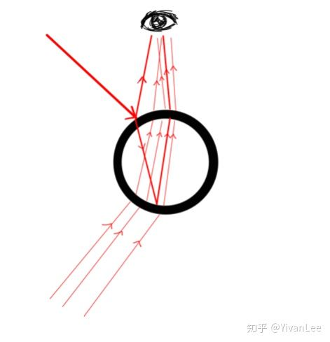
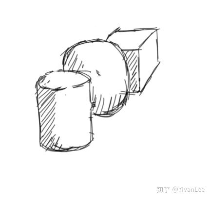
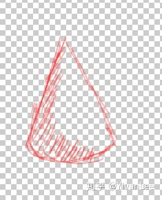
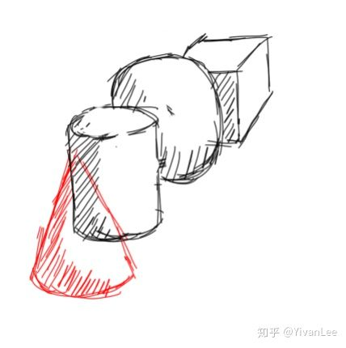
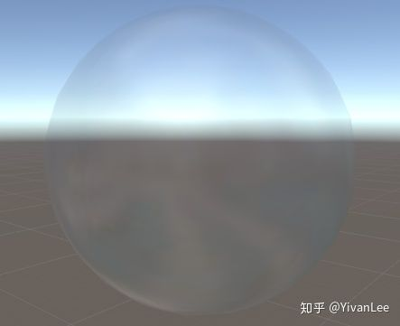
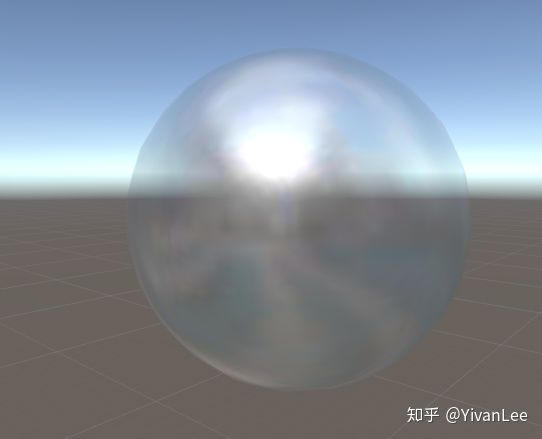
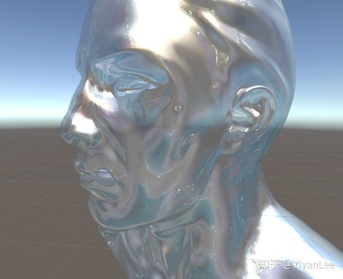
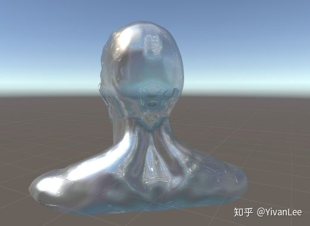

# 虚幻4渲染编程(材质编辑器篇)【第十卷：  TranslucentSpecularShading】

## 我的专栏目录：

YivanLee：专题概述及目录

zhuanlan.zhihu.com

## 简介：

现在的游戏很多游戏里，半透明物体的渲染有很多问题，质感表现很差（也许时光栅渲染的通病），所以我觉得有必要详细研究一下半透材质相关的Shading方法。

最近我发现想要深入研究Shading必须要有很强的光照方程数学建模能力。所以首先我们需要对光线进行数学建模：

对于透明物体，摄像机里的光线来源如下（一盏主光的情况下）：主光找到物体表面，发生反射（镜面反射和漫反射），然后一部分主光的光线折射进物体里，一部分光线内部再发生反射然后进入摄像机。这个现象会造成发生两次反射的结构的反射亮度高于发生一次反射的部分的反射光亮度。其次就是物体背面的环境光透过物体产生折射然后进入摄像机。这就会造成以下几个现象

（1）Caustic   因为内部反射的光线可能会聚焦到一起然后再一起反射进摄像机。这部分光线往往会在再次射出物体时发生散射。

（2）折射        因为光线在物体内部发生了折射

（3）透射        这部分光线一般情况下不会被摄像机察觉到，透过去就透过去了，但是如果是把一个透明物体放到一个桌子上，你会发现透明物体的影子比不透明物体的影子应该要量，并且因为透射光线也会发生聚焦反应所以会在桌子上形程光斑。

然后再来对比下我们光栅渲染过程中透明物体是怎么来的。

（1）首先正常渲染背面物体

然后渲染透明物体

然后根据混合模式直接把它们的渲染结果叠在一起

这种方式和我们分析的光线传播方式完全就背道而驰，下面就在光栅的这个框架下想办法还原真实的光线传播方式。

------

关于透明物体的折射和透射的模拟方法我的其它文章已经讲得很多了，这里我就只介绍我对第一次反射高光部分的处理

首先是直接光照到物体表面后直接就反射进摄像机这部分的光线，这部分光线不应该和背景的任何东西发生混合或者干扰，毕竟这束光线直接就进摄像机了。按照以前传统的方法，镜面反射效果如下：

Output.a = 0.2

我改进了这部分计算，效果如下

Output.a = saturate(0.2 + GGXArea)

想要让背景的光线不影响这部分光线也很简单，就是改变高光部分的透明度或者把透明物体的光照方程拆到几个混合方式不同的pass里就可以了。可以看到这才是接近正确的第一次反射光线的效果。

------

Enjoy it！
