# 虚幻4渲染编程（MultiPass篇)【第一卷：Dynamic Character HitMask】

本专栏的“虚幻4向巨佬低头”篇会慢慢介绍epic官方大神Ryan Brucks 所做的一些效果。什么都不用说，先让我们膜拜巨佬三秒。

## **先声明一下这一部分内容主要是对Ryan大神所展示的效果的研究和自己实现，我不是简单搬运！因为你是找不到Ryan实现这些效果从资源准备开始的每一步详细步骤的。**

先上效果吧：

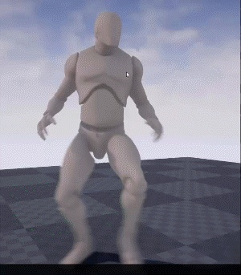

<svg x="16" y="18.5" class="GifPlayer-icon"></svg>

我在这里只做了这个效果的核心，就是如何绘制mask

巨佬Ryan做的效果是这样的：

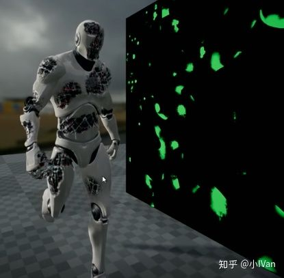

我们只要有了mask，就能做巨佬的这种动态损伤效果啦。下面我们就开始吧

这是一个实时绘制污渍的多pass效果。虚幻里实现多pass的方式目前用得比较多的就rendertarget还有一个是多重叠模型。也许后期虚幻4会暴露出更多接口和特性。

首先我们要准备一下几个资源

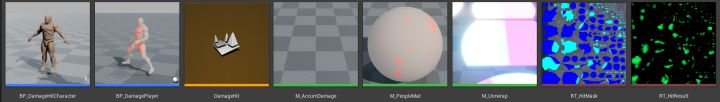

第一个BP-DamageCHaracter，继承于ACharacter类，用于接收我们的鼠标输入和架一台摄像机，第二个BP_DamagePlayer，继承于Actor类，用于完成这次效果的主要功能，第三个就是这次效果的场景，第四个为绘制最后一个HitResult的材质，第五个是呈现角色最后效果的材质，它会使用M_AccumDamage绘制出的RT_HitResult。M_UnWrap用于将角色瞬间展成一个平面（后面会阐述为啥要这么做）。

完成好这几个资产的准备后，我们需要打开脚本，为脚本做一些设置

首先BP_DamagePlayer中，我们需要为它准备一个模型资产和一个动画资产。动画资产不用多说，只需要满足虚幻4对动画资源的要求即可。模型资产有一个需要注意的地方，就是我们需要为模型资源制作2套UV。由于通常模型制作过程中我们会将模型对称来制作，这时候制作出的模型其实是uv重叠的。这样的好处就是节约，不管是贴图的利用率还是建模的速度。但是uv重叠对我们这种绘制来说是不可以的，所以我们需要再分一套不重叠的uv。

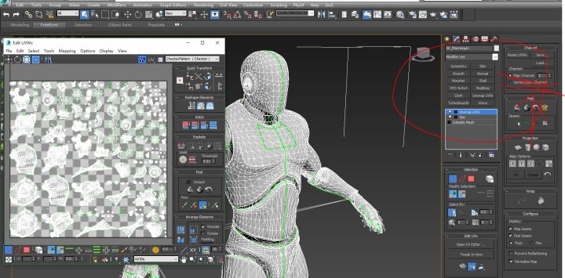

这是max里的展开后的效果。导入引擎后你应该看到下图的结果

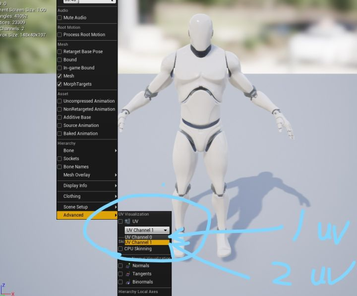

为BP_DamagePlayer准备好动画和模型资产后，我们还需要创建一个SceneCapturecomponent2D，然后将他上移到模型头顶，rotation设置为（0，-90.270）即可。再新建一个hitLocation成员变量，用于储存鼠标的点击位置。最后你的SceneCapturComponent2D应该是下图这样设置的

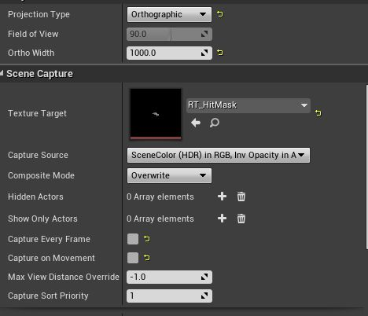

BP_DamagePlayer是下图这样的

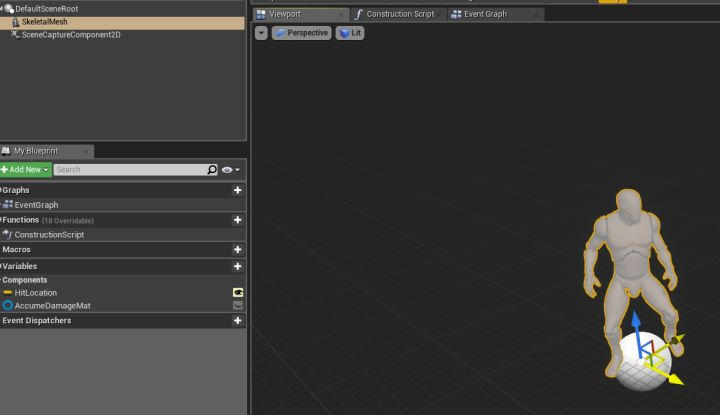

注意模型的正面朝向应该和Y轴一致，调整senecapturecomponent2D和模型的朝向位置是为了更方便后期绘制的时候对应坐标。

完成好这些准备后我们需要为BP_DamagePlayer添加一些逻辑

下面是这次效果的主要逻辑

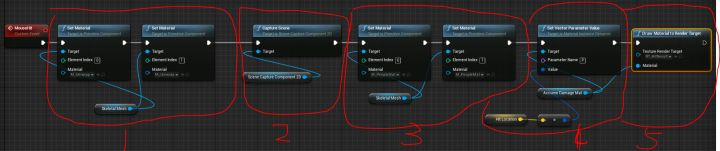

主要分为五部分，第一部分是将瞬间展开材质给予模型，让模型瞬间被展开成一个平面（后面会详细阐述这么做的目的），第二部分为抓取展开成平面的模型，并将这些信息（其实这里抓取的是顶点位置信息）储存到RT_HitMask里。第三部分将角色原来的材质设置回去，完成抓取操作，第四部分为将鼠标位置传入M_AccumDamage里。最后用M—AccumeDamage绘制RT_HitResult。

最后的一步就是在beginPlay上给RT_HitResult一个clear操作。

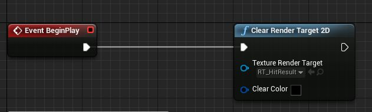

完成BP_DamagePlayer操作后我们需要来到BP_DamageCharacter中。

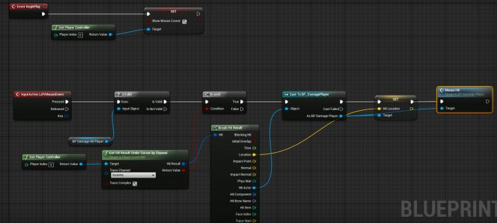

逻辑很简单，我们需要创建一个BP_DamageHitPlayer来指向关卡里的BP_DamagePLayer的一个实例。

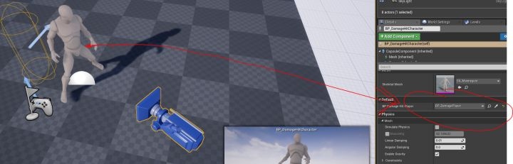

完成这一切后，剩下的就是shader（材质）的工作了

首先来说一下M_Unwrap。这个材质如下图

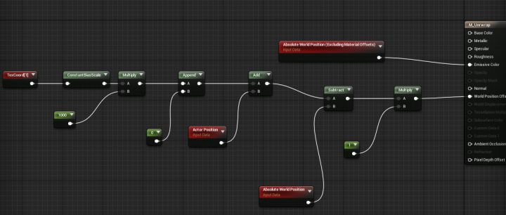

这个材质会瞬间将模型展成一个屏面。首先来说一下为什么要展成一个平面。我们想要在模型上绘制，就需要解决几个问题。第一个是在哪儿绘制，第二是怎么绘制。第二个问题很好解决，直接向RT上绘制就可以了（可以看看我前面的几篇博客---RenderTarget在虚幻4的应用）。那么现在来解决在哪儿绘制的问题。以前RenderTarget在虚幻4的应用中是直接在RT上绘制然后把RT映射到平面上，这是没问题的。因为模型平面和RT是一个简单映射关系

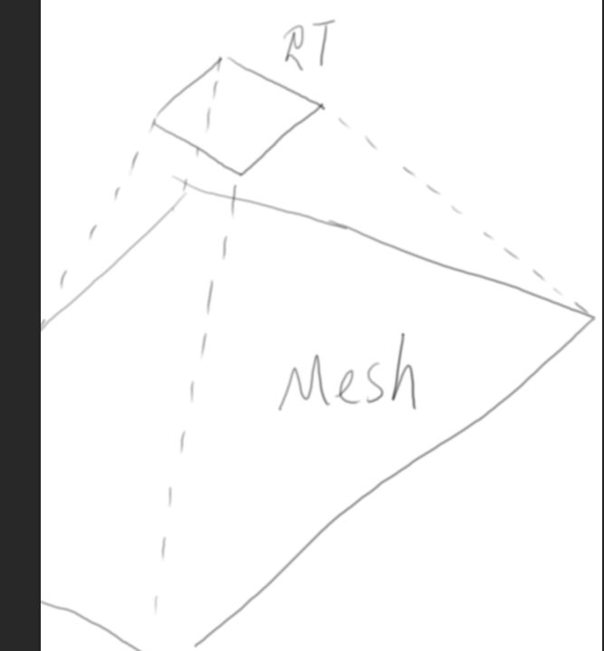

而现在是一个极为复杂的映射关系，不仅如此。模型还在动画的驱动下不停运动变化

所以要是有个办法能储存各个顶点的位置，然后我把这些位置拿出来用就好了。所以现在就可以把模型瞬间展开成一个平面，然后把这个平面照下来成一张图，这个图里存的不是颜色，而是顶点的位置，就像法线贴图里存所有定点法线一样。这里再把这个材质的截图放过来对照讲解。

首先Texcoord【1】表示获取的是模型的第二套UV。由于UV的范围是X【0，1】Y【-1，0】所以我们用constantbiassScale把UV坐标调整到X【-0.5，0.5】Y【-0.5，0.5】。相当于把uv坐标平移到角色脚底。（随手拿鼠标画的，丑请见谅）

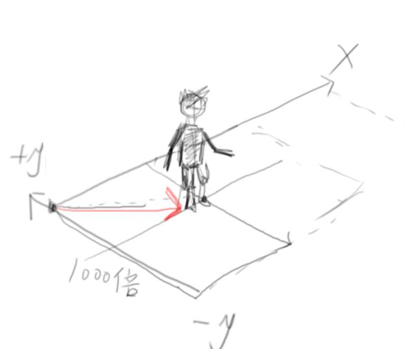

再乘以1000，将以前大小为1X1的平面放大到1000X1000方便捕获。最后减去顶点本身的位置信息，最后得到的就是个平面。

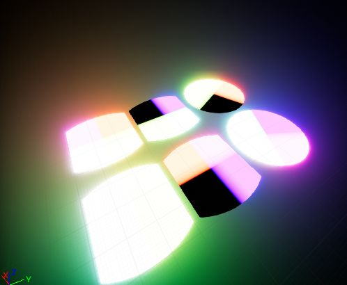

最后就是要考虑究竟要捕获的什么了，现在只是把顶点展开了，里面记录的信息应该是模型顶点未被展成平面时的位置

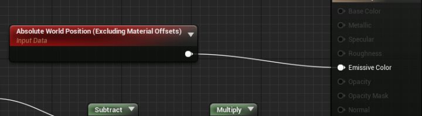

完成这一切后我们只需要在M_AccumDamage中把这些记录到RT_HitMask的信息和HitPosition进行比较做个sphereMask就能绘制出RT_HitResult了

下面是M_AccumDamge的逻辑

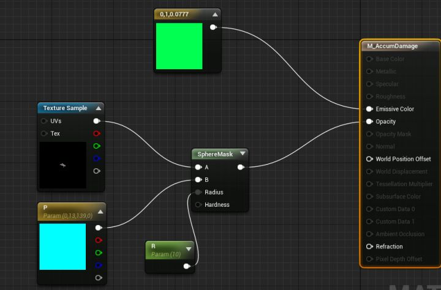

R就是我们的笔刷大小，P是BP_DamagePlayer上传的HitLocation。那上面那个Texture是RT_HitMask。RT_HitMask的来源是

最后需要注意的一点是记得把BP_DamagePlayer中的SkeletonMeshComponent（我们的模型）碰撞设置为blockall。最后就大功告成啦。

这还能做很多其他效果，比如绘制污渍，绘制伤口，给角色绘制眼泪，实时流下来，等等。

下面章会介绍巨佬Rayan的其他效果***并且我们自己一步步实现它***！！！
