# 虚幻4渲染编程（MultiPass篇）【第二卷：UseRendertargetInBP】

## 为了更好理解后面的内容，这里先来Rendertarget素质四连一下吧。这里会介绍Rendertarget的一些常用用法，乒乓缓冲之类的东西。

## **RenderTarget素质四连【第一节：RenderTarget使用基础】**

RenderTarget实在能做太多地方了。光影，实时绘制，投射，环境交互，流体模拟，在材质中模拟多pass行为（虚幻4.16的时候还无法进行多pass行为）等等。今天简单做了一下实时绘制，我的目标是做环境模拟，如雪地脚印，踩草丛后，草被踩下去然后慢慢恢复。不过做这些之前需要先做实时绘制。

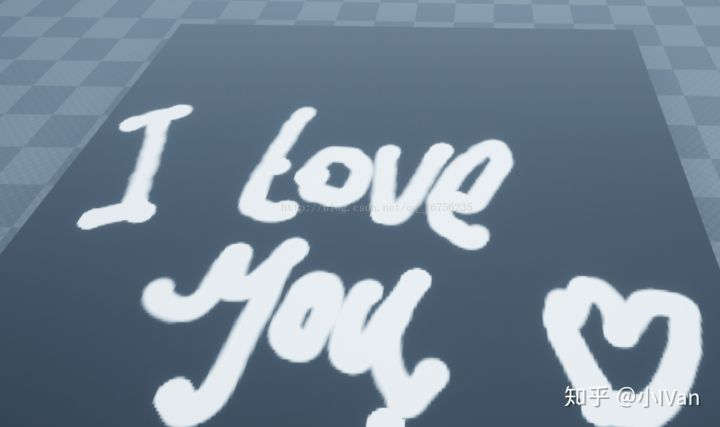

在directx或者opengl里面做RT简直就是噩梦，各种资源的绑定解绑，状态的更新十分麻烦，但是虚幻4里十分方便，blueprint脚本都能轻松完成。

做上面的效果，首先需要准备一个平面模型

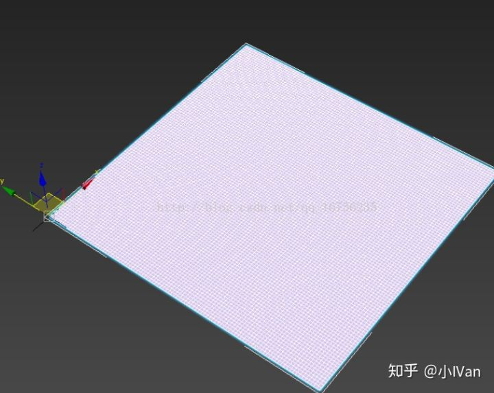

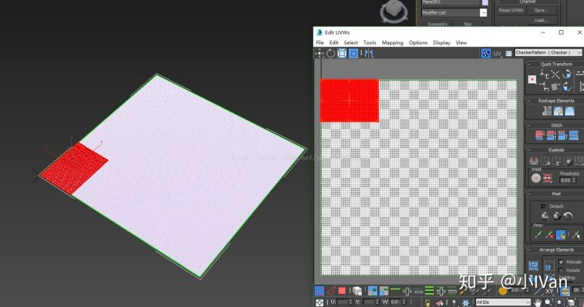

我们需要调整模型的轴和模型的uv如上图所示，方向不能反。导出时z轴必须向上，max的Y轴和UE的Y轴是相反的。下面是模型导入UE里后的状况

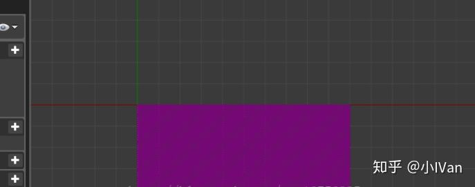

模型导入UE后记得加上碰撞。

完成模型的准备后我们还需要准备两个材质和一张RT。然后再准备一个BP脚本。BP脚本要记得让它接受玩家的输入。

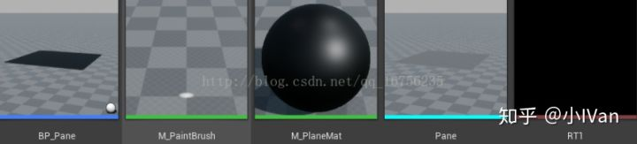

完成这些准备后进入到第一个PainBrush材质里。这个材质是我们的笔刷，负责向RT1提供绘制信息。

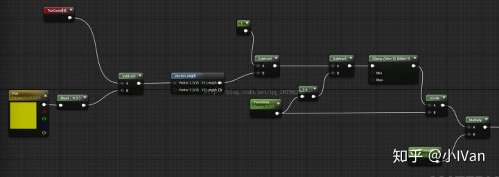

混合模式如果调成Additve那么就可以绘制连续的图案了。这些混合模式的介绍可以参考BeginGameProgrammingWithDirectX11的BlendingMode哪一章。

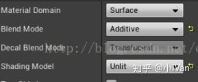

完成我们的笔刷后，我们需要给模型做一个材质M_PlaneMat，目前我们不需要做的很复杂，就是直接把RT给DIffuse接口就可以了

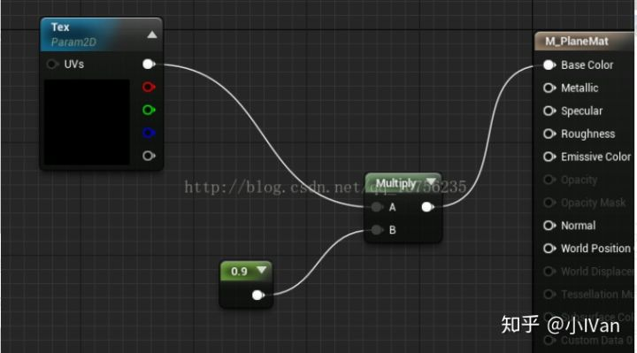

完成了这些，我们就需要开始在脚本里工作了。

首先进行射线检查，检测到我们笔刷的下笔的位置

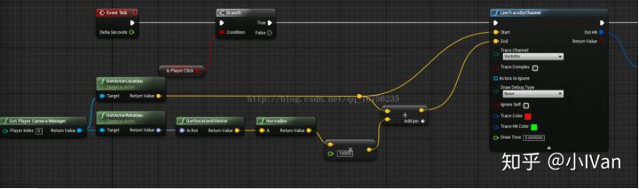

获取到下笔位置后，我们需要做一个转换，因为我们获取的是worldspace position，但是我们需要的是meshspace position，所以需要乘以逆矩阵把position转换回去。那些说虚幻4里只有SQP的没有矩阵变换的程序员可以洗洗睡了。

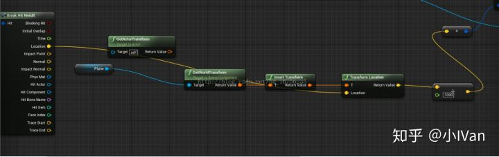

完成这些之后就可以把转换得到的位置传到材质里然后调用draw方法就大功告成了。

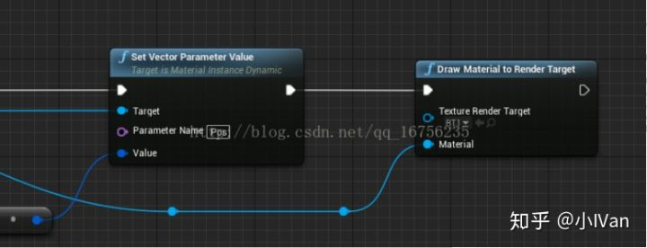

------

## **RenderTarget素质四连【第二节：乒乓缓冲】**

**还是老规矩先上效果：**

<svg x="16" y="18.5" class="GifPlayer-icon"></svg>

我点一下鼠标，球就会变成白色，然后自己慢慢恢复为黑色。

原理图：

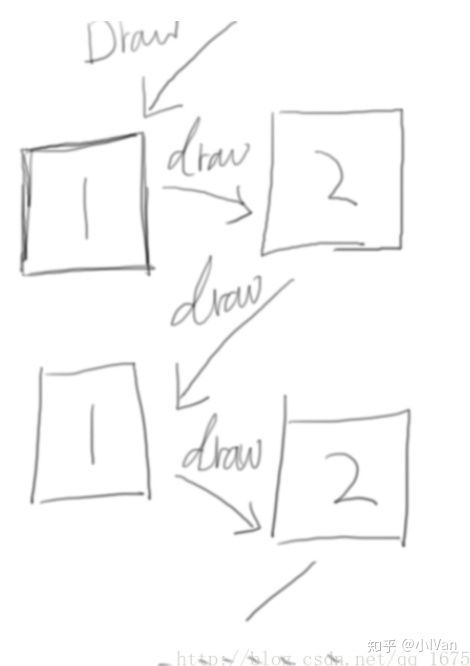

下面我们来一步步实现它

首先我们要准备如下资源

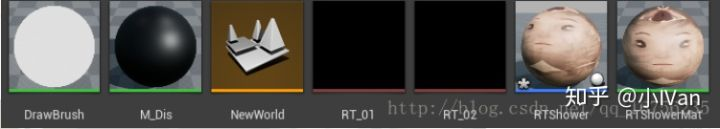

第一个为笔刷，我直接设置成白色，第二个为容纳双缓冲RT的材质。剩下的就是两个RT和一个蓝图脚本和一个模型默认材质

材质中的0.99是每次乒乓缓冲一次的衰减值，每次会衰减0.01

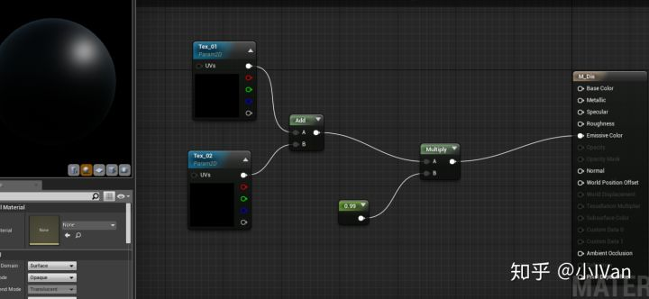

下面是乒乓缓冲的来回draw的调用逻辑

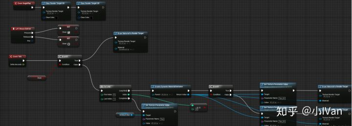

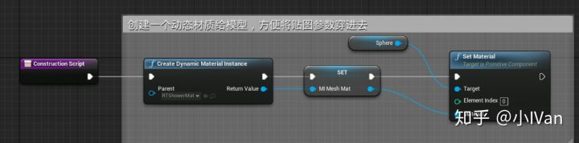

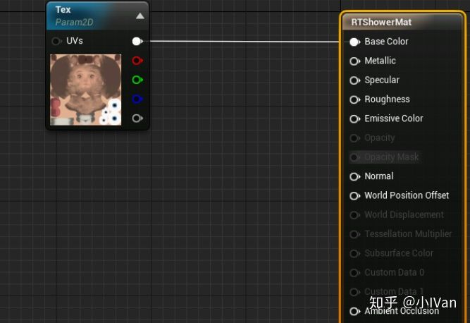

------

## **RenderTarget素质四连【第三节：路径消退和雪迹】**

**还是先上效果：**

<svg x="16" y="18.5" class="GifPlayer-icon"></svg>

<svg x="16" y="18.5" class="GifPlayer-icon"></svg>

其实这是前两部分的叠加，我们有了这个mask还能做生长效果

<svg x="16" y="18.5" class="GifPlayer-icon"></svg>

其实就是把mask白色的地方拿到之后，对草模型进行顶点位置偏移即可。

<iframe allowfullscreen="" src="https://www.zhihu.com/video/980425456759222272?autoplay=false&amp;useMSE=" frameborder="0"></iframe>

除此之外还能做雪地效果

有了这些基础之后我们继续向前迈进吧

Enjoy it！！
