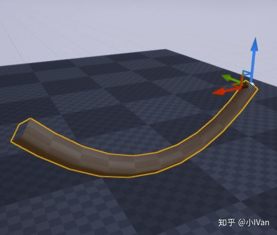
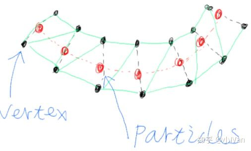
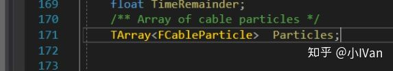
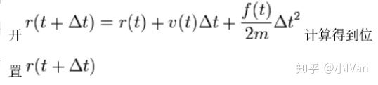
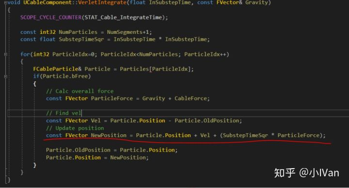
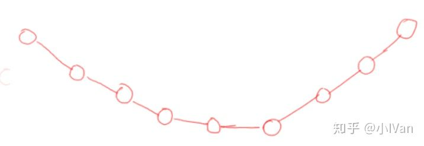
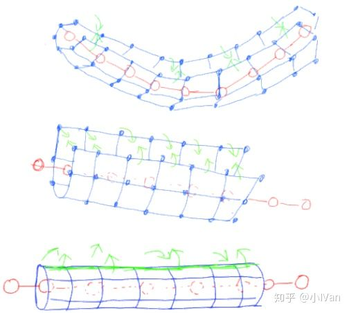
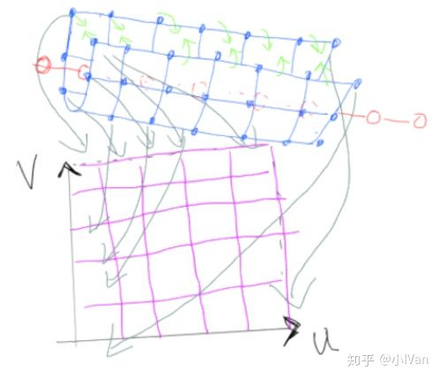
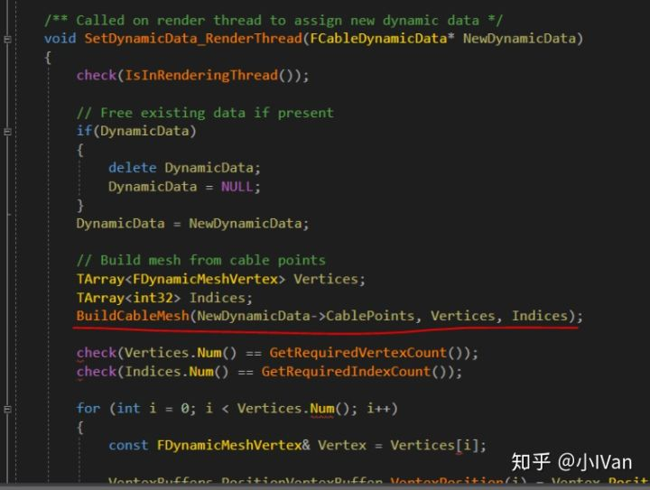

# 虚幻4渲染编程（图元汇编篇）【第一卷：CableComponent的原理及Unity实现】


图元汇编阶段其实有很多可做文章的地方，这也是渲染管线的开始。这个图元汇编篇我们将一起探索如何在虚幻中制作各种图元汇编的有趣效果。

首先拿到庞大的虚幻4引擎是不是有点感觉无从下手呢，所以我们先从研究虚幻4自带的一些代码开始，虚幻4的CableComponent就是一个很好的例子。下面我们就开始先从CableComponent开始启程吧。探索完之后为了检验我们是否完全理解了，我们会在unity中重现它。还是老规矩，先上效果吧：

<iframe allowfullscreen="" src="https://www.zhihu.com/video/980751158972928000?autoplay=false&amp;useMSE=" frameborder="0"></iframe>


这个是虚幻4的原装效果

这个sh

下面分几个小节

（1）CableComponent的原理

（2）CableComponent在虚幻里的实现步骤代码实现

（3）通过CableComponent，总结虚幻的渲染管线的图元汇编阶段的各个细节

## 下面请打开虚幻4源码找到CableComponent

------

## **【1】CableComponent的原理**

首先我们要知道cablecomponent的实现方法。下面先来看这张图




要实现绳子或者锁链，我们需要实时结算，更新顶点的位置，重新构建模型。说来轻巧，但是具体如何操作如何实现呢。

首先我们需要一堆粒子，此粒子非彼粒子（不要想得那么高端）。这里说的粒子可不是特效的粒子系统。这里的粒子其实就是一堆数据你可以理解为一堆数据位置标记。一个粒子里包含了粒子的新老位置信息喝是否可自由移动信息。我们利用各种公式去解算这些“隐形的”粒子，来重新拓扑整个模型。打开虚幻的源码，你可以看到定义粒子的结构体。


我们通过解算粒子的位置，来不断更新顶点缓冲区种顶点数据的位置，这样来达到使我们的绳索运动的目的。大概思路现在有了。我们定义了一个结构体来描述粒子，粒子之间有作用力和反作用力（有公式来解算这些作用里，这里先把它放在一边），然后我们通过这些粒子（位置标记）来每帧更新顶点的位置，这样来让我们的绳子模型动起来。  

有了上面的核心思路之后，我们再来捋一下我们要做的事情。

第一：我们要定义一些粒子（这个好办，其实就是一个FCableParticle的结构体数组）

第二：结算这些粒子，让它们有重力，有速度，感觉像是物理的。而且这些解算不能太费，要能在游戏里跑才行。

第三：利用第二步解算的粒子，重新构建整个模型。

从上面可以发现，第一步我们定义一个Cableparticle的数组就可以了，你能在虚幻的CableComponent.h里找到这个数组。




那么第二步和第三步如何操作呢。第二步我们需要一个比较经典的算法，韦尔莱算法。第三步我们需要了解如何在虚幻里更新上传顶点数据即可。




你可以在虚幻的源码种找到对应的函数




至于第三步模型的重新构建的话，主要需要注意几个点。第一是位置的构建，第二是UV的构建，第三是切线的构建，第四是indexbuffer的构建。对应虚幻源码种的void BuildCableMesh函数。那么它是如何构建模型的呢。

首先我们设置绳子的段数从而有了particle




接下来我们根据我们设置的cable的边数开始构建顶点和UV




先构建了一个面片，然后在把这个面片包裹在粒子周围。这样就很好理解怎么做UV映射了。




------

## **【2】CableComponent的实现步骤代码实现**

下面我们就来一行一行代码得研究CableComponent

打开CableComponent.h 开始我们会看到如下代码

```text
class FPrimitiveSceneProxy;  
  
/** Struct containing information about a point along the cable */  
struct FCableParticle  
{  
    FCableParticle()  
    : bFree(true)  
    , Position(0,0,0)  
    , OldPosition(0,0,0)  
    {}  
  
    /** If this point is free (simulating) or fixed to something */  
    bool bFree;  
    /** Current position of point */  
    FVector Position;  
    /** Position of point on previous iteration */  
    FVector OldPosition;  
};  
```

这里前置先声明了FPrimitiveSceneProxy这个类，这个类是场景代理，负责渲染线程和逻辑线程的交互，它会将顶点缓冲，索引缓冲数据提交。

然后定义了粒子元的数据，包含了三个数据，新，老位置数据和bFree数据，这个bFree数据控制这个粒子是否是自由的，能够参与位置运算的。如果它是false，那么它将被固定。我们看到一般情况下我们将cable拖到场景里，它的最前端和最后端是固定的，那是因为它的前后两端的那两个粒子的bfree属性是false的缘故。

接着往下翻就到了UCableComponent类的地方了。它继承自UMeshComponent。至于PrimitiveComponent  meshComponent的关系，我在第一卷有详细介绍。这里就不赘述了。

```text
//~ Begin UActorComponent Interface.  
    virtual void OnRegister() override;  
    virtual void TickComponent(float DeltaTime, enum ELevelTick TickType, FActorComponentTickFunction *ThisTickFunction) override;  
    virtual void SendRenderDynamicData_Concurrent() override;  
    virtual void CreateRenderState_Concurrent() override;  
    //~ Begin UActorComponent Interface.  
  
    //~ Begin USceneComponent Interface.  
    virtual FBoxSphereBounds CalcBounds(const FTransform& LocalToWorld) const override;  
    virtual void QuerySupportedSockets(TArray<FComponentSocketDescription>& OutSockets) const override;  
    virtual bool HasAnySockets() const override;  
    virtual bool DoesSocketExist(FName InSocketName) const override;  
    virtual FTransform GetSocketTransform(FName InSocketName, ERelativeTransformSpace TransformSpace = RTS_World) const override;  
    //~ Begin USceneComponent Interface.  
  
    //~ Begin UPrimitiveComponent Interface.  
    virtual FPrimitiveSceneProxy* CreateSceneProxy() override;  
    //~ End UPrimitiveComponent Interface.  
  
    //~ Begin UMeshComponent Interface.  
    virtual int32 GetNumMaterials() const override;  
    //~ End UMeshComponent Interface.  
```

这里就是一些函数的重载，它们负责组件的注册和绘制等工作。virtual  void OnRegister() override;这个函数负责组件的注册，会在组件构建的时候调用。virtual void  TickComponent（...）这个函数会每帧都调用。

virtual FPrimitiveSceneProxy* CreateSceneProxy() override;会创建场景代理。

再往下就是CableComponent自己的属性了，比如绳子的段数，边数。物理运算的时候迭代的次数，绳子的长度，绳子参与物理运算时受到的力等。

```text
/** 
 *  Should we fix the start to something, or leave it free. 
 *  If false, component transform is just used for initial location of start of cable 
 */  
UPROPERTY(EditAnywhere, BlueprintReadWrite, Category = "Cable")  
bool bAttachStart;  
  
/**  
 *  Should we fix the end to something (using AttachEndTo and EndLocation), or leave it free.  
 *  If false, AttachEndTo and EndLocation are just used for initial location of end of cable 
 */  
UPROPERTY(EditAnywhere, BlueprintReadWrite, Category = "Cable")  
bool bAttachEnd;  
  
/** Actor or Component that the defines the end position of the cable */  
UPROPERTY(EditAnywhere, Category="Cable")  
FComponentReference AttachEndTo;  
  
/** Socket name on the AttachEndTo component to attach to */  
UPROPERTY(EditAnywhere, Category = "Cable")  
FName AttachEndToSocketName;  
  
/** End location of cable, relative to AttachEndTo (or AttachEndToSocketName) if specified, otherwise relative to cable component. */  
UPROPERTY(EditAnywhere, BlueprintReadWrite, Category="Cable", meta=(MakeEditWidget=true))  
FVector EndLocation;  
  
/** Attaches the end of the cable to a specific Component within an Actor **/  
UFUNCTION(BlueprintCallable, Category = "Cable")  
void SetAttachEndTo(AActor* Actor, FName ComponentProperty, FName SocketName = NAME_None);  
  
/** Gets the Actor that the cable is attached to **/  
UFUNCTION(BlueprintCallable, Category = "Cable")  
AActor* GetAttachedActor() const;  
  
/** Gets the specific USceneComponent that the cable is attached to **/  
UFUNCTION(BlueprintCallable, Category = "Cable")  
USceneComponent* GetAttachedComponent() const;  
  
/** Get array of locations of particles (in world space) making up the cable simulation. */  
UFUNCTION(BlueprintCallable, Category = "Cable")  
void GetCableParticleLocations(TArray<FVector>& Locations) const;  
  
/** Rest length of the cable */  
UPROPERTY(EditAnywhere, BlueprintReadWrite, Category="Cable", meta=(ClampMin = "0.0", UIMin = "0.0", UIMax = "1000.0"))  
float CableLength;  
  
/** How many segments the cable has */  
UPROPERTY(EditAnywhere, BlueprintReadOnly, Category="Cable", meta=(ClampMin = "1", UIMin = "1", UIMax = "20"))  
int32 NumSegments;  
  
/** Controls the simulation substep time for the cable */  
UPROPERTY(EditAnywhere, AdvancedDisplay, BlueprintReadOnly, Category="Cable", meta=(ClampMin = "0.005", UIMin = "0.005", UIMax = "0.1"))  
float SubstepTime;  
  
/** The number of solver iterations controls how 'stiff' the cable is */  
UPROPERTY(EditAnywhere, BlueprintReadWrite, Category="Cable", meta=(ClampMin = "1", ClampMax = "16"))  
int32 SolverIterations;  
  
/** Add stiffness constraints to cable. */  
UPROPERTY(EditAnywhere, BlueprintReadWrite, AdvancedDisplay, Category = "Cable")  
bool bEnableStiffness;  
  
/**  
 *  EXPERIMENTAL. Perform sweeps for each cable particle, each substep, to avoid collisions with the world.  
 *  Uses the Collision Preset on the component to determine what is collided with. 
 *  This greatly increases the cost of the cable simulation. 
 */  
UPROPERTY(EditAnywhere, BlueprintReadWrite, AdvancedDisplay, Category = "Cable")  
bool bEnableCollision;  
  
/** If collision is enabled, control how much sliding friction is applied when cable is in contact. */  
UPROPERTY(EditAnywhere, BlueprintReadWrite, AdvancedDisplay, Category = "Cable", meta = (ClampMin = "0.0", ClampMax = "1.0", EditCondition = "bEnableCollision"))  
float CollisionFriction;  
  
/** Force vector (world space) applied to all particles in cable. */  
UPROPERTY(EditAnywhere, BlueprintReadWrite, Category = "Cable Forces")  
FVector CableForce;  
  
/** Scaling applied to world gravity affecting this cable. */  
UPROPERTY(EditAnywhere, BlueprintReadWrite, Category = "Cable Forces")  
float CableGravityScale;  
  
/** How wide the cable geometry is */  
UPROPERTY(EditAnywhere, BlueprintReadWrite, Category="Cable Rendering", meta=(ClampMin = "0.01", UIMin = "0.01", UIMax = "50.0"))  
float CableWidth;  
  
/** Number of sides of the cable geometry */  
UPROPERTY(EditAnywhere, BlueprintReadOnly, Category="Cable Rendering", meta=(ClampMin = "1", ClampMax = "16"))  
int32 NumSides;  
  
/** How many times to repeat the material along the length of the cable */  
UPROPERTY(EditAnywhere, BlueprintReadWrite, Category="Cable Rendering", meta=(UIMin = "0.1", UIMax = "8"))  
float TileMaterial;  
```

这些参数在Detail面板能进行调节。可以自行去调节调节感受一下。这些数据里面有些数据会为后面的粒子数量的确定，模型构造时边的长度，顶点数量提供数据支持。

```text
private:  
  
    /** Solve the cable spring constraints */  
    void SolveConstraints();  
    /** Integrate cable point positions */  
    void VerletIntegrate(float InSubstepTime, const FVector& Gravity);  
    /** Perform collision traces for particles */  
    void PerformCableCollision();  
    /** Perform a simulation substep */  
    void PerformSubstep(float InSubstepTime, const FVector& Gravity);  
    /** Get start and end position for the cable */  
    void GetEndPositions(FVector& OutStartPosition, FVector& OutEndPosition);  
    /** Amount of time 'left over' from last tick */  
    float TimeRemainder;  
    /** Array of cable particles */  
    TArray<FCableParticle>    Particles;  
  
  
    friend class FCableSceneProxy;  
```

后面这些就是一些函数和数组的声明了。这些函数和数组会在后面一一用到。

打开CableCompoent.cpp，找到OnRegister函数。它是Component的初始化函数

```text
void UCableComponent::OnRegister()  
{  
    Super::OnRegister();  
  
    const int32 NumParticles = NumSegments+1;  
  
    Particles.Reset();  
    Particles.AddUninitialized(NumParticles);  
  
    FVector CableStart, CableEnd;  
    GetEndPositions(CableStart, CableEnd);  
  
    const FVector Delta = CableEnd - CableStart;  
  
    for(int32 ParticleIdx=0; ParticleIdx<NumParticles; ParticleIdx++)  
    {  
        FCableParticle& Particle = Particles[ParticleIdx];  
  
        const float Alpha = (float)ParticleIdx/(float)NumSegments;  
        const FVector InitialPosition = CableStart + (Alpha * Delta);  
  
        Particle.Position = InitialPosition;  
        Particle.OldPosition = InitialPosition;  
        Particle.bFree = true; // default to free, will be fixed if desired in TickComponent  
    }  
}  
```

这里主要做了初始化操作，先确定粒子的数量，粒子的数量时绳子的段数+1。

完成初始化后，会执行Tick函数

```text
void UCableComponent::TickComponent(float DeltaTime, enum ELevelTick TickType, FActorComponentTickFunction *ThisTickFunction)  
{  
    Super::TickComponent(DeltaTime, TickType, ThisTickFunction);  
  
    const FVector Gravity = FVector(0, 0, GetWorld()->GetGravityZ()) * CableGravityScale;  
  
    // Update end points  
    FVector CableStart, CableEnd;  
    GetEndPositions(CableStart, CableEnd);  
  
    FCableParticle& StartParticle = Particles[0];  
  
    if (bAttachStart)  
    {  
        StartParticle.Position = StartParticle.OldPosition = CableStart;  
        StartParticle.bFree = false;  
    }  
    else  
    {  
        StartParticle.bFree = true;  
    }  
  
    FCableParticle& EndParticle = Particles[NumSegments];  
    if (bAttachEnd)  
    {  
        EndParticle.Position = EndParticle.OldPosition = CableEnd;  
        EndParticle.bFree = false;  
    }  
    else  
    {  
        EndParticle.bFree = true;  
    }  
  
    // Ensure a non-zero substep  
    float UseSubstep = FMath::Max(SubstepTime, 0.005f);  
  
    // Perform simulation substeps  
    TimeRemainder += DeltaTime;  
    while(TimeRemainder > UseSubstep)  
    {  
        PerformSubstep(UseSubstep, Gravity);  
        TimeRemainder -= UseSubstep;  
    }  
  
    // Need to send new data to render thread  
    MarkRenderDynamicDataDirty();  
  
    // Call this because bounds have changed  
    UpdateComponentToWorld();  
};  
```

其实这里思路也挺清晰的。

判断绳子最前端和最后端的粒子时锁定状态还是自由状态，然后在PerformSubstep(UseSubstep, Gravity);种执行韦尔莱算法更新particles的位置，方便给渲染线程重构顶点位置。如果你激活了物理模拟，它还会计算物理状态。

```text
void UCableComponent::PerformSubstep(float InSubstepTime, const FVector& Gravity)  
{  
    SCOPE_CYCLE_COUNTER(STAT_Cable_SimTime);  
  
    VerletIntegrate(InSubstepTime, Gravity);  
  
    SolveConstraints();  
  
    if (bEnableCollision)  
    {  
        PerformCableCollision();  
    }  
}  
```

这里还是很清晰的。先执行韦尔莱运算，然后对粒子进行约束，然后如果激活了物理，再计算物理碰撞。

SolveConstraints()会调用SolveDistanceConstraint。它的作用是把粒子约束在合理的范围内。这里可以把它理解为反作用力的效果计算，韦尔莱是作用力的计算部分。

```text
/** Solve a single distance constraint between a pair of particles */  
static void SolveDistanceConstraint(FCableParticle& ParticleA, FCableParticle& ParticleB, float DesiredDistance)  
{  
    // Find current vector between particles  
    FVector Delta = ParticleB.Position - ParticleA.Position;  
    //   
    float CurrentDistance = Delta.Size();  
    float ErrorFactor = (CurrentDistance - DesiredDistance)/CurrentDistance;  
  
    // Only move free particles to satisfy constraints  
    if(ParticleA.bFree && ParticleB.bFree)  
    {  
        ParticleA.Position += ErrorFactor * 0.5f * Delta;  
        ParticleB.Position -= ErrorFactor * 0.5f * Delta;  
    }  
    else if(ParticleA.bFree)  
    {  
        ParticleA.Position += ErrorFactor * Delta;  
    }  
    else if(ParticleB.bFree)  
    {  
        ParticleB.Position -= ErrorFactor * Delta;  
    }  
}  
```

以上是逻辑线程的部分。渲染线程则负责用逻辑线程的这些计算结果莱计算图元的最终形状。

那么是如何将逻辑线程的顶点数据发送到渲染线程呢？我们可以找到这个函数：

```text
void UCableComponent::CreateRenderState_Concurrent()  
{  
    Super::CreateRenderState_Concurrent();  
  
    SendRenderDynamicData_Concurrent();  
}  
  
void UCableComponent::SendRenderDynamicData_Concurrent()  
{  
    if(SceneProxy)  
    {  
        // Allocate cable dynamic data  
        FCableDynamicData* DynamicData = new FCableDynamicData;  
  
        // Transform current positions from particles into component-space array  
        const FTransform& ComponentTransform = GetComponentTransform();  
        int32 NumPoints = NumSegments+1;  
        DynamicData->CablePoints.AddUninitialized(NumPoints);  
        for(int32 PointIdx=0; PointIdx<NumPoints; PointIdx++)  
        {  
            DynamicData->CablePoints[PointIdx] = ComponentTransform.InverseTransformPosition(Particles[PointIdx].Position);  
        }  
  
        // Enqueue command to send to render thread  
        ENQUEUE_UNIQUE_RENDER_COMMAND_TWOPARAMETER(  
            FSendCableDynamicData,  
            FCableSceneProxy*,CableSceneProxy,(FCableSceneProxy*)SceneProxy,  
            FCableDynamicData*,DynamicData,DynamicData,  
        {  
            CableSceneProxy->SetDynamicData_RenderThread(DynamicData);  
        });  
    }  
} 
```

可以看到，这里会将DynamicData发送到逻辑线程。找到这个Dynamic的定义

```text
/** Dynamic data sent to render thread */  
struct FCableDynamicData  
{  
    /** Array of points */  
    TArray<FVector> CablePoints;  
};  
```

一切就清晰啦。渲染线程会用逻辑线程发送过去的particles的position数据不停进行绘制




------

## **【3】通过CableComponent，总结虚幻的渲染管线的图元汇编阶段的各个细节**

**那么最后来捋一下**

**（1）渲染线程这边，场景代理会创建各种资源，如VertexBuffer，Indexbuffer，Material（关于shader这些这里不做讨论了，具体可以看【材质编辑器全解第一卷】Unity，UnrealEngine4等各大引擎材质编辑器原理详解），会收取逻辑线程发送过来的数据（一堆粒子的位置），利用这些位置信息重新更新顶点缓冲和索引缓冲，重新绘制网格。**

**（2）逻辑线程这边。OnRegister会初始化各个数据，TickComponent会每帧计算Particles的位置，最后把这个位置信息发送给渲染线程。**

**只要做到上述的这些，就可以完整掌握整个图元汇编的操作了。下面我们就把Unreal的这个CableComponent般到Unity里面去吧。**


你也可以试试在unity里重现整个实现，以此来检测自己是否真正理解。下面是我unity的脚本代码

```csharp
using System.Collections;  
using System.Collections.Generic;  
using UnityEngine;  
  
public struct Particle  
{  
    public bool bFree;  
    public Vector3 NewPosition;  
    public Vector3 OldPosition;  
}  
  
[ExecuteInEditMode]  
public class CS_DynamicRope : MonoBehaviour   
{  
    public bool bDoubleSide = false;  
    public bool bAttachStart = true;  
    public bool bAttachEnd = true;  
    public Vector3 EndPosition;  
    public Vector3 StartPosition;  
    public Vector3 CableForce;  
    public float CableLength = 10.0f;  
    public float CableWidth = 2.0f;  
    public int NumSegments = 2;  
    public float SubstepTime = 1;  
    public int SolverIterations = 1;  
    public float GravityScale = 1;  
    public int tillingNum = 1;  
    public Material CableMaterial;  
  
    private Particle[] Particles;  
    private float SecondTime;  
    private bool bAttached = false;  
    private Vector3 AttachedPos = new Vector3(0, 0, 0);  
  
    void CreateMesh(Mesh meshval)  
    {  
        //边数默认为2  
        int NumOfSides = 2;  
        //构建面片带模型  
        int NumOfPoints = Particles.Length;  
        int NumOfVertex = NumOfPoints * NumOfSides;  
        float cableYOffset = CableWidth / 2;  
        Vector3[] NewVertexes = new Vector3[NumOfVertex];  
        Vector2[] NewUVs = new Vector2[NumOfVertex];  
        int vertexindexnum = 0;  
        for (int PointIndex = 0; PointIndex < NumOfPoints; PointIndex++)  
        {  
            int CurrentIndex = Mathf.Max(0, PointIndex);  
            int NextIndex = Mathf.Min(PointIndex + 1, NumOfPoints - 1);  
            Vector3 LineDir = Vector3.Normalize(Particles[NextIndex].NewPosition - Particles[CurrentIndex].NewPosition);  
            Vector3 LineForward = gameObject.transform.TransformVector(new Vector3(0, 0, 1));  
            Vector3 LineUp = Vector3.Cross(LineDir, LineForward);  
            for (int Sides = 0; Sides < NumOfSides; Sides++)  
            {  
                if (Sides == 0)  
                {  
                    NewVertexes[vertexindexnum] = Particles[PointIndex].NewPosition - LineUp * cableYOffset;  
                    NewUVs[vertexindexnum] = new Vector2(1.0f / (float)NumOfPoints * PointIndex * tillingNum, 0);  
                }  
                else  
                {  
                    NewVertexes[vertexindexnum] = Particles[PointIndex].NewPosition + LineUp * cableYOffset;  
                    NewUVs[vertexindexnum] = new Vector2(1.0f / (float)NumOfPoints * PointIndex * tillingNum, 1);  
                }   
                vertexindexnum++;  
            }  
        }  
        meshval.vertices = NewVertexes;  
        meshval.uv = NewUVs;  
        //构建三角形  
        if(bDoubleSide)  
        {  
            int NumOfTriangles = NumSegments * NumOfSides * 3 * 2;  
            int[] newTriangles = new int[NumOfTriangles];  
            int tiangleindexnum = 0;  
            for (int SecIndex = 0; SecIndex < NumSegments; SecIndex++)  
            {  
                int BL = 0;     // S1---TL-----TR-------X---  
                int TL = 0;     //      |       |       |  
                int BR = 0;     //      |   N   |  N+1  |  
                int TR = 0;     //      |       |       |  
                                // S0---BL------BR------X---  
  
                BL = SecIndex * 2;  
                TL = SecIndex * 2 + 1;  
                BR = (SecIndex + 1) * 2;  
                TR = (SecIndex + 1) * 2 + 1;  
                //正面第一个三角形  
                newTriangles[tiangleindexnum] = BL;  
                tiangleindexnum++;  
                newTriangles[tiangleindexnum] = TL;  
                tiangleindexnum++;  
                newTriangles[tiangleindexnum] = TR;  
                tiangleindexnum++;  
                //正面第二个三角形  
                newTriangles[tiangleindexnum] = TR;  
                tiangleindexnum++;  
                newTriangles[tiangleindexnum] = BR;  
                tiangleindexnum++;  
                newTriangles[tiangleindexnum] = BL;  
                tiangleindexnum++;  
                //背面第一个三角形  
                newTriangles[tiangleindexnum] = TR;  
                tiangleindexnum++;  
                newTriangles[tiangleindexnum] = TL;  
                tiangleindexnum++;  
                newTriangles[tiangleindexnum] = BL;  
                tiangleindexnum++;  
                //背面第二个三角形  
                newTriangles[tiangleindexnum] = BL;  
                tiangleindexnum++;  
                newTriangles[tiangleindexnum] = BR;  
                tiangleindexnum++;  
                newTriangles[tiangleindexnum] = TR;  
                tiangleindexnum++;  
            }  
            meshval.triangles = newTriangles;  
  
        }  
        else  
        {  
            int NumOfTriangles = NumSegments * NumOfSides * 3;  
            int[] newTriangles = new int[NumOfTriangles];  
            int tiangleindexnum = 0;  
            for (int SecIndex = 0; SecIndex < NumSegments; SecIndex++)  
            {  
                int BL = 0;     // S1---TL-----TR-------X---  
                int TL = 0;     //      |       |       |  
                int BR = 0;     //      |N      |       |  
                int TR = 0;     //      |       |       |  
                                // S0---BL------BR------X---  
  
                BL = SecIndex * 2;  
                TL = SecIndex * 2 + 1;  
                BR = (SecIndex + 1) * 2;  
                TR = (SecIndex + 1) * 2 + 1;  
  
                newTriangles[tiangleindexnum] = BL;  
                tiangleindexnum++;  
                newTriangles[tiangleindexnum] = TL;  
                tiangleindexnum++;  
                newTriangles[tiangleindexnum] = TR;  
                tiangleindexnum++;  
  
                newTriangles[tiangleindexnum] = TR;  
                tiangleindexnum++;  
                newTriangles[tiangleindexnum] = BR;  
                tiangleindexnum++;  
                newTriangles[tiangleindexnum] = BL;  
                tiangleindexnum++;  
            }  
            meshval.triangles = newTriangles;  
        }  
  
    }  
  
    void DrawMesh()  
    {  
        //清空它  
        Mesh mesh = GetComponent<MeshFilter>().sharedMesh;  
        mesh.Clear();  
          
        //重画它  
        float newGravity = GravityScale * -0.918f;  
        VerletIntergrate(SubstepTime, new Vector3(0, newGravity, 0));  
        SolveConstrains();  
  
        CreateMesh(mesh);  
  
    }  
  
    void BuildPoints()  
    {  
        //只会在开始时执行一次  
        float SecLength = CableLength / NumSegments;  
        for(int pointIndex = 0; pointIndex<Particles.Length; pointIndex++)  
        {  
            Particles[pointIndex].NewPosition = new Vector3(SecLength * pointIndex, 0, 0);  
            Particles[pointIndex].bFree = true;  
        }  
        if (bAttachStart ==true)  
        {  
            Particles[0].bFree = false;  
            Particles[0].NewPosition = StartPosition;  
        }  
        else  
            Particles[0].bFree = true;  
        if (bAttachEnd ==true)  
        {  
            Particles[Particles.Length - 1].bFree = false;  
            Particles[Particles.Length - 1].NewPosition = EndPosition;  
        }  
        else  
            Particles[Particles.Length - 1].bFree = true;  
    }  
  
    // Use this for initialization  
    void Start ()   
    {  
        gameObject.AddComponent<MeshFilter>();  
        gameObject.AddComponent<MeshRenderer>();  
        gameObject.GetComponent<MeshRenderer>().material = CableMaterial;  
  
        Particles = new Particle[NumSegments + 1];  
        BuildPoints();  
        DrawMesh();  
    }  
  
    void VerletIntergrate (float InSubstepTime, Vector3 Gravity)  
    {  
        int NumParticles = NumSegments + 1;  
        float SubSteptimeSqr = InSubstepTime * InSubstepTime;  
  
        for(int ParticleIndex = 0; ParticleIndex < NumParticles; ParticleIndex++)  
        {  
            if (Particles[ParticleIndex].bFree)  
            {  
                Vector3 PartocleForce = Gravity + CableForce;  
  
                Vector3 Vel = Particles[ParticleIndex].NewPosition - Particles[ParticleIndex].OldPosition;  
                Vector3 NewPosition = Particles[ParticleIndex].NewPosition + Vel + (SubSteptimeSqr * PartocleForce);  
  
                Particles[ParticleIndex].OldPosition = Particles[ParticleIndex].NewPosition;  
                Particles[ParticleIndex].NewPosition = NewPosition;  
            }  
        }   
    }  
  
    void SolveConstrains()  
    {  
        float Segmentlength = CableLength / NumSegments;          
  
        for(int IterationIdx = 0; IterationIdx < SolverIterations; IterationIdx++)  
        {  
            // Solve distance constraint for each segment  
            for (int SegIdx = 0; SegIdx < NumSegments; SegIdx++)  
            {  
                // Find current vector between particles  
                Vector3 Delta = Particles[SegIdx + 1].NewPosition - Particles[SegIdx].NewPosition;  
                //   
                float CurrentDistance = Delta.magnitude;  
                float ErrorFactor = (CurrentDistance - Segmentlength) / CurrentDistance;  
  
                // Only move free particles to satisfy constraints  
                if (Particles[SegIdx].bFree && Particles[SegIdx + 1].bFree)  
                {  
                    Particles[SegIdx].NewPosition += ErrorFactor * 0.5f * Delta;  
                    Particles[SegIdx + 1].NewPosition -= ErrorFactor * 0.5f * Delta;  
                }  
                else if (Particles[SegIdx].bFree)  
                {  
                    Particles[SegIdx].NewPosition += ErrorFactor * Delta;  
                }  
                else if (Particles[SegIdx + 1].bFree)  
                {  
                    Particles[SegIdx + 1].NewPosition -= ErrorFactor * Delta;  
                }  
            }  
        }  
    }  
  
    // Update is called once per frame  
    void Update ()   
    {  
        float UseSubStep = Mathf.Max(SubstepTime,0.005f);  
        SecondTime += Time.deltaTime;  
  
        if(bAttached == true)  
        {  
            Particles[Particles.Length - 1].NewPosition = AttachedPos;  
        }  
        else  
        {  
            Particles[Particles.Length - 1].NewPosition = new Vector3(0, 0, 3);  
        }  
          
        //BuildPoints()  
        DrawMesh();  
    }  
  
    //和外部交互逻辑交互的函数，如果只是想要一个单纯的绳子脚本，请删除这里  
    public void AttachEndStart(Vector3 EndPos)  
    {  
        bAttached = true;  
        AttachedPos = transform.worldToLocalMatrix * new Vector4(EndPos.x, EndPos.y, EndPos.z, 1);  
    }  
    public void DettachEndStart()  
    {  
        bAttached = false;  
        AttachedPos = new Vector3(0, 0, 0);  
    }  
}  
```


如果是接触图元汇编不久的朋友可能依然一头雾水，这里只是大概过一下，后面的章节会对上面的细节做更多讲解
