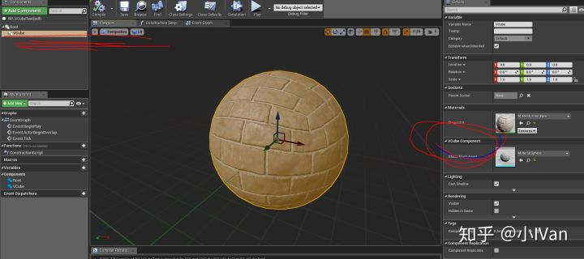
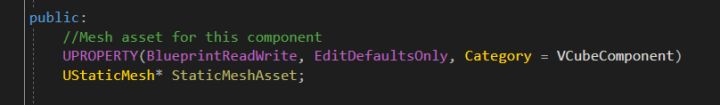
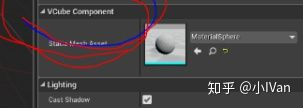
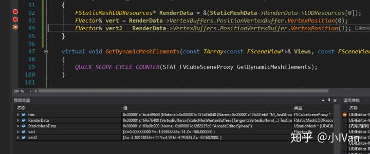
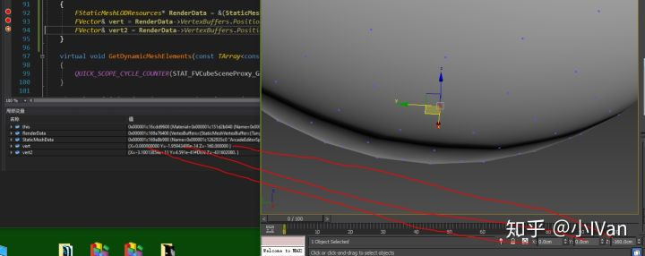
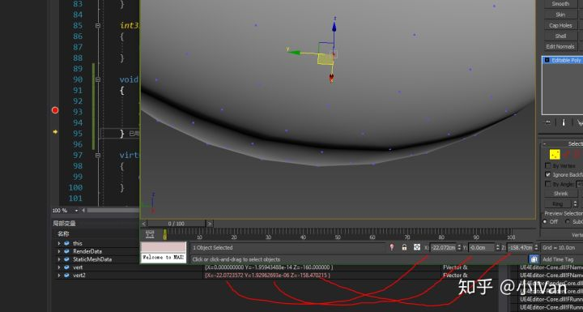
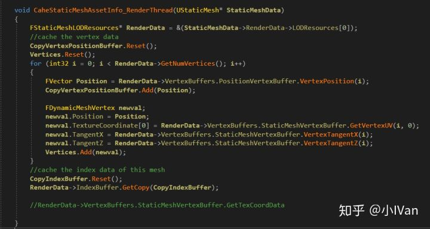
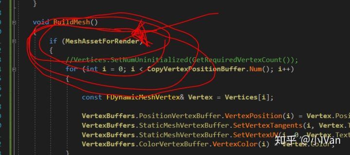
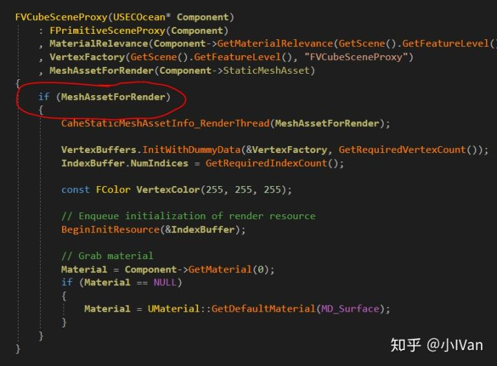

# 虚幻4渲染编程（图元汇编篇）【第四卷：自定义模型资源管线】


前面我们使用自己的程序化模型做了一些效果。但是我们发现，程序化的模型无法做出特别复杂或者可控的效果，于是我们需要一种手段从给我们的资源里加载我们在max或者maya里生产的资源，下面我们就来从StaticMesh中读取我们需要的资源然后我们把这些数据组织成buffer然后我们来自己控制上传和绘制。

先上效果吧：




看上去好像没什么特别的，但是这个模型是我们自己控制顶点缓冲，索引缓冲，uv等信息绘制出来的！！！这意味着我们能自己控制模型资源的数据格式，UV通道的多少，怎么合并渲染，怎么优化数据！

这一节将为我们后续做一些效果作铺垫。

虚幻4的静态模型资源储存在UStaticMesh中。




我们通过UStaticMesh来指认模型资源




我们有了模型资源之后，下一步就是把资源中的数据抠出来用来给我们渲染。

为了寻找虚幻4模型资源数据到底存在哪里的，我们做如下尝试：




可以看到我们拿到了一些数据，但是这些数据是顶点数据吗，我去做了下验证

把资源从max中导出然后把捕获的数据和max中的作比较


然后把







可以看到我们的确拿到了顶点数据（Y值的误差是模型中心和原点没重合造成的）

下一步我们就开始扣数据啦




数据抠出来之后我们把数据拷贝进缓冲区中

```cpp
	void BuildMesh()
	{
		
		//Vertices.SetNumUninitialized(GetRequiredVertexCount());
		for (int i = 0; i < CopyVertexPositionBuffer.Num(); i++)
		{
			
			const FDynamicMeshVertex& Vertex = Vertices[i];

			VertexBuffers.PositionVertexBuffer.VertexPosition(i) = Vertex.Position;
			VertexBuffers.StaticMeshVertexBuffer.SetVertexTangents(i, Vertex.TangentX, Vertex.GetTangentY(), Vertex.TangentZ);
			VertexBuffers.StaticMeshVertexBuffer.SetVertexUV(i, 0, Vertex.TextureCoordinate[0]);
			VertexBuffers.ColorVertexBuffer.VertexColor(i) = Vertex.Color;
		}

		{
			auto& VertexBuffer = VertexBuffers.PositionVertexBuffer;
			void* VertexBufferData = RHILockVertexBuffer(VertexBuffer.VertexBufferRHI, 0, VertexBuffer.GetNumVertices() * VertexBuffer.GetStride(), RLM_WriteOnly);
			FMemory::Memcpy(VertexBufferData, VertexBuffer.GetVertexData(), VertexBuffer.GetNumVertices() * VertexBuffer.GetStride());
			RHIUnlockVertexBuffer(VertexBuffer.VertexBufferRHI);
		}

		{
			auto& VertexBuffer = VertexBuffers.ColorVertexBuffer;
			void* VertexBufferData = RHILockVertexBuffer(VertexBuffer.VertexBufferRHI, 0, VertexBuffer.GetNumVertices() * VertexBuffer.GetStride(), RLM_WriteOnly);
			FMemory::Memcpy(VertexBufferData, VertexBuffer.GetVertexData(), VertexBuffer.GetNumVertices() * VertexBuffer.GetStride());
			RHIUnlockVertexBuffer(VertexBuffer.VertexBufferRHI);
		}

		{
			auto& VertexBuffer = VertexBuffers.StaticMeshVertexBuffer;
			void* VertexBufferData = RHILockVertexBuffer(VertexBuffer.TangentsVertexBuffer.VertexBufferRHI, 0, VertexBuffer.GetTangentSize(), RLM_WriteOnly);
			FMemory::Memcpy(VertexBufferData, VertexBuffer.GetTangentData(), VertexBuffer.GetTangentSize());
			RHIUnlockVertexBuffer(VertexBuffer.TangentsVertexBuffer.VertexBufferRHI);
		}

		{
			auto& VertexBuffer = VertexBuffers.StaticMeshVertexBuffer;
			void* VertexBufferData = RHILockVertexBuffer(VertexBuffer.TexCoordVertexBuffer.VertexBufferRHI, 0, VertexBuffer.GetTexCoordSize(), RLM_WriteOnly);
			FMemory::Memcpy(VertexBufferData, VertexBuffer.GetTexCoordData(), VertexBuffer.GetTexCoordSize());
			RHIUnlockVertexBuffer(VertexBuffer.TexCoordVertexBuffer.VertexBufferRHI);
		}

		void* IndexBufferData = RHILockIndexBuffer(IndexBuffer.IndexBufferRHI, 0, CopyIndexBuffer.Num() * sizeof(int32), RLM_WriteOnly);
		FMemory::Memcpy(IndexBufferData, &CopyIndexBuffer[0], CopyIndexBuffer.Num() * sizeof(int32));
		RHIUnlockIndexBuffer(IndexBuffer.IndexBufferRHI);
	}
```


完成之后把我们的数据发送给Drawing Policy进行绘制

```text
	virtual void GetDynamicMeshElements(const TArray<const FSceneView*>& Views, const FSceneViewFamily& ViewFamily, uint32 VisibilityMap, FMeshElementCollector& Collector) const override
	{
		QUICK_SCOPE_CYCLE_COUNTER(STAT_FVCubeSceneProxy_GetDynamicMeshElements);

		const bool bWireframe = AllowDebugViewmodes() && ViewFamily.EngineShowFlags.Wireframe;

		auto WireframeMaterialInstance = new FColoredMaterialRenderProxy(
			GEngine->WireframeMaterial ? GEngine->WireframeMaterial->GetRenderProxy(IsSelected()) : NULL,
			FLinearColor(0, 0.5f, 1.f)
		);

		Collector.RegisterOneFrameMaterialProxy(WireframeMaterialInstance);

		FMaterialRenderProxy* MaterialProxy = NULL;
		if (bWireframe)
		{
			MaterialProxy = WireframeMaterialInstance;
		}
		else
		{
			MaterialProxy = Material->GetRenderProxy(IsSelected());
		}

		for (int32 ViewIndex = 0; ViewIndex < Views.Num(); ViewIndex++)
		{
			if (VisibilityMap & (1 << ViewIndex))
			{
				const FSceneView* View = Views[ViewIndex];
				// Draw the mesh.
				FMeshBatch& Mesh = Collector.AllocateMesh();
				FMeshBatchElement& BatchElement = Mesh.Elements[0];
				BatchElement.IndexBuffer = &IndexBuffer;
				Mesh.bWireframe = bWireframe;
				Mesh.VertexFactory = &VertexFactory;
				Mesh.MaterialRenderProxy = MaterialProxy;
				BatchElement.PrimitiveUniformBuffer = CreatePrimitiveUniformBufferImmediate(GetLocalToWorld(), GetBounds(), GetLocalBounds(), true, UseEditorDepthTest());
				BatchElement.FirstIndex = 0;
				BatchElement.NumPrimitives = GetRequiredIndexCount() / 3;
				BatchElement.MinVertexIndex = 0;
				BatchElement.MaxVertexIndex = GetRequiredVertexCount();
				Mesh.ReverseCulling = IsLocalToWorldDeterminantNegative();
				Mesh.Type = PT_TriangleList;
				Mesh.DepthPriorityGroup = SDPG_World;
				Mesh.bCanApplyViewModeOverrides = false;
				Collector.AddMesh(ViewIndex, Mesh);
			}
		}
	}
```


这样我们就控制了模型渲染资源准备的整套细节。如果能做到这一步，那我们还可以从其它地方读取数据然后把它渲染出来！不一定非要用UStaicMesh，你甚至可以使用自己发明的一套资源格式！

下面是完整代码

VCubeComponent.h

```text
#pragma once

#include "CoreMinimal.h"
#include "UObject/ObjectMacros.h"
#include "Components/MeshComponent.h"
#include "VCubeComponent.generated.h"

class UStaticMesh;

struct FVParticle
{
	FVParticle():
		NewPos(0,0,0),
		CurPos(0,0,0)
	{}


	FVector NewPos;
	FVector CurPos;
};


//This is a mesh effect component
UCLASS(hidecategories = (Object, LOD, Physics, Collision), editinlinenew, meta = (BlueprintSpawnableComponent), ClassGroup = Rendering, DisplayName = "VCubeComponent")
class VCUBE_API UVCubeComponent : public UMeshComponent
{
	GENERATED_UCLASS_BODY()

public:
	//Mesh asset for this component
	UPROPERTY(BlueprintReadWrite, EditDefaultsOnly, Category = VCubeComponent)
	UStaticMesh* StaticMeshAsset;

private:

	//~ Begin UPrimitiveComponent Interface.
	virtual FPrimitiveSceneProxy* CreateSceneProxy() override;
	//~ End UPrimitiveComponent Interface.

	//~ Begin UMeshComponent Interface.
	virtual int32 GetNumMaterials() const override;
	//~ End UMeshComponent Interface.

	//~ Begin USceneComponent Interface.
	virtual FBoxSphereBounds CalcBounds(const FTransform& LocalToWorld) const override;
	//~ Begin USceneComponent Interface.

	//~ Begin UActorComponent Interface.
	virtual void OnRegister() override;
	virtual void TickComponent(float DeltaTime, enum ELevelTick TickType, FActorComponentTickFunction *ThisTickFunction) override;
	virtual void SendRenderDynamicData_Concurrent() override;
	virtual void CreateRenderState_Concurrent() override;
	//~ End UActorComponent Interface.

	friend class FVCubeSceneProxy;
};
```

cpp

```text
// Copyright 1998-2017 Epic Games, Inc. All Rights Reserved. 

#include "VCubeComponent.h"
#include "RenderingThread.h"
#include "RenderResource.h"
#include "PrimitiveViewRelevance.h"
#include "PrimitiveSceneProxy.h"
#include "VertexFactory.h"
#include "MaterialShared.h"
#include "Engine/CollisionProfile.h"
#include "Materials/Material.h"
#include "LocalVertexFactory.h"
#include "SceneManagement.h"
#include "DynamicMeshBuilder.h"
#include "EngineGlobals.h"
#include "Engine/Engine.h"

#include "Runtime/Engine/Classes/Kismet/KismetSystemLibrary.h"
#include "Runtime/Engine/Classes/Engine/StaticMesh.h"

/** Index Buffer */
class FVCubeIndexBuffer : public FIndexBuffer
{
public:

	virtual void InitRHI() override
	{
		FRHIResourceCreateInfo CreateInfo;
		IndexBufferRHI = RHICreateIndexBuffer(sizeof(int32), NumIndices * sizeof(int32), BUF_Dynamic, CreateInfo);
	}

	int32 NumIndices;
};


/** Scene proxy */
class FVCubeSceneProxy : public FPrimitiveSceneProxy
{
public:

	SIZE_T GetTypeHash() const override
	{
		static size_t UniquePointer;
		return reinterpret_cast<size_t>(&UniquePointer);
	}

	FVCubeSceneProxy(UVCubeComponent* Component)
		: FPrimitiveSceneProxy(Component)
		, MaterialRelevance(Component->GetMaterialRelevance(GetScene().GetFeatureLevel()))
		, VertexFactory(GetScene().GetFeatureLevel(), "FVCubeSceneProxy")
		, MeshAssetForRender(Component->StaticMeshAsset)
	{
		CaheStaticMeshAssetInfo_RenderThread(MeshAssetForRender);

		VertexBuffers.InitWithDummyData(&VertexFactory, GetRequiredVertexCount());
		IndexBuffer.NumIndices = GetRequiredIndexCount();

		const FColor VertexColor(255, 255, 255);

		// Enqueue initialization of render resource
		BeginInitResource(&IndexBuffer);

		// Grab material
		Material = Component->GetMaterial(0);
		if (Material == NULL)
		{
			Material = UMaterial::GetDefaultMaterial(MD_Surface);
		}

	}

	virtual ~FVCubeSceneProxy()
	{
		VertexBuffers.PositionVertexBuffer.ReleaseResource();
		VertexBuffers.StaticMeshVertexBuffer.ReleaseResource();
		VertexBuffers.ColorVertexBuffer.ReleaseResource();
		IndexBuffer.ReleaseResource();
		VertexFactory.ReleaseResource();
	}

	int32 GetRequiredVertexCount() const
	{
		return CopyVertexPositionBuffer.Num();
	}

	int32 GetRequiredIndexCount() const
	{
		return CopyIndexBuffer.Num();
	}

	void CaheStaticMeshAssetInfo_RenderThread(UStaticMesh* StaticMeshData)
	{
		FStaticMeshLODResources* RenderData = &(StaticMeshData->RenderData->LODResources[0]);
		//cache the vertex data
		CopyVertexPositionBuffer.Reset();
		Vertices.Reset();
		for (int32 i = 0; i < RenderData->GetNumVertices(); i++)
		{
			FVector Position = RenderData->VertexBuffers.PositionVertexBuffer.VertexPosition(i);
			CopyVertexPositionBuffer.Add(Position);

			FDynamicMeshVertex newval;
			newval.Position = Position;
			newval.TextureCoordinate[0] = RenderData->VertexBuffers.StaticMeshVertexBuffer.GetVertexUV(i, 0);
			newval.TangentX = RenderData->VertexBuffers.StaticMeshVertexBuffer.VertexTangentX(i);
			newval.TangentZ = RenderData->VertexBuffers.StaticMeshVertexBuffer.VertexTangentZ(i);
			Vertices.Add(newval);
		}
		//cache the index data of this mesh
		CopyIndexBuffer.Reset();
		RenderData->IndexBuffer.GetCopy(CopyIndexBuffer);
		
		//RenderData->VertexBuffers.StaticMeshVertexBuffer.GetTexCoordData
		
	}

	void BuildMesh()
	{
		
		//Vertices.SetNumUninitialized(GetRequiredVertexCount());
		for (int i = 0; i < CopyVertexPositionBuffer.Num(); i++)
		{
			
			const FDynamicMeshVertex& Vertex = Vertices[i];

			VertexBuffers.PositionVertexBuffer.VertexPosition(i) = Vertex.Position;
			VertexBuffers.StaticMeshVertexBuffer.SetVertexTangents(i, Vertex.TangentX, Vertex.GetTangentY(), Vertex.TangentZ);
			VertexBuffers.StaticMeshVertexBuffer.SetVertexUV(i, 0, Vertex.TextureCoordinate[0]);
			VertexBuffers.ColorVertexBuffer.VertexColor(i) = Vertex.Color;
		}

		{
			auto& VertexBuffer = VertexBuffers.PositionVertexBuffer;
			void* VertexBufferData = RHILockVertexBuffer(VertexBuffer.VertexBufferRHI, 0, VertexBuffer.GetNumVertices() * VertexBuffer.GetStride(), RLM_WriteOnly);
			FMemory::Memcpy(VertexBufferData, VertexBuffer.GetVertexData(), VertexBuffer.GetNumVertices() * VertexBuffer.GetStride());
			RHIUnlockVertexBuffer(VertexBuffer.VertexBufferRHI);
		}

		{
			auto& VertexBuffer = VertexBuffers.ColorVertexBuffer;
			void* VertexBufferData = RHILockVertexBuffer(VertexBuffer.VertexBufferRHI, 0, VertexBuffer.GetNumVertices() * VertexBuffer.GetStride(), RLM_WriteOnly);
			FMemory::Memcpy(VertexBufferData, VertexBuffer.GetVertexData(), VertexBuffer.GetNumVertices() * VertexBuffer.GetStride());
			RHIUnlockVertexBuffer(VertexBuffer.VertexBufferRHI);
		}

		{
			auto& VertexBuffer = VertexBuffers.StaticMeshVertexBuffer;
			void* VertexBufferData = RHILockVertexBuffer(VertexBuffer.TangentsVertexBuffer.VertexBufferRHI, 0, VertexBuffer.GetTangentSize(), RLM_WriteOnly);
			FMemory::Memcpy(VertexBufferData, VertexBuffer.GetTangentData(), VertexBuffer.GetTangentSize());
			RHIUnlockVertexBuffer(VertexBuffer.TangentsVertexBuffer.VertexBufferRHI);
		}

		{
			auto& VertexBuffer = VertexBuffers.StaticMeshVertexBuffer;
			void* VertexBufferData = RHILockVertexBuffer(VertexBuffer.TexCoordVertexBuffer.VertexBufferRHI, 0, VertexBuffer.GetTexCoordSize(), RLM_WriteOnly);
			FMemory::Memcpy(VertexBufferData, VertexBuffer.GetTexCoordData(), VertexBuffer.GetTexCoordSize());
			RHIUnlockVertexBuffer(VertexBuffer.TexCoordVertexBuffer.VertexBufferRHI);
		}

		void* IndexBufferData = RHILockIndexBuffer(IndexBuffer.IndexBufferRHI, 0, CopyIndexBuffer.Num() * sizeof(int32), RLM_WriteOnly);
		FMemory::Memcpy(IndexBufferData, &CopyIndexBuffer[0], CopyIndexBuffer.Num() * sizeof(int32));
		RHIUnlockIndexBuffer(IndexBuffer.IndexBufferRHI);
	}

	void SetDynamicData_RenderThread()
	{
		check(IsInRenderingThread());

		BuildMesh();
	}

	virtual void GetDynamicMeshElements(const TArray<const FSceneView*>& Views, const FSceneViewFamily& ViewFamily, uint32 VisibilityMap, FMeshElementCollector& Collector) const override
	{
		QUICK_SCOPE_CYCLE_COUNTER(STAT_FVCubeSceneProxy_GetDynamicMeshElements);

		const bool bWireframe = AllowDebugViewmodes() && ViewFamily.EngineShowFlags.Wireframe;

		auto WireframeMaterialInstance = new FColoredMaterialRenderProxy(
			GEngine->WireframeMaterial ? GEngine->WireframeMaterial->GetRenderProxy(IsSelected()) : NULL,
			FLinearColor(0, 0.5f, 1.f)
		);

		Collector.RegisterOneFrameMaterialProxy(WireframeMaterialInstance);

		FMaterialRenderProxy* MaterialProxy = NULL;
		if (bWireframe)
		{
			MaterialProxy = WireframeMaterialInstance;
		}
		else
		{
			MaterialProxy = Material->GetRenderProxy(IsSelected());
		}

		for (int32 ViewIndex = 0; ViewIndex < Views.Num(); ViewIndex++)
		{
			if (VisibilityMap & (1 << ViewIndex))
			{
				const FSceneView* View = Views[ViewIndex];
				// Draw the mesh.
				FMeshBatch& Mesh = Collector.AllocateMesh();
				FMeshBatchElement& BatchElement = Mesh.Elements[0];
				BatchElement.IndexBuffer = &IndexBuffer;
				Mesh.bWireframe = bWireframe;
				Mesh.VertexFactory = &VertexFactory;
				Mesh.MaterialRenderProxy = MaterialProxy;
				BatchElement.PrimitiveUniformBuffer = CreatePrimitiveUniformBufferImmediate(GetLocalToWorld(), GetBounds(), GetLocalBounds(), true, UseEditorDepthTest());
				BatchElement.FirstIndex = 0;
				BatchElement.NumPrimitives = GetRequiredIndexCount() / 3;
				BatchElement.MinVertexIndex = 0;
				BatchElement.MaxVertexIndex = GetRequiredVertexCount();
				Mesh.ReverseCulling = IsLocalToWorldDeterminantNegative();
				Mesh.Type = PT_TriangleList;
				Mesh.DepthPriorityGroup = SDPG_World;
				Mesh.bCanApplyViewModeOverrides = false;
				Collector.AddMesh(ViewIndex, Mesh);
			}
		}
	}

	virtual FPrimitiveViewRelevance GetViewRelevance(const FSceneView* View) const override
	{
		FPrimitiveViewRelevance Result;
		Result.bDrawRelevance = IsShown(View);
		Result.bShadowRelevance = IsShadowCast(View);
		Result.bDynamicRelevance = true;
		Result.bRenderInMainPass = ShouldRenderInMainPass();
		Result.bUsesLightingChannels = GetLightingChannelMask() != GetDefaultLightingChannelMask();
		Result.bRenderCustomDepth = ShouldRenderCustomDepth();
		MaterialRelevance.SetPrimitiveViewRelevance(Result);
		return Result;
	}

	virtual bool CanBeOccluded() const override
	{
		return !MaterialRelevance.bDisableDepthTest;
	}

	virtual uint32 GetMemoryFootprint(void) const override { return(sizeof(*this) + GetAllocatedSize()); }

	uint32 GetAllocatedSize(void) const { return(FPrimitiveSceneProxy::GetAllocatedSize()); }

private:

	UMaterialInterface * Material;
	FStaticMeshVertexBuffers VertexBuffers;
	FVCubeIndexBuffer IndexBuffer;
	FLocalVertexFactory VertexFactory;

	FMaterialRelevance MaterialRelevance;

	TArray<FVector> CopyVertexPositionBuffer;
	TArray<uint32> CopyIndexBuffer;
	TArray<FDynamicMeshVertex> Vertices;
	UStaticMesh* MeshAssetForRender;
};

//////////////////////////////////////////////////////////////////////////

UVCubeComponent::UVCubeComponent(const FObjectInitializer& ObjectInitializer)
	: Super(ObjectInitializer)
{
	PrimaryComponentTick.bCanEverTick = true;
	bTickInEditor = true;
	bAutoActivate = true;

}

void UVCubeComponent::OnRegister()
{
	Super::OnRegister();

	MarkRenderDynamicDataDirty();
}

void UVCubeComponent::TickComponent(float DeltaTime, enum ELevelTick TickType, FActorComponentTickFunction *ThisTickFunction)
{
	Super::TickComponent(DeltaTime, TickType, ThisTickFunction);

	// Need to send new data to render thread
	MarkRenderDynamicDataDirty();

	UpdateComponentToWorld();
}

void UVCubeComponent::CreateRenderState_Concurrent()
{
	Super::CreateRenderState_Concurrent();

	if (SceneProxy && StaticMeshAsset)
	{
		// Enqueue command to send to render thread
		ENQUEUE_UNIQUE_RENDER_COMMAND_TWOPARAMETER(
			FVBoxComponentDynamicData,
			FVCubeSceneProxy*, SceneProxy, (FVCubeSceneProxy*)SceneProxy,
			UStaticMesh*, StaticMeshData, StaticMeshAsset,
			{
				SceneProxy->CaheStaticMeshAssetInfo_RenderThread(StaticMeshData);
			});
	}

	SendRenderDynamicData_Concurrent();
}

void UVCubeComponent::SendRenderDynamicData_Concurrent()
{
	if (SceneProxy)
	{
		// Enqueue command to send to render thread
		ENQUEUE_UNIQUE_RENDER_COMMAND_ONEPARAMETER(
			FSendRayBasicComponentDynamicData,
			FVCubeSceneProxy*, VBoxSceneProxy, (FVCubeSceneProxy*)SceneProxy,
			{
				VBoxSceneProxy->SetDynamicData_RenderThread();
			});
	}
}

FPrimitiveSceneProxy* UVCubeComponent::CreateSceneProxy()
{
	return new FVCubeSceneProxy(this);
}

int32 UVCubeComponent::GetNumMaterials() const
{
	return 1;
}

FBoxSphereBounds UVCubeComponent::CalcBounds(const FTransform& LocalToWorld) const
{
	FBoxSphereBounds NewBounds;
	NewBounds.Origin = FVector::ZeroVector;
	NewBounds.BoxExtent = FVector(HALF_WORLD_MAX, HALF_WORLD_MAX, HALF_WORLD_MAX);
	NewBounds.SphereRadius = FMath::Sqrt(3.0f * FMath::Square(HALF_WORLD_MAX));
	return NewBounds;
}
```

------

更新：

今天我用这个框架重写敲个东西的时候发现，上面那套代码有问题，但是第一次我使用上面的代码并没有出现问题，我怀疑是Blueprint里面有缓存数据，所以导致我的代码没有崩掉。需要对上述代码做如下修改才能在一个新家你的空工程里正常运行：







Enjoy it !
