# DynamicsiMulation


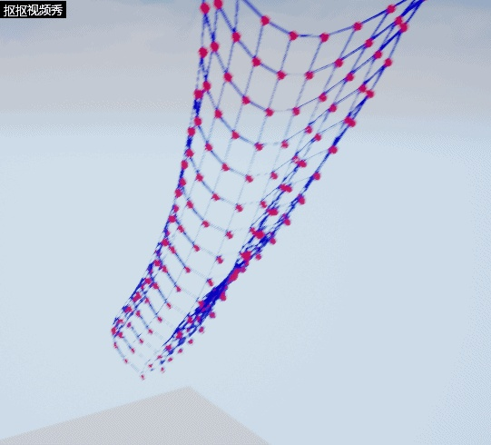

<svg x="16" y="18.5" class="GifPlayer-icon"></svg>

目前（2018年）在游戏中，通常使用韦尔莱积分做动力学模拟。使用韦尔莱积分可以模拟大部分物体的运动。布料，绳子，弹簧，软体，棍子都可以模拟。但是神奇的是，国内几乎找不到什么资料，找到稀少的仅有几篇看了也做不出东西或者不理解。本节将由浅入深一步一步实现各种动力学模拟的效果。

本人只是一个美术，如有错误还请各路大神斧正。

本文的实现环境是：虚幻4引擎 4.19 和VS2017

下面都是c++代码，翻译成c#在unity里也同样适用。

下面是本文的小结顺序：

（1）韦尔莱积分的原理及推导

（2）我们的第一个动力学小球

（3）棍子模拟

（4）三角形稳定的几何结构模拟

（5）约束

（6）布料模拟

（7）发散总结

------

【1】韦尔莱积分的原理和推导

这里有一篇纯数学的推导

关于verlet算法，有人可以简单地讲解下吗？

www.zhihu.com

但是我看了以后还是感觉有点迷，所以我再来按照我的思路再推导一次

首先先考虑一个质点。一个质点的运动在游戏里其实每帧是位置的改变，我们有一个球，在时间  t 的时候在A位置，在时间 t'’  的时候在B位置。我们需要按照一定的方法把它从A位置移动到B位置即可，这就是我们的核心诉求。为了模拟真实世界，所以我们的移动方式需要遵循物理定律，这时候我们就把牛顿老爷子的运动三定律请出来了，我们使用运动三定律来移动我们的质点。

先来一张S-T图，以一个简单的平抛运动为例（规定向上为S正方向）


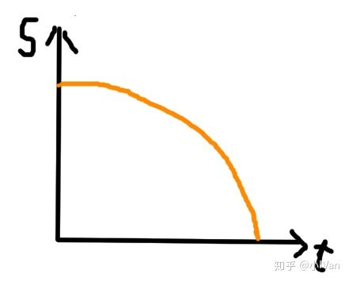图（1）

设：

时间为  

路程为   

速度为  

 时刻的位置为  

​          此时刻的速度为  

 均为向量

将  用泰勒展开式展开

 

由图1所示，速度是s-t函数的一阶导数，加速度是s-t的二阶导数，所以：

 

 

又由牛顿第二定律：

 

f为力，m为质量，a为加速度

所以等式可以化简为

 

同理  可以化简为：

 

由 （1）+（2）可得：

 

这里为什么可以省略约等呢，因为我们的精度要求没那么高，余项的值其实很小可以忽略。

再整理一下

  为质点新的位置  

 为质点现在的位置  

 为质点老的位置  

所以我们的代码就可以写成：

 

代码如下：


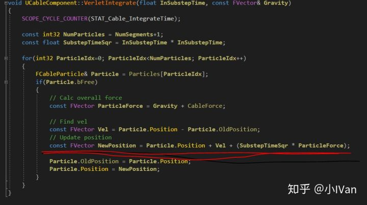

------

【2】我们第一个动力学小球

现在我们有了移动一个质点的物理学方法了，但是这还仅仅不够，我们仅仅有了一个移动质点的方法，我们现在还需要一个质点莱给我们移动，还需要显示它，还需要时间来驱动这个公式。

下面第一步，我们要先有一个质点，所以我们定义了一个质点类型


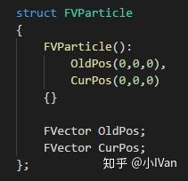

然后定义了一个组件


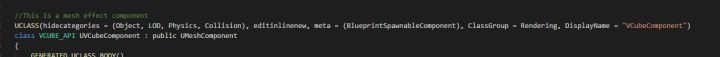

在这个组件中，声明一个质点数TestParticles数组和一个力ForceDir


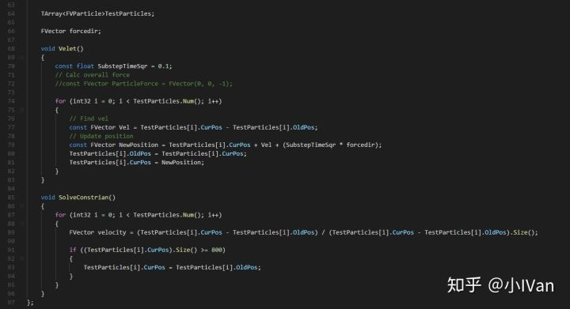

然后是我们的Velet函数，这个函数就是运行我们韦尔莱积分的函数了。为了不让我们的质点掉到无限远处，所以我用一个SolveConstrain函数来限定它，当它到达我定义的地面高度时，新的位置 = 老的位置，这样就相当于它停下不动了。

在组件的构造函数中出事话这些成员变量


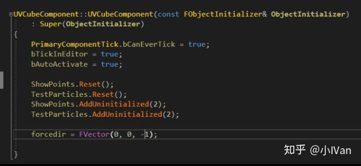

然后在Tick函数中每帧执行我们的函数


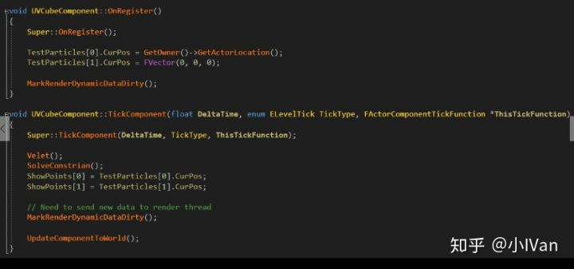

这里面这个ShowPoint是一个数组


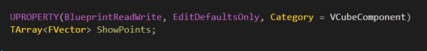

为了让编辑器里能方便拿到我们质点的位置，这样我们就能用这个数组在蓝图脚本里drawdebugpoint了，来辅助我们观察，让我们能看到我们的质点。

在引擎里创建一个Actor，然后把我们写的这个组件加到Actor里，然后在tick函数里每帧以Shwopoints数组draw一个DebugSphere，那么你将会看到如下效果：


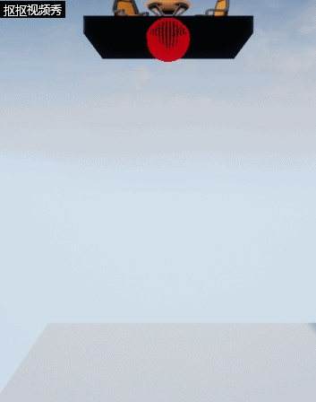

<svg x="16" y="18.5" class="GifPlayer-icon"></svg>

我们的第一个运动的球就出来啦！

完整代码如下：

h文件

```text
#pragma once

#include "CoreMinimal.h"
#include "UObject/ObjectMacros.h"
#include "Components/MeshComponent.h"
#include "VCubeComponent.generated.h"

class UStaticMesh;

struct FVParticle
{
	FVParticle():
		OldPos(0,0,0),
		CurPos(0,0,0)
	{}

	FVector OldPos;
	FVector CurPos;
};


//This is a mesh effect component
UCLASS(hidecategories = (Object, LOD, Physics, Collision), editinlinenew, meta = (BlueprintSpawnableComponent), ClassGroup = Rendering, DisplayName = "VCubeComponent")
class VCUBE_API UVCubeComponent : public UMeshComponent
{
	GENERATED_UCLASS_BODY()

public:
	UPROPERTY(BlueprintReadWrite, EditDefaultsOnly, Category = VCubeComponent)
	TArray<FVector> ShowPoints;

private:
	//------------------------------------------------------//

	TArray<FVParticle>TestParticles;

	FVector forcedir;

	void Velet()
	{
		const float SubstepTimeSqr = 0.1;
		// Calc overall force
		//const FVector ParticleForce = FVector(0, 0, -1);

		for (int32 i = 0; i < TestParticles.Num(); i++)
		{
			// Find vel
			const FVector Vel = TestParticles[i].CurPos - TestParticles[i].OldPos;
			// Update position
			const FVector NewPosition = TestParticles[i].CurPos + Vel + (SubstepTimeSqr * forcedir);
			TestParticles[i].OldPos = TestParticles[i].CurPos;
			TestParticles[i].CurPos = NewPosition;
		}
	}

	void SolveConstrian()
	{
		for (int32 i = 0; i < TestParticles.Num(); i++)
		{
			FVector velocity = (TestParticles[i].CurPos - TestParticles[i].OldPos) / (TestParticles[i].CurPos - TestParticles[i].OldPos).Size();

			if ((TestParticles[i].CurPos).Size() >= 800)
			{
				TestParticles[i].CurPos = TestParticles[i].OldPos;
			}
		}
	}
};
```

cpp文件

```text
#include "VCubeComponent.h"

//////////////////////////////////////////////////////////////////////////

UVCubeComponent::UVCubeComponent(const FObjectInitializer& ObjectInitializer)
	: Super(ObjectInitializer)
{
	PrimaryComponentTick.bCanEverTick = true;
	bTickInEditor = true;
	bAutoActivate = true;

	ShowPoints.Reset();
	TestParticles.Reset();
	ShowPoints.AddUninitialized(2);
	TestParticles.AddUninitialized(2);

	forcedir = FVector(0, 0, -1);

}

void UVCubeComponent::OnRegister()
{
	Super::OnRegister();

	TestParticles[0].CurPos = GetOwner()->GetActorLocation();
	TestParticles[1].CurPos = FVector(0, 0, 0);

	MarkRenderDynamicDataDirty();
}

void UVCubeComponent::TickComponent(float DeltaTime, enum ELevelTick TickType, FActorComponentTickFunction *ThisTickFunction)
{
	Super::TickComponent(DeltaTime, TickType, ThisTickFunction);

	Velet();
	SolveConstrian();
	ShowPoints[0] = TestParticles[0].CurPos;
	ShowPoints[1] = TestParticles[1].CurPos;

	// Need to send new data to render thread
	MarkRenderDynamicDataDirty();

	UpdateComponentToWorld();
}
```

------

【3】棍子模拟

我们有了一个球以后，我们可以尝试再在TestParticles数组里加入第二个质点，然后蓝图里以这个质点再画一次DebugSphere。

我们现在只有了棍子的两端，这时候我们需要一个方式来让棍子的两端不碰在一起


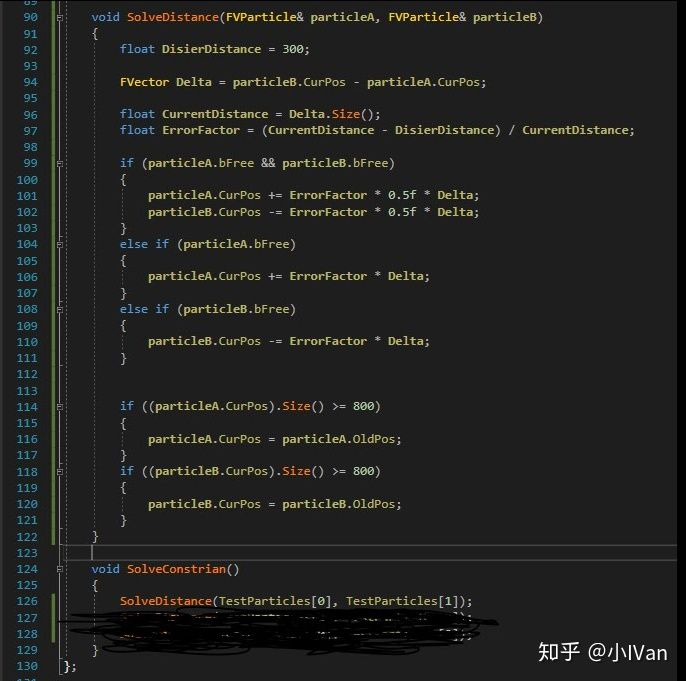

然后在Tick函数中和注册函数中：


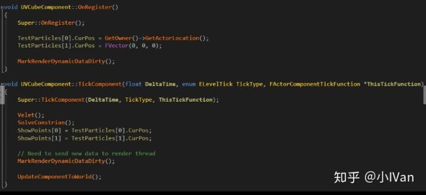

于是你就能看到下面的效果了：


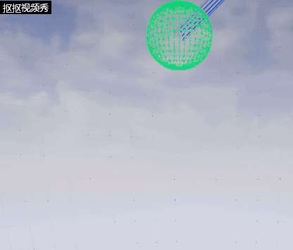

<svg x="16" y="18.5" class="GifPlayer-icon"></svg>

------

【4】三角形稳定结构模拟

有了一根棍子，我们再加两根棍子，就是个闭合三角形

效果如下：


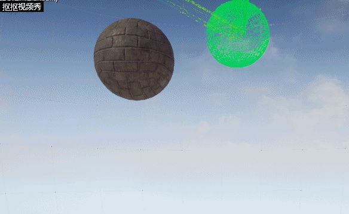

<svg x="16" y="18.5" class="GifPlayer-icon"></svg>

我们在constrain里指认一下就可以了


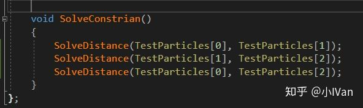

我们还可以加一个点模拟四面体


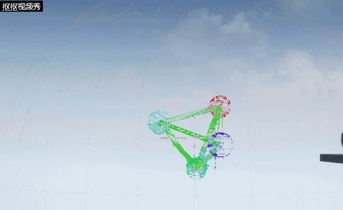

<svg x="16" y="18.5" class="GifPlayer-icon"></svg>

------

【5】约束

目前约束有以下几种方法

（1）棍子约束


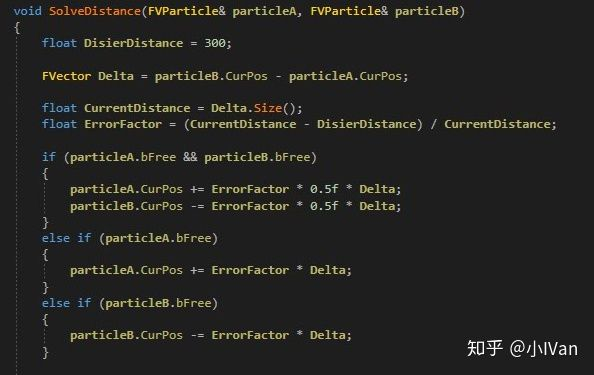

（2）软棍子约束

软棍子约束就是，假设有A--B--C三个质点，我先对AB用棍子约束，在对AC用棍子约束多step一次

（3）钉子约束

就是让粒子不运动，给个bool判断一下是否bFree就可以了


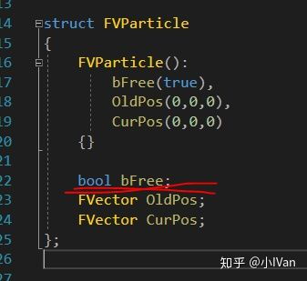

（4）角度约束（群里一哥们儿的代码，他写了我就不想写了）


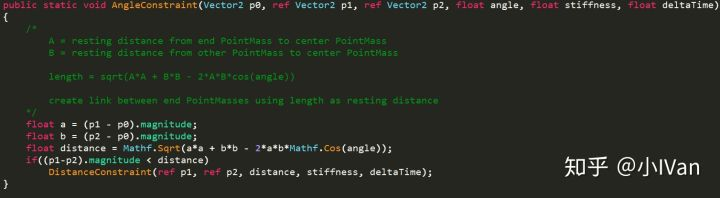

然后你就能做各种约束啦


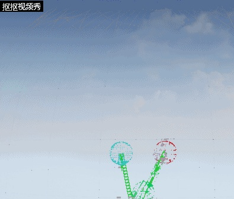

<svg x="16" y="18.5" class="GifPlayer-icon"></svg>

------

【6】布料模拟

主要是约束的构建比较麻烦，需要质点构建横竖两个方向的约束，我的方法是先构建横着的，再构建竖着的。


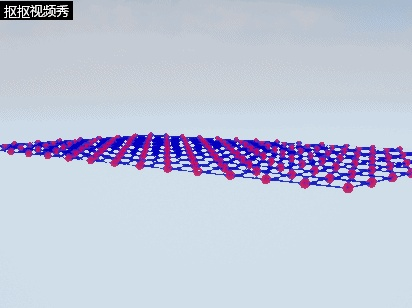

<svg x="16" y="18.5" class="GifPlayer-icon"></svg>


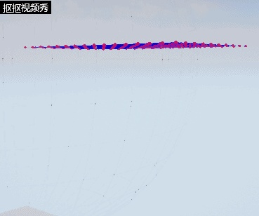

<svg x="16" y="18.5" class="GifPlayer-icon"></svg>


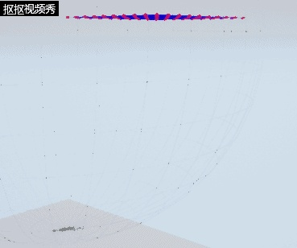

<svg x="16" y="18.5" class="GifPlayer-icon"></svg>

然后我们就能做出布料啦！

------

【7】发散

以上还没有使用角度约束，我们还可以用韦尔来积分制作橡胶棒，弯曲树木的躯干等等效果。还可以制作软体。

布料demo核心代码：

粒子类型和约束类型部分：

```text
struct FVParticle
{
	FVParticle():
		bFree(true),
		OldPos(0,0,0),
		CurPos(0,0,0)
	{}

	bool bFree;
	FVector OldPos;
	FVector CurPos;
};


struct FVConstrain
{
	FVConstrain(){}

	FVParticle* particleA;
	FVParticle* particleB;

	void BuildConstrain(FVParticle& A, FVParticle& B)
	{
		particleA = &A;
		particleB = &B;
	}

	void SolveDistance()
	{
		if (particleA == nullptr || particleB == nullptr) return;

		float DisierDistance = 49;

		FVector Delta = particleB->CurPos - particleA->CurPos;

		float CurrentDistance = Delta.Size();
		float ErrorFactor = (CurrentDistance - DisierDistance) / CurrentDistance;

		if (particleA->bFree && particleB->bFree)
		{
			particleA->CurPos += ErrorFactor * 0.5f * Delta;
			particleB->CurPos -= ErrorFactor * 0.5f * Delta;
		}
		else if (particleA->bFree)
		{
			particleA->CurPos += ErrorFactor * Delta;
		}
		else if (particleB->bFree)
		{
			particleB->CurPos -= ErrorFactor * Delta;
		}

		//Simple collision
		if ((particleA->CurPos).Size() >= 700)
		{
			particleA->CurPos = particleA->OldPos;
		}
		if ((particleB->CurPos).Size() >= 700)
		{
			particleB->CurPos = particleB->OldPos;
		}

	}

	void DrawDebugConstrain(UWorld* world)
	{
		DrawDebugCylinder(world, particleA->CurPos, particleB->CurPos, 1.0, 6, FColor::Blue, false, -1, 0, 1.0);
	}

};
```

组件头文件部分：

```text
	TArray<FVParticle>TestParticles;

	TArray<FVConstrain>Constrains;

	FVector forcedir;

	void Velet()
	{
		const float SubstepTimeSqr = 0.1;
		// Calc overall force
		//const FVector ParticleForce = FVector(0, 0, -1);

		for (int32 i = 0; i < TestParticles.Num(); i++)
		{
			if (TestParticles[i].bFree)
			{
				// Find vel
				const FVector Vel = TestParticles[i].CurPos - TestParticles[i].OldPos;
				// Update position
				const FVector NewPosition = TestParticles[i].CurPos + Vel + (SubstepTimeSqr * forcedir);
				TestParticles[i].OldPos = TestParticles[i].CurPos;
				TestParticles[i].CurPos = NewPosition;
			}
		}
	}

	void SolveDistance(FVParticle& particleA, FVParticle& particleB)
	{
		float DisierDistance = 300;

		FVector Delta = particleB.CurPos - particleA.CurPos;

		float CurrentDistance = Delta.Size();
		float ErrorFactor = (CurrentDistance - DisierDistance) / CurrentDistance;

		if (particleA.bFree && particleB.bFree)
		{
			particleA.CurPos += ErrorFactor * 0.5f * Delta;
			particleB.CurPos -= ErrorFactor * 0.5f * Delta;
		}
		else if (particleA.bFree)
		{
			particleA.CurPos += ErrorFactor * Delta;
		}
		else if (particleB.bFree)
		{
			particleB.CurPos -= ErrorFactor * Delta;
		}

		//Simple collision
		if ((particleA.CurPos).Size() >= 800)
		{
			particleA.CurPos = particleA.OldPos;
		}
		if ((particleB.CurPos).Size() >= 800)
		{
			particleB.CurPos = particleB.OldPos;
		}
	}

	void SolveConstrian()
	{
		for (int32 i = 0; i < Constrains.Num(); i++)
		{
			Constrains[i].SolveDistance();
		}
	}
```

组件cpp部分

```text
UVCubeComponent::UVCubeComponent(const FObjectInitializer& ObjectInitializer)
	: Super(ObjectInitializer)
{
	PrimaryComponentTick.bCanEverTick = true;
	bTickInEditor = true;
	bAutoActivate = true;

	forcedir = FVector(0, 0, -1);

}

void UVCubeComponent::OnRegister()
{
	Super::OnRegister();

	int32 XSideNum = 10;
	int32 YSideNum = 10;
	int32 TestParticleNum = XSideNum * YSideNum;
	int32 ConstrainNum = (4 * TestParticleNum - 2 * XSideNum - 2 * YSideNum) * 0.5;

	ShowPoints.Reset();
	TestParticles.Reset();
	Constrains.Reset();
	ShowPoints.AddUninitialized(TestParticleNum);
	TestParticles.AddUninitialized(TestParticleNum);
	Constrains.AddUninitialized(ConstrainNum);

	for (int32 Y = 0; Y < YSideNum; Y++)
	{
		for (int32 X = 0; X < XSideNum; X ++)
		{
			TestParticles[Y * XSideNum + X].CurPos = FVector(X * 50, Y * 50, 0);

			if ((Y == 0 && X ==0) || (Y == 0 && X == XSideNum - 1))
			{
				//TestParticles[Y * XSideNum + X].bFree = false;
			}
		}
	}

	//  @---@---@---@ constrain
	int32 XXSideConstrainNum = XSideNum - 1;
	int32 XYSideConstrainNum = YSideNum;
	for (int32 Y = 0; Y < XYSideConstrainNum; Y++)
	{
		for (int32 X = 0; X < XXSideConstrainNum; X++)
		{
			Constrains[Y * XXSideConstrainNum + X].BuildConstrain(TestParticles[Y * XSideNum + X], TestParticles[Y * XSideNum + X + 1]);
		}
	}

	//  @||@||@||@ constrain
	int32 YXSideConstrainNum = XSideNum;
	int32 YYSideConstrainNum = YSideNum - 1;
	for (int32 Y = 0; Y < YYSideConstrainNum; Y++)
	{
		for (int32 X = 0; X < YXSideConstrainNum; X++)
		{
			Constrains[Y * YXSideConstrainNum + X + XXSideConstrainNum * XYSideConstrainNum].BuildConstrain(TestParticles[Y * YXSideConstrainNum + X], TestParticles[Y * YXSideConstrainNum + X + XSideNum]);
		}
	}

	MarkRenderDynamicDataDirty();
}

void UVCubeComponent::TickComponent(float DeltaTime, enum ELevelTick TickType, FActorComponentTickFunction *ThisTickFunction)
{
	Super::TickComponent(DeltaTime, TickType, ThisTickFunction);

	Velet();
	SolveConstrian();

	for (int32 i = 0; i < TestParticles.Num(); i++)
	{
		ShowPoints[i] = TestParticles[i].CurPos;
	}

	for (auto cons : Constrains)
	{
		cons.DrawDebugConstrain(GetOwner()->GetWorld());
	}

	// Need to send new data to render thread
	MarkRenderDynamicDataDirty();

	UpdateComponentToWorld();
}
```

我的环境模拟篇还有更深层次的运用

YivanLee：虚幻4渲染编程（环境模拟篇）【第五卷：可交互物理植被模拟 - 上】

zhuanlan.zhihu.com

Enjoy it ！

最后展示一下我拿PhysicsX制作的物理吊桥：


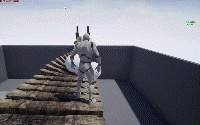

<svg x="16" y="18.5" class="GifPlayer-icon"></svg>


编辑于 2019-05-31
