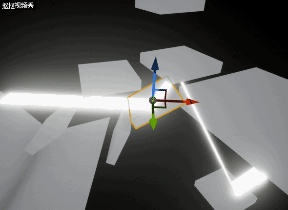
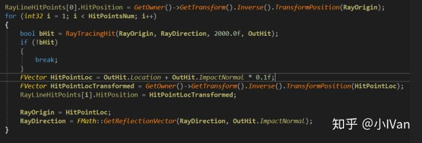
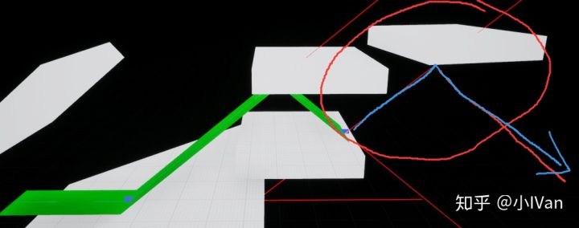
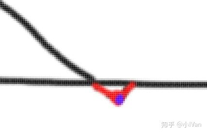
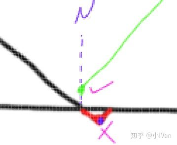

# 虚幻4渲染编程（图元汇编篇）【第三卷：激光反射】


然后还是老规矩先上效果




<svg x="16" y="18.5" class="GifPlayer-icon"></svg>

在第二卷使用4.17版本的引擎搞清楚了整个图元汇编的流程之后，我们这里使用4.19版本的引擎在原来的基础上制作如上效果。

制作这个效果的思路：

（1）先射线检测找到光线的路径

（2）根据上述的路径生成一个模型

还是非常简单的哈。首先是这个路径生成




这里面迭代光线的Origin的时候需要注意一点就是不能以在模型表面的点作为下次光线的发射点，因为在检测的时候可能把这条光线的起始点作为光线的终点。下面是错误的效果：




可以看到光线路径没有正确反弹。原因如下图：




可能因为误差原因，hit点被隐藏在内部或者从模型表面检测，下一个hit点就被认为在模型表面了，起点和终点重叠。所以我们需要沿法线方向把起始点抬高




下面是完整代码：

h文件

```text
// Copyright 1998-2017 Epic Games, Inc. All Rights Reserved.

#pragma once

#include "CoreMinimal.h"
#include "UObject/ObjectMacros.h"
#include "Components/MeshComponent.h"
#include "RayBasicComponent.generated.h"

class FPrimitiveSceneProxy;

USTRUCT(BlueprintType)
struct FRayLineHitPointDesc
{
	GENERATED_USTRUCT_BODY()

	UPROPERTY(EditAnywhere, BlueprintReadWrite, Category = RayLineHitPoint)
	FVector HitPosition;

	UPROPERTY(EditAnywhere, BlueprintReadWrite, Category = RayLineHitPoint)
	FVector HitNextDir;

	UPROPERTY(EditAnywhere, BlueprintReadWrite, Category = RayLineHitPoint)
	int32 HitPointIndex;
};

/** Component that allows you to specify custom triangle mesh geometry */
UCLASS(hidecategories = (Object, LOD, Physics, Collision), editinlinenew, meta = (BlueprintSpawnableComponent), ClassGroup = Rendering, DisplayName = "RayBasicComponent")
class RAYLINECOMPONENT_API URayBasicComponent : public UMeshComponent
{
	GENERATED_UCLASS_BODY()

public:

	UPROPERTY(EditAnywhere, BlueprintReadWrite, Category = RayLineComponent)
	float DebugSec;

private:

	//~ Begin UPrimitiveComponent Interface.
	virtual FPrimitiveSceneProxy* CreateSceneProxy() override;
	//~ End UPrimitiveComponent Interface.

	//~ Begin UMeshComponent Interface.
	virtual int32 GetNumMaterials() const override;
	//~ End UMeshComponent Interface.

	//~ Begin USceneComponent Interface.
	virtual FBoxSphereBounds CalcBounds(const FTransform& LocalToWorld) const override;
	//~ Begin USceneComponent Interface.

	//~ Begin UActorComponent Interface.
	virtual void OnRegister() override;
	virtual void TickComponent(float DeltaTime, enum ELevelTick TickType, FActorComponentTickFunction *ThisTickFunction) override;
	virtual void SendRenderDynamicData_Concurrent() override;
	virtual void CreateRenderState_Concurrent() override;
	//~ End UActorComponent Interface.

	TArray<FRayLineHitPointDesc> RayLineHitPoints;

	bool RayTracingHit(FVector RayOrigin, FVector RayDirection, float RayMarhingLength, FHitResult& OutHitResoult);

	friend class FRayLineMeshSceneProxy;
};
```

cpp文件

```text
// Copyright 1998-2017 Epic Games, Inc. All Rights Reserved. 

#include "RayBasicComponent.h"
#include "RenderingThread.h"
#include "RenderResource.h"
#include "PrimitiveViewRelevance.h"
#include "PrimitiveSceneProxy.h"
#include "VertexFactory.h"
#include "MaterialShared.h"
#include "Engine/CollisionProfile.h"
#include "Materials/Material.h"
#include "LocalVertexFactory.h"
#include "SceneManagement.h"
#include "DynamicMeshBuilder.h"
#include "EngineGlobals.h"
#include "Engine/Engine.h"

#include "Runtime/Engine/Classes/Kismet/KismetSystemLibrary.h"

/** Index Buffer */
class FRayLineMeshIndexBuffer : public FIndexBuffer
{
public:
	
	virtual void InitRHI() override
	{
		FRHIResourceCreateInfo CreateInfo;
		IndexBufferRHI = RHICreateIndexBuffer(sizeof(int32), NumIndices * sizeof(int32), BUF_Dynamic, CreateInfo);
	}

	int32 NumIndices;
};

struct FRayLineDynamicData
{
	TArray<FVector> HitpointsPosition;
	//You can also define some other data to send
};

/** Scene proxy */
class FRayLineMeshSceneProxy : public FPrimitiveSceneProxy
{
public:

	SIZE_T GetTypeHash() const override
	{
		static size_t UniquePointer;
		return reinterpret_cast<size_t>(&UniquePointer);
	}

	FRayLineMeshSceneProxy(URayBasicComponent* Component)
		: FPrimitiveSceneProxy(Component)
		, MaterialRelevance(Component->GetMaterialRelevance(GetScene().GetFeatureLevel()))
		, VertexFactory(GetScene().GetFeatureLevel(), "FRayLineMeshSceneProxy")
	{

		VertexBuffers.InitWithDummyData(&VertexFactory, GetRequiredVertexCount());
		IndexBuffer.NumIndices = GetRequiredIndexCount();

		const FColor VertexColor(255, 255, 255);

		// Enqueue initialization of render resource
		BeginInitResource(&IndexBuffer);

		// Grab material
		Material = Component->GetMaterial(0);
		if (Material == NULL)
		{
			Material = UMaterial::GetDefaultMaterial(MD_Surface);
		}

	}

	void BuildMesh(FRayLineDynamicData* NewDynamicData)
	{
		
		TArray<FDynamicMeshVertex> Vertices;
		TArray<int32> Indices;
		for (int32 i = 0; i < NewDynamicData->HitpointsPosition.Num(); i++)
		{
			FDynamicMeshVertex newvert0;
			newvert0.Position = NewDynamicData->HitpointsPosition[i] + FVector(0, 100, 0);
			newvert0.TextureCoordinate[0] = FVector2D(i / 10, 1);

			FDynamicMeshVertex newvert1;
			newvert1.Position = NewDynamicData->HitpointsPosition[i] + FVector(0, -100, 0);
			newvert1.TextureCoordinate[0] = FVector2D(i / 10, 0);

			Vertices.Add(newvert0);
			Vertices.Add(newvert1);
		}
		for (int32 i = 0; i < NewDynamicData->HitpointsPosition.Num() - 1; i++)
		{
			Indices.Add(2 * i);
			Indices.Add(2 * i + 2);
			Indices.Add(2 * i + 1);
			Indices.Add(2 * i + 2);
			Indices.Add(2 * i + 3);
			Indices.Add(2 * i + 1);
		}
		
		check(Vertices.Num() == GetRequiredVertexCount());
		check(Indices.Num() == GetRequiredIndexCount());


		for (int i = 0; i < Vertices.Num(); i++)
		{
			const FDynamicMeshVertex& Vertex = Vertices[i];

			VertexBuffers.PositionVertexBuffer.VertexPosition(i) = Vertex.Position;
			VertexBuffers.StaticMeshVertexBuffer.SetVertexTangents(i, Vertex.TangentX, Vertex.GetTangentY(), Vertex.TangentZ);
			VertexBuffers.StaticMeshVertexBuffer.SetVertexUV(i, 0, Vertex.TextureCoordinate[0]);
			VertexBuffers.ColorVertexBuffer.VertexColor(i) = Vertex.Color;
		}

		{
			auto& VertexBuffer = VertexBuffers.PositionVertexBuffer;
			void* VertexBufferData = RHILockVertexBuffer(VertexBuffer.VertexBufferRHI, 0, VertexBuffer.GetNumVertices() * VertexBuffer.GetStride(), RLM_WriteOnly);
			FMemory::Memcpy(VertexBufferData, VertexBuffer.GetVertexData(), VertexBuffer.GetNumVertices() * VertexBuffer.GetStride());
			RHIUnlockVertexBuffer(VertexBuffer.VertexBufferRHI);
		}

		{
			auto& VertexBuffer = VertexBuffers.ColorVertexBuffer;
			void* VertexBufferData = RHILockVertexBuffer(VertexBuffer.VertexBufferRHI, 0, VertexBuffer.GetNumVertices() * VertexBuffer.GetStride(), RLM_WriteOnly);
			FMemory::Memcpy(VertexBufferData, VertexBuffer.GetVertexData(), VertexBuffer.GetNumVertices() * VertexBuffer.GetStride());
			RHIUnlockVertexBuffer(VertexBuffer.VertexBufferRHI);
		}

		{
			auto& VertexBuffer = VertexBuffers.StaticMeshVertexBuffer;
			void* VertexBufferData = RHILockVertexBuffer(VertexBuffer.TangentsVertexBuffer.VertexBufferRHI, 0, VertexBuffer.GetTangentSize(), RLM_WriteOnly);
			FMemory::Memcpy(VertexBufferData, VertexBuffer.GetTangentData(), VertexBuffer.GetTangentSize());
			RHIUnlockVertexBuffer(VertexBuffer.TangentsVertexBuffer.VertexBufferRHI);
		}

		{
			auto& VertexBuffer = VertexBuffers.StaticMeshVertexBuffer;
			void* VertexBufferData = RHILockVertexBuffer(VertexBuffer.TexCoordVertexBuffer.VertexBufferRHI, 0, VertexBuffer.GetTexCoordSize(), RLM_WriteOnly);
			FMemory::Memcpy(VertexBufferData, VertexBuffer.GetTexCoordData(), VertexBuffer.GetTexCoordSize());
			RHIUnlockVertexBuffer(VertexBuffer.TexCoordVertexBuffer.VertexBufferRHI);
		}

		void* IndexBufferData = RHILockIndexBuffer(IndexBuffer.IndexBufferRHI, 0, Indices.Num() * sizeof(int32), RLM_WriteOnly);
		FMemory::Memcpy(IndexBufferData, &Indices[0], Indices.Num() * sizeof(int32));
		RHIUnlockIndexBuffer(IndexBuffer.IndexBufferRHI);
	}

	/** Called on render thread to assign new dynamic data */
	void SetDynamicData_RenderThread(FRayLineDynamicData* NewDynamicData)
	{
		check(IsInRenderingThread());

		BuildMesh(NewDynamicData);

	}

	virtual ~FRayLineMeshSceneProxy()
	{
		VertexBuffers.PositionVertexBuffer.ReleaseResource();
		VertexBuffers.StaticMeshVertexBuffer.ReleaseResource();
		VertexBuffers.ColorVertexBuffer.ReleaseResource();
		IndexBuffer.ReleaseResource();
		VertexFactory.ReleaseResource();
	}

	int32 GetRequiredVertexCount() const
	{
		return 20;
	}

	int32 GetRequiredIndexCount() const
	{
		return 54;
	}

	virtual void GetDynamicMeshElements(const TArray<const FSceneView*>& Views, const FSceneViewFamily& ViewFamily, uint32 VisibilityMap, FMeshElementCollector& Collector) const override
	{
		QUICK_SCOPE_CYCLE_COUNTER(STAT_FRayLineMeshSceneProxy_GetDynamicMeshElements);

		const bool bWireframe = AllowDebugViewmodes() && ViewFamily.EngineShowFlags.Wireframe;

		auto WireframeMaterialInstance = new FColoredMaterialRenderProxy(
			GEngine->WireframeMaterial ? GEngine->WireframeMaterial->GetRenderProxy(IsSelected()) : NULL,
			FLinearColor(0, 0.5f, 1.f)
		);

		Collector.RegisterOneFrameMaterialProxy(WireframeMaterialInstance);

		FMaterialRenderProxy* MaterialProxy = NULL;
		if (bWireframe)
		{
			MaterialProxy = WireframeMaterialInstance;
		}
		else
		{
			MaterialProxy = Material->GetRenderProxy(IsSelected());
		}

		for (int32 ViewIndex = 0; ViewIndex < Views.Num(); ViewIndex++)
		{
			if (VisibilityMap & (1 << ViewIndex))
			{
				const FSceneView* View = Views[ViewIndex];
				// Draw the mesh.
				FMeshBatch& Mesh = Collector.AllocateMesh();
				FMeshBatchElement& BatchElement = Mesh.Elements[0];
				BatchElement.IndexBuffer = &IndexBuffer;
				Mesh.bWireframe = bWireframe;
				Mesh.VertexFactory = &VertexFactory;
				Mesh.MaterialRenderProxy = MaterialProxy;
				BatchElement.PrimitiveUniformBuffer = CreatePrimitiveUniformBufferImmediate(GetLocalToWorld(), GetBounds(), GetLocalBounds(), true, UseEditorDepthTest());
				BatchElement.FirstIndex = 0;
				BatchElement.NumPrimitives = GetRequiredIndexCount() / 3;
				BatchElement.MinVertexIndex = 0;
				BatchElement.MaxVertexIndex = GetRequiredVertexCount();
				Mesh.ReverseCulling = IsLocalToWorldDeterminantNegative();
				Mesh.Type = PT_TriangleList;
				Mesh.DepthPriorityGroup = SDPG_World;
				Mesh.bCanApplyViewModeOverrides = false;
				Collector.AddMesh(ViewIndex, Mesh);
			}
		}
	}

	virtual FPrimitiveViewRelevance GetViewRelevance(const FSceneView* View) const override
	{
		FPrimitiveViewRelevance Result;
		Result.bDrawRelevance = IsShown(View);
		Result.bShadowRelevance = IsShadowCast(View);
		Result.bDynamicRelevance = true;
		Result.bRenderInMainPass = ShouldRenderInMainPass();
		Result.bUsesLightingChannels = GetLightingChannelMask() != GetDefaultLightingChannelMask();
		Result.bRenderCustomDepth = ShouldRenderCustomDepth();
		MaterialRelevance.SetPrimitiveViewRelevance(Result);
		return Result;
	}

	virtual bool CanBeOccluded() const override
	{
		return !MaterialRelevance.bDisableDepthTest;
	}

	virtual uint32 GetMemoryFootprint(void) const override { return(sizeof(*this) + GetAllocatedSize()); }

	uint32 GetAllocatedSize(void) const { return(FPrimitiveSceneProxy::GetAllocatedSize()); }

private:

	UMaterialInterface * Material;
	FStaticMeshVertexBuffers VertexBuffers;
	FRayLineMeshIndexBuffer IndexBuffer;
	FLocalVertexFactory VertexFactory;

	FMaterialRelevance MaterialRelevance;
};

//////////////////////////////////////////////////////////////////////////

URayBasicComponent::URayBasicComponent(const FObjectInitializer& ObjectInitializer)
	: Super(ObjectInitializer)
{
	PrimaryComponentTick.bCanEverTick = true;
	bTickInEditor = true;
	bAutoActivate = true;

	DebugSec = 200.0f;

}

void URayBasicComponent::OnRegister()
{
	Super::OnRegister();

	RayLineHitPoints.Reset();
	RayLineHitPoints.AddUninitialized(10);

	MarkRenderDynamicDataDirty();
}

bool URayBasicComponent::RayTracingHit(FVector RayOrigin, FVector RayDirection, float RayMarhingLength, FHitResult& OutHitResoult)
{
	const TArray<AActor*>IgActor;
	FVector startpos = RayOrigin;
	FVector endpos = RayOrigin + RayDirection * RayMarhingLength;
	return UKismetSystemLibrary::LineTraceSingle(
		GetOwner(),
		startpos,
		endpos,
		ETraceTypeQuery::TraceTypeQuery1,
		false,
		IgActor,
		EDrawDebugTrace::Type::None,
		OutHitResoult,
		true,
		FLinearColor::Blue,
		FLinearColor::Red,
		1.0f);
}

void URayBasicComponent::TickComponent(float DeltaTime, enum ELevelTick TickType, FActorComponentTickFunction *ThisTickFunction)
{
	Super::TickComponent(DeltaTime, TickType, ThisTickFunction);

	//RayLineHitPoints.Reset();
	FVector RayDirection = FVector(1.0f, 0.0f, 0.0f);
	FVector RayOrigin = GetOwner()->GetActorLocation();
	int32 HitPointsNum = 10;
	FHitResult OutHit;
	
	RayLineHitPoints[0].HitPosition = GetOwner()->GetTransform().Inverse().TransformPosition(RayOrigin);
	for (int32 i = 1; i < HitPointsNum; i++)
	{
		bool bHit = RayTracingHit(RayOrigin, RayDirection, 2000.0f, OutHit);
		if (!bHit)
		{
			break;
		}
		FVector HitPointLoc = OutHit.Location + OutHit.ImpactNormal * 0.1f;
		FVector HitPointLocTransformed = GetOwner()->GetTransform().Inverse().TransformPosition(HitPointLoc);
		RayLineHitPoints[i].HitPosition = HitPointLocTransformed;

		RayOrigin = HitPointLoc;
		RayDirection = FMath::GetReflectionVector(RayDirection, OutHit.ImpactNormal);
	}

	// Need to send new data to render thread
	MarkRenderDynamicDataDirty();

	UpdateComponentToWorld();
}

void URayBasicComponent::CreateRenderState_Concurrent()
{
	Super::CreateRenderState_Concurrent();

	SendRenderDynamicData_Concurrent();
}

void URayBasicComponent::SendRenderDynamicData_Concurrent()
{
	if (SceneProxy)
	{
		FRayLineDynamicData* NewDynamicData = new FRayLineDynamicData;
		NewDynamicData->HitpointsPosition.AddUninitialized(RayLineHitPoints.Num());
		for (int32 i = 0; i < RayLineHitPoints.Num(); i++)
		{
			NewDynamicData->HitpointsPosition[i] = RayLineHitPoints[i].HitPosition;
		}

		// Enqueue command to send to render thread
		ENQUEUE_UNIQUE_RENDER_COMMAND_TWOPARAMETER(
			FSendRayBasicComponentDynamicData,
			FRayLineMeshSceneProxy*, CableSceneProxy, (FRayLineMeshSceneProxy*)SceneProxy,
			FRayLineDynamicData*, NewDynamicData, NewDynamicData,
			{
				CableSceneProxy->SetDynamicData_RenderThread(NewDynamicData);
			});
	}
}

FPrimitiveSceneProxy* URayBasicComponent::CreateSceneProxy()
{
	return new FRayLineMeshSceneProxy(this);
}

int32 URayBasicComponent::GetNumMaterials() const
{
	return 1;
}

FBoxSphereBounds URayBasicComponent::CalcBounds(const FTransform& LocalToWorld) const
{
	FBoxSphereBounds NewBounds;
	NewBounds.Origin = FVector::ZeroVector;
	NewBounds.BoxExtent = FVector(HALF_WORLD_MAX, HALF_WORLD_MAX, HALF_WORLD_MAX);
	NewBounds.SphereRadius = FMath::Sqrt(3.0f * FMath::Square(HALF_WORLD_MAX));
	return NewBounds;
}
```

Enjoy it！
