# 虚幻4渲染编程（图元汇编篇）【第二卷：使用自己程序化生成的模型】


本节使用的是UE4.17，如果使用4.19或以上版本的话会有一些不同。UE4.19又把这些封装了一下。从原理上为了解释清楚我还是选择了比较原始的4.17版本。后面的章节会把它改造成现在的版本。

还是先上效果吧

上篇文章分析了虚幻自带的CableComponent并且在unity中重现了CableComponent，这篇将开始着手自己进行图元汇编的编程。我们先做一个简单的，后续再慢慢做一些比较好玩的图元汇编相关的效果。


<svg x="16" y="18.5" class="GifPlayer-icon"></svg>

这个GIF在网页上的表现优点奇怪，我这里看到有残影，其实是没有的哈


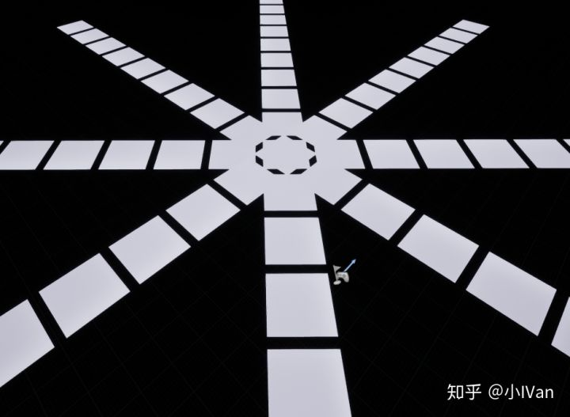

首先我们先建一个新的插件


我给它命名为RayLine，你也可以给它叫个什么其他名字，然后在插件里加一个头文件和源文件


然后在Build.cs文件里引入我们需要的模块


然后我们在RayBasicComponent.h中键入我们的新类型


我随便定义了一个结构体。

然后我们来定义我们的组件类型


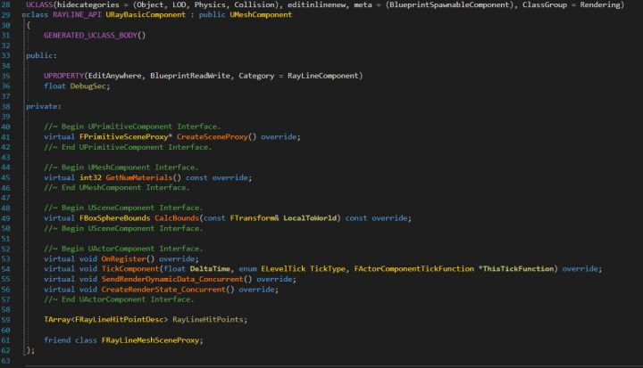

我们的这个类型继承自UMeshComponent，然后有一个RAYLINE_API类导出宏，这个宏的名字必须和我们模块的名字保持一致，我们的模块就是我们的插件啦。

然后我们声明了一个GENERATED_UCLASS_BODY()，这个宏会帮我们自动生成默认构造函数，我们这里如果再敲构造函数，编译器就会报错了，所以我们这里什么都不需要干，如果我们这里使用的是GENERATED_BODY()宏的话就需要写构造函数了。

然后我声明了一个变量DebugSec并给他UPROPERTY宏，这样编辑器就能认识它了，它也会被纳入垃圾回收里。

然后我们重写了virtual FPrimitiveSceneProxy* CreateSceneProxy() override函数，这个函数创建场景代理，场景代理的作用就是负责在渲染线程端把逻辑线程这边的数据压入渲染管线，下面我画个图感受一下：


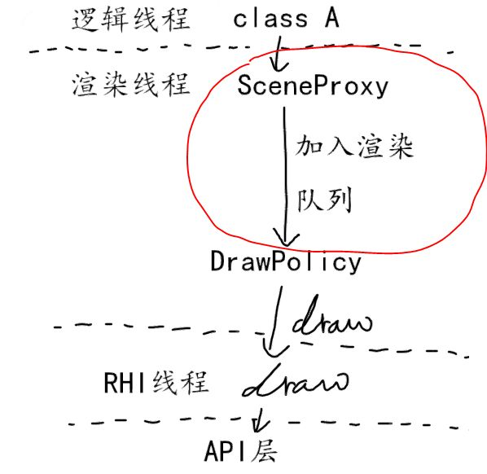

我们这里只需要管到把我们的模型加入渲染队列就可以了（红圈圈起来的部分），至于后面的事情就是引擎帮我们处理了，当然如果你不想使用引擎的渲染管线把后面一大片自己撸一套新机制出来也行。

然后来到我们的RayBasicComponent.cpp

我们先把需要的头文件包含进来


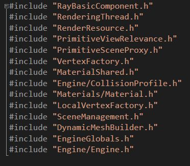

然后定义我们的顶点缓冲区，注意这个和Shader篇的顶点着色器是两个东西哈。


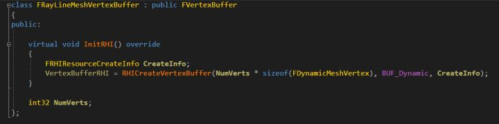

然后是我们的索引缓冲区


然后是顶点输入布局


然后是一个结构体，把它视作一个数据包，方便我们从逻辑层把数据们打包一起发送到渲染线程


然后有了这些资源后，我们就可以开始实现我们的场景代理了。


我们先在我们的代理类中加入一些成员


然后就是我们的构造函数了


这里它派生自FPrimitiveSceneProxy，然后在构造函数里我们初始化了顶点缓存的顶点数量然后初始化了我们的顶点缓存，输入布局工厂，索引缓存

这里的GetRequriedVertexCount函数我直接先返回几个值


然后是析构函数，我们要自己控制释放资源。


然后是GetDynamicMeshElement函数，这个函数负责把模型数据加入到绘制队列，注意我们仅到此为止，后面真正的绘制都不是我们管的了。


这里需要注意一下：


红线勾画的这里的树木要和顶点缓存和索引缓存的数目有关系了，一定要匹配，不如会报错。

然后是以下四个函数


因为我们这个是动态的模型，所以需要有一个函数负责在渲染线程接收逻辑层发送过来的数据


然后是BuildMesh函数


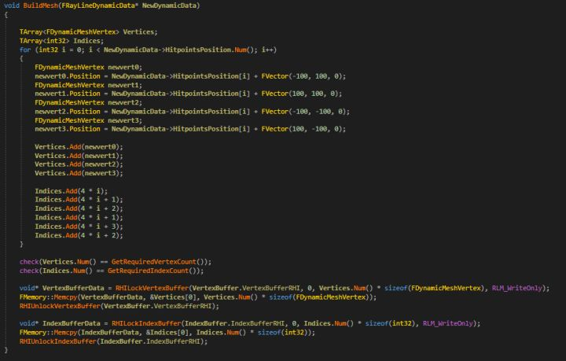

完成了场景代理，我们下一步就是开始实现URayBasicComponent部分

先是构造函数


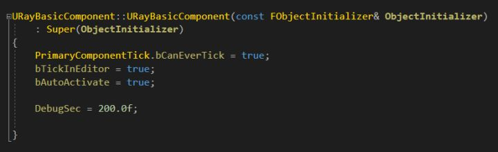

一定要把三个开关打开，这样才能调用ComponentTick这些函数来更新我们的组件。


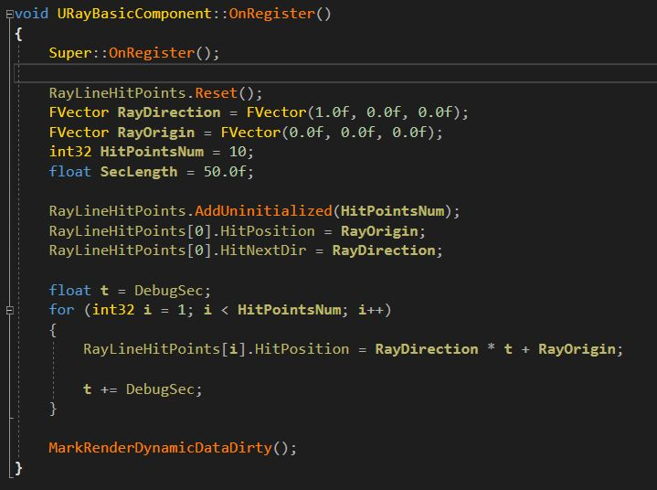

然后是注册组件，注意最后的MarkRenderDynamicDataDirty();这个函数，这个函数会开启一个开关，让引擎每帧更新所有组件渲染状态的时候，会更新到我们的组件。

然后是tickcomponent


这个MarkRenderDynamicDataDirty();函数如果被调用，为组件开启了渲染状态开关，那么引擎就会自己调用我们下面的两个函数了


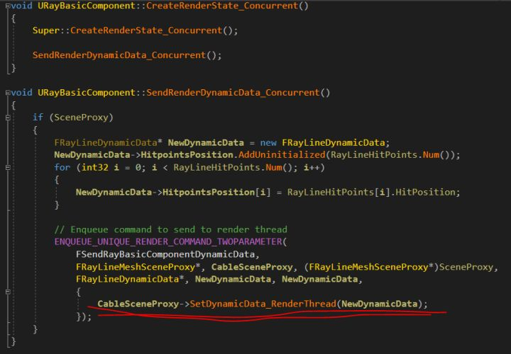

这两个函数才是真正负责把逻辑线程的数据发送到渲染线程的。注意红线勾的那个函数就是我们自己在场景代理里自己定义的接收函数。


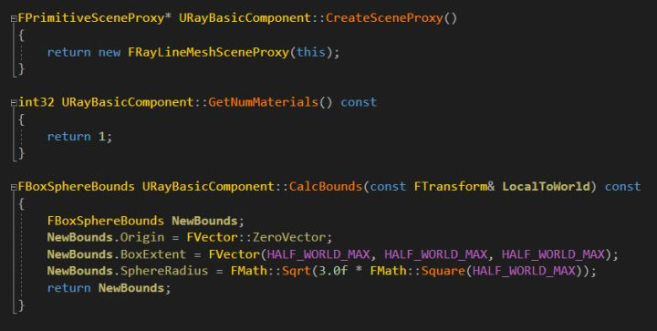

然后是创建场景代理，获取材质，构建包围盒的操作了。

至此我们就通过一个简短的框架自己编辑了顶点缓存和索引缓存然后上传它并且渲染它，这只是个简单的框架，后面我们将慢慢基于此框架做更多有趣的效果。

下面是完整代码：

RayBasicComponent.h

```text
// Copyright 1998-2017 Epic Games, Inc. All Rights Reserved.

#pragma once

#include "CoreMinimal.h"
#include "UObject/ObjectMacros.h"
#include "Components/MeshComponent.h"
#include "RayBasicComponent.generated.h"

class FPrimitiveSceneProxy;

USTRUCT(BlueprintType)
struct FRayLineHitPointDesc
{
	GENERATED_USTRUCT_BODY()

	UPROPERTY(EditAnywhere, BlueprintReadWrite, Category = RayLineHitPoint)
	FVector HitPosition;

	UPROPERTY(EditAnywhere, BlueprintReadWrite, Category = RayLineHitPoint)
	FVector HitNextDir;

	UPROPERTY(EditAnywhere, BlueprintReadWrite, Category = RayLineHitPoint)
	int32 HitPointIndex;
};

/** Component that allows you to specify custom triangle mesh geometry */
UCLASS(hidecategories = (Object, LOD, Physics, Collision), editinlinenew, meta = (BlueprintSpawnableComponent), ClassGroup = Rendering)
class RAYLINE_API URayBasicComponent : public UMeshComponent
{
	GENERATED_UCLASS_BODY()

public:

	UPROPERTY(EditAnywhere, BlueprintReadWrite, Category = RayLineComponent)
	float DebugSec;

private:

	//~ Begin UPrimitiveComponent Interface.
	virtual FPrimitiveSceneProxy* CreateSceneProxy() override;
	//~ End UPrimitiveComponent Interface.

	//~ Begin UMeshComponent Interface.
	virtual int32 GetNumMaterials() const override;
	//~ End UMeshComponent Interface.

	//~ Begin USceneComponent Interface.
	virtual FBoxSphereBounds CalcBounds(const FTransform& LocalToWorld) const override;
	//~ Begin USceneComponent Interface.

	//~ Begin UActorComponent Interface.
	virtual void OnRegister() override;
	virtual void TickComponent(float DeltaTime, enum ELevelTick TickType, FActorComponentTickFunction *ThisTickFunction) override;
	virtual void SendRenderDynamicData_Concurrent() override;
	virtual void CreateRenderState_Concurrent() override;
	//~ End UActorComponent Interface.

	TArray<FRayLineHitPointDesc> RayLineHitPoints;

	friend class FRayLineMeshSceneProxy;
};
```

RayBasicComponent.cpp

```text
// Copyright 1998-2017 Epic Games, Inc. All Rights Reserved. 

#include "RayBasicComponent.h"
#include "RenderingThread.h"
#include "RenderResource.h"
#include "PrimitiveViewRelevance.h"
#include "PrimitiveSceneProxy.h"
#include "VertexFactory.h"
#include "MaterialShared.h"
#include "Engine/CollisionProfile.h"
#include "Materials/Material.h"
#include "LocalVertexFactory.h"
#include "SceneManagement.h"
#include "DynamicMeshBuilder.h"
#include "EngineGlobals.h"
#include "Engine/Engine.h"

/** Vertex Buffer */
class FRayLineMeshVertexBuffer : public FVertexBuffer
{
public:
	
	virtual void InitRHI() override
	{
		FRHIResourceCreateInfo CreateInfo;
		VertexBufferRHI = RHICreateVertexBuffer(NumVerts * sizeof(FDynamicMeshVertex), BUF_Dynamic, CreateInfo);
	}

	int32 NumVerts;
};

/** Index Buffer */
class FRayLineMeshIndexBuffer : public FIndexBuffer
{
public:
	
	virtual void InitRHI() override
	{
		FRHIResourceCreateInfo CreateInfo;
		IndexBufferRHI = RHICreateIndexBuffer(sizeof(int32), NumIndices * sizeof(int32), BUF_Dynamic, CreateInfo);
	}

	int32 NumIndices;
};

/** Vertex Factory */
class FCustomMeshVertexFactory : public FLocalVertexFactory
{
public:

	FCustomMeshVertexFactory()
	{}


	/** Initialization */
	void Init(const FRayLineMeshVertexBuffer* VertexBuffer)
	{
		if (IsInRenderingThread())
		{
			// Initialize the vertex factory's stream components.
			FDataType NewData;
			NewData.PositionComponent = STRUCTMEMBER_VERTEXSTREAMCOMPONENT(VertexBuffer, FDynamicMeshVertex, Position, VET_Float3);
			NewData.TextureCoordinates.Add(
				FVertexStreamComponent(VertexBuffer, STRUCT_OFFSET(FDynamicMeshVertex, TextureCoordinate), sizeof(FDynamicMeshVertex), VET_Float2)
			);
			NewData.TangentBasisComponents[0] = STRUCTMEMBER_VERTEXSTREAMCOMPONENT(VertexBuffer, FDynamicMeshVertex, TangentX, VET_PackedNormal);
			NewData.TangentBasisComponents[1] = STRUCTMEMBER_VERTEXSTREAMCOMPONENT(VertexBuffer, FDynamicMeshVertex, TangentZ, VET_PackedNormal);
			SetData(NewData);
		}
		else
		{
			ENQUEUE_UNIQUE_RENDER_COMMAND_TWOPARAMETER(
				InitCableVertexFactory,
				FCustomMeshVertexFactory*, VertexFactory, this,
				const FRayLineMeshVertexBuffer*, VertexBuffer, VertexBuffer,
				{
					// Initialize the vertex factory's stream components.
					FDataType NewData;
			NewData.PositionComponent = STRUCTMEMBER_VERTEXSTREAMCOMPONENT(VertexBuffer,FDynamicMeshVertex,Position,VET_Float3);
			NewData.TextureCoordinates.Add(
				FVertexStreamComponent(VertexBuffer,STRUCT_OFFSET(FDynamicMeshVertex,TextureCoordinate),sizeof(FDynamicMeshVertex),VET_Float2)
			);
			NewData.TangentBasisComponents[0] = STRUCTMEMBER_VERTEXSTREAMCOMPONENT(VertexBuffer,FDynamicMeshVertex,TangentX,VET_PackedNormal);
			NewData.TangentBasisComponents[1] = STRUCTMEMBER_VERTEXSTREAMCOMPONENT(VertexBuffer,FDynamicMeshVertex,TangentZ,VET_PackedNormal);
			VertexFactory->SetData(NewData);
				});
		}
	}
};

struct FRayLineDynamicData
{
	TArray<FVector> HitpointsPosition;
	//You can also define some other data to send
};

/** Scene proxy */
class FRayLineMeshSceneProxy : public FPrimitiveSceneProxy
{
public:

	FRayLineMeshSceneProxy(URayBasicComponent* Component)
		: FPrimitiveSceneProxy(Component)
		, MaterialRelevance(Component->GetMaterialRelevance(GetScene().GetFeatureLevel()))
	{

		VertexBuffer.NumVerts = GetRequiredVertexCount();
		IndexBuffer.NumIndices = GetRequiredIndexCount();

		const FColor VertexColor(255, 255, 255);

		// Init vertex factory
		VertexFactory.Init(&VertexBuffer);

		// Enqueue initialization of render resource
		BeginInitResource(&VertexBuffer);
		BeginInitResource(&IndexBuffer);
		BeginInitResource(&VertexFactory);

		// Grab material
		Material = Component->GetMaterial(0);
		if (Material == NULL)
		{
			Material = UMaterial::GetDefaultMaterial(MD_Surface);
		}

	}

	void BuildMesh(FRayLineDynamicData* NewDynamicData)
	{
		
		TArray<FDynamicMeshVertex> Vertices;
		TArray<int32> Indices;
		for (int32 i = 0; i < NewDynamicData->HitpointsPosition.Num(); i++)
		{
			FDynamicMeshVertex newvert0;
			newvert0.Position = NewDynamicData->HitpointsPosition[i] + FVector(-100, 100, 0);
			FDynamicMeshVertex newvert1;
			newvert1.Position = NewDynamicData->HitpointsPosition[i] + FVector(100, 100, 0);
			FDynamicMeshVertex newvert2;
			newvert2.Position = NewDynamicData->HitpointsPosition[i] + FVector(-100, -100, 0);
			FDynamicMeshVertex newvert3;
			newvert3.Position = NewDynamicData->HitpointsPosition[i] + FVector(100, -100, 0);

			Vertices.Add(newvert0);
			Vertices.Add(newvert1);
			Vertices.Add(newvert2);
			Vertices.Add(newvert3);

			Indices.Add(4 * i);
			Indices.Add(4 * i + 1);
			Indices.Add(4 * i + 2);
			Indices.Add(4 * i + 1);
			Indices.Add(4 * i + 3);
			Indices.Add(4 * i + 2);
		}
		
		check(Vertices.Num() == GetRequiredVertexCount());
		check(Indices.Num() == GetRequiredIndexCount());

		void* VertexBufferData = RHILockVertexBuffer(VertexBuffer.VertexBufferRHI, 0, Vertices.Num() * sizeof(FDynamicMeshVertex), RLM_WriteOnly);
		FMemory::Memcpy(VertexBufferData, &Vertices[0], Vertices.Num() * sizeof(FDynamicMeshVertex));
		RHIUnlockVertexBuffer(VertexBuffer.VertexBufferRHI);

		void* IndexBufferData = RHILockIndexBuffer(IndexBuffer.IndexBufferRHI, 0, Indices.Num() * sizeof(int32), RLM_WriteOnly);
		FMemory::Memcpy(IndexBufferData, &Indices[0], Indices.Num() * sizeof(int32));
		RHIUnlockIndexBuffer(IndexBuffer.IndexBufferRHI);
	}

	/** Called on render thread to assign new dynamic data */
	void SetDynamicData_RenderThread(FRayLineDynamicData* NewDynamicData)
	{
		check(IsInRenderingThread());

		BuildMesh(NewDynamicData);

	}

	virtual ~FRayLineMeshSceneProxy()
	{
		VertexBuffer.ReleaseResource();
		IndexBuffer.ReleaseResource();
		VertexFactory.ReleaseResource();
	}

	int32 GetRequiredVertexCount() const
	{
		return 40;
	}

	int32 GetRequiredIndexCount() const
	{
		return 60;
	}

	virtual void GetDynamicMeshElements(const TArray<const FSceneView*>& Views, const FSceneViewFamily& ViewFamily, uint32 VisibilityMap, FMeshElementCollector& Collector) const override
	{
		QUICK_SCOPE_CYCLE_COUNTER(STAT_FRayLineMeshSceneProxy_GetDynamicMeshElements);

		const bool bWireframe = AllowDebugViewmodes() && ViewFamily.EngineShowFlags.Wireframe;

		auto WireframeMaterialInstance = new FColoredMaterialRenderProxy(
			GEngine->WireframeMaterial ? GEngine->WireframeMaterial->GetRenderProxy(IsSelected()) : NULL,
			FLinearColor(0, 0.5f, 1.f)
		);

		Collector.RegisterOneFrameMaterialProxy(WireframeMaterialInstance);

		FMaterialRenderProxy* MaterialProxy = NULL;
		if (bWireframe)
		{
			MaterialProxy = WireframeMaterialInstance;
		}
		else
		{
			MaterialProxy = Material->GetRenderProxy(IsSelected());
		}

		for (int32 ViewIndex = 0; ViewIndex < Views.Num(); ViewIndex++)
		{
			if (VisibilityMap & (1 << ViewIndex))
			{
				const FSceneView* View = Views[ViewIndex];
				// Draw the mesh.
				FMeshBatch& Mesh = Collector.AllocateMesh();
				FMeshBatchElement& BatchElement = Mesh.Elements[0];
				BatchElement.IndexBuffer = &IndexBuffer;
				Mesh.bWireframe = bWireframe;
				Mesh.VertexFactory = &VertexFactory;
				Mesh.MaterialRenderProxy = MaterialProxy;
				BatchElement.PrimitiveUniformBuffer = CreatePrimitiveUniformBufferImmediate(GetLocalToWorld(), GetBounds(), GetLocalBounds(), true, UseEditorDepthTest());
				BatchElement.FirstIndex = 0;
				BatchElement.NumPrimitives = GetRequiredIndexCount() / 3;
				BatchElement.MinVertexIndex = 0;
				BatchElement.MaxVertexIndex = GetRequiredVertexCount();
				Mesh.ReverseCulling = IsLocalToWorldDeterminantNegative();
				Mesh.Type = PT_TriangleList;
				Mesh.DepthPriorityGroup = SDPG_World;
				Mesh.bCanApplyViewModeOverrides = false;
				Collector.AddMesh(ViewIndex, Mesh);
			}
		}
	}

	virtual FPrimitiveViewRelevance GetViewRelevance(const FSceneView* View) const override
	{
		FPrimitiveViewRelevance Result;
		Result.bDrawRelevance = IsShown(View);
		Result.bShadowRelevance = IsShadowCast(View);
		Result.bDynamicRelevance = true;
		Result.bRenderInMainPass = ShouldRenderInMainPass();
		Result.bUsesLightingChannels = GetLightingChannelMask() != GetDefaultLightingChannelMask();
		Result.bRenderCustomDepth = ShouldRenderCustomDepth();
		MaterialRelevance.SetPrimitiveViewRelevance(Result);
		return Result;
	}

	virtual bool CanBeOccluded() const override
	{
		return !MaterialRelevance.bDisableDepthTest;
	}

	virtual uint32 GetMemoryFootprint(void) const override { return(sizeof(*this) + GetAllocatedSize()); }

	uint32 GetAllocatedSize(void) const { return(FPrimitiveSceneProxy::GetAllocatedSize()); }

private:

	UMaterialInterface * Material;
	FRayLineMeshVertexBuffer VertexBuffer;
	FRayLineMeshIndexBuffer IndexBuffer;
	FCustomMeshVertexFactory VertexFactory;

	FMaterialRelevance MaterialRelevance;
};

//////////////////////////////////////////////////////////////////////////

URayBasicComponent::URayBasicComponent(const FObjectInitializer& ObjectInitializer)
	: Super(ObjectInitializer)
{
	PrimaryComponentTick.bCanEverTick = true;
	bTickInEditor = true;
	bAutoActivate = true;

	DebugSec = 200.0f;

}

void URayBasicComponent::OnRegister()
{
	Super::OnRegister();

	RayLineHitPoints.Reset();
	FVector RayDirection = FVector(1.0f, 0.0f, 0.0f);
	FVector RayOrigin = FVector(0.0f, 0.0f, 0.0f);
	int32 HitPointsNum = 10;
	float SecLength = 50.0f;
	
	RayLineHitPoints.AddUninitialized(HitPointsNum);
	RayLineHitPoints[0].HitPosition = RayOrigin;
	RayLineHitPoints[0].HitNextDir = RayDirection;

	float t = DebugSec;
	for (int32 i = 1; i < HitPointsNum; i++)
	{
		RayLineHitPoints[i].HitPosition = RayDirection * t + RayOrigin;

		t += DebugSec;
	}

	MarkRenderDynamicDataDirty();
}

void URayBasicComponent::TickComponent(float DeltaTime, enum ELevelTick TickType, FActorComponentTickFunction *ThisTickFunction)
{
	Super::TickComponent(DeltaTime, TickType, ThisTickFunction);

	RayLineHitPoints.Reset();
	FVector RayDirection = FVector(1.0f, 0.0f, 0.0f);
	FVector RayOrigin = FVector(0.0f, 0.0f, 0.0f);
	int32 HitPointsNum = 10;
	float SecLength = 50.0f;

	RayLineHitPoints.AddUninitialized(HitPointsNum);
	RayLineHitPoints[0].HitPosition = RayOrigin;
	RayLineHitPoints[0].HitNextDir = RayDirection;

	float t = DebugSec;
	for (int32 i = 1; i < HitPointsNum; i++)
	{
		RayLineHitPoints[i].HitPosition = RayDirection * t + RayOrigin;

		t += DebugSec;
	}

	// Need to send new data to render thread
	MarkRenderDynamicDataDirty();

	UpdateComponentToWorld();
}

void URayBasicComponent::CreateRenderState_Concurrent()
{
	Super::CreateRenderState_Concurrent();

	SendRenderDynamicData_Concurrent();
}

void URayBasicComponent::SendRenderDynamicData_Concurrent()
{
	if (SceneProxy)
	{
		FRayLineDynamicData* NewDynamicData = new FRayLineDynamicData;
		NewDynamicData->HitpointsPosition.AddUninitialized(RayLineHitPoints.Num());
		for (int32 i = 0; i < RayLineHitPoints.Num(); i++)
		{
			NewDynamicData->HitpointsPosition[i] = RayLineHitPoints[i].HitPosition;
		}

		// Enqueue command to send to render thread
		ENQUEUE_UNIQUE_RENDER_COMMAND_TWOPARAMETER(
			FSendRayBasicComponentDynamicData,
			FRayLineMeshSceneProxy*, CableSceneProxy, (FRayLineMeshSceneProxy*)SceneProxy,
			FRayLineDynamicData*, NewDynamicData, NewDynamicData,
			{
				CableSceneProxy->SetDynamicData_RenderThread(NewDynamicData);
			});
	}
}

FPrimitiveSceneProxy* URayBasicComponent::CreateSceneProxy()
{
	return new FRayLineMeshSceneProxy(this);
}

int32 URayBasicComponent::GetNumMaterials() const
{
	return 1;
}

FBoxSphereBounds URayBasicComponent::CalcBounds(const FTransform& LocalToWorld) const
{
	FBoxSphereBounds NewBounds;
	NewBounds.Origin = FVector::ZeroVector;
	NewBounds.BoxExtent = FVector(HALF_WORLD_MAX, HALF_WORLD_MAX, HALF_WORLD_MAX);
	NewBounds.SphereRadius = FMath::Sqrt(3.0f * FMath::Square(HALF_WORLD_MAX));
	return NewBounds;
}
```

RayLine.Build.cs


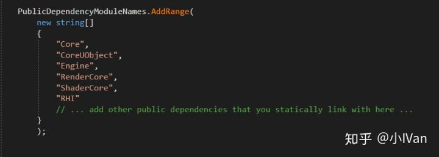

Enjoy It！
