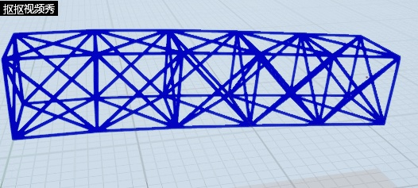
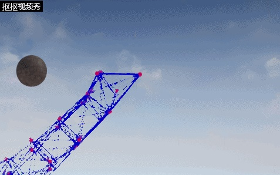
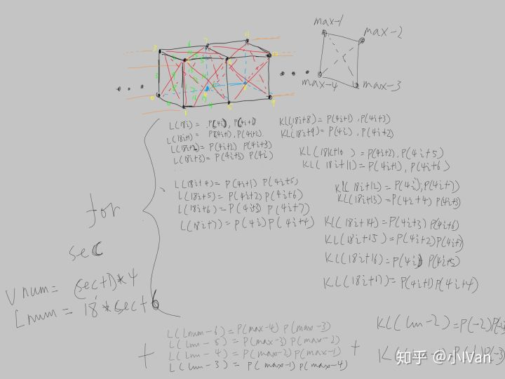

# 虚幻4渲染编程（图元汇编篇）【第六卷：与场景交互的软体果冻】


软体在游戏里是一个比较少见的效果，也是很多策划梦寐以求的效果。如果需要跟场景交互，仅仅通过shader是无法完美完成这项任务的（近似抖一下还是可以的）。下面在图元汇编阶段做文章，来完成这一效果。

先还是上效果吧：




<svg x="16" y="18.5" class="GifPlayer-icon"></svg>




<svg x="16" y="18.5" class="GifPlayer-icon"></svg>

这一节是承接上一节的内容，其实就是把韦尔莱的约束改一下，让整个粒子结构比布料更加稳定即可构建出软体粒子。下面上一张原理图




按照上述的构建方法把图元构建出来就可以了

下面是我的图形构建代码

```text
void UVCubeComponent::BuildParticleMesh_Cloth()
{

	int32 XSideNum = 10;
	int32 YSideNum = 10;
	int32 TestParticleNum = XSideNum * YSideNum;
	int32 ConstrainNum = (4 * TestParticleNum - 2 * XSideNum - 2 * YSideNum) * 0.5;

	ShowPoints.Reset();
	TestParticles.Reset();
	Constrains.Reset();
	ShowPoints.AddUninitialized(TestParticleNum);
	TestParticles.AddUninitialized(TestParticleNum);
	Constrains.AddUninitialized(ConstrainNum);

	for (int32 Y = 0; Y < YSideNum; Y++)
	{
		for (int32 X = 0; X < XSideNum; X++)
		{
			TestParticles[Y * XSideNum + X].CurPos = FVector(X * 50, Y * 50, 0);

			if ((Y == 0 && X == 0) || (Y == 0 && X == XSideNum - 1))
			{
				TestParticles[Y * XSideNum + X].bFree = false;
			}
		}
	}

	//  @---@---@---@ constrain
	int32 XXSideConstrainNum = XSideNum - 1;
	int32 XYSideConstrainNum = YSideNum;
	for (int32 Y = 0; Y < XYSideConstrainNum; Y++)
	{
		for (int32 X = 0; X < XXSideConstrainNum; X++)
		{
			Constrains[Y * XXSideConstrainNum + X].BuildConstrain(TestParticles[Y * XSideNum + X], TestParticles[Y * XSideNum + X + 1], 50.0f);
		}
	}

	//  @||@||@||@ constrain
	int32 YXSideConstrainNum = XSideNum;
	int32 YYSideConstrainNum = YSideNum - 1;
	for (int32 Y = 0; Y < YYSideConstrainNum; Y++)
	{
		for (int32 X = 0; X < YXSideConstrainNum; X++)
		{
			Constrains[Y * YXSideConstrainNum + X + XXSideConstrainNum * XYSideConstrainNum].BuildConstrain(TestParticles[Y * YXSideConstrainNum + X], TestParticles[Y * YXSideConstrainNum + X + XSideNum], 50.0f);
		}
	}
}

void UVCubeComponent::BuildParticleMesh_SimpleBox()
{
	int32 TestParticleNum = 4;
	int32 ConstrainNum = 6;

	ShowPoints.Reset();
	TestParticles.Reset();
	Constrains.Reset();
	ShowPoints.AddUninitialized(TestParticleNum);
	TestParticles.AddUninitialized(TestParticleNum);
	Constrains.AddUninitialized(ConstrainNum);

	TestParticles[0].CurPos = FVector(0, 0, 0);
	TestParticles[1].CurPos = FVector(100, 0, 0);
	TestParticles[2].CurPos = FVector(0, 100, 0);
	TestParticles[3].CurPos = FVector(0, 0, 100);

	Constrains[0].BuildConstrain(TestParticles[0], TestParticles[1], 100.0f);
	Constrains[1].BuildConstrain(TestParticles[1], TestParticles[2], 141.42f);
	Constrains[2].BuildConstrain(TestParticles[2], TestParticles[0], 100.0f);
	Constrains[3].BuildConstrain(TestParticles[3], TestParticles[2], 141.42f);
	Constrains[4].BuildConstrain(TestParticles[3], TestParticles[1], 141.42f);
	Constrains[5].BuildConstrain(TestParticles[3], TestParticles[0], 100.0f);
}

void UVCubeComponent::BuildPartcileMesh_SimpleCube()
{
	int32 TestParticleNum = 8;
	int32 ConstrainNum = 24;

	ShowPoints.Reset();
	TestParticles.Reset();
	Constrains.Reset();
	ShowPoints.AddUninitialized(TestParticleNum);
	TestParticles.AddUninitialized(TestParticleNum);
	Constrains.AddUninitialized(ConstrainNum);

	TestParticles[0].CurPos = FVector(0, 0, 0);
	TestParticles[1].CurPos = FVector(100, 0, 0);
	TestParticles[2].CurPos = FVector(100, 100, 0);
	TestParticles[3].CurPos = FVector(0, 100, 0);

	TestParticles[4].CurPos = FVector(0, 0, 100);
	TestParticles[5].CurPos = FVector(100, 0, 100);
	TestParticles[6].CurPos = FVector(100, 100, 100);
	TestParticles[7].CurPos = FVector(0, 100, 100);

	Constrains[0].BuildConstrain(TestParticles[0], TestParticles[1], 100.0f);
	Constrains[1].BuildConstrain(TestParticles[1], TestParticles[2], 100.0f);
	Constrains[2].BuildConstrain(TestParticles[2], TestParticles[3], 100.0f);
	Constrains[3].BuildConstrain(TestParticles[3], TestParticles[0], 100.0f);
	Constrains[4].BuildConstrain(TestParticles[4], TestParticles[5], 100.0f);
	Constrains[5].BuildConstrain(TestParticles[5], TestParticles[6], 100.0f);
	Constrains[6].BuildConstrain(TestParticles[6], TestParticles[7], 100.0f);
	Constrains[7].BuildConstrain(TestParticles[7], TestParticles[4], 100.0f);
	Constrains[8].BuildConstrain(TestParticles[4], TestParticles[0], 100.0f);
	Constrains[9].BuildConstrain(TestParticles[5], TestParticles[1], 100.0f);
	Constrains[10].BuildConstrain(TestParticles[6], TestParticles[2], 100.0f);
	Constrains[11].BuildConstrain(TestParticles[7], TestParticles[3], 100.0f);
	Constrains[12].BuildConstrain(TestParticles[4], TestParticles[1], SqrtTwo * 100.0f);
	Constrains[13].BuildConstrain(TestParticles[5], TestParticles[0], SqrtTwo * 100.0f);
	Constrains[14].BuildConstrain(TestParticles[5], TestParticles[2], SqrtTwo * 100.0f);
	Constrains[15].BuildConstrain(TestParticles[6], TestParticles[1], SqrtTwo * 100.0f);
	Constrains[16].BuildConstrain(TestParticles[6], TestParticles[3], SqrtTwo * 100.0f);
	Constrains[17].BuildConstrain(TestParticles[7], TestParticles[2], SqrtTwo * 100.0f);
	Constrains[18].BuildConstrain(TestParticles[7], TestParticles[0], SqrtTwo * 100.0f);
	Constrains[19].BuildConstrain(TestParticles[4], TestParticles[3], SqrtTwo * 100.0f);
	Constrains[20].BuildConstrain(TestParticles[4], TestParticles[6], SqrtTwo * 100.0f);
	Constrains[21].BuildConstrain(TestParticles[7], TestParticles[5], SqrtTwo * 100.0f);
	Constrains[22].BuildConstrain(TestParticles[0], TestParticles[2], SqrtTwo * 100.0f);
	Constrains[23].BuildConstrain(TestParticles[3], TestParticles[1], SqrtTwo * 100.0f);
}

void UVCubeComponent::BuildParticleMesh_BoxHolder()
{
	int32 BoxHolderSecNum = 5;
	float BoxWidthAndHeight = 70.0f;
	float BoxLength = 90.0f;
	float BoxThirdSide = FMath::Sqrt(BoxLength* BoxLength + BoxWidthAndHeight * BoxWidthAndHeight);

	int32 TestParticleNum = (BoxHolderSecNum + 1) * 4;
	int32 ConstrainNum = BoxHolderSecNum * 18 + 6;
	
	ShowPoints.Reset();
	TestParticles.Reset();
	Constrains.Reset();
	ShowPoints.AddUninitialized(TestParticleNum);
	TestParticles.AddUninitialized(TestParticleNum);
	Constrains.AddUninitialized(ConstrainNum);

	TestParticles[0].bFree = false;
	TestParticles[1].bFree = false;
	TestParticles[2].bFree = false;
	TestParticles[3].bFree = false;

	for (int32 i = 0; i <= BoxHolderSecNum; i++)
	{
		FVector ZeroSide = FVector(BoxLength * i, 0, 0);
		FVector OneSide = FVector(BoxLength * i, BoxWidthAndHeight, 0);
		FVector TwoSide = FVector(BoxLength * i, BoxWidthAndHeight, BoxWidthAndHeight);
		FVector ThreeSide = FVector(BoxLength * i, 0, BoxWidthAndHeight);

		TestParticles[4 * i].CurPos = ZeroSide;
		TestParticles[4 * i + 1].CurPos = OneSide;
		TestParticles[4 * i + 2].CurPos = TwoSide;
		TestParticles[4 * i + 3].CurPos = ThreeSide;
	}

	for (int32 sec = 0; sec < BoxHolderSecNum; sec++)
	{
		Constrains[18 * sec].BuildConstrain(TestParticles[4 * sec], TestParticles[4 * sec + 1], BoxWidthAndHeight);
		Constrains[18 * sec + 1].BuildConstrain(TestParticles[4 * sec + 1], TestParticles[4 * sec + 2], BoxWidthAndHeight);
		Constrains[18 * sec + 2].BuildConstrain(TestParticles[4 * sec + 2], TestParticles[4 * sec + 3], BoxWidthAndHeight);
		Constrains[18 * sec + 3].BuildConstrain(TestParticles[4 * sec + 3], TestParticles[4 * sec], BoxWidthAndHeight);

		Constrains[18 * sec + 4].BuildConstrain(TestParticles[4 * sec + 1], TestParticles[4 * sec + 5], BoxWidthAndHeight);
		Constrains[18 * sec + 5].BuildConstrain(TestParticles[4 * sec + 2], TestParticles[4 * sec + 6], BoxWidthAndHeight);
		Constrains[18 * sec + 6].BuildConstrain(TestParticles[4 * sec + 3], TestParticles[4 * sec + 7], BoxWidthAndHeight);
		Constrains[18 * sec + 7].BuildConstrain(TestParticles[4 * sec], TestParticles[4 * sec + 4], BoxWidthAndHeight);

		Constrains[18 * sec + 8].BuildConstrain(TestParticles[4 * sec + 1], TestParticles[4 * sec + 3], SqrtTwo * BoxWidthAndHeight);
		Constrains[18 * sec + 9].BuildConstrain(TestParticles[4 * sec], TestParticles[4 * sec + 2], SqrtTwo * BoxWidthAndHeight);

		Constrains[18 * sec + 10].BuildConstrain(TestParticles[4 * sec + 2], TestParticles[4 * sec + 5], SqrtTwo * BoxWidthAndHeight);
		Constrains[18 * sec + 11].BuildConstrain(TestParticles[4 * sec + 1], TestParticles[4 * sec + 6], SqrtTwo * BoxWidthAndHeight);

		Constrains[18 * sec + 12].BuildConstrain(TestParticles[4 * sec], TestParticles[4 * sec + 7], SqrtTwo * BoxWidthAndHeight);
		Constrains[18 * sec + 13].BuildConstrain(TestParticles[4 * sec + 4], TestParticles[4 * sec + 3], SqrtTwo * BoxWidthAndHeight);

		Constrains[18 * sec + 14].BuildConstrain(TestParticles[4 * sec + 3], TestParticles[4 * sec + 6], SqrtTwo * BoxWidthAndHeight);
		Constrains[18 * sec + 15].BuildConstrain(TestParticles[4 * sec + 2], TestParticles[4 * sec + 7], SqrtTwo * BoxWidthAndHeight);

		Constrains[18 * sec + 16].BuildConstrain(TestParticles[4 * sec], TestParticles[4 * sec + 5], SqrtTwo * BoxWidthAndHeight);
		Constrains[18 * sec + 17].BuildConstrain(TestParticles[4 * sec + 1], TestParticles[4 * sec + 4], SqrtTwo * BoxWidthAndHeight);
	}

	Constrains[ConstrainNum - 6].BuildConstrain(TestParticles[TestParticleNum - 4], TestParticles[TestParticleNum - 3], BoxWidthAndHeight);
	Constrains[ConstrainNum - 5].BuildConstrain(TestParticles[TestParticleNum - 3], TestParticles[TestParticleNum - 2], BoxWidthAndHeight);
	Constrains[ConstrainNum - 4].BuildConstrain(TestParticles[TestParticleNum - 2], TestParticles[TestParticleNum - 1], BoxWidthAndHeight);
	Constrains[ConstrainNum - 3].BuildConstrain(TestParticles[TestParticleNum - 1], TestParticles[TestParticleNum - 4], BoxWidthAndHeight);

	Constrains[ConstrainNum - 2].BuildConstrain(TestParticles[TestParticleNum - 4], TestParticles[TestParticleNum - 2], SqrtTwo * BoxWidthAndHeight);
	Constrains[ConstrainNum - 1].BuildConstrain(TestParticles[TestParticleNum - 3], TestParticles[TestParticleNum - 1], SqrtTwo * BoxWidthAndHeight);
}
```


Enjoy it！！！
