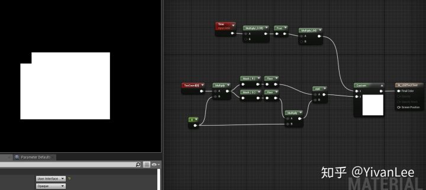
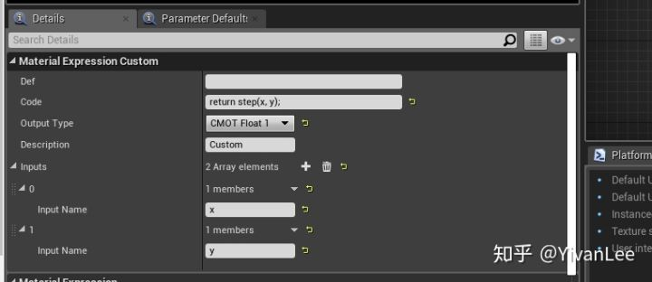
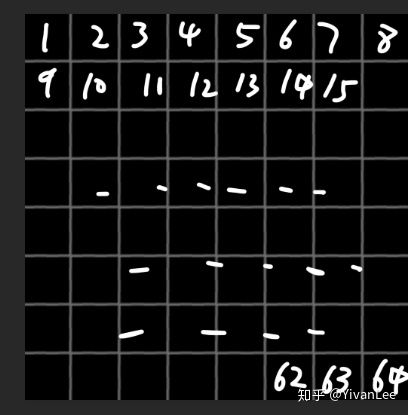
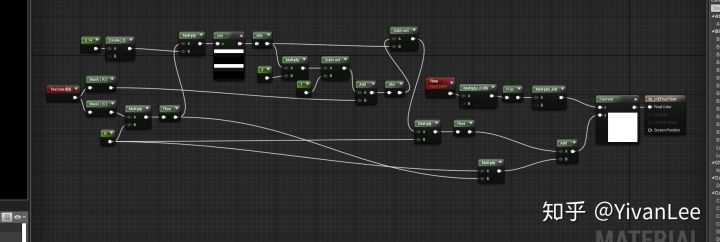
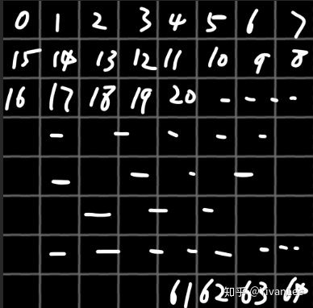
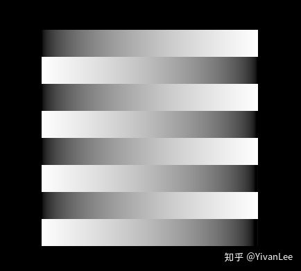
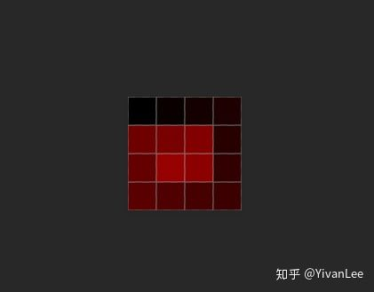

# 虚幻4渲染编程（程序化纹理篇）【第三卷：Dynamic Texture Mask】

简介：

常常会用到一些Dynamic Texture Mask来配合程序制作各种效果，比如我要动态遮蔽贴图的某个部分，这些算法都将成为日后做各种复杂效果的基础。下面就这个问题来做专门的研究。

------

## **【1】**横向换行遮蔽贴图的某个部位

<svg x="16" y="18.5" class="GifPlayer-icon"></svg>

代码如下

CustomNode种的代码：

这个东西很常用，可以动态遮蔽贴图的某个部分对于程序控制Tile贴图的某块显示。

首先把UV空间分为若干格，上面的示例种我分了8X8格，然后用n*y+x函数填充每个格子中的值，这样就能得到从左往右递增换行的数值分布

最后用Step算出Mask即可。

如果是想做单纯的这种UI动画只需要把格子分细一点就可以感觉连续了。

------

## **【2】**横向来回乒乓换行遮蔽贴图的某个部位

<svg x="16" y="18.5" class="GifPlayer-icon"></svg>

节点如下：

需要注意的是材质编辑器的sin和cos的周期不是2PI，所以这里我直接用CustomNode写了个sin(x)

这里主要是要算出UV的乒乓交错即可

------

## **【3】特殊朝向的区块遮蔽**

有时候想要一些特殊朝向的区块遮蔽，这时候如果还用纯公式算的话计算量就太大了，所以可以考虑预生成贴图的方式

比如螺旋方式的话可以做一张螺旋型的IndexTexture然后直接查询即可按照我们设定的方式进行遮蔽了。

------

Enjoy it
