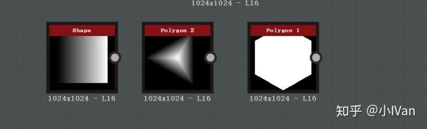
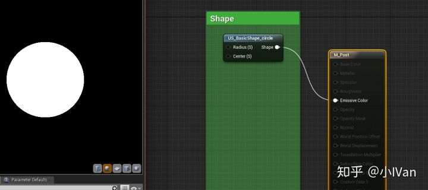
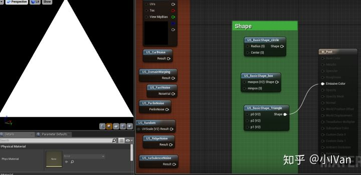
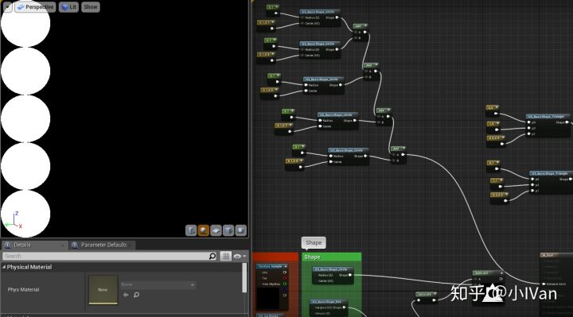

# 虚幻4渲染编程（程序化纹理篇）【第二卷：UnrealSubstance工具节点搭建---图元】


我们在做程序化纹理的时候，还需要基础图元作为支撑，三角形，圆形等等。Substance在这方面有几大图元生成器节点




第一个节点比较好实现，直接采现成的图即可。后面那两个应该就是实时算的。做后两个那种节点的图形构造有几种思路。（1）构造动态模型，直接draw到RT上 。（2）在PS或者CS中用SDF构造。在这里我先实现后者。前者需要写材质编辑器节点。

SDF的构造可以看我之前的文章，不过下面用的是二维的。

[Begin ray marching in unreal engine 4【第三卷：更多图形更复杂的光照】](https://zhuanlan.zhihu.com/p/36788227)

------

## **【1】圆形**

圆形比较简单，直接比较距离和半径的值就可以了




```text
float shape_circle(float2 uv, float r, float2 center)
{
    if(distance(uv, center) <= r)
    {
        return 1;
    }
    else
    {
        return 0;
    }
}
```

------

## **【2】矩形**

我们在空间中直接定义最大顶点和最小顶点的坐标即可定义一个矩形


```text
float shape_box(float2 uv, float2 maxpos, float2 minpos)
{
    float2 a = uv - minpos;
    float2 b = uv - maxpos;
    if(a.x >= 0 && a.y >=0 && b.x <= 0 && b.y <=0 )
    {
        return 1;
    }
    else
    {
        return 0;
    }
}
```

调整minpos和maxpos可以改变矩形的形状

------

## **【3】三角形**




```text
float sdTriangle( in float2 p0, in float2 p1, in float2 p2, in float2 p )
{
	float2 e0 = p1 - p0;
	float2 e1 = p2 - p1;
	float2 e2 = p0 - p2;

	float2 v0 = p - p0;
	float2 v1 = p - p1;
	float2 v2 = p - p2;

	float2 pq0 = v0 - e0*clamp( dot(v0,e0)/dot(e0,e0), 0.0, 1.0 );
	float2 pq1 = v1 - e1*clamp( dot(v1,e1)/dot(e1,e1), 0.0, 1.0 );
	float2 pq2 = v2 - e2*clamp( dot(v2,e2)/dot(e2,e2), 0.0, 1.0 );
    
    float s = sign( e0.x*e2.y - e0.y*e2.x );
    float2 d = min( min( float2( dot( pq0, pq0 ), s*(v0.x*e0.y-v0.y*e0.x)),float2( dot( pq1, pq1 ), s*(v1.x*e1.y-v1.y*e1.x) )),float2(dot(pq2, pq2 ), s*(v2.x*e2.y-v2.y*e2.x)));

	if(-sqrt(d.x)*sign(d.y) > 0)
    {
        return 0;
    }
    else
    {
        return 1;
    }
}
```

p就是uv，p0，p1，p2是三角形的三个顶点。我们现在有了基本图元就能组合出很多形状了。




------

Enjoy it ！
