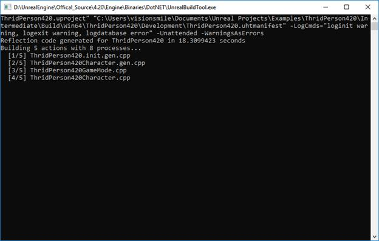

# Build flow of the Unreal Engine4 project | Z's Blog

星期二, 三月 19, 2019

5:33 下午

 

已剪辑自: <https://imzlp.me/posts/6362/>

UE通过UBT来构建项目(不管是VS里的Build也好，Editor里的Compile也好，最终都会调用UBT)。UBT和UHT是UE工具链的基石，内容太多，没办法一次性分析全部，先梳理出一个大致的轮廓，有时间再慢慢补充。
 
 先对UBT和UHT的工作职责有一个大概介绍：
 UBT：

·         Scans solution directory for modules and plug-ins

·         Determines all modules that need to be rebuilt

·         Invokes UHT to parse C++ headers

·         Creates compiler & linker options from .Build.cs & .Target.cs

·         Executes platform specific compilers (VisualStudio, LLVM)

**UHT**：

·         Parses all C++ headers containing UClasses

·         Generates glue code for all Unreal classes & functions

·         Generated files stored in Intermediates directory

言归正传。首先，从零开始，第一步先创建一个C++项目(BasicCode/ThridPerson任选)，并打开VS。
  

![Projects  UhiealPi6ject Brow  New Project  Choose a template to use as a starting point for your new project Any of these features can be added later by clicking Add Feature “ Content Pack in Content Browser  0 Blueprint C++  Basic Code  2 D Side  Scroller  Flrst  person  Third  person  Flying  Top Down  0  Puzzle  Twin Stick  Shooter  Rolling  Vehicle  Side  Scroller  Vehicle  Advanced  Third Person  Choose some settings for your project Do worry,you can change these later in the Hardware section ofProject Settings You can so add the Starter Content toyour project later  LISIng Content Browser  Desktop ／ Console  Select a location for your project to be stored  Maximum Quality  C Wsers\visionsmile\DocumentsWnreal Projects  Folder  NO Starter Content  Thridperson42Dl  r 」 三 ！ 生 PruJ± ](file:///C:/Users/WUMING~1/AppData/Local/Temp/msohtmlclip1/01/clip_image002.jpg)

 打开VS之后可以看到这样的Solution结构：
  

 在Solution中选中创建的Project点击**右键**-**Properties**：
  

 可以看到，NMake-Gerneral下的构建命令(Build Command)使用的均是Engine\Build\BatchFiles目录下的bat(在Windows平台)：

| 1    2    3    4    5    6 | # Build    Engine\Build\BatchFiles\Build.bat    # ReBuild    Engine\Build\BatchFiles\Rebuild.bat    # Clean    Engine\Build\BatchFiles\Clean.bat |
| -------------------------- | ------------------------------------------------------------ |
|                            |                                                              |

以Build.bat为例：

| 1    2    3    4    5    6    7    8    9    10    11    12    13    14    15    16    17    18    19    20    21    22    23    24    25    26    27 | @echo off    setlocal enabledelayedexpansion        REM The %~dp0 specifier resolves to the path to the directory where this .bat   is located in.    REM We use this so that regardless of where the .bat file was executed from,   we can change to    REM directory relative to where we know the .bat is stored.    pushd "%~dp0\..\..\Source"        REM %1 is the game name    REM %2 is the platform name    REM %3 is the configuration name        IF EXIST ..\..\Engine\Binaries\DotNET\UnrealBuildTool.exe (              ..\..\Engine\Binaries\DotNET\UnrealBuildTool.exe %* -DEPLOY                    popd                        REM   Ignore exit codes of 2 ("ECompilationResult.UpToDate") from UBT;   it's not a failure.                    if   "!ERRORLEVEL!"=="2" (                            EXIT   /B 0                    )                        EXIT   /B !ERRORLEVEL!    ) ELSE (            ECHO UnrealBuildTool.exe not   found in ..\..\Engine\Binaries\DotNET\UnrealBuildTool.exe            popd            EXIT /B 999    ) |
| ------------------------------------------------------------ | ------------------------------------------------------------ |
|                                                              |                                                              |

可以看到Build.bat将接收的参数都转发给了UnrealBuildTool.exe:

| 1    | ..\..\Engine\Binaries\DotNET\UnrealBuildTool.exe   %* |
| ---- | ----------------------------------------------------- |
|      |                                                       |

通过UnrealBuildTools构建项目需要传递参数：

\1.    %1 is the game name

\2.    %2 is the platform name

\3.    %3 is the configuration name

\4.    %4 is the ProjectPath

| 1    2 | # Example    UnrealBuildTool.exe ThridPerson420 Win64 Development "C:\Users\visionsmile\Documents\Unreal   Projects\Examples\ThridPerson420\ThridPerson420.uproject" -WaitMutex   -FromMsBuild |
| ------ | ------------------------------------------------------------ |
|        |                                                              |

然后来看一下UnrealBuildTools是怎么处理的：

| 1    2    3    4    5    6    7    8    9    10    11    12    13    14    15    16    17    18    19    20    21    22    23 | // Engine\Source\Programs\UnrealBuildTools\UnrealBuildTool.cs    private static int Main(string[] Arguments)    {            // make sure we catch any   exceptions and return an appropriate error code.            // Some inner code already   does this (to ensure the Mutex is released),            // but we need something to   cover all outer code as well.            try            {                    return   GuardedMain(Arguments);            }            catch (Exception Exception)            {                    if   (Log.IsInitialized())                    {                            Log.TraceError("UnrealBuildTool   Exception: " + Exception.ToString());                    }                    if   (ExtendedErrorCode != 0)                    {                            return   ExtendedErrorCode;                    }                    return   (int)ECompilationResult.OtherCompilationError;            }    } |
| ------------------------------------------------------------ | ------------------------------------------------------------ |
|                                                              |                                                              |

![973  974  975  976  977  978  979  98@  981  982  983  984  985  986  987  988  989  99@  991  992  993  994  Arguments ）  prnvate statnc nnt  ／ ／ ma S u r e We a n e r r 0 r  ／ ／ Some inner code already does this （ to e n S u r e the Mutex 巧 s released) ，  ／ ／ but we need something to C 0 ve r a11 outer code a S 驹 e11 ．  rn  ardedMai (Arguments ）  catch （ Excepti on Excepti on ）  习 巧 f  巧 f  (Log. Islni ti ati zed() ）  Log ． IdTool Excepti on ：  (ExtendedErrorCode ！ = @）  return ExtendedErrorCode•  Excepti on · TOString()) ，  return (int) ECompi lationError  三 810574m 三 p 三 ed  Lo “  Unrea18uiIdTooI.Unrea18uiIdTooI.GuardedMain returned  Arguments  [ 引  [ 4 ]  [ 5 ]  Value  {string[6]}  "ThridPerson420"  'Win64"  'Development"  'C:\Wsers\\visionsmile\\Documents\Wnreal Projects\\Examples\\ThridPerson42D\\ThridPe.  -WaitMutex"  '-FromMs8uiId  0 乁 -  string[]  Strlng  Strlng  Strlng  Strlng  Strlng  Strlng ](file:///C:/Users/WUMING~1/AppData/Local/Temp/msohtmlclip1/01/clip_image008.jpg)

 可以看到传入进来的参数。
 在GuardedMain中对引擎和传入参数做了一堆检测之后，会调用RunUBT:
  

![ThridPerson420Character.h  ThridPerson420Character.cpp  V 0 ]  Unrea18uiIdTooI.cs × ExternalExecution.cs  rn ntProcessOutputAsyn 0 Ject  CodeGenerator•cpp  UnrealHeaderToolMain.cpp  Output  Na m e  Autos  Arguments  StartTime  R 凸 凵  LogLevel  StartupListener  Locals  Breakpoints  Value  {string[6]}  Exception Settings  993  911  912  913  914  915  916  917  918  919  92@  921  922  923  924  925  926  927  928  929  93@  931  932  933  934  935  936  937  〔 Stack  Na m e  Sen e r DataRecenve EventArgs  Vali datePlatforms (Arguments ） ，  else 巧 f (Bui IdConfi gu rati on ． DeployTa rgetFi le ！ =  null)  U E Bu 巧 IdDeployTa rget DeployTa rget = n ew UEBuildDeployTarget(BuildConfiguration.Dep  { 彐 ／ 16 ／ 2019 2 ： 44 PM}  Succeeded  {Unrea18uildTool.StartupTraceListener}  true  string[]  System.DateTime  Unrea18uildTool.ECompilation..  Unrea18uildTool.LogEventType  Unrea18uildTool.StartupTraceLi.  bo 引  bo 引  Log.WriteLine(LogEventType.Console, " Deployi ng {@} { 1 } { 2 } ．  DeployTa rget ． Ta  UEBui IdPlatform. GetBui Id Platform (DeployTa rget · Platform) · Deploy (DeployTa rget) ；  Result  ECompi lati onResult · Succeeded  bLogProgramNameWithSever1t,'  bUseMutex  虽 V 已 M 凵 t  bAutoSDKOnly  bVaIidatePIatforms  bCreatedMutex  SinglelnstanceMutex  EngineSourceDirectory  8uildConfiguration  ProjectFile  8asicInitStatTime  GameName  bSpecificModulesOnly  〔 he 匚 疑 P 忏 orm  bGenerateProjectFiles  OverrideWindowsCompiler  ProjectFileFormats  0 凵 tp 凵 tL  8uiIdDuration  false  false  bo 引  bo 引  {System.Threading.Mutex}  System.Threading.Mutex  "D:\WnrealEngine\\Offical Source\\4.20\\... 乁 -  Strlng  {Unrea18uildTool.8uildConfiguration}  Unrea18uildTool.8uildConfigur.  {C:Wsers\visionsmile\DocumentsWnreal ProJec. 。 Tools.DotNETCommon.FiIeRef.  { 彐 ／ 16 ／ 2019 2 ： 44 PM}  巧 f  Bu 巧 Id 0 u r  (Result  Result  project  ECompi lati onResult · Succeeded)  RunlJBT(BuiIdConfi guration, Arguments  ProjectFiIe  true)  < 彐 07m 三  false  Win64  false  Default  Count =  System.DateTime  Strlng  bo 引  Unrea18uildTool.UnrealTargetPl  bo 引  Unrea18uiIdTooI.WindowsCom.  System ℃ ollections.Generic.List  Unrea18uildTool.SDKOutputLe•."  double  ／ ／ Print S 0 me performance 巧 n fo  double BuildDuration  (DateTime.lJtcNow _ Sta rtTi (e) · TotaZSeconds•  巧 f IdTool.bPrintPerformanceInfo)  Log ． Tracelnformation("GetIncludes ti me ：  + CPPHeaders ． TotalTi meSpentGetti nglnclu(  Log ． Tracelnforrnation("Di rectlncludes cache mn S S ti me ：  + CPPHeaders ． Di rectlncluå  Log ． Tracelnformation("FindIncludePaths calls:  + CPPHeaders.TotalFindIncludedFiU  Log ． Tracelnforrnation("PCH gen ti me ：  + UEBuildModuleCPP.TotalPCHGenTime + "s") ，  Log ． Tracelnforrnation("PCH cache ti me ：  + UEBui IdModuleCPP.TotalPCHCacheTime + " s 1  1 n 0 ．  + _TOf-nlnppnTnI  0 Unrea18uildTool.exe!Unrea18uildTool.Unrea18uildTool.GuardedMain(stringO Arguments) Line 926  ． Unrea18uildTool.exe!Unrea18uildTool.Unrea18uildTool.Main(string[] Arguments) Li n e g 〕 ](file:///C:/Users/WUMING~1/AppData/Local/Temp/msohtmlclip1/01/clip_image010.jpg)

 在UBT中会对传入的参数做检测，当前模块的依赖分析(Build.cs)，之后会调用UHT来生成代码：
 调用的函数为ExecuteHeaderToolIfNecessary(System/ExternalExecution.cs):
  

 如果上一步通过UHT生成成功，就会执行编译的Action了(ActionGraph.ExecuteActions in System/ActionGraphs.cs)：
  

 继续进入会检测一堆引擎的构建配置（e.g:Engine/Saved/UnrealBuildTool/BuildConfiguration.xml）：
  

 我这里保持的是引擎默认的构建配置，则创建了一个ParallelExecutor(System/ParallelExecutor.cs)，然后执行：
  

![ActionGraph  493  494  495  496  497  498  499  5@ 1  5@2  5@3  5@4  {Unrea18uildTool.8uildConfigurati... Unrea18uildTool.8uildConfiguration  ThridPerson420Character.h  ThridPerson420Character.cpp  U n rea 旧 凵 i 尾 To 酰  ExternalExecution.cs  CodeGenerator•cpp  UnrealHeaderToolMain.cpp  n ew ParalIeIExecutor() ，  n ew LocalExecutor() ，  · Name;  Executor ÉxecuteActions(iActionsToExecute, BuildConfiguration.bLogDetaiIedActionStats  Result  28@  282  283  284  285  public abstract  class ActionGraph  if(TeIemetry. IsAvai table 0  b001  C ] 0  (List<Action> ActionsToExecute  ionGrap  b001 bLogDetai ledAc  ！ Bui IdConfi gu rati on · bXG E Export)  监 凵 t  声  Value  ActionsToExecute  Count = 1  8uildConfiguration  8uildConfiguration.bLogDe. 。 false  {Unrea18uildTool.ParallelExecutor}  e 匚 凵  Executor.Name  ExecutorName  Result  〔 Stack  0 Unrea18uildTool.exe!Unrea18uildTool.ActionGraph.ExecuteActions(Unrea18uildTool.8uildConfiguration 。  0 Unrea18uildTool.exe!Unrea18uildTool.Unrea18uildTooI.RunU8T(Unrea18uildTool.8uildConfiguration 8uil..  Unrea18uildTool.exe!Unrea18uildTool.Unrea18uildTool.GuardedMain(stringO Arguments) Line 926  Unrea18uildTool.exe!Unrea18uildTool.Unrea18uildTool.Main(string[] Arguments) Line 980  La n 〔  System ℃ ollections.Generic.List<U...  bo 引  Unrea18uildTool.ActionExecutor { “  Strlng  Strlng ](file:///C:/Users/WUMING~1/AppData/Local/Temp/msohtmlclip1/01/clip_image018.jpg)

 将当前的编译任务创建出多个Action，并执行:
  

 开始编译代码：
  

未完待续。
