**UE4 Config****配置文件详解**

2018年12月26日 星期三

18:06

之前文档中的错误已经更正，欢迎大家随时指出文章的不足。

（如果只是想了解如何使用，直接看第三章节就可以了）

一 配置总体概述

UE4中，配置文件（Config）其实就是.ini文件。可以用于设置加载时要初始化的属性的值，配置信息按照键值对的格式来实现。虚幻4官方文档只有简单的使用规则，要想深入了解还需要查看源代码才行，所以这里我把自己的学习成果分享给大家。一个完整的配置文件格式如下图1-1所示。

图1-1 配置文件格式示意图

我们所见到的配置文件一般只存在于以下四个路径。

\1. \Engine\Config及其子目录

\2. \Engine\Saved\Config及其子目录（引擎运行后生成）

\3. Projects\[ProjectName]\Config及其子目录

\4. Projects\[ProjectName]\Saved\Config及其子目录（游戏项目运行后生成）

如上面所标记的，路径2与路径4的配置信息都是后生成的。

二 概念须知

为了后面的描述清晰，这里需要先简单描述一些基本原理以及一些概念。

2.1 概念

Section：如上图1-1，每个配置文件里面有很多模块，每个模块的标题就是一个section。

Flush：在代码里面，类FConfigCacheIni有一个名为Flush()的方法。它的表面意思是冲洗，奔涌，在代码里面表示将内存信息（即缓存的配置信息）准确无误的书写到文件里面。

GConfig：全局空间的一个配置缓存变量。定义如下FConfigCacheIni*  GConfig =NULL;在不同的情况下存储不同的信息，如图2-1，图2-2。关于GConfig的内容后面会有较为详细的讲解。

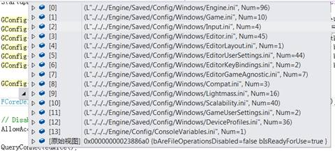

图2-1 运行纯引擎编辑器时GConfig存储的信息

**SaveConfig**函数：这个函数用来将配置信息保存到GConfig并保存到文件里面。（后面会详细解释他的使用以及参数的意义）。

**LoadConfig**函数：这个函数用来读取配置文件的信息并将该信息赋值给当前类对应的属性。（后面会进一步解释）

**UCLASS(config=FileName)**：表示这个类默认条件下将配置信息保存到哪个配置文件，config后面的文件名可以是任意字符串。

**UCLASS(perObjectConfig)**：表示这个类的配置信息将会基于每个实例进行存储。

**UCLASS(config=XXX,configdonotcheckdefaults)**：表示这个类对应的配置文件不会检查XXX层级上层的DefaultXXX配置文件是否有该信息（后面会解释层级），就直接存储到Saved目录下。

**UPROPERTY(config)**：不指定Section的情况下，标记config的这个属性在保存到配置文件里面的时候会保存在当前类对应的Section部分。同理，加载的时候也会从当前类对应的Section下加载。

**UPROPERTY(globalconfig)**：不指定Section的情况下，标记config的这个属性在保存到配置文件里面的时候会保存在基类对应的Section部分。同理，加载的时候也会从基类对应的Section下加载。

注：如果这里有些内容不太理解，可以等看完后面再回头来看这些概念

2.2 基本原理

 

2.2.1 配置文件结构

 

为了对配置文件有一个整体的了解，我们必须要弄清配置文件的结构。

\1.      配置分类

Compat（兼容性）

DeviceProfiles（设备概述文件）

Editor（编辑器）

EditorGameAgnostic（编辑器游戏未知的配置信息）

EditorKeyBindings（编辑器按键绑定）

EditorUserSettings（编辑器用户设置）

Engine（引擎）

Game（游戏）

Input（输入）

Lightmass（灯光构建相关）

Scalability（可扩展性）

EditorLayout（编辑器布局）

SourceControlSettings（源码控制设置，只存在于引擎和工程的Save目录）

TemplateDefs（模板定义，只存在于引擎和工程的Save目录）

上面基本描述了所有配置文件的类型，不同类型的配置设置放在不同的文件里面。当

然上面这些只是UE4为我们提供的文件类型，我们也可以定义自己的配置文件，也可以把内容放到你想放的任意一个文件里面。

在文档的最后面的附录会大致描述当前项目不同目录下配置文件存储的信息内容。

 

\2.      文件层次结构

 

配置文件读入时从Base.ini开始，文件结构中后面文件内的值覆盖之前的值。Engine文

件夹中的文件将应用于所有项目，而针对特定项目的文件应该位于项目目录中的文件内。最后，所有特定项目和特定平台的差异都被保存到 [ProjectDirectory]/Saved/Config/[Platform]/

[Category].ini文件中。下面是配置文件的Engine类的文件层次结构示例。

① Engine/Config/Base.ini  该文件一般是空的

② Engine/Config/BaseEngine.ini

③ Engine/Config/[Platform]/[Platform]Engine.ini

④ [ProjectDirectory]/Config/DefaultEngine.ini

⑤ [ProjectDirectory]/Config/[Platform]/[Platform]Engine.ini

⑥ [ProjectDirectory]/Saved/Config/[Platform]/Engine.ini

对上面的内容作一下解释：UE4本身给系统默认的一些配置文件建立了层次结构（如Engine，Game，Editor等，这里我们称每个类型为一个**层次类型**）。我们在读取**某种层次类型**配置文件信息的时候（比如说Engine类型），会按照上面的路径依次读取，因为后面层级的内容对于项目针对性逐步增强，所以层级越高里面的配置信息优先级越高。如果路径②与路径④某项属性配置信息不同，那么我们认为路径④的信息是准确的，从而忽略路径②的该项信息。如果我们发现在SaveConfig的时候该项属性信息与路径④的对应属性信息也不同，就把该配置信息存储到路径⑥下面。

同时要注意到UE4提供的这些基本配置文件的名称是固定的（中括号的除外），如果随意**删除或者修改这些配置文件的名称**就会导致层级信息缺失。

不过我们可以利用UE4的层级系统将配置信息存储到这些文件，也可以自己创建新的配置文件。下一条原理2.2.1会对这里做进一步的阐述。

 

2.2.1 配置文件目录分析

 

在总体概述里面，我们简单的描述了配置文件的目录，这里要拿出来作进一步分析。

我们所见到的配置文件一般只存在于以下四个路径。

\1. \Engine\Config及其子目录

\2. \Engine\Saved\Config及其子目录（引擎运行后生成）

\3. Projects\[ProjectName]\Config及其子目录

\4. Projects\[ProjectName]\Saved\Config及其子目录（游戏项目运行后生成）

下面先给出4个目录下的文件内容，作一个直观的了解，**同时请大家牢牢记住这4个路径以及其对应的编号，后面会多次提到。**

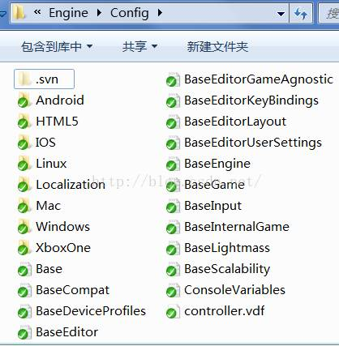

 

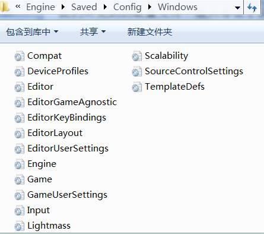

图2-2 Engine目录下配置文件的对比图（路径1与2）

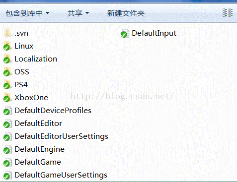

 

图2-3 Project目录下配置文件的对比图（路径3与4）

 

那么这四个目录之间的关系是什么，有什么作用？

首先我们要知道路径1余路径3中的配置文件在引擎在运行的时候是不会生成的，所以这里面的文件以及信息需要你手动的添加，当然引擎路径1的配置文件都已经写好了一般不需要改动（但是当你新建一个空白项目时，引擎会为你在路径3里自动生成DefaultEngine.ini以及DefaultGame.ini 还可能会生成DefaultEditor.ini，如果使用提供的模板，同时还会生成DefaultEditor.ini和 DefaultInput.ini 配置文件）。

根据我上面给出的对比图，我们可以把引擎和项目分开来看。当你只是打开一个纯引擎的编辑器时，与项目是没有任何关系的。引擎会根据自身的代码逻辑以及路径1中的配置信息来生成路径2中的配置信息。同理，我们在运行工程的时候也会根据代码逻辑和路径3的配置信息来生成路径4的配置信息，不过有一点区别。因为我们刚刚看了原理2.2.1的文件层次结构，所以应该明白工程的配置文件（路径4下的）生成还与路径1中的引擎配置文件有间接关系（与路径2的无关系）。

另外，我们在上面对比的其实是路径3与路径4\windows，而路径4下的结构一般是下面这样的，除了平台文件夹还会有一个CleanSourceConfigs文件夹。

图2-4  Projects\[ProjectName]\Saved\Config目录结构图

我们生成的信息分布在这两个文件夹，CleanSource文件夹里面其实就是路径1和路径3配置信息的总和（也就是文件层次结构⑥之前的配置信息），其他与游戏本身，与平台相关的差异配置信息会最终存储到Windows（对应的平台）目录下。

总结一下，无论是引擎还是项目，在Config下的配置信息都是手动添加的，而Save/Config下的都是引擎或项目运行后生成的。

注意：如果删除了工程下的DefaultEngine.ini，会导致工程无法运行，提示如下的错误。（这表示Engine目录下的配置必须要有 [URL] GameName=ProjectName）。

图2-5 丢失DefaultEngine.ini的报错示意图

2.2.3存储原理

配置文件的存储通过一个全局的变量GConfig来实现，GConfig是FConfigIni（配置信息缓存类）的一个实例化对象。他在程序启动时会加载所有的配置信息并保存在自身当中。我们通过修改该变量里面的信息并执行相关操作来完成配置信息的修改与保存。

 

**三．使用流程**

3.1 SaveConfig与LoadConfig的使用

想正确的保存配置信息，就必须使用到SaveConfig()函数。不过这个函数在使用上有几点要注意，否则你可能在配置文件里面找不到你想存储的数据。

图3-1SaveConfig的定义图

 

SaveConfig函数是UObject的一个方法，这就表示所有继承于UObject的类都可以使用它。根据图我们看到该函数有三个参数，第三个参数默认是GConfig（后面会讲到这个全局变量），一般不做修改。第一个参数默认是CPF_Config，我们也可以指定为CPF_GlobalConfig。表示我们要保存的是标记Config的属性还是标记Global的属性。

第二个参数要重点强调，他表示带有路径的文件名称，如果我们不写该参数，那么SaveConfig就会找到当前调用他的类的UCLASS(Config=XXX)所标记的这个XXX文件，并将信息保存到这个文件。如果我们给出了第二个参数，他就将信息保存到对应参数的文件里面。

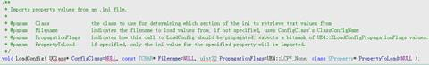

图3-2LoadConfig的定义图

 

LoadConfig的功能是从配置文件里面读取特定的属性值并赋给指定类的对应属性。第一个参数指定了要把值赋给哪个类的属性，第二个参数表示到哪个配置文件找对应的配置信息，第三个参数表示是哪种标记（Config还是GlobalConfig），第四个参数表示指定要赋值的属性。

如果不指定第4个参数，就会读取配置并给所有标记UProperty(Config)的属性赋值。

注：在后面的原理解析，会进一步的分析这两个函数。

3.2自动配置

 

在UE4里面，我们利用引擎提供的特性，只需简单做一下配置就可以轻松实现配置信息的保存与读取。基本流程如下所示：

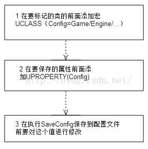

图3-3 自动实现属性配置流程图

\1.      为指出应该从哪个配置文件中读取哪个变量，那么在包含这些变量的类的UCLASS

宏中应赋予Config标识符。

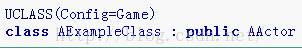

注意：必须为 Config 标识符提供类别（比如Game（游戏））。这确定了从哪个配置文件中读取类的变量及将其保存到哪个配置文件中。所有可能的分类都在类ConfigCacheIni（实际是GConfig对象）中进行定义。所有配置文件的分类列表在第二部分里面已经描述。

\2. 要想指定读取和保存到配置文件中的某个变量，也必须为该属性UPROPERTY()宏提供Config标识符。如下图所示

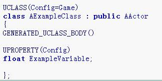

对属性的Config标识符不提供任何分类。ExampleVariable属性现在可以从配置文件结构（第二部分有描述）的任意Game配置文件中读取， 只要信息由以下语法所指定（这里面的ModuleName指的是包Package，ExampleClass就是对应的类名。）

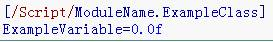

​    3.这一步在官方文档上说的很模糊。如果你只按照上面两个步骤做，就会发现，对应的配置文件里面还是没有你想要的变量。**因为在引擎执行SaveConfig的时候会遍历一遍所有的标记Config的属性，判断当前对象的config属性是否与同属一类CDO的相同属性的值相同，如果相同证明没有任何修改，也就没有必要存储到配置文件里面去**。

所以这里我们有两种办法修改属性的值，一是在一个方法里面修改该config属性的值，然后在游戏开始的时候调用。另一种是将这个config属性设置为蓝图可读写，在蓝图配置里面修改。最后，在这些修改操作执行之后一定要调用SaveConfig来保存配置信息（根据3.1的讲解，这里的SaveConfig我们一般不填第二个参数），同时就会将信息写到配置文件里面。如果上面的工作你都做了，但是没有执行SaveConfig是不会有任何效果的。

注：CDO即ClassDefaultObject。这涉及UE4每个对象的内部结构，系统在运行时会默认构造一个该类的对象，这个对象只执行了构造函数。下面图3-2给出一个CDO与当前实际对象的内部结构对比。

 

3.3手动编码配置

 

除了上面描述的半自动配置的方法，我们也可以通过硬编码让配置信息保存到任意的文件里面。这里我们还是必须要用到SaveConfig函数，不过要设置好正确的参数。前面介绍过，SaveConfig()函数是UObejct方法，可以在任意继承于UObject并使用配置类修饰符的类上进行调用。一般来说，只要是借助UProperty并且调用由SaveConfig()实现自动保存的，保存的变量就会位于按照格式 [(package).(classname)] 命名的Section中。

例如，bDisableAILogging属性是Engine类的一个标记Config的UProperty属性，保存后就会位于DefaultEngine.ini 中的[/Script/Engine.Engine] 下面。

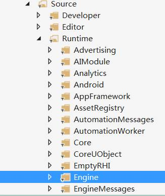

图3-4引擎目录下的Engine包

下面举例在GameMode中如何使用手动编码将信息保存到指定的位置。

\1.      获取到全局的GConfig然后执行**GConfig->SetBool(SectionStr,OptionStr,Value,GGameUserSettings);** 操作，将该bool变量写到GConfig里面。当然引擎还提供了Set String，Integer，float等类型的配置变量。（SectionStr表示Section名称，OptionStr表示键值对的Key值）

 

\2.       然后在GameMode初始化阶段，或者其他合适的位置执行步骤1并调用SaveConfig保存。

GGameUserSettingsIni是全局的FString，保存的是GameUserSetting配置文件的路径，所以这里我们就可以把GameMode的配置信息保存到GameUserSetting里面了。其他的配置文件路径对于的变量可以在Core.cpp里面搜索到。

这里要说明一下，GGameUserSettingsIni是全局的FString，保存的是最高层级的GameUserSetting配置文件的路径。其他的配置文件路径对应的变量可以在Core.cpp里面搜索到。引擎在运行的时候会自动的帮我们给这些路径赋值（见图3-7,3-8）。

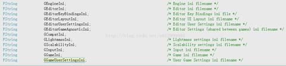

图3-5保存不同配置文件路径的全局变量

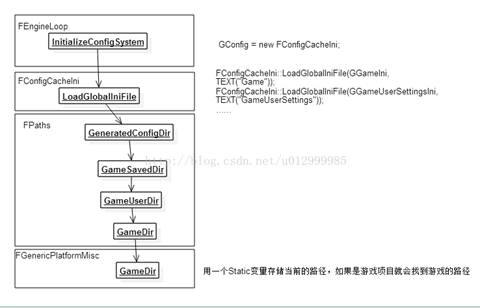

图3-6 初始化配置文件路径的流程图

 

3.4读取自定义文件并建立对应的层次结构

 

前面借助UCLASS等宏可以在Saved/Config目录下生产我们自定义名称的配置文件。但是如果我想在Project/Config下面建立自己的DefaultXXX.ini文件，如何读取并同样建立一个层次关系结构呢。比如想读取下图的DefaultConfig文件，

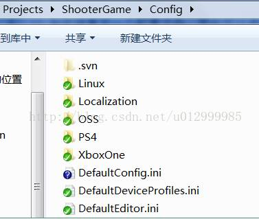

图3-7建立自定义配置文件

我们可以在合适的位置（GameInstance，GameMode，或者引擎的InitializeConfigSystem）调用FConfigCacheIni::LoadGlobalIniFile(GConfigIni,TEXT("Config"), NULL, NULL, true);函数。

之后代码就会给“Config”名称的文件建立一个层次结构，并在Saved/Config生成一个Config.ini文件。这里的GConfigIni是我们定义的全局路径，方便我们随时获取这个Config文件的位置。

 

**四．配置文件的存储流程**

前面我们已经介绍了配置文件的使用流程，也知道了自动配置和手动配置上流程的差异，这里用流程图简单梳理一下。如图4-1,4-2。

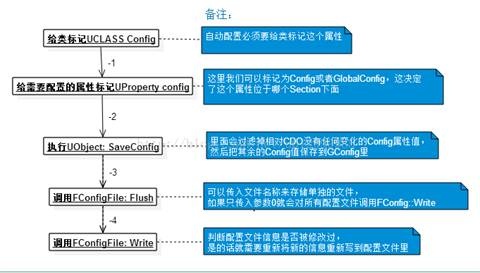

图4-1自动配置信息一般存储流程图

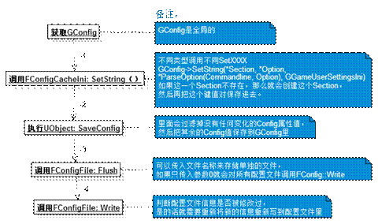

图4-2手动配置信息一般存储流程图

注：SaveConfig是UObject的方法，可以在任何标记Config的子类上调用。

 

**五．原理与特性分析**

5.1 配置文件的意义

 

在刚接触配置文件的时候，我最大的疑问就是配置文件一般是用来读的，为什么要生成这么多的配置文件以及信息？

这里可以这样理解，

第一次运行游戏项目，引擎会首先读取引擎目录\Config，游戏目录\Config里面的配置信息，以及配置文件路径（运行游戏时的配置路径就是[ProjectDirectory]/Saved/Config/[Platform]/）存储到GConfig里面。然后其他的配置信息会在各个模块执行其SaveConfig()的时候写到GConfig（前面有简单的描述）最后通过GConfig写到生成的配置文件里面。（注：这里生成的文件是指Projects\[ProjectName]\Saved\Config及其子目录，第二章节有讲解）

而第二次运行时，因为之前已经生成了配置文件。引擎首先会把所有的配置文件里面的数据读入到GConfig里面（包括第一次运行生成的），然后如果发现配置文件信息有遗漏或者有改动，就在执行SaveConfig()的时候再次写入到GConfig里面，同时再写到路径4（见2.2.1章节）配置文件里面。

通过上面，我们可以知道。其实我们修改后来生成的配置信息是没什么意义的，因为每次游戏运行的时候我们都想把配置信息存储成我们在代码或者工程想要的样子。这部分生成的配置信息我们可以在游戏运行后读取并加以利用。不过我们可以修改路径3（见2.2.1章节，工程默认配置）里面的信息，这里面的信息是我们想修改后就会立刻生效的。如果你事先把所有信息都写在了路径3下面，就会发现路径4里面的配置信息没有任何内容了。

 

5.2 配置文件的存储原理

 

GConfig前面已经出现了多次，我们有必要了解一下GConfig到底是什么。其实，GConfig就是一个配置信息缓存量，在运行时里面会一直保存所有的配置信息。

下面是GConfig所属的类以及继承关系图。

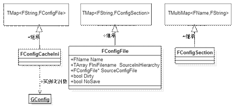

图5-1 GConfig继承关系图

​    从上面的图我们可以看出，GConfig可以说是一个三层结构的Map（最底层为MultiMap），依次存储了配置路径，配置section，配置属性与值。详细的结构我们可以通过下图来进一步了解。

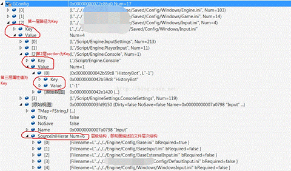

图5-2 GConfig内容结构解析图

这里需要对FConfigFile这个类型做一下解释。从上面两个图可以看出，一个配置文件FConfigFile类由5个成员构成，这个5个成员可以解释前面的很多规则与现象

1.FName 记录这个配置文件的类型

2.SourceIniHierarchy 就如我们在第二章节2.2.1所说明的，这个成员变量描述了文件的层级结构，根据这个结构我们最后的差异信息才会存储到\Windows下面

3.SourceConfigFile 表示从本地最开始加载的配置内容（其实就是加载第二章节2.2.2中所说的路径1和路径4里面的配置信息）

4.dirty 文件是否被修改，在写文件的时候，如果这个值为False就不会重写配置文件

5.NoSave文件是否没有保存

 

5.2.2UCLASS与UProperty中的Config解析

 

在自动配置中，我们通过UCLASS与UProperty宏里面添加Config来实现。这里就涉及到了UE4的反射系统，我们简单描述一下。

引擎编译是UBT（UnrealBuildTool）来控制的。首先调用UHT（UnrealHeaderTool）解析各个类中的UCLASS这样的宏，并生成对应的.generate.h以及.generate.cpp文件，这些文件代码都是宏，用来实现诸多有关UObject的功能。其次，才会调用C++的编译器来进行编译。

通上面的步骤会给每个UObject类型都绑定了一个Class类，同时注册所有Uproperty与UFunction，所有标记UProperty的属性会以链表的形式保存到这个Class类里面。然后我们可以通过GetClass()->PropertyLink方法可以获取到这个链表，HasAnyPropertyFlags可以判断当前属性是否有Config标记。通过对标记的处理我们可以判断是哪种标记，进而再判断当前对象的该属性值与对应的CDO属性值是否相同，最后就完成了SaveConfig中的判断流程。

对于UCLASS，我们可以在SaveConfig看到，如果没有给第二个参数指定文件名称，就会执行GetConfigFilename（this），然后通过这个函数来获取到他绑定Class的ClassConfigName。这个ClassConfigName也是通过反射系统来实现的。

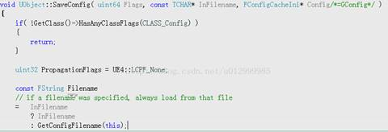

图5-3SaveConfig部分实现图

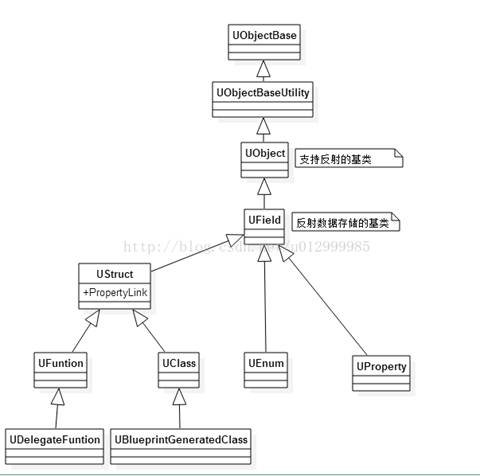

图5-4 反射部分相关类的继承关系图

5.3 配置文件和继承

Config UCLASS和UPROPERTY标识符都将被子类继承。这表示子类可以读取或保存父类中指定为Config的所有变量，并且它们将会位于相同的配置文件分类中。变量都会位于具有子类名称的部分下。例如，继承 ExampleClass 的 ChildExampleClass 的配置文件信息看起来如下方的代码行，并且将被保存在同一个Config配置文件中。

子类无法否定继承父类的Config标志，但是子类可以通过重新声明config 关键字并指定一个不同的文件名来更改这个.ini文件。 

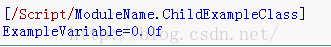

5.4 基于每个对象实例的配置

虚幻引擎 4 可以把一个对象的配置信息保存到任何所需的配置文件中。如果 PerObjectConfig 标识符用于 UCLASS 宏，那么这个类的配置信息将会基于每个对象实例进行存储，其中每个对象实例在.ini文件中都有一部分，该文件以这个对象的名字命名，格式如下 [ObjectName ClassName] 。 这个关键字会传递给子类。

这样的例子可以参考UDeviceProfile类，它的前置宏为UCLASS(config=DeviceProfiles, perobjectconfig, Blueprintable)。表示会产生名称为DeviceProfile.ini的配置文件，并且里面的信息如下所示。

[XboxOne DeviceProfile]

Key=Value

[iPhone5S DeviceProfile]

Key=Value

里面的代码细节其实就是在执行SaveConfig的时候，会判断这个当前对象是否用PerObjectConfig 进行标记，是的话就为这个对象单独标记一个配置信息（如Section = L" iPhone5S DeviceProfile "），否则就统一标记到这个类里面（如Section = L"/Script/

UdpMessaging.UdpMessagingSettings"）。

**六．其他**

1.配置文件的生成要远比内容书写早的多，如果是第一次运行，在工程运行的一开始就会通过GenerateDestIniFile生成空的配置文件。

\2. FPaths包含了游戏工程的各种目录路径，如EngineDir，GameSavedDir，GameContentDir等，这对于配置信息的存储路径很重要。

 

来自 <[*https://blog.csdn.net/u012999985/article/details/52801264*](https://blog.csdn.net/u012999985/article/details/52801264)> 

 

 

**Console Variables in C++**

2018年12月27日 星期四

11:34

A **console command** is a user input string that is sent to the engine and the engine can react is some way (e.g. console/log response, changing internal state). A **console variable** additionally stores some state that can be changed through the console. By registering console commands and variables in the console manager you get auto completion and enumeration to get a list of all console objects (console command Help or DumpConsoleVariables). Because of this, you should avoid the old Exec interface. The console manager in the central point to control all those things and more (e.g. user input history).

**What is a console variable?**

A console variable is some simple data type (e.g. float, int, string) that has an engine wide state and the user can read and set the state. The console variable has a name and the user gets auto completion when he starts typing the name into the console. e.g.

| **User console   input** | **Console output**                        | **Description**                                              |
| ------------------------ | ----------------------------------------- | ------------------------------------------------------------ |
| MyConsoleVar             | MyConsoleVar = 0                          | The current state of   the variable is printed into the console. |
| MyConsoleVar 123         | MyConsoleVar = 123 LastSetBy: Constructor | The state of the   variable is changed and the new state printed into the console. |
| MyConsoleVar ?           | Possibly multi line help text.            | Print the console   variable help text into the console.     |

**Creating / registering a console variable**

The variable needs to be registered early when the engine is created. This example shows the best way of doing that (in any C++ file):

**static** TAutoConsoleVariable<int32> CVarRefractionQuality(
     TEXT("r.RefractionQuality"),
     2,
     TEXT("Defines the distortion/refraction quality, adjust for quality or performance.\n")
     TEXT("<=0: off (fastest)\n")
     TEXT("  1: low quality (not yet implemented)\n")
     TEXT("  2: normal quality (default)\n")
     TEXT("  3: high quality (e.g. color fringe, not yet implemented)"),
     ECVF_Scalability | ECVF_RenderThreadSafe);

Here we register a console variables of the type int32, with the name r.RefractionQuality, the default value of 2 and some multi line help text and some flags. There are many flags, the most important one is ECVF_Cheat. That is explained in detail in IConsoleManager.h. The help text is shown when the user uses "?" after the console variable.

If needed you also can generate a console variable inside a function:

IConsoleManager::Get().RegisterConsoleVariable(TEXT("r.RefractionQuality"),
    2,
    TEXT("Defines the distortion/refraction quality, adjust for quality or performance.\n")
     TEXT("<=0: off (fastest)\n")
     TEXT("  1: low quality (not yet implemented)\n")
     TEXT("  2: normal quality (default)\n")
     TEXT("  3: high quality (e.g. color fringe, not yet implemented)"),
    ECVF_Scalability | ECVF_RenderThreadSafe);

IConsoleManager::Get() is the global access point. There you can register a console variable or find an existing one. The first parameter is the name of the console variable. The second parameter is the default value, and depending on the type of this constant, a different console variable type is created: int, float, or string (!FString). The next parameter defines the console variable help text.

It is also possible to register a reference to an existing variable. This is convenient and fast but bypasses multiple features (e.g. thread safety, callback, sink, cheat) so we suggest to avoiding this method. Here is an example:

FAutoConsoleVariableRef CVarVisualizeGPUSimulation(
     TEXT("FX.VisualizeGPUSimulation"),
     VisualizeGPUSimulation,
     TEXT("Visualize the current state of GPU simulation.\n")
     TEXT("0 = off\n")
     TEXT("1 = visualize particle state\n")
     TEXT("2 = visualize curve texture"),
     ECVF_Cheat
     );

Here they type is deducted from the variable type.

**Getting the state of a console variable**

Getting the state of console variables created with **RegisterConsoleVariableRef** can be done efficiently by using the variable that it was registered with. e.g.

// only needed if you are not in the same cpp file
 **extern** TAutoConsoleVariable<int32> CVarRefractionQuality;
 // get the value on the game thread
 int32 MyVar = CVarRefractionQuality.GetValueOnGameThread();

Using Getter functions (ie. !GetInt(), !GetFloat(), !GetString()) to determine a console variables state results in a slightly slower implementation (virtual function call, possibly cache miss, etc.). For best performance you should use same type the variable was registered with. In order to get the pointer to the variable, you can either store the return argument of the register function or call **FindConsoleVariable** just before you need the variable. Example:

**static const auto** CVar = IConsoleManager::Get().FindConsoleVariable(TEXT("TonemapperType")); 
 int32 Value = CVar->GetInt();

The static there ensures the name search (implemented as map) is only done the first time this code is called. This is correct as the variable will never move and only gets destructed on engine shutdown.

**How to track console variable changes**

If you want to execute some custom code if a console variable changes, you have 3 methods you can choose from.

Often the simplest method is the best: You can store the old state in your subsystem and check each frame if they differ. Here you control when this happens very freely e.g. render thread or game thread, streaming thread, before/after tick or rendering. When you detect the difference, you copy the console variable state and do your custom code. e.g.

**void** MyFunc()
 {
     int GBufferFormat = CVarGBufferFormat.GetValueOnRenderThread();

**if**(CurrentGBufferFormat != GBufferFormat)
     {
         CurrentGBufferFormat = GBufferFormat;

// custom code
     }
 }

You also can register a console variable sink e.g.

**static void** MySinkFunction()
 {
     **bool** bNewAtmosphere = CVarAtmosphereRender.GetValueOnGameThread() != 0;

// by default we assume the state is true
     **static bool** GAtmosphere = **true**;

**if** (GAtmosphere != bNewAtmosphere)
     {
         GAtmosphere = bNewAtmosphere;

// custom code
     }
 }

FAutoConsoleVariableSink CMyVarSink(FConsoleCommandDelegate::CreateStatic(&MySinkFunction));

The sink is called at a specific point on the main thread before rendering. The function does not get the console variable name/pointer as this often would lead to the wrong behavior. If multiple console variables (e.g. r.SceneColorFormat, r.GBufferFormat) should all trigger the change, it is best to call the code after all have been changed, not one after another.

The last method, using the callback, you should avoid as it can cause problems if not used carefully:

·         A cycle can cause a deadlock (We could prevent the deadlock but which callback to favour is not clear).

·         The callback can come back at any point in time whenever **!Set()** is getting called. You code has to work in all cases (during init, during serialization). You can assume it is always on the main thread side.

We suggest to not use this method unless you cannot solve it with the other methods mentioned.

Example:

**void** OnChangeResQuality(IConsoleVariable* Var)
 {
     SetResQualityLevel(Var->GetInt());
 }

CVarResQuality.AsVariable()
     ->SetOnChangedCallback(FConsoleVariableDelegate::CreateStatic(&OnChangeResQuality));

**Intended console variable behavior and style**

·         Console variable should reflect the user input, not necessarily the state of the system (e.g. !MotionBlur 0/1, some platforms might not support it). The variable state should not be changed by code. Otherwise the user might wonder if he mistyped because the variable does not have the state he specified or he might not be able to change a console variable because of the state of some other variable.

·         Always provide a good help explaining what the variable is used for and what values make sense to specify.

·         Most console variables are intended for development only so specifying the ECVF_Cheat flag early would be a good idea. Even better might be to compile out the feature using defines (e.g. #if !(UE_BUILD_SHIPPING || UE_BUILD_TEST)).

·         The variable name should be as minimal as possible while being descriptive, negating meaning should be avoided (e.g. bad names would be !EnableMotionBlur, !MotionBlurDisable, MBlur, !HideMotionBlur). Use upper and lower case to make the name easier to read and consistent (e.g. !MotionBlur).

·         For indentation, you can assume fixed width font (non proportional) output.

·         It is important to register the variable during engine initialization so that auto completion and !DumpConsoleCommands and !Help can work.

Please read IConsoleManager.h for find more details on this.

**Loading console variables**

On engine startup, the state of console variables can be loaded from the file **Engine/Config/ConsoleVariables.ini**. This place is reserved for the local developer - it should not be used for project settings. More details can be found in the file itself:

; This file allows you to set console variables on engine startup (In undefined order).
 ; Currently there is no other file overriding **this** one.
 ; This file should be in the source control database (**for** the comments and to know **where** to find it)
 ; but kept empty from variables.
 ; A developer can change it locally to save time not having to type repetitive
 ; console variable settings. The variables need to be in the section called [Startup].
 ; Later on we might have multiple named sections referenced by the section name.
 ; This would allow platform specific or level specific overrides.
 ; The name comparison is not **case** sensitive and **if** the variable does not exist, it is ignored.
 ;
 ; Example file content:
 ;
 ; [Startup]
 ; FogDensity = 0.9
 ; ImageGrain = 0.5
 ; FreezeAtPosition = 2819.5520 416.2633 75.1500 65378 -25879 0

[Startup]

You also can put the settings **Engine/Config/BasEngine.ini** e.g.

[SystemSettings]
 r.MyCvar = 2

[SystemSettingsEditor]
 r.MyCvar = 3

Setting also can come from **Script/Engine.RendererSettings**. These project settings are exposed like this:

UPROPERTY(config, EditAnywhere, Category=Optimizations, meta=(
     ConsoleVariable="r.EarlyZPassMovable",DisplayName="Movables in early Z-pass",
     ToolTip="Whether to render movable objects in the early Z pass. Need to reload the level!"))
     uint32 bEarlyZPassMovable:1;

Those settings can be changed in the editor UI. Project settings should not intermix with scalability settings (to prevent priority issues).

Other settings can come from the Scalability feature. Look at **Config/BaseScalability.ini** or the Scalability documentation for more info.

**Command line**

The command line allows to set console variables, call console commands or exec commands. This an example:

UE4Editor.exe GAMENAME -ExecCmds="r.BloomQuality 12,vis 21,Quit"

Here we execute 3 commands. Note that setting a console variable this way requires you to omit the '=' you would need in an ini file.

**Priority**

Console variables can be overridden from various sources e.g. user/editor/project settings, command line, consolevariables.ini, ... In order to be able to reapply some settings (e.g. project settings can be changed in editor UI) while keeping the specified overrides (e.g. from command line), we introduced a priority. Now all settings can be applied in any order.

see IConsoleManager.h:

// lowest priority (default after console variable creation)
 ECVF_SetByConstructor =         0x00000000,
 // from Scalability.ini
 ECVF_SetByScalability =         0x01000000,
 // (in game UI or from file)
 ECVF_SetByGameSetting =         0x02000000,
 // project settings
 ECVF_SetByProjectSetting =      0x03000000,
 // per device setting
 ECVF_SetByDeviceProfile =       0x04000000,
 // per project setting
 ECVF_SetBySystemSettingsIni =   0x05000000,
 // consolevariables.ini (for multiple projects)
 ECVF_SetByConsoleVariablesIni = 0x06000000,
 // a minus command e.g. -VSync 
 ECVF_SetByCommandline =         0x07000000,
 // least useful, likely a hack, maybe better to find the correct SetBy...
 ECVF_SetByCode =                0x08000000,
 // editor UI or console in game or editor
 ECVF_SetByConsole =             0x09000000,

In some cases, you might see this log printout:

Console variable 'r.MyVar' wasn't set (Priority SetByDeviceProfile < SetByCommandline)

It might be intended (e.g. command line forces a user setting) or caused by some code issue. The priority is also helpful to see who set the variable the last time. You can get this information when getting the console variable state. e.g.

\> r.GBuffer

r.GBuffer = "1"      LastSetBy: Constructor

**Future**

·         Currently console variables can only be created in C++ but that might change.

·         We thought about adding an enum and bool type but there are many problems attached to it. For now we suggest to use int, or if needed, strings.

·         The help text is convenient but to save executable size or to make it harder for cheaters, we consider adding a define to prevent the help text to go into the executable.

**Unregistering console variables**

The **UnregisterConsoleVariable** method allows you to remove the console variable. At least this is what is happening from the user's perspective. The variable is still kept (with the unregistered flags) to not crash when pointers access the data. If a new variable is registered with the same name, the old variable is restored and flags get copied from the new variable. This way DLL loading and unloading can work even without losing the variable state. Note that this will not work for console variable references.

 

来自 <[*https://docs.unrealengine.com/en-us/Programming/Development/Tools/ConsoleManager*](https://docs.unrealengine.com/en-us/Programming/Development/Tools/ConsoleManager)> 

 
